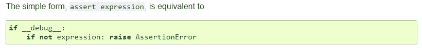
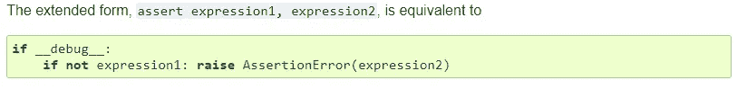

# Python 基础:函数

> 原文：<https://towardsdatascience.com/python-basics-functions-ed7c35e194a9?source=collection_archive---------4----------------------->


Source: [https://bit.ly/2EhK47P](https://bit.ly/2EhK47P)

读完这篇文章你会知道:

*   什么是**功能**以及**如何定义它们**
*   什么是**参数**和**自变量**
*   如何从函数中**返回值**
*   如何定义函数**文档**
*   Python 中的**范围代表什么**
*   什么是**关键字参数**
*   **灵活**和**默认参数**
*   什么是 **Python 异常**以及**如何处理**以及**如何引发它们**
*   **断言语句**

# 介绍

功能是一段有组织的**可重用代码**解决一个**特定任务**。函数帮助我们保持代码的整洁，并为我们提供代码重用的能力。

# 内置函数

Python 有几个[内置函数](https://docs.python.org/3/library/functions.html#built-in-functions)，它们**总是可用**。其中一些功能是 [**打印**](https://docs.python.org/3/library/functions.html#print) 和 [**最大**](https://docs.python.org/3/library/functions.html#max) 。让我们看一些如何使用它们的例子。

*   **打印**功能接受对象并打印它们

输出:

```
Python
chess backgammon
```

*   **max** 函数接受一个[可迭代](/python-basics-iteration-and-looping-6ca63b30835c)并返回最大的项

输出:

```
49
```

我们可以看到，我们只是通过写函数名来调用函数，并传递所需的输入。

# 用户定义的函数

作为程序员或数据科学家，有时我们需要特定于我们需求的功能。在这些情况下，我们可以定义自己的函数。

要定义函数，我们需要遵循以下规则:

1.  使用关键字`**def**`引入一个**功能定义**
2.  编写**函数名**后跟**括号** `**()**` 和一个**冒号** `**:**`
3.  在这些括号**(可选)**内定义一个**参数列表**
4.  编写**函数体**。构成函数体的语句从**下一行**开始，并且必须是**预期的**。当函数**被调用**时，函数体中的代码为 **run** 。
5.  函数体的第一条语句可以是代表**函数文档(可选)**的**字符串文字**
6.  使用`**return**` **关键字**将结果传回给调用者**(可选)**

如果你认为有许多步骤，不要担心。我们将看到许多例子，概念将变得非常简单。

## 定义不带参数的函数

让我们看一个没有可选部分的函数定义的简单例子。我们可以通过键入函数名，后跟**括号** `()`来调用函数。当我们调用这个函数时，它将打印当前日期。

输出:

```
2019-02-19
```

请注意，这个输出对您来说可能是不同的。输出将是您调用该函数的日期。

## 定义带参数的函数

我们几乎总是需要函数参数。当我们想要**将数据传递到**我们的**函数**中时，就会用到它们。当我们调用一个函数时，我们将参数传递给这个函数。

**一个参数示例**

输出:

```
Forgive yourself for your faults and your mistakes and move on. - Les Brown
```

当我们定义这样的参数时，它是必需的。如果我们不为这个参数传递一个参数值，这会给我们一个错误。

输出:

```
**--------------------------------------------------------------------**
**TypeError**                          Traceback (most recent call last)
**<ipython-input-48-f2f093834d71>** in <module>**()**
      2     print**(**text**)**
      3 
**----> 4** print_message**()**

**TypeError**: print_message() missing 1 required positional argument: 'text'
```

稍后，在这篇博文中，我们将看到如何定义可选参数(带有默认值的参数)。

**多参数示例** 我们可以添加**任意多的参数**，我们只需要用**逗号**将它们隔开。在许多情况下，我们需要不止一个参数。

参数传递的顺序对应于函数定义中参数的顺序。在下面的例子中，我们将 10 作为参数`number1`的值，将 5 作为参数`number2`的值。

输出:

```
15
```

然而，如果我们想将结果保存在变量中，我们不能使用上面的函数定义，因为我们的函数只是打印结果，我们不使用`**return**` **语句**。让我们看看如果我们试图保存结果会发生什么。

输出:

```
15
None
```

我们可以看到 sum 被打印出来(因为我们的函数被调用了)，但是`result`变量的值是`None`而不是 15。在下一节中，让我们看看如何返回值。

## 定义返回结果的函数

我们可以使用`**return**` **关键字**离开当前的函数调用并返回想要的结果。让我们看看如何重新定义函数`sum_numbers`来返回总和，而不是打印出来。

输出:

```
15
```

我们可以清楚地看到，这次`result`变量的值是 15。

## 定义返回多个值的函数

我们还可以定义一个返回多个值的函数。我们可以通过在函数中构造名为 [**元组**](/python-basics-tuples-9bb3851257b5) 的对象来实现。Python 中的 tuples 数据类型是一个 [**不可变的**](/https-towardsdatascience-com-python-basics-mutable-vs-immutable-objects-829a0cb1530a) [**序列**](/python-basics-iteration-and-looping-6ca63b30835c) 。这意味着它们可以像列表一样包含多个值。

输出:

```
2019-02-19
08:23:38.030659
```

在上面的例子中，我们使用**序列解包**。我们只是将元组中的值“解包”到`date`和`time`变量中。

## 用文档定义函数

在上一个例子中，我们定义了一个函数，它以元组的形式返回当前日期和当前时间。也许很容易理解函数是做什么的。然而，如果这个函数有一个**文档**不是很好吗？

输出:

```
2019-02-19
08:26:49.538434
```

在许多情况下，我们的函数比上面的例子更复杂。在这些情况下，为你的功能准备文档总是更好的。功能文档可包括以下信息:

*   **函数参数**
*   **函数计算**
*   **返回值/秒**

# 范围

并不是所有我们定义的对象(包括函数)在 Python 代码中都是可访问的。程序的范围代表**，其中变量名或函数名可以被访问**。Python 有 3 种作用域:**局部**、**全局**和**内置**作用域。

## 局部范围

当我们的对象或函数在函数中定义**时，这意味着它有一个局部范围。我们只能在定义这个对象或函数的函数内部使用它。**

## 全球范围

当我们的对象或函数在 Python 代码的主体中定义**时，这意味着它具有全局范围。我们可以在任何地方访问这个对象或函数，因为它是全局的。**

## 内置范围

在 Python 中，我们有许多内置于中的[函数和类型，它们**总是可用的**。](https://docs.python.org/3/library/functions.html)

## 附加注释

*   如果我们在函数中使用变量名或函数名**，Python 将首先在**局部**中搜索该名称，然后在**全局**中搜索，最后在**内置** **作用域**中搜索。**
*   如果我们在脚本的主体中使用变量或名称**，Python 将首先在**全局**中搜索该名称，然后在内置** **范围**中搜索该名称。

是时候看看几个例子了。

Local scope Example

输出:

```
15**--------------------------------------------------------------------**
**NameError**                          Traceback (most recent call last)
**<ipython-input-2-faf6ee9da5b3>** in <module>**()**
      4 
      5 print**(**sum_numbers**(10,** **5))**
**----> 6** print**(**result**)**

**NameError**: name 'result' is not defined
```

在这个例子中，我们可以看到我们可以在函数中访问`result`变量，但是在函数之外我们不能访问它。那是因为`**result**` **变量有局部作用域**，只能在`sum_numbers`函数内部访问。

Global vs Local Scope Example

输出:

```
Hi, Ventsi the sum is 15**--------------------------------------------------------------------**
**NameError**                          Traceback (most recent call last)
**<ipython-input-1-747761fcaa8f>** in <module>**()**
      7 
      8 print**(**sum_numbers**(10,** **5))**
**----> 9** print**(**result**)**

**NameError**: name 'result' is not defined
```

在这个例子中，我们可以看到我们可以访问函数中的全局变量**`**name**`。同样，我们使用了`**str()**` **内置函数**。然而，`**result**` **变量又有一个局部范围**，它不能在`sum_numbers`函数之外被访问。**

**Local vs Global Scope Example**

**输出:**

```
15
100
```

**这里，我们全局定义了一个`result`变量，然后我们在函数中定义了另一个与**同名的变量**。我们可以看到，全局范围的值是 100，因为我们的全局变量有这个值。此外，sum_numbers(10，5)的值是 15，因为局部变量`result`的值是在函数内部计算的。**

**Change the Value of a Global Variable Inside a Function**

**输出:**

```
programming
machine learning
```

**当我们想在某个函数中改变一个全局变量的值时，我们可以使用关键字`**global**`**。****

# ******关键字参数******

> ****关键字参数与函数调用相关。当您在函数调用中使用关键字参数时，**调用者通过参数名**识别参数。****
> 
> ****这允许您**跳过参数**或**将它们打乱顺序**，因为 Python 解释器能够使用提供的关键字将值与参数匹配。****

****来源:https://www.tutorialspoint.com/python/python_functions.htm****

****我们可以使用关键字 arguments 使用**参数名称** **和** `**=**` **符号**。****

****Keyword Arguments Example****

****输出:****

```
**8
8
9**
```

# ****默认参数****

****在某些情况下，我们有一个带有多个参数的函数，其中一些参数有一个**公共值**。我们可以为一些函数参数指定**默认参数**。在这些情况下，我们可以调用我们的函数**,而不用为带有默认参数的参数指定值**。在 Python 中要做到这一点，我们可以使用`=`符号后跟默认值。****

****Default Argument Example****

****输出:****

```
**81
4
8**
```

****从上面的例子中，我们可以看到`power`参数有一个默认值 **2** 。当我们没有为它指定值时，将使用默认值。然而，正如我们看到的，我们可以传递一个不同的值。****

****Default Arguments Example****

****输出:****

```
**The number 2 raised to the power 2 is: 4
8
9**
```

# ****灵活的论据****

****有时候，我们想要更多**灵活的功能**。例如，我们可能想要定义一个函数，它接受的参数比我们在函数中指定的参数多。换句话说，我们可能需要向函数传递任意数量的参数。我们可以在函数定义中使用**特殊语法*args** 和 ****kwargs** 来实现这一点。****

## *****参数****

****这些参数被称为**无名称变长参数**。****

****输出:****

```
**<class 'tuple'>
(1, 23, 4, 52, 2, 123)**
```

****我们可以看到*args 语法**将所有参数**作为一个名为 `**args**`的元组传递给函数**。因此，我们可以对元组数据类型做任何我们能做的事情。******

****输出:****

```
**5
10
15**
```

****输出:****

```
**10.0
18.0
15.75**
```

## ***** *克瓦查****

****这些参数被称为变长参数。****

****输出:****

```
**<class 'dict'>
{'age': 24, 'position': 'data analyst'}
<class 'dict'>
{'name': 'Jake', 'email': 'jake@gmail.com', 'position': 'machine learning engineer'}**
```

****我们可以看到，**kwargs 语法**将所有参数**作为一个名为 `**kwargs**`的字典传递给了函数**。因此，我们可以对 dictionary 数据类型做任何我们能做的事情。******

****输出:****

```
**age 24
position data analyst

name Jake
email jake@gmail.com
position machine learning engineer**
```

****其实变量名可以随便，我们只需要在**前插入一个星号** ***** **或者两个星号**** 即可。****

****输出:****

```
**10.0

age 24
position data analyst**
```

## ****调用函数时使用*和******

****我们已经看到，我们可以在函数定义中使用这种特殊的语法。然而，**我们也可以在**调用函数**时使用它**。****

**输出:**

```
name: Jake
position: data analyst
email: jake@gmail.com
```

**输出:**

```
name: Jake
position: data analyst
email: jake@gmail.com
```

# **Python 异常**

**在许多情况下，当我们**错误地使用函数**时，它**会引发一个异常(错误)。****

**例如，我们可以从文档中看到内置函数`[int()](https://docs.python.org/3/library/functions.html#int)`的部分内容:“*返回一个由数字或字符串 x 构造的整数对象，或者如果没有给定参数，则返回* `*0*` *”***

**输出:**

```
6
7**--------------------------------------------------------------------**
**ValueError**                         Traceback (most recent call last)
**<ipython-input-1-dea319bbd9d9>** in <module>**()**
      1 print**(**int**(6.99))**
      2 print**(**int**("7"))**
**----> 3** print**(**int**("Hi"))****ValueError**: invalid literal for int() with base 10: 'Hi'
```

**我们可以看到，当我们传递“Hello”字符串作为输入时，引发了 value error。**

> **当 Python 脚本**引发异常**时，我们的代码必须**立即**处理异常**，否则程序执行将停止**。**

## **异常处理**

**有时，我们可能希望在不停止程序执行的情况下处理引发的异常。在 Python 中，我们可以使用 **try-except** **子句**来实现。**

*   **`**try**` **块**让我们测试代码块的错误**
*   **`**except**` **块**让我们处理一个错误**

**输出:**

```
An exception occured
```

**上面的代码引发了一个 [**名称错误**](https://docs.python.org/3/library/exceptions.html#NameError) ，因为名称`numbers`没有定义。当我们没有指定我们正在寻找的异常类型时，except 将处理所有的异常类型。**

**当然，我们可以写一个 except 块，它是**寻找一个特定种类的**异常。**

**输出:**

```
An NameError occured
```

**当我们想为每个被处理的异常执行不同的代码时，我们可以定义尽可能多的**，除了块**。**

**输出:**

```
A ValueError occured
```

**同样，当我们需要关于异常的更多信息时，我们可以使用语法将它保存到变量中。例如，我们可能希望记录错误消息。**

**我们还可以添加一个`**else**` **块**，如果没有出现错误，它将被执行。**

**输出:**

```
Something went wrong
'int' object is not iterable
```

**输出:**

```
[1, 2, 3]
Nothing went wrong
```

**同样，如果我们想执行一些代码**而不管**try 块是否产生了**错误**，我们可以使用`**finally**`T16 块而不是`**else**`T18 块。**

**想象一下，我们在你的工作目录中有一个文件`filename.txt`，你试图在其中写一些文本。**

**输出:**

```
An error occured when writing to the file
```

**出现错误是因为默认情况下，打开的内置函数使用“读取”模式。然而，`**finally**` **块**在两种情况下都关闭文件连接(如果有错误或没有)。在这种情况下，我们使用这个块来确保我们的文件被关闭。**

## **投掷错误**

**当我们定义自己的函数时，我们可能想要抛出错误并编写更多有意义的错误消息。让我们定义一个函数，如果两个单词是[变位词](https://en.wikipedia.org/wiki/Anagram)，它将返回。**

**输出:**

```
True**--------------------------------------------------------------------**
**TypeError**                          Traceback (most recent call last)
**<ipython-input-61-f1a30da1d38d>** in <module>**()**
      7 
      8 print**(**check_anagrams**("silent",** **"listen"))**
**----> 9** print**(**check_anagrams**("silent",** **5))**

**<ipython-input-61-f1a30da1d38d>** in check_anagrams**(word1, word2)**
      4     Returns **True** **if** the word1 **and** word2 are anagrams**,** otherwise returns **False**
      5     """
**----> 6     return** sorted**(**word1**)** **==** sorted**(**word2**)**
      7 
      8 print**(**check_anagrams**("silent",** **"listen"))**

**TypeError**: 'int' object is not iterable
```

**在第二次调用函数**时，我们错误地使用了它**，为`word2`传递了整数 5。在这种情况下引发了 TypeError。我们可以看到这个信息有点混乱。因此，我们可以尝试检查这两个单词是否作为字符串传递，并抛出一个更具描述性的错误消息。我们可以使用`**raise**` **关键字**抛出一个错误。**

**输出:**

```
True**--------------------------------------------------------------------**
**TypeError**                          Traceback (most recent call last)
**<ipython-input-3-afb475aa2f4f>** in <module>**()**
     10 
     11 print**(**check_anagrams**("silent",** **"listen"))**
**---> 12** print**(**check_anagrams**("silent",** **5))**

**<ipython-input-3-afb475aa2f4f>** in check_anagrams**(word1, word2)**
      5     """
      6     **if** type**(**word1**)** **!=** str **or** type**(**word2**)** **!=** str**:**
**----> 7         raise** TypeError**("The word1 and word2 must be strings")**
      8 
      9     **return** sorted**(**word1**)** **==** sorted**(**word2**)**

**TypeError**: The word1 and word2 must be strings
```

**现在，关于这个问题的信息更加具体了。尝试捕捉更具体的异常，并编写具体而清晰的错误消息。您可以从[文档](https://docs.python.org/3/library/exceptions.html#built-in-exceptions)中查看所有异常类型。**

# **断言语句**

**断言语句是对我们的**代码**进行完整性检查的一种便捷方式。它们是**布尔表达式**，检查条件是否返回`True`或`False`。如果一个条件返回`True`，程序将转到下一行代码。否则，将引发一个错误并停止程序执行。**

**我们可以把断言语句看作是**“如果不抛出”语句**。**

****

> **在当前实现中，内置变量`__debug__`在正常情况下是`True`，当请求优化时是`False`**

**来源:[https://docs . python . org/3/reference/simple _ stmts . html # the-assert-statement](https://docs.python.org/3/reference/simple_stmts.html#the-assert-statement)**

**输出:**

```
True**--------------------------------------------------------------------**
**AssertionError**                     Traceback (most recent call last)
**<ipython-input-68-e5a7f4b2ffc2>** in <module>**()**
     10 
     11 print**(**check_anagrams**("silent",** **"listen"))**
**---> 12** print**(**check_anagrams**("silent",** **5))**

**<ipython-input-68-e5a7f4b2ffc2>** in check_anagrams**(word1, word2)**
      5     """
      6     **assert** type**(**word1**)** **==** str
**----> 7     assert** type**(**word2**)** **==** str
      8 
      9     **return** sorted**(**word1**)** **==** sorted**(**word2**)**

**AssertionError**:
```

**嗯，但是没有错误信息。如果我们想**给这个 **AssertionError** 添加一个消息**该怎么办？我们可以传递它，用逗号分隔，**就在我们的表达式**之后。**

****

**输出:**

```
True**--------------------------------------------------------------------**
**AssertionError**                     Traceback (most recent call last)
**<ipython-input-66-5f2e42abf116>** in <module>**()**
     10 
     11 print**(**check_anagrams**("silent",** **"listen"))**
**---> 12** print**(**check_anagrams**("silent",** **5))**

**<ipython-input-66-5f2e42abf116>** in check_anagrams**(word1, word2)**
      5     """
      6     **assert** type**(**word1**)** **==** str**,** **"The word1 must be a string"**
**----> 7     assert** type**(**word2**)** **==** str**,** **"The word2 must be a string"**
      8 
      9     **return** sorted**(**word1**)** **==** sorted**(**word2**)**

**AssertionError**: The word2 must be a string
```

# **类型提示**

**Python 是一种动态类型语言。当我们定义变量、函数、类等的时候。我们**不需要指定数据类型**。这让我们可以更快地编写代码。**

**然而，从 Python 版本开始，我们能够在函数定义中添加**类型提示**。我们可以说出参数的**预期数据类型**以及函数返回的数据类型。**

**输出:**

```
Hello Ventsi**--------------------------------------------------------------------TypeError**                          Traceback (most recent call last)
**<ipython-input-28-b1c33d5121c9>** in <module>**()**
      1 print**(**greeting**("Ventsi"))**
**----> 2** print**(**greeting**(42))**

**<ipython-input-1-311aff60a9bd>** in greeting**(name)**
      1 **def** greeting**(**name**:** str**)** **->** str**:**
**----> 2     return** **'Hello '** **+** name

**TypeError**: must be str, not int
```

**我们也可以定义类型别名。**

**输出:**

```
[2.0, -8.4, 10.8]
```

**你可以在这里找到更多信息[。](https://docs.python.org/3/library/typing.html)**

# **传递可变对象和不可变对象**

**当我们将 [**可变对象**](/https-towardsdatascience-com-python-basics-mutable-vs-immutable-objects-829a0cb1530a) 传递给我们的函数时，我们必须小心。函数调用中传递的参数使用的是**对象*引用*** ，而不是对象的值。所以，请记住，有些函数可以**改变被传递对象**的值。**

> ***某些对象的*值*可以改变。值可以改变的对象* ***是*** *据说是* **可变***；一旦被创建，其值不变的对象***称为****。******

*****输出:*****

```
***Before calling the function: ['this is test sentence', 'I love Python', 'positive thinking is nice!']
After calling the function: ['This is test sentence', 'I love python', 'Positive thinking is nice!']***
```

*****我们可以看到，在调用我们的函数之后，我们已经更改了`sentences`列表的内容。*****

*****如果我们想将结果保存在一个不同的变量中，我们可以在我们的函数中拷贝列表，对拷贝版本进行大写并返回。这样，我们不会改变`sentences`列表本身(在某些情况下，这是您想要的)。*****

*****输出:*****

```
***Before calling the function: ['this is test sentence', 'I love Python', 'positive thinking is nice!']
After calling the function: ['this is test sentence', 'I love Python', 'positive thinking is nice!']
Capitalized sentences (result of the function): ['This is test sentence', 'I love python', 'Positive thinking is nice!']***
```

# *****摘要*****

*   *****功能是一段有组织的**可重用代码**解决一个**特定任务**。*****
*   *****我们可以添加**任意多的参数**，我们只需要用逗号**分隔它们。*******
*   *****当我们调用一个函数时，我们将参数传递给这个函数。*****
*   *****我们可以使用`**return**` **关键字**从函数中返回一个结果*****
*   *****我们可以定义一个函数**返回多个值**构造名为 [**元组**](/python-basics-tuples-9bb3851257b5) 的对象*****
*   *****函数体的第一条语句可以是代表**函数文档(可选)**的**字符串文字*******
*   *****Python 有 **3 种类型的作用域** : **局部**，**全局**和**内置**作用域。*****
*   *****当我们在函数调用中使用**关键字参数**时，**调用者通过参数名**识别参数。这允许您**跳过参数**或**将它们打乱顺序**。*****
*   *****我们可以为一些函数参数指定**默认参数*******
*   *****当我们想要有**灵活的参数**时，我们可以使用**特殊语法*args** 和 ****kwargs** 。*****
*   *****我们可以使用 **try-except 子句**来**处理**引发的异常。*****
*   *****我们可以用`**raise**` **关键字**到**抛出一个错误**。*****
*   *******断言语句**是一种方便的方式来**检查**我们的**代码**。*****
*   *****当我们**将可变对象**传递给我们的函数时，我们必须小心，**它们的值可以被改变**。*****
*   *****附加说明:当我们编写自己的函数时，我们必须小心不要覆盖某些**包名**或**内置函数名**。*****

# *****时事通讯*****

*****如果你想在我发表新的博客文章时得到通知，你可以订阅我的时事通讯。*****

# *****商务化人际关系网*****

*****这是[我在 LinkedIn 上的简介](https://www.linkedin.com/in/ventsislav-yordanov-a657b086/)，如果你想和我联系的话。我将很高兴与你联系在一起。*****

# *****最后的话*****

*****谢谢你的阅读。我希望你喜欢这篇文章。如果你喜欢，请按住拍手键，分享给你的朋友。我很高兴听到你的反馈。如果你想写一篇关于λ函数的博文，请告诉我。如果你有什么问题，尽管问。😉*****

# *****资源:*****

*   *****[https://camp . data camp . com/courses/python-data-science-toolbox-part-1/](https://campus.datacamp.com/courses/python-data-science-toolbox-part-1/)*****
*   *****[https://www.geeksforgeeks.org/args-kwargs-python/](https://www.geeksforgeeks.org/args-kwargs-python/)*****
*   *****[https://www.tutorialspoint.com/python/python_functions.htm](https://www.tutorialspoint.com/python/python_functions.htm)*****
*   *****[https://www . salty crane . com/blog/2008/01/how-to-use-args-and-kwargs-in-python/](https://www.saltycrane.com/blog/2008/01/how-to-use-args-and-kwargs-in-python/)*****
*   *****[https://stack overflow . com/questions/2052390/manually-raising-throwing-a-exception-in-python](https://stackoverflow.com/questions/2052390/manually-raising-throwing-an-exception-in-python)*****
*   *****[https://www.tutorialspoint.com/python/python_exceptions.htm](https://www.tutorialspoint.com/python/python_exceptions.htm)*****
*   *****[https://www.w3schools.com/python/python_try_except.asp](https://www.w3schools.com/python/python_try_except.asp)*****
*   *****[https://docs . python . org/3/library/exceptions . html # exception-hierarchy](https://docs.python.org/3/library/exceptions.html#exception-hierarchy)*****
*   *****https://docs.python.org/3/tutorial/controlflow.html*****
*   *****【https://docs.python.org/3/reference/simple_stmts.html *****
*   *****[https://docs . python . org/3/library/functions . html #内置函数](https://docs.python.org/3/library/functions.html#built-in-functions)*****
*   *****[https://docs.python.org/3/reference/simple_stmts.html](https://docs.python.org/3/reference/simple_stmts.html)*****