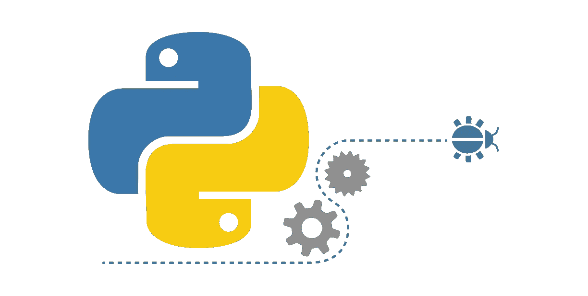
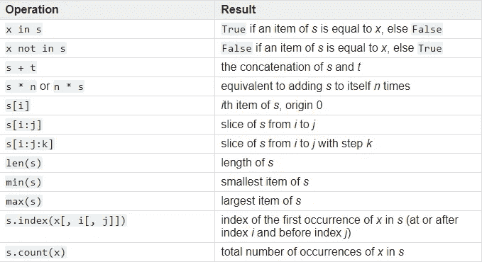

# Python 基础:元组

> 原文：<https://towardsdatascience.com/python-basics-tuples-9bb3851257b5?source=collection_archive---------7----------------------->



Source: [https://www.quora.com/Can-you-suggest-some-good-books-websites-for-learning-Python-for-a-layman](https://www.quora.com/Can-you-suggest-some-good-books-websites-for-learning-Python-for-a-layman)

读完这篇博客后，你会知道:

*   Python 中的元组数据类型是什么
*   如何初始化元组
*   如何迭代元组
*   元组上的常见序列运算
*   什么是元组解包
*   元组和列表有什么区别

# 介绍

> 元组是**不可变序列**，通常用于存储异构数据的集合(例如由`[enumerate()](https://docs.python.org/3/library/functions.html#enumerate)`内置产生的 2 元组)。

序列是**可迭代**中很常见的**类型**。内置序列类型的一些例子有 [**列表**](https://docs.python.org/3.3/library/stdtypes.html#list) 、 [**字符串**](https://docs.python.org/3.3/library/stdtypes.html#str) 和 [**元组**](https://docs.python.org/3.3/library/stdtypes.html#tuple) 。它们使用整数索引支持高效的**元素访问**，并定义了一个返回序列长度的方法。

值可以改变的对象**被称为**可变的。**对象**一旦被创建，其值就不可改变**称为**不可变**。**

如果你想知道更多关于 Python 中序列和不可变对象的细节，你可以看看我以前的博文:

*   [Python 基础:迭代、可迭代、迭代器和循环](/python-basics-iteration-and-looping-6ca63b30835c)
*   [Python 基础:可变与不可变对象](/https-towardsdatascience-com-python-basics-mutable-vs-immutable-objects-829a0cb1530a)

元组看起来类似于列表。它们可以包含**多个值**。列表和元组的**主要区别**在于**元组是不可变的**，而**列表是可变的**。

# 元组初始化

在 Python 中，我们可以用几种方式初始化元组

*   用一对**括号**来表示一个**空元组** : `**()**`
*   为具有一个值 : `**a,**`或`**(a,)**`的**元组使用尾随逗号**
*   **用逗号分隔项目** : `**a, b, c**`或`**(a, b, c)**`
*   使用 [**tuple()**](https://docs.python.org/3/library/stdtypes.html#tuple) **内置** : `**tuple()**`或`**tuple(iterable)**`

**括号是可选的**，除非在空元组的情况下，或者当需要它们来避免语法歧义时。例如，`f(a, b)`是一个带有两个参数的函数调用，而`f((a, b))`是一个带有一个作为两个元素的元组传递的参数的函数调用。

## 初始化空元组

输出:

```
<class 'tuple'>
<class 'tuple'>

()
()
```

## 用单个值初始化元组

输出:

```
<class 'tuple'>
<class 'tuple'>

('Python',)
('Data Science',)
```

## 初始化具有多个值的元组

输出:

```
<class 'tuple'>
<class 'tuple'>

(1, 2, 3)
(1, 2, 3)
```

## 从 Iterables 初始化元组

输出:

```
<class 'tuple'>
('Python', 'Maths', 'Machine Learning')
```

# 迭代元组

我们已经知道元组是**序列数据类型**，我们可以迭代序列，因为它们是**可迭代的**。

输出:

```
Pineapple
orange
banana
apple
```

# 列举

Python 中的`[**enumerate(iterable, start=0)**](https://docs.python.org/3/library/functions.html#enumerate)` **内置函数**返回迭代器。当我们迭代这个迭代器时，它返回一个包含计数(从 0 开始)和通过迭代`**iterable**`获得的值的**元组**。

输出:

```
0 Pineapple
1 orange
2 banana
3 apple

0 pandas
1 scikit-learn
2 seaborn
```

# 常见顺序操作

在 Python 中，我们有一些常见的序列操作[](https://docs.python.org/3/library/stdtypes.html#typesseq-common)**，它们被大多数序列类型支持，包括可变的和不可变的。**

> **该表列出了按优先级升序排序的**序列操作。表中，`***s***`**`***t***`**为同类型序列**，`***n***` **，** `***i***` **，** `***j***` **，** `***k***` **为整数**，`***x***` **为满足** `***s***`任意类型和值限制的任意对象。******
> 
> **`in`和`not in`操作与比较操作具有相同的优先级。`+`(连接)和`*`(重复)运算与相应的数字运算具有相同的优先级。**

****

**Source: [https://docs.python.org/3/library/stdtypes.html#typesseq-common](https://docs.python.org/3/library/stdtypes.html#typesseq-common)**

**让我们看看如何对元组进行这些操作。**

## **在，不在**

**输出:**

```
True
False

False
True
```

## **串联**

**输出:**

```
('Python', 'Web Development', 'Machine Learning', 'Communication', 'Courtesy', 'Flexibility', 'Integrity')
```

## **增加**

**输出:**

```
(['Communication', 'Courtesy'], ['Communication', 'Courtesy'], ['Communication', 'Courtesy'])
```

**这相当于给自己加了三次`soft_skills`。但是，要小心！ `**soft_skills**` **中的**项不复制**，**被多次引用**。让我们看看，如果我们向元组的第一个列表添加值，会发生什么。****

**输出:**

```
(['Communication', 'Courtesy'], ['Communication', 'Courtesy'], ['Communication', 'Courtesy'])

(['Communication', 'Courtesy', 'Responsibility'], ['Communication', 'Courtesy', 'Responsibility'], ['Communication', 'Courtesy', 'Responsibility'])
```

**新添加的值被添加到三个列表中，因为它们引用同一个对象。**

## **索引**

**输出:**

```
Communication
Responsibility
```

**是的，在 Python 中我们可以使用负索引(我们可以使用`-1`作为索引来获取最后一个元素)。当我们使用负指数时，应用此公式计算实际指数:`len(sequence) + index`。**

**在我们的例子中，长度是 5，所以我们得到索引`5 — 1 = 4`处的项目，这就是****责任****项目。****

## ****限幅****

****我们可以使用切片来选择序列对象中的一系列项目。语法是`sliceable[start_index:end_index:step]`。****

*   ****`start_index`是切片的起始索引，该索引处的元素将包含在结果中，默认值为`0`。****
*   ****`end_index`是切片的结束索引，此索引处的元素将**不包括在结果中**。默认值是`len(sequence)`。****
*   ****`step`是指标增加的数量，
    默认为`1`。如果我们为步长设置一个负值，我们将向后移动。****

****输出:****

```
**('Courtesy', 'Flexibility', 'Integrity')
('Communication', 'Courtesy', 'Flexibility', 'Integrity')
('Communication', 'Courtesy', 'Flexibility', 'Integrity', 'Responsibility')
('Communication', 'Flexibility', 'Responsibility')
('Responsibility', 'Integrity', 'Flexibility', 'Courtesy', 'Communication')**
```

## ****最小值、最大值和长度****

****我们可以使用`min()`、`max()`和`len()`内置函数来获得一个序列的最大值、最小值和长度。****

****输出:****

```
**5
Communication
Responsibility

11
7
90**
```

## ****索引和计数****

****我们已经为元组提供了索引和计数方法。我们可以使用第一个来**标识给定值**的索引，使用第二个来**标识这个值**在我们的元组中出现了多少次。****

****输出:****

```
**1**--------------------------------------------------------------------**
**ValueError**                         Traceback (most recent call last)
**<ipython-input-21-f2447af847ce>** in <module>**()**
      3 
      4 numbers **=** **(10,** **22,** **53,** **53,** **8,** **9,** **11,** **45,** **90,** **7,** **26)**
**----> 5** print**(**numbers**.**index**(100))**

**ValueError**: tuple.index(x): x not in tuple**
```

****我们可以看到，如果我们传递一个不在元组中的值，我们将得到一个`ValueError`。****

****输出:****

```
**1
2

0**
```

****如果我们传递一个在我们的元组中不存在的值，**计数方法**将返回 0。这一次没有错误。****

# ****元组解包****

****我们还可以将元组中的值“解包”到变量中。此外，更通用的方法称为**序列解包**，因此这将适用于任何序列。我们已经看到了枚举内置函数的例子。****

****输出:****

```
**10
20
30**
```

****请注意，解包元组时，左侧变量的数量应该等于元组中值的数量。否则，我们会得到一个错误。****

****输出:****

```
****--------------------------------------------------------------------**
**ValueError**                         Traceback (most recent call last)
**<ipython-input-45-282b018b9602>** in <module>**()**
**----> 1** a**,** b **=** **(10,** **20,** **30)**

**ValueError**: too many values to unpack (expected 2)**
```

****输出:****

```
****--------------------------------------------------------------------**
**ValueError**                         Traceback (most recent call last)
**<ipython-input-43-c91a3d9d3fc4>** in <module>**()**
**----> 1** a**,** b**,**c**,**d **=** **(10,** **20,** **30)**

**ValueError**: not enough values to unpack (expected 4, got 3)**
```

# ****元组与列表****

****如前所述，列表和元组之间的**主要区别**在于**元组是不可变的**，而**列表是可变的**。****

******重要注意事项** :
如果可变对象被改变，包含对可变对象的**引用的**不可变容器**的值可以被改变。当我们谈论容器**的**可变性时，只有被包含对象的**身份**是隐含的。然而，如果我们的不可变容器只包含不可变的数据类型，它的值就不能改变。参见这篇[博文](/https-towardsdatascience-com-python-basics-mutable-vs-immutable-objects-829a0cb1530a)中的例子。******

****与列表不同，元组没有`append()`、`insert()`、`remove()`、`pop()`、`extend()`等方法，因为它们具有不可变的性质。****

****输出:****

```
**['Flexibility', 'Courtesy', 'Flexibility', 'Integrity', 'Responsibility']**--------------------------------------------------------------------**
**TypeError**                         Traceback (most recent call last)
**<ipython-input-47-5d2973b1f2b4>** in <module>**()**
      4 
      5 tuple_skills **=** **("Communication",** **"Courtesy",** **"Flexibility",** **"Integrity",** **"Responsibility")**
**----> 6** tuple_skills**[0]** **=** **"Flexibility"**

**TypeError**: 'tuple' object does not support item assignment**
```

## ****文档中的附加注释****

> ****尽管元组可能看起来类似于列表，但它们通常用于不同的情况和不同的目的。元组是[不可变的](https://docs.python.org/3.7/glossary.html#term-immutable)，并且通常包含通过解包或索引(或者甚至在`[namedtuples](https://docs.python.org/3.7/library/collections.html#collections.namedtuple)`的情况下通过属性)访问的异构元素序列。列表是[可变的](https://docs.python.org/3.7/glossary.html#term-mutable)，它们的元素通常是同构的，通过遍历列表来访问。****

****来源:[https://docs . python . org/3.7/tutorial/data structures . html # tuple-and-sequences](https://docs.python.org/3.7/tutorial/datastructures.html#tuples-and-sequences)****

## ****何时使用元组****

*   ******元组比列表快。如果你需要一组常量值，而你所要做的就是遍历它，那么使用元组而不是列表。******

****输出:****

```
**0.034131127635760095
0.11737610517116082**
```

****`timeit`库允许我们以秒为单位测量经过的时间。我们可以清楚地看到元组初始化比列表初始化快。****

*   ****仅包含不可变值**的元组可以用作字典**的键，而列表则不能。****

****输出:****

```
**Introducton**--------------------------------------------------------------------**
**TypeError**                          Traceback (most recent call last)
**<ipython-input-5-c18ababebf4d>** in <module>**()**
      2 print**(**book**[(1,** **10)])**
      3 
**----> 4** book **=** **{[1,** **10]:** **"Introducton",** **[11,** **15]:** **"Notation and Definitions",** **[16,** **30]:** **"Fundamental Algorithms"}**

**TypeError**: unhashable type: 'list'**
```

*   ****如果我们的元组只包含不可变的对象，我们可以使用它们来确保我们的数据不会被改变。****

# ****摘要****

*   ****元组是**不可变序列**，通常用于存储异构数据的集合(例如由`[*enumerate()*](https://docs.python.org/3/library/functions.html#enumerate)`内置产生的 2 元组)。****
*   ****列表和元组的**主要区别**在于**元组是不可变的**，而**列表是可变的**。****
*   ****我们可以使用一对括号**`**()**`和**来初始化一个元组，括号内的值用逗号**隔开。******
*   ******我们可以使用[**tuple(iterable)**](https://docs.python.org/3/library/stdtypes.html#tuple)**内置的**函数来初始化一个 tuple。******
*   ******我们可以使用一个简单的 for 循环对元组进行迭代。******
*   ******我们可以对元组进行[常见的序列操作](https://docs.python.org/3.7/library/stdtypes.html#common-sequence-operations)，比如**索引**、**切片**、**拼接**、**乘法**，获取 **min** 、 **max** 值等等。******
*   ******我们可以从元组中解包值******
*   ******当你需要一组**常量值**并且你所要做的就是**遍历它**时，使用元组而不是列表。******

# ******时事通讯******

******如果你想在我发表新的博客文章时得到通知，你可以订阅我的时事通讯。******

# ******商务化人际关系网******

******这是我在 LinkedIn 上的简介，如果你想和我联系的话。我将很高兴与你联系在一起。******

# ******最后的话******

******谢谢你的阅读。我希望你喜欢这篇文章。如果你喜欢，请按住拍手键，分享给你的朋友。我很高兴听到你的反馈。如果你有什么问题，尽管问。😉******

# ******资源******

*   ******[https://www . data camp . com/community/tutorials/python-tuples-tutorial](https://www.datacamp.com/community/tutorials/python-tuples-tutorial)******
*   ******[https://www.tutorialspoint.com/python/python_tuples.htm](https://www.tutorialspoint.com/python/python_tuples.htm)******
*   ******[https://stack overflow . com/questions/1708510/python-list-vs-tuple-when-to-use-each](https://stackoverflow.com/questions/1708510/python-list-vs-tuple-when-to-use-each)******
*   ******[https://docs . python . org/3/tutorial/data structures . html #元组和序列](https://docs.python.org/3/tutorial/datastructures.html#tuples-and-sequences)******
*   ******[https://docs.python.org/3/library/stdtypes.html#tuples](https://docs.python.org/3/library/stdtypes.html#tuples)******
*   ******[https://docs . python . org/3.7/library/stdtypes . html # common-sequence-operations](https://docs.python.org/3.7/library/stdtypes.html#common-sequence-operations)******