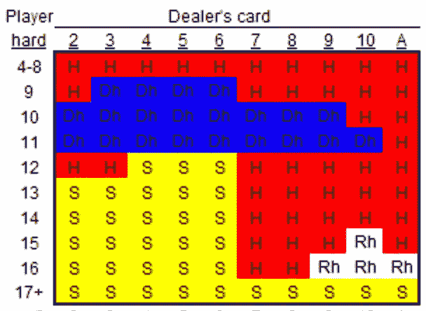

# Python 点模拟器

> 原文：<https://towardsdatascience.com/python-blackjack-simulator-61b591ffb971?source=collection_archive---------8----------------------->

## **砸，还是不砸？**

## **背景**

计算机是检验统计和战略之间相互作用的理想工具。这是因为虽然战略问题往往是理论性的，但它们也意味着会对现实世界产生影响，而这些影响会通过统计结果反映出来。在许多情况下，统计结果太难手工研究，所以更容易做一个[【蒙特卡洛模拟】](https://en.wikipedia.org/wiki/Monte_Carlo_method)，这是几个随机试验，试图梳理出模式。

扑克是一种极其复杂的游戏，两个人之间可能有超过十万亿手牌。这意味着目前的计算机远没有足够的能力来“解决”扑克，所以他们不得不经常使用巧妙的蒙特卡罗方法。我决定从简单一点开始，试着为 21 点做这件事。

特别感谢[赔率向导](https://wizardofodds.com/games/blackjack/strategy/4-decks/)，我用它的图表来设计我的策略函数。用于这个项目的代码在我的 [Github](https://github.com/molron94/Blackjack-Sim) 上，因为它太长了，不能粘贴在这里。

# **二十一点的规则**

21 点是一种玩家与赌场对抗的游戏。玩家和赌场都试图得到不超过 21 的尽可能多的牌。过了 21 就意味着自动输了。如果玩家和赌场都过 21，赌场赢。然而，玩家可以在做出决定之前看到赌场的一张牌，而赌场的行为独立于玩家的牌，通常持续到其得分达到 17。

每张数字牌(2-10)都值它的数字，一张 ace 值 1 或 11，一张 face 牌值 10。请注意，这意味着实际上 10(10，J，Q，K)是其他牌的 4 倍。还有各种其他的警告，比如 21 点奖金、分成和双倍，你可以在这个[网站](http://Blackjack Rules - Learn How to Play 21 - [Tips & Best Practices] https://www.blackjack.org/blackjack-rules/)上读到。

Various blackjack outcomes and their associated results

# **项目概述**

这个项目有三个阶段:

1.  创建一个功能，为您提供战略性的 21 点建议，例如，是否击中，留等。
2.  使用上述策略制作一个 21 点模拟器来模拟 21 点的一手牌
3.  多次运行模拟以汇总结果并运行实验

# 第一阶段:战略

21 点是一个已经研究得相当多的游戏，互联网上有各种各样的地方有完美的策略，被称为'基本 21 点策略'。在你制定退休计划之前，请注意，即使你玩的是“完美的”21 点，与赌场相比，你的亏损额也很小(大约 0.5%)，但只是比玩不完美 21 点的人输得慢。这些信息通常显示在网格状的图表中。下面是我在这个项目中使用的[图](https://wizardofodds.com/games/blackjack/strategy/4-decks/)的一个片段:

如果我的牌加起来是 12，而庄家有一张 7，则图表显示我应该“打”，即多拿一张牌。但是，如果庄家有 5，我应该“留下”，即放弃，并希望庄家“破产”(得分高于 21)。我把图表的每一个建议都编码进了一个函数，BlackJackStrategy。

# 阶段 2:模拟

尝试模拟 21 点的每一手牌是这个项目中最具挑战性的部分。我首先随机创建了一副牌，上面有所有的数字，以及四倍多的十。然后，使用随机数生成器，我给玩家发了两张牌，给庄家发了一张牌，并使用基本的 21 点策略来决定玩家将如何行动，并使用 21 点规则来决定结果。这些都在函数“21 点手牌结果”中。

注意:我使用的模拟假设有无限多副牌，因为赌场通常使用 6-8 副牌，这不会对结果产生太大影响。我将“分裂”的结果模拟成两只手，这允许我递归地处理分裂。这将减少方差一点点，但数量可以忽略不计。

# 阶段 3:重复模拟和实验

重复模拟是这个项目中最容易的部分，只要重复我的 21 点纸牌游戏就可以了。我的第一个实验是看看 21 点中的“赌场优势”是什么，这是你每赌 100 美元预计会输掉的钱数。我通过模拟一百万手牌尝试了几次，发现你会损失 10 到 40 美分。

## 实验一:翻倍 7 vs 庄家 6

在基本的 21 点策略图上，它说击中 7 对庄家的 6。如果我们加倍会怎么样？我在我的单手 21 点模拟器中添加了一个“硬编码”输入，它允许你对玩家的第一个动作进行硬编码，然后假设玩家在剩下的时间里遵循基本 21 点的建议。我首先运行了 100，000 次模拟，玩家下注 1 美元，拿着 3 和 4 与庄家的 6 进行比较，玩家赚了大约 2，000 美元。然而，当我运行 100，000 个 double 硬编码的模拟时，这变成了 15，000 美元的损失。这意味着，将 a 7 和 a 6 翻倍的决定花费了玩家 100，000 美元的赌注中的 17，000 美元，平均为他们赌注的 17%!

## 实验 2:拆分两个 10s vs 庄家 6

“千万不要拆 10”是 21 点的一条著名建议。让我们来评估一下，如果你拿着两张 10 和庄家拿着一张 6(这对庄家来说是最差的牌)分牌会发生什么。当我们在不拆分的情况下运行 100，000 次模拟时，玩家可以赚大约 70，000 美元。然而，当我们硬编码“分割”时，玩家只能获得 60，000 美元。虽然有两张 10 对一张 6 仍然非常有利可图，但玩家要花 10%的赌注来分割 10。

# 结论

可以通过改变硬编码来测试基本 21 点策略的每个方面，看看哪种方法在模拟中效果最好。编码和测试非常有趣，我期待在研究其他策略问题时应用类似的方法。