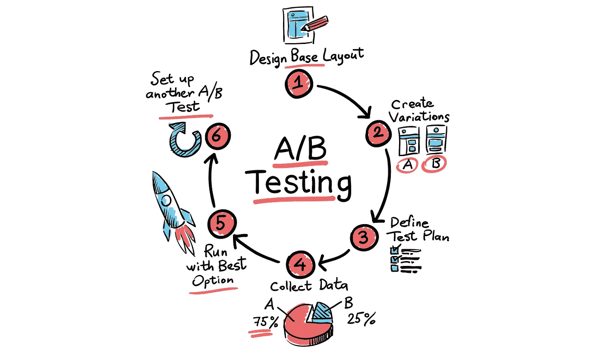
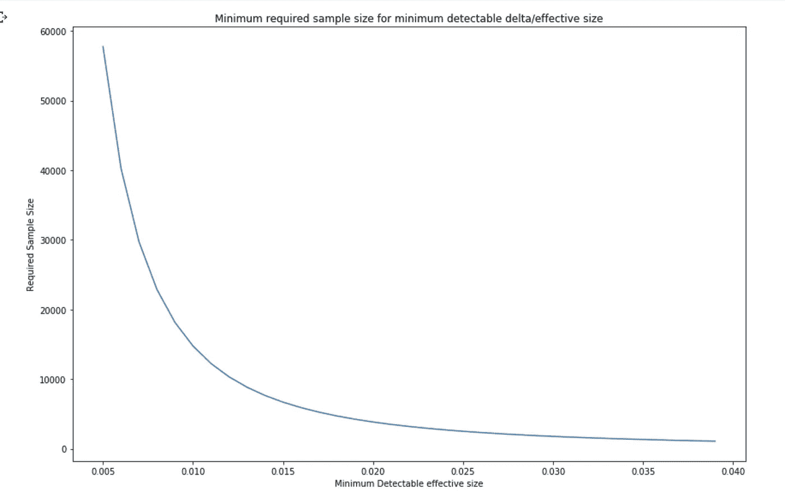
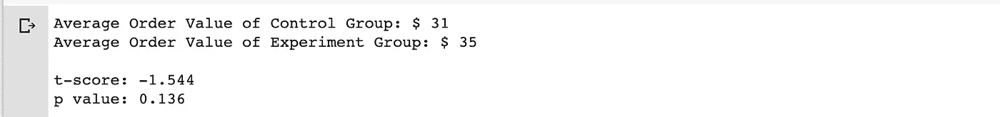
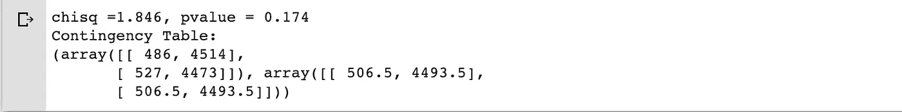
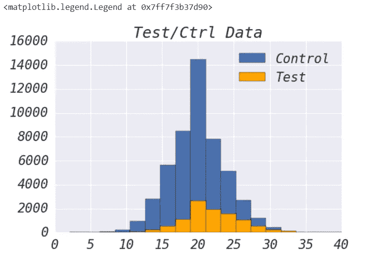
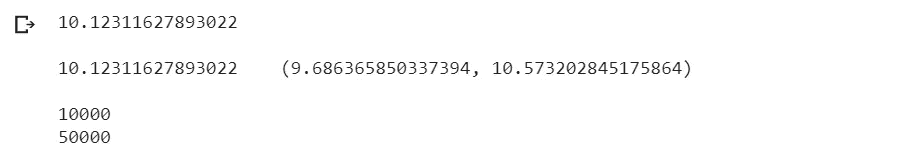

# Python 代码:从假设检验到商业案例的在线实验

> 原文：<https://towardsdatascience.com/python-code-from-hypothesis-test-to-online-experiments-with-buiness-cases-e0597c6d1ec?source=collection_archive---------6----------------------->

**在线实验设计框架:**

1.  决定 KPI、护栏(主要指标、次要指标)
2.  设计:第一类，第二类误差，样本量/持续时间，你的 H0 和 H1 是什么
3.  设置实验(RTC，随机化算法)
4.  衡量和比较(健全性检查、新颖性效果)
5.  建议行动

这里我们关注第二步:实验设计和第四步:测量和比较。

理解 I 型、II 型误差、FPR、FNR、α、β的定义及其各自的数学公式非常关键。因为这些知识有助于建立理解和应用 p 值和功率的坚实基础。但是，文章不会深入表达那些术语和相关的统计知识(那不是这里的核心话题)。

对于非统计背景受众，p 值控制测试中检测到的提升/差异是否由随机机会引起，换句话说，两组之间没有提升/差异；功率控制看到测试中检测到的升力/差异为真(升力/差异)的概率，换句话说就是不要错过‘转出变化’的机会。

# 在步骤 2 和 3 中，我们需要选择:使用哪种假设检验？

首先让我们简单解释一下什么是 Z，T，F 测试以及什么时候使用它。在线实验 ab 检验中，最常见的情况是应用两样本假设检验

z，T 分布用来回答:**两个样本**来自同一个总体的概率有多大。回忆 t 分布有较厚的尾部。最终，越来越多的样本 t 分布将转化为 Z 分布

f 分布用于回答:两个样本来自具有相同方差的总体的概率是多少？通常，我们想知道**三个或更多样本**来自同一总体的概率是多少

卡方分布卡方拟合优度测试确定样本数据是否与总体匹配。独立性的卡方检验比较列联表中的两个变量，看它们是否相关。在更一般的意义上，它测试分类变量的分布是否彼此不同:

## 我们来编码吧！

# 通过 Z 检验的两个比例点估计

零假设(H0):两组均值是不同的——双边的

零假设(H0): u0 > u1 或 u0< u2 — one sided

Use case: Ran a fair AB test, control group got 486 clicks out of 5000 impression vs experiment group got 527 clicks out of 5000 impression. Could we say experiment group won the test? Given statistical significance as 0.95

In the result, p-value= 0.1742 >α= 0.05，我们未能拒绝 H0，这意味着从实验组观察到的高 CTR 是由于随机机会。对营销团队/产品团队的建议是不要推出这一新计划/变化。

# 通过点估计、带测试用例的 Z 检验确定样本大小

用例:根据转换率(CVR)计算样本量

假设:基线转换率=10%，CVR 提升 10%，显著水平=95%，功率=80%

我们需要每组至少 14744 次点击，这相当于 1.85 周，平均每周流量为 16k 次点击。在这个例子中，两周是一个很好的实验持续时间。

如果我的流量非常大(通常这对于许多公司来说并不常见，除了像脸书或谷歌这样的大型科技公司)，并且能够达到 5 天的样本量，该怎么办？1.仍然运行至少 7 天，以捕捉每周趋势 2。给控制组分配更多的流量，不要浪费你的流量。

**“艺术作品在此”:**在 1 .足够的力量(不要错过机会/察觉不到改进)2 .中寻找平衡或取舍。所需的最小样本量(交通量)3。有效尺寸(如果度量增加/减少多少，值得进行测试)-最小可检测差异

假设 alpha =0.05，幂= 0.8，让我们检查当改变有效大小时，样本大小如何变化

输出:

# 独立双样本 T 检验

对于两面派；H0 认为；两个集团的手段是不同的

对于一边倒:H0: u0 > u1 或 u0 < u2

Given Alpha= 0.05

Output:

We fail to reject null hypothesis with alpha=0.05

# Sample size via point estimate, t test

It’s very similar to Z test (which we expressed a lot above) when using t test. Then let’s just code.

# Chi-Square Test

Null hypothesis: no difference between two groups

**用例:AA 测试—健全性检查**:这两个组的观众是否相同。不均匀随机化？

示例:营销团队希望提高 CVR(通常营销团队更关心 CAC、RPU 或其他货币指标。这里用 CVR 来展示快速计算)通过测试一个新的关键字竞价算法。在推出 A/B 测试之前，需要进行 AA 测试，以确保两组的观众在 CVR 方面是相同的。

以下是在 AA 测试中要测试的假设:

H₀:两组的转换率是一样的

H₁:两组间的转换率不同

**方法一:使用比例测试**

可以使用比例检验，因为卡方分布是正态分布的平方
。在这种情况下(具有双侧替代的双样本情况)，下面的卡方检验产生与比例 Z 检验相同的值。

输出:

我们无法拒绝 p 值= 0.175 >α= 0.05 的零假设

**方法二:使用列联表——传统方法**

输出:

这里我们得到了与比例测试相同的结果(p 值=0.174)。

# 方差分析检验和 f 分布

**ANOVA 检验**可用于测量这些平均值之间的统计显著性差异，进而测量其总体平均值之间的差异。

## 单向方差分析

*   *无效假设*:组均值相等(组均值无变化)
*   *替代假设*:至少一组均值与其他组不同

例如，一家公司的营销团队可能想要回答，如果五个州的销售业绩相同。用统计学的语言来表述这个问题。我们希望衡量不同州的销售额之间是否有任何差异，将销售额作为 KPI 进行评估。

任何假设检验的第一步都是将问题转化为无效假设和替代假设:

*   **H** 0 **:** 组间均值相同
*   至少，一组的平均值是不同的

要执行此测试，我们必须根据所选的显著性水平或 p 值(通常为 0.05)和自由度，计算 f 检验统计值，并将其与 f 分布表中的临界值进行比较。

我们有了所有五个州(加利福尼亚州、纽约州、德克萨斯州、弗吉尼亚州和伊利诺伊州)的销售数据，然后让我们编码。

我们不能拒绝 H0，因为 p 值= 0.82 >α= 0.05。下一步是进行成对 t 检验，以发现哪些州在销售业绩方面与其他州不同。

# 双向方差分析

双向 f 检验:双向 f 检验是单向 f 检验的扩展，当我们有两个自变量和两个以上的组时使用。双向 f 检验不能说明哪个变量是主导变量。如果我们需要检查个体的显著性，那么就需要进行事后检验。

# 小样本量(低流量)补救措施

*   *非参数统计检验*
*   *重采样—引导*
*   *找到与 KPI 高度相关的早期指标*

## 1.非参数统计显著性检验—无分布

H0:两组，同分布

**曼-惠特尼 U /威尔科克森-曼-惠特尼检验**

独立双样本 t 检验的替代方法，数据类型:二进制。CVR 中心

输出:

## **2。重采样—助推器**

赞成:没有正态假设(当样本量很小时，大多数情况下无效)

缺点:计算成本高。数据质量也很重要。

我曾经使用“scikit-learn”中的“重采样”包。然后我找到了这个为在线实验设计开发的 Python API，它使用起来非常直观。

Example is from [bootstrapped](https://github.com/facebookincubator/bootstrapped) library. Copyright 2016-present, Facebook, Inc. All rights reserved.

输出:

Example is from [bootstrapped](https://github.com/facebookincubator/bootstrapped) library. Copyright 2016-present, Facebook, Inc. All rights reserved.

让我们检查一下手段。

输出:

如示例所示，这是一个非常有用的库，并且易于应用。有关更多应用和详情，请查看以下链接:

 [## 拔靴带

### bootstrapped 是一个 Python 库，允许您根据数据构建置信区间。这在各种场合都很有用…

pypi.org](https://pypi.org/project/bootstrapped/) 

即使 AB 测试没有告诉你“为什么会发生”——真正的因果关系，它仍然是一个非常强大的工具，应用统计技术来改善用户体验，让客户更开心等等。我相信，在应用统计数据时，总有一种“艺术作品”可以在技术和工程之间找到平衡，推动收入增长(长期或短期)以及客户/用户的满意度。