# 使用熊猫数据帧、Spark 数据帧和考拉数据帧的 Python 数据预处理

> 原文：<https://towardsdatascience.com/python-data-preprocessing-using-pandas-dataframe-spark-dataframe-and-koalas-dataframe-e44c42258a8f?source=collection_archive---------9----------------------->

## 为 Python 中的机器学习准备数据


随着在数据预处理、数据分析和机器学习中的广泛使用，Pandas 与 Numpy、Scikit-Learn 和 Matplotlib 一起成为 Python 中事实上的数据科学栈。

然而，Pandas 的主要限制之一是 Pandas 是为可以在单台机器上处理的小数据集设计的，因此它不能很好地扩展到大数据。相反，Apache spark 是为大数据设计的，但它有一个非常不同的 API，也缺乏 Pandas 中许多易于使用的数据争论和可视化功能。最近宣布了一个新的开源考拉，它通过增强 PySpark 的 DataFrame API 使其与 pandas DataFrame API 兼容，弥合了 Pandas DataFrame 和 Spark DataFrame 之间的差距。

在这篇文章中，类似于[熊猫数据帧和 Spark 数据帧](/python-pandas-vs-scala-how-to-handle-dataframes-part-ii-d3e5efe8287d)之间的比较，我使用一个公共数据集[*sample _ stocks . CSV*](https://raw.githubusercontent.com/databricks/koalas/master/data/sample_stocks.csv)来评估和比较熊猫、Spark 和考拉数据帧在机器学习的典型数据预处理步骤中的基本功能，包括:

1.  加载数据(例如，从互联网加载 csv 文件)
2.  浏览数据(例如，汇总统计、数据可视化等。)
3.  清理数据(例如，处理丢失的数据)
4.  转换数据(例如，特征工程、缩放、重新格式化为 Numpy 数组或 Spark RDD(弹性分布式数据集))

为方便起见，假设以下 Python 库已安装在 Mac 等本地机器上:

*   Anaconda (conda 4.7.10)带有 Numpy、Pandas、Matplotlib 和 Scikit-Learn
*   火花 2.4.4
*   [考拉](https://github.com/databricks/koalas)

# 1.加载数据

在开始任何数据预处理之前，需要将数据集(例如，公共的 *sample_stocks.csv* 文件)加载到内存中。为此，让我们导入相关的 Python 库:

```
import numpy as np
import pandas as pd
import matplotlib.pyplot as plt
%matplotlib inlinefrom pyspark import SparkContexttry:
    sc = SparkContext('local', 'Pyspark demo')
except ValueError:
    print('SparkContext already exists!')from pyspark.sql import SparkSession
try:
    spark = SparkSession.builder.appName('Recommendation_system').getOrCreate()
except ValueError:
    print('SparkSession already exists!')
```

## 1.1 在 Pandas 中加载 csv 文件

Pandas 提供了一个 *read_csv* ()函数，既可以读取本地 csv 文件，也可以从互联网上读取 csv 文件作为 Pandas 数据帧:

```
pd_df = pd.read_csv("[https://raw.githubusercontent.com/databricks/koalas/master/data/sample_stocks.csv](https://raw.githubusercontent.com/databricks/koalas/master/data/sample_stocks.csv)")
pd_df.head(1)
```

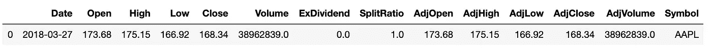

## 1.2 在 Spark 中加载 csv 文件

在 Spark 中， *SparkSession* 只提供了一种从本地 csv 文件或内存中的 RDD 读取 Spark 数据帧的方法。Spark 需要与其他 Python 库结合使用，才能从互联网上远程读取 csv 文件。

一种方法是首先使用 URL 请求和响应包从互联网读取 csv 文件的内容，然后将内容转换为 SparkSession 的 Spark RDD，以作为 Spark 数据帧加载。

```
import urllib.requesturl = "[https://raw.githubusercontent.com/databricks/koalas/master/data/sample_stocks.csv](https://raw.githubusercontent.com/databricks/koalas/master/data/sample_stocks.csv)"
response = urllib.request.urlopen(url)
data = response.read()      
text = data.decode('utf-8')  
spark_df1 = spark.read.csv(sc.parallelize(text.splitlines()), header=True)
print(spark_df1.show(1))
```

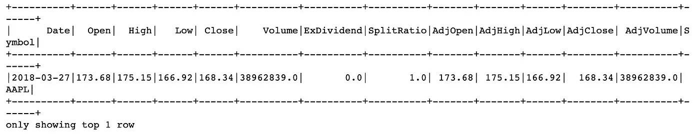

另一种方法是首先使用 Pandas 读取 csv 文件作为 Pandas 数据帧，然后使用 SparkSession 从 Pandas 数据帧创建 Spark 数据帧。

```
spark_df2 = spark.createDataFrame(pd.read_csv(url))
```

## 1.3 在考拉中加载 csv 文件

像 Spark 一样，考拉只提供了从本地 csv 文件读取的方法。它需要与其他 Python 库结合才能从互联网上读取 csv 文件。一个简单的方法是首先使用 Pandas 读取 csv 文件作为 Pandas 数据帧，然后将其转换为 Koalas 数据帧。

```
import databricks.koalas as ks
ks_df = ks.from_pandas(pd.read_csv(url))
ks_df.head(1)
```

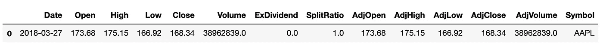

# 2.探索数据

一旦数据集作为数据帧加载到内存中，我们就可以使用数据帧的各种函数从不同的方面研究它。

## 2.1 了解数据框架模式

通常，探索数据帧的第一步是理解它的模式:列名和相应的数据类型。

对于 Pandas、Spark 和 Koalas 数据帧，获取数据帧列名和数据类型的方法是相似的。所有这些数据帧都为列名提供了属性 *columns* ，为列数据类型提供了属性 *dtypes* 。

需要注意的一点是，Spark DataFrame 的数据类型取决于示例公共 csv 文件的加载方式。如果通过 Spark 使用 URL *请求*和*响应*包加载 csv 文件，则列数据类型默认为 string 类型，而如果通过 Pandas with Spark 加载 csv 文件，则列数据类型为 double 类型。

```
# DataFrame column names
pandas_column_names = pd_df.columns
spark_column_names  = spark_df1.columns
ks_column_names     = ks_df.columns# DataFrame column data type
pandas_column_data_types = pd_df.dtypes
spark_column_data_types  = spark_df1.dtypes
ks_column_data_types     = ks_df.dtypes
```

## 2.2 获取汇总统计数据

一旦我们理解了数据帧的模式，探索数据的下一步是查看汇总统计，例如[五个数字汇总](https://en.wikipedia.org/wiki/Five-number_summary)。所有的熊猫、Spark 和考拉数据帧都提供了相同的函数 *describe* ()来获得这些基本的汇总统计数据，包括数据帧中每一列的总行数、*最小值*、*平均值*、*最大值*和*百分位数*。

```
pd_df.describe()
```

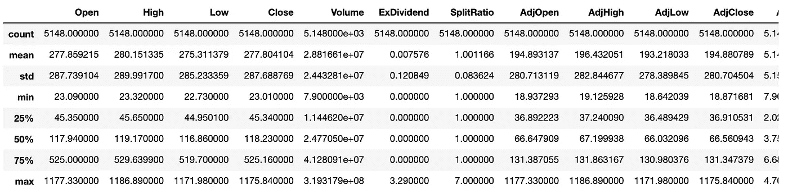

```
spark_df1.describe()
ks_df.describe()
```

除了基本的汇总统计信息之外，汇总统计信息的另一个要素是数据帧中不同列之间的相关性。所有的熊猫、星火、考拉数据框架都提供了一个函数 *corr* ()来计算相关系数。熊猫和考拉 DataFrame 的 *corr* ()函数可以处理任意数量的列，但是 Spark DataFrame 的 *corr* ()函数只允许两列。

```
pd_df[['Open','Close', 'Volume']].corr()
ks_df[['Open','Close', 'Volume']].corr()
```

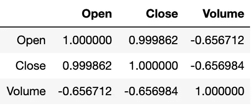

```
from pyspark.sql.functions import corr
spark_df2.select(corr("Open","Close")).show()
```

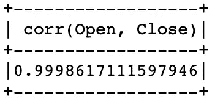

## 2.3 分组依据和聚合

分组依据和聚合(例如，最小值、最大值、平均值等。)是汇总统计的另一个要素。熊猫和考拉数据框架为分组依据和聚合提供了相同的功能:

```
pd_df.groupby('Symbol').max()['Open']
ks_df.groupby('Symbol').max()['Open']
```

但是，用于 group by 和 aggregation 的 Spark DataFrame 函数具有不同的格式:

```
from pyspark.sql.functions import max
spark_df2.groupBy("Symbol").agg(max("Open")).show()
```

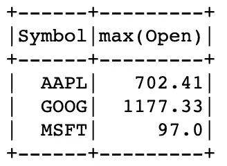

## 2.4 可视化数据

数据可视化是理解数据的一种重要而有效的方法。熊猫和考拉数据框为数据可视化提供了类似的绘图功能，但绘图质量可能会有很大差异。例如，与熊猫数据框架散点图相比，下面的考拉数据框架散点图遗漏了许多数据点。

但是，Spark DataFrame 不直接提供任何数据可视化功能。一种简单的解决方法是将 Spark 数据帧转换为熊猫或考拉数据帧，以实现数据可视化。

```
pd_df_sub = pd_df[['Open', 'Close']]
pd_df_sub.plot.scatter(x='Open', y='Close')
```

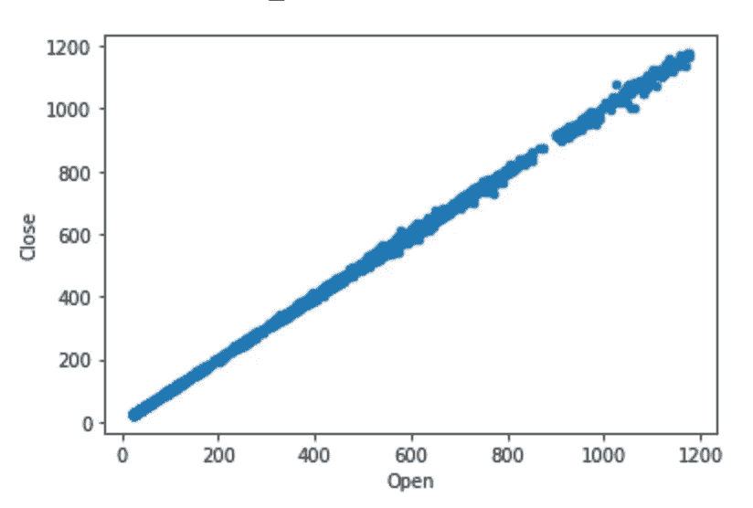

```
ks_df_sub = ks_df[['Open', 'Close']]
ks_df_sub.plot.scatter(x='Open', y='Close')
```

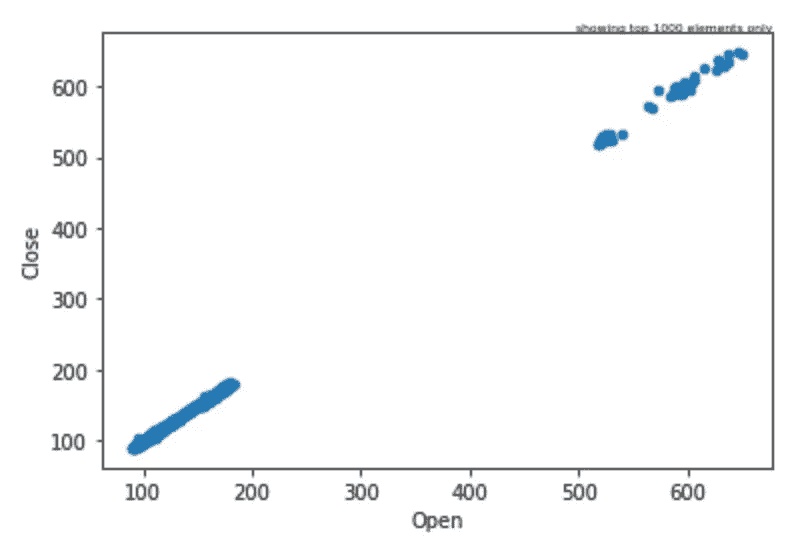

熊猫和考拉 DataFrame 中的散点图函数只能处理两列。Pandas 绘图模块提供了一个 *scatter_matrix* ()函数，该函数可以为任意数量的列绘制散点图。

```
from pandas.plotting import scatter_matrix
pd_df_sub = pd_df[['Open', 'Close', 'Volume']]
scatter_matrix(pd_df_sub, alpha=0.2)
```

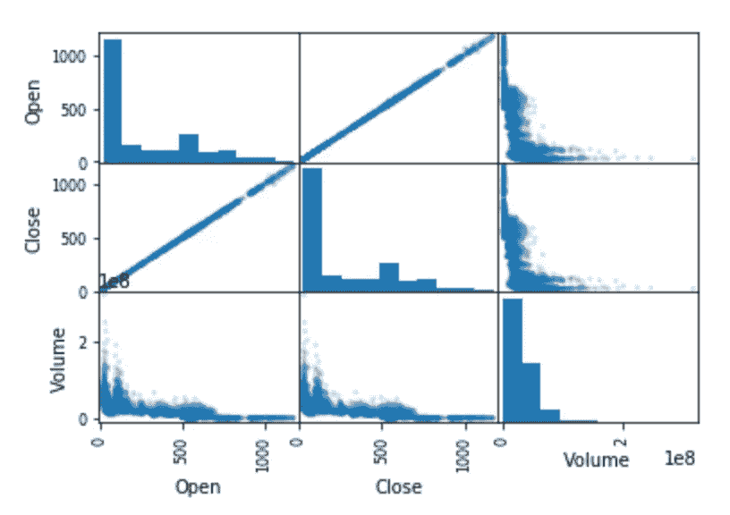

# 3.清理数据

数据清理的两个主要目标是处理丢失的数据和过滤掉异常值。

## 3.1 处理缺失数据

为了演示如何处理丢失的数据，首先让我们将一个丢失的数据项(例如，np.nan)分配到 Pandas 数据帧中:

```
pd_df_missing = pd_df.copy()
pd_df_missing.loc[0, 'Open'] = np.nan
pd_df_missing[pd_df_missing['Open'].isnull()]
```

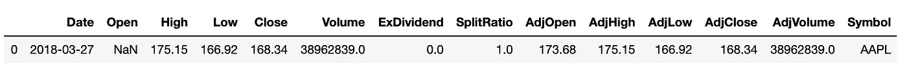

Pandas DataFrame 提供了一个 *fillna* ()函数，可以用任意字符串或数字填充缺失的数据项。Spark 和 Koalas 数据帧提供了类似的功能，但是它们只允许与相应列的数据类型相匹配的值。

```
pd_df_missing.fillna('N/A', inplace = True)
pd_df_missing.fillna(0, inplace = True)# Spark and Koalas allow only a number
ks_df_missing.fillna(0, inplace = True) 
spark_df_missing = spark_df_missing.na.fill(0)
```

## 3.2 过滤数据

数据过滤可用于去除异常值和许多其他目的。

如下面的示例代码所示，熊猫和考拉数据帧具有相同的 API，用于有条件地选择数据行和列。然而，Spark 数据帧有一个不同的 API。

```
pd_df.loc[pd_df['Open'] >= 168, ['Open','Close']].head()
ks_df.loc[ks_df['Open'] >= 168, ['Open','Close']].head()
spark_df.filter("Open > 168").select("Open","Close").show(5)
```

# 4.为特征工程转换数据

特征工程可以是机器学习应用的基础，并且可以通过各种类型的数据转换来实现。特征是数据帧中的数据列。功能工程的范围各不相同，但通常包括以下内容:

*   选择与机器学习中的预测目标相关的现有数据列的子集(即，受监督的机器学习中的标签)
*   用更有意义的名称重命名现有列
*   基于现有列创建新列(即创建衍生特征)
*   将列值缩放到特定范围内(即，在深度学习中将列值缩放到[0，1]或[-1，1]的范围内)

## 4.1 选择列

如前所述，Pandas 和 Koalas DataFrames 提供了相同的选择列的方法，但是 Spark DataFrame 提供了不同的 API。

```
pd_df[['Open', 'Close']]
ks_df[['Open', 'Close']]
spark_df.select('Open', 'Close')
```

## 4.2 重命名列

Pandas 和 Spark DataFrames 使用不同的函数名，但重命名列的功能相似。

```
pd_df.rename(columns = {"Symbol": "SYMBOL"}, inplace = True)
spark_df = spark_df.withColumnRenamed("Symbol", "SYMBOL")
```

但是，目前的考拉数据框架不支持重命名列的功能。

## 4.3 创建新列

机器学习通常需要从现有特征中派生新特征，即从现有列创建新数据列:

```
from pyspark.sql.functions import colpd_df['Sum'] = pd_df['Open'] + pd_df['Close']
ks_df['Sum'] = ks_df['Open'] + ks_df['Close']
spark_df1 = spark_df1.withColumn("Sum", col("Open") + col("Close"))
```

## 4.4 删除列

不必要的列(如 *AdjOpen* 和 *AdjHigh* )可以删除如下:

```
pd_df = pd_df.drop(['AdjOpen', 'AdjHigh'], axis=1)
ks_df = ks_df.drop(['AdjOpen', 'AdjHigh'], axis=1)
spark_df = spark_df.drop('AdjOpen', 'AdjHigh')
```

## 4.5 缩放列

如前所述，如果不同列的值在非常不同的范围内，则在机器学习中有必要将列的值缩放到某个范围内(例如，[0，1 或[-1，1])。对于 Pandas DataFrame，scikit-learn 库为此提供了两个常用函数 *MinMaxScaler* ()和 *StandardScaler* ()。

但是，这些函数不能直接应用于考拉数据帧。树袋熊数据帧需要转换成熊猫数据帧才能利用这些功能。

可以为 Spark 数据帧缩放列，但是与为 Pandas 数据帧使用 scikit-learn 函数相比，实现可能要复杂得多。例如，类似于 [Spark 数据缩放示例，](https://stackoverflow.com/questions/40337744/scalenormalise-a-column-in-spark-dataframe-pyspark)以下代码使用 Spark *MinMaxScaler* 、 *VectorAssembler* 和 *Pipeline* 对象来缩放 Spark 数据帧列:

```
from pyspark.ml.feature import MinMaxScaler
from pyspark.ml import Pipeline
from pyspark.ml.feature import VectorAssembler# VectorAssembler Transformation - Converting column to vector type
assembler = VectorAssembler(inputCols=['Open'], outputCol="Open_Vect")
scaler = MinMaxScaler(inputCol="Open_Vect", outputCol="Open_Scaled")# Pipeline of VectorAssembler and MinMaxScaler
pipeline = Pipeline(stages=[assembler, scaler])# Fitting pipeline on dataframe
spark_df3 = pipeline.fit(spark_df2).transform(spark_df2).drop("Open_Vect")
spark_df3.show(1)
```

## 4.6 一键编码

需要使用一键编码将分类数据类型列的值转换为数字数据类型的新列:

```
pd_df_dummies = pd.get_dummies(pd_df)
ks_df_dummies = ks.get_dummies(ks_df)
```

但是，Spark DataFrame 不提供这样的功能。一种解决方法是将数据帧转换为熊猫或考拉数据帧。

## 4.7 为机器学习重新格式化数据帧

数据预处理的最后一步是根据使用的机器学习库，将数据帧转换为机器学习建模使用的适当格式。

如果基于 Numpy 的机器学习或深度学习库(即 scikit-learn、Keras 等。)时，需要将 DataFrame 转换为 Numpy 数组进行建模。Pandas DataFrame 提供了一个 *values* 属性来从 Pandas DataFrame 中获取一个 NumPy 数组。但是现在的考拉数据框架不支持这样的方法。如果数据集可以在单台机器上处理，Spark 或 Koalas 数据帧可以转换为 Pandas 数据帧，如下所示，以便轻松获得相应的 Numpy 数组。

```
pd_df_from_koalas = ks_df.to_pandas()
pd_df_from_spark = spark_df.toPandas()
```

如果使用像 [MLlib](https://spark.apache.org/docs/latest/mllib-data-types.html) 这样的基于 Spark 的机器学习库，那么需要将数据帧转换成 RDD 或 Spark 数据帧。一个 Spark 数据帧可以直接馈入一个适当设计的 MLlib 流水线(例如参见 [MLlib](https://spark.apache.org/docs/latest/mllib-data-types.html) )或者转换成 RDD，如果基于 RDD 的 MLlib API 用于建模的话。Spark 数据帧提供了一个 *rdd* 属性来返回一个 rdd。在这种情况下，熊猫或考拉数据帧需要首先转换为 Spark 数据帧，以便进行建模。这可以通过以下方式实现:

```
spark_df_from_pandas = spark.createDataFrame(pd_df)
spark_df_from_koalas = ks_df.to_spark()
```

# 摘要

正如在[考拉公告](https://databricks.com/blog/2019/04/24/koalas-easy-transition-from-pandas-to-apache-spark.html)中所描述的，数据科学家倾向于使用熊猫数据框架来探索数据。由于陡峭的学习曲线，他们不愿意使用 Spark DataFrame。考拉似乎通过提供一个易于使用的 API 来填补它们之间的空白，该 API 类似于可以在 Spark 上运行的熊猫 DataFrame。

在这篇文章中，正如下面的汇总表所示，我使用了一个公共数据集[*sample _ stocks . CSV*](https://raw.githubusercontent.com/databricks/koalas/master/data/sample_stocks.csv)来评估和比较机器学习的典型数据预处理任务中熊猫、Spark 和考拉数据帧的基本功能。

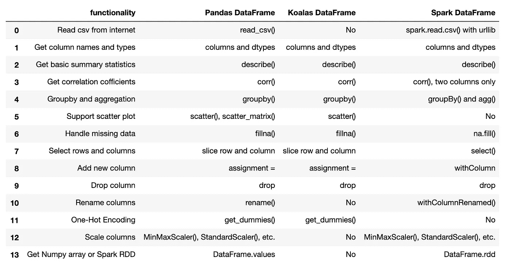

考拉还处于发育初期。如上表所示，它不支持数据预处理的一些基本功能。某些支持的功能尚未成熟。随着开发的推进，考拉在 Spark 上易于使用的数据转换和可视化 API 的许多潜在优势将在大规模数据集(例如，数亿条数据记录)的情况下开始闪耀。

披露声明:2019 首创一。观点是作者个人的观点。除非本帖中另有说明，否则 Capital One 不隶属于所提及的任何公司，也不被这些公司认可。使用或展示的所有商标和其他知识产权是其各自所有者的财产。