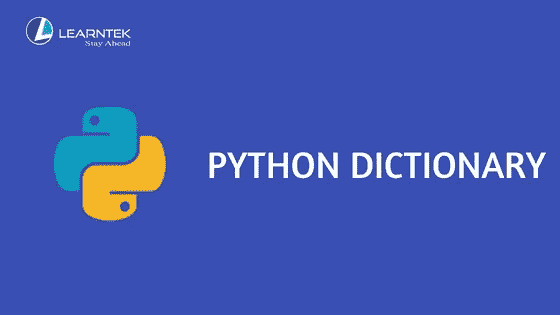

# Python 字典从零开始！！！

> 原文：<https://towardsdatascience.com/python-dictionary-from-scratch-c41316794bcc?source=collection_archive---------25----------------------->

## 让我们了解一下 python 中字典的基础知识。



Credits: [Learntek](https://www.learntek.org/blog/python-dictionary/)

python 中的 Dictionary 包含一个以 key: value 格式存储的无序数据集合。字典也被称为“联想记忆”或“联想数组”。在字典中，键必须总是唯一的。而这些值可以重复，并且可以是任何数据类型。键值对应该表示为“key: value”(:冒号是必须的)。下面是一些最常用的字典方法，也是最常见的面试问题之一。此外，代码可以在我的 [GitHub](https://github.com/Tanu-N-Prabhu/Python/blob/master/Dictionary%20/%20Python_Dictionary.ipynb) 页面上找到。

**比如用 python 声明一个字典:**

```
**# Declaring a dictionary**dictionary = {}dictionary = {'Name': 'Tanu', 'Sex': 'Male', 'Age': 23}
print(dictionary)**{'Name': 'Tanu', 'Sex': 'Male', 'Age': 23}**print(type(dictionary))**dict**
```

# 1)访问字典中的元素

字典可以通过它们的索引来获取值。要做到这一点，您所要做的就是将数字或键的名称与字典的名称一起放在一对方括号内。

```
**# Accessing the elements in a dictionary**dictionary = {‘Name’: ‘Tanu’, ‘Sex’: ‘Male’, ‘Age’: 23}
print(dictionary)**{'Name': 'Tanu', 'Sex': 'Male', 'Age': 23}**print(dictionary['Name'])**'Tanu'**print(dictionary['Sex'])**'Male'**
```

如果您尝试访问字典中未声明的键，则会引发异常，指示未找到任何结果:

```
print(dictionary[‘Height’])**--------------------------------------------------------------------****KeyError   Traceback (most recent call last)**[**<ipython-input-9-038ad6c9b2d4>**](/<ipython-input-9-038ad6c9b2d4>) **in <module>()
----> 1 dictionary['Height']****KeyError: 'Height'**
```

同样，我们可以使用字典的 get()来获取或访问字典的值，如下所示:

```
print(dictionary.get(‘Age’))**23**
```

# 2)从字典中删除元素。

在 python 中，有四种不同的方式或方法可用于从字典中移除元素。它们是 pop、del、popitem 和 clear。del 用于从字典中删除一个键，pop 用于从字典中删除特定的键，popitem 用于从字典中任意删除该键，clear 用于清除或删除字典中的所有元素(顾名思义)。

```
**# Removing the elements from a dictionary**dictionary = {'Name': 'Tanu', 'Sex': 'Male', 'Age': 23, 'Height': 5.8, 'Occupation': 'Student'}
print(dictionary)**{'Name': 'Tanu', 'Sex': 'Male', 'Age': 23, 'Height': 5.8, 'Occupation': 'Student'}****--------------------------------------------------------------------****# Deleting an element**del dictionary['Name']
print(dictionary)**{'Sex': 'Male', 'Age': 23, 'Height': 5.8, 'Occupation': 'Student'}****--------------------------------------------------------------------****# Popping an item**print(dictionary.popitem())**('Occupation', 'Student')****--------------------------------------------------------------------****# Popping the value**dictionary.pop('Sex')**'Male'****--------------------------------------------------------------------**print(dictionary)**{'Age': 23, 'Height': 5.8}****--------------------------------------------------------------------****# Clearing the entire dictionary**dictionary.clear()
print(dictionary)**{}**
```

# 3)遍历字典

使用 for 循环，我们可以遍历字典中的每个键，如下所示:

```
dictionary = {‘Name’: ‘Tanu’, ‘Sex’: ‘Male’, ‘Age’: 23, ‘Height’: 5.8, ‘Occupation’: ‘Student’}
print(dictionary)**{'Name': 'Tanu', 'Sex': 'Male', 'Age': 23, 'Height': 5.8, 'Occupation': 'Student'}****# Iterating through the values**for i in dictionary:
    print(dictionary[i])**Tanu 
Male 
23 
5.8 
Student****--------------------------------------------------------------------****# Iterating through the keys**for i in dictionary:
    print(i)**Name 
Sex 
Age 
Height 
Occupation**
```

# 所有

如果字典的所有键都为真(或者如果字典为空)，则字典中的 all()返回“真”。如果字典中的键为 true，或者如果 dictionary all 方法返回 true，否则将返回 false。

```
dictionary = {0: “Tanu”, 1: “Prabhu”}
print(dictionary)**{0: 'Tanu', 1: 'Prabhu'}**print(all(dictionary))**False**dictionary = {1: "Tanu", 1: "Prabhu"}
print(all(dictionary))**True**dictionary = {}
print(all(dictionary))**True**
```

# 5)任何

如果字典中的任意键为真，字典中的 any()返回“真”。如果字典为空，则返回“False”。

```
dictionary = {0: “Tanu”, 1: “Prabhu”}
print(dictionary)**{0: 'Tanu', 1: 'Prabhu'}**print(any(dictionary))**True**dictionary = {0: "Tanu", 0: "Prabhu"}
print(any(dictionary))**False****# 0 is False**dictionary = {0: "Tanu"}
print(any(dictionary))**False**
```

# 6)透镜

字典中的 length()方法返回字典的长度(很明显)。它返回字典的条目数。

```
dictionary = {‘Name’: ‘Tanu’, ‘Sex’: ‘Male’, ‘Age’: 23, ‘Height’: 5.8, ‘Occupation’: ‘Student’}
print(dictionary)**{'Name': 'Tanu', 'Sex': 'Male', 'Age': 23, 'Height': 5.8, 'Occupation': 'Student'}**print(len(dictionary))**5**
```

# 7)排序

dictionary 中的 Sorted()方法返回字典中新排序的键列表。

```
dictionary = {‘Name’: ‘Tanu’, ‘Sex’: ‘Male’, ‘Age’: 23, ‘Height’: 5.8, ‘Occupation’: ‘Student’}
print(dictionary)**{'Name': 'Tanu', 'Sex': 'Male', 'Age': 23, 'Height': 5.8, 'Occupation': 'Student'}****# Sorting in a ascending order**print(sorted(dictionary))**['Age', 'Height', 'Name', 'Occupation', 'Sex']****# Sorting in a descending order**print(sorted(dictionary, reverse = True))**['Sex', 'Occupation', 'Name', 'Height', 'Age']**
```

sorted()方法接受一个反向参数作为可选参数。

# 8)复制

顾名思义，dictionary 中的 copy 方法返回字典的副本。

```
dictionary = {‘Name’: ‘Tanu’, ‘Sex’: ‘Male’, ‘Age’: 23, ‘Height’: 5.8, ‘Occupation’: ‘Student’}
print(dictionary)**{'Name': 'Tanu', 'Sex': 'Male', 'Age': 23, 'Height': 5.8, 'Occupation': 'Student'}**dictionary1 = {}
print(dictionary1)**{}**dictionary1 = dictionary.copy()
dictionary1**{'Name': 'Tanu', 'Sex': 'Male', 'Age': 23, 'Height': 5.8, 'Occupation': 'Student'}**
```

# 9)钥匙

Python 字典方法 key()返回字典中所有可用键的列表。

```
dictionary = {‘Name’: ‘Tanu’, ‘Sex’: ‘Male’, ‘Age’: 23, ‘Height’: 5.8, ‘Occupation’: ‘Student’}
print(dictionary)**{'Name': 'Tanu', 'Sex': 'Male', 'Age': 23, 'Height': 5.8, 'Occupation': 'Student'}**print(dictionary.keys())**dict_keys(['Name', 'Sex', 'Age', 'Height', 'Occupation'])**
```

# 十)价值观

Python 字典方法 values()返回给定字典中所有可用值的列表。

```
dictionary = {‘Name’: ‘Tanu’, ‘Sex’: ‘Male’, ‘Age’: 23, ‘Height’: 5.8, ‘Occupation’: ‘Student’}
print(dictionary)**{'Name': 'Tanu', 'Sex': 'Male', 'Age': 23, 'Height': 5.8, 'Occupation': 'Student'}**print(dictionary.values())**dict_values(['Tanu', 'Male', 23, 5.8, 'Student'])**
```

因此，以上是 Python 中非常重要的字典技术或函数。一些例子是从 [Python 字典](https://www.programiz.com/python-programming/dictionary)中引用的。我用一种简单的方式写了这篇教程，这样每个人都可以理解和掌握 Python 中字典的概念，而不需要以前的编程知识或经验。如果你们对代码有什么疑问，评论区就是你们的了。谢谢，祝你愉快。