# Python 效率技巧:有抱负的 python 爱好者的新旧技巧

> 原文：<https://towardsdatascience.com/python-efficiency-tips-old-and-new-tricks-for-the-aspiring-pythonista-6717dccd1a39?source=collection_archive---------13----------------------->

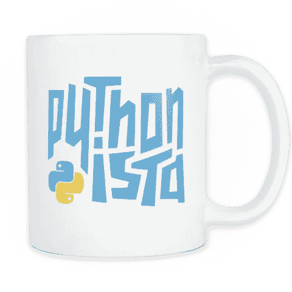

## 这是给予的季节。本着节日的精神，我在 Googleverse 上搜索了一些有趣的、或许不为人知的(直到现在)提高完美主义者 Pythonista 效率的技巧。

1.  **tqdm()**

tqdm()是一个包装器，用于即时显示“for”循环的智能进度表。它需要一个安装和一个导入，但是如果您曾经有过一个循环，看起来花费的时间比它应该花费的时间长，这可以提供一些需要的洞察力。

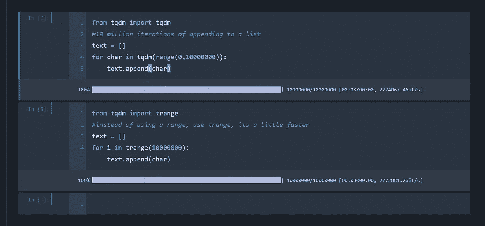

tqdm() and trange() in action — trange is just a bit faster than using range() within tqdm()

**2。Shift 和 Tab 键(Windows 操作系统)**

这个技巧实际上为我节省了很多去 Stackoverflow 的时间，但我有时还是会忘记使用它。这里有几个用途:

*   结束你的思考。在使用了一段时间后，记住正确的库或变量有时会很困难。只需在一个字母后使用**选项卡**按钮，就会弹出一个以该字母开头的术语或实例化变量的下拉列表。

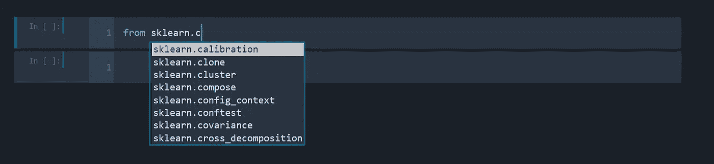

Just type in a letter and use Tab to see a list of options

*   包/特性/方法文档。通过组合 Shift + Tab，将为该项弹出一个 docstring 和说明。在 Jupyter 笔记本中有三种查看方式:

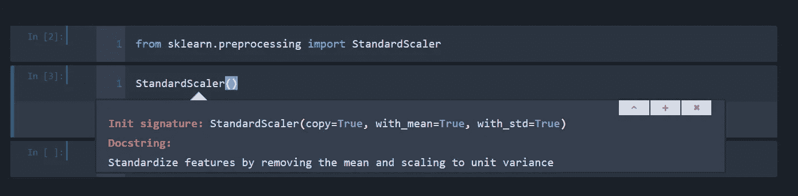

Standard window with argument(s) and brief docstring

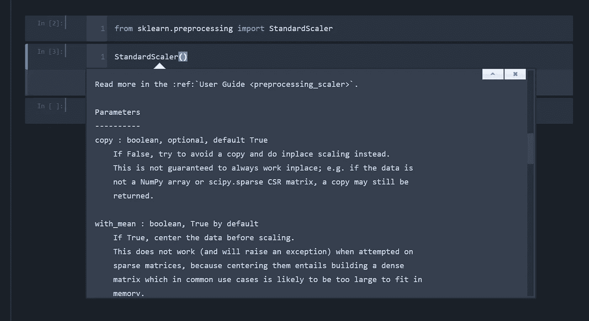

Using the + button will reveal full documentation, including parameters, examples and website

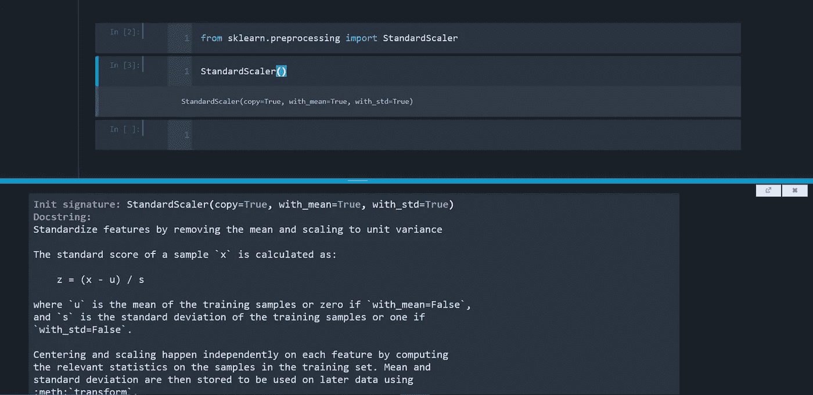

Using the ^ button will embed a bottom pane with the full documentation.

3. **f 弦**

对于那些仍然使用 str.format()或%d(替换为数字)，%s(替换为字符串)的人来说，f 字符串更有效。f 字符串可以在代码中的任何地方被调用，并且可以引用任何以前实例化的变量。下面是一些如何使用它们的例子:

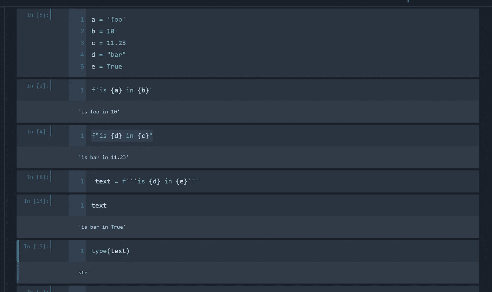

Using ‘ ‘ , “ “ and ‘’’ ‘’’ are all valid methods, and most datatypes can be utilized

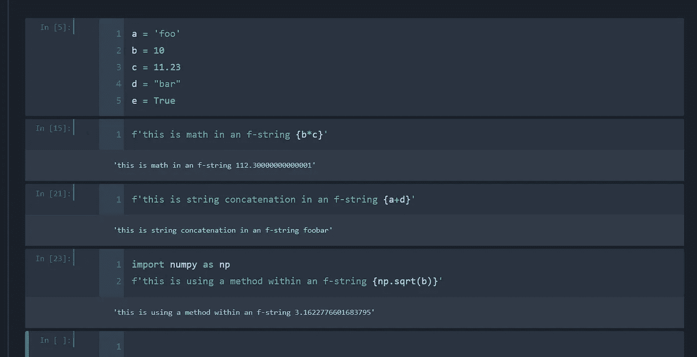

Math operations, string concatenation and methods can be performed within f-strings

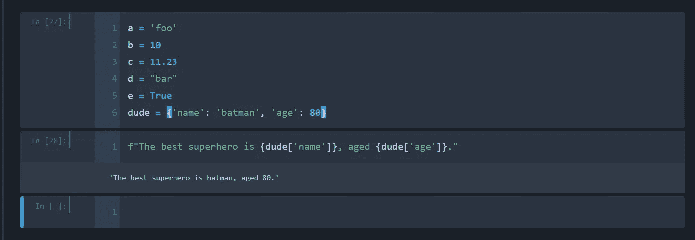

Dictionary values can also be called out in f-strings

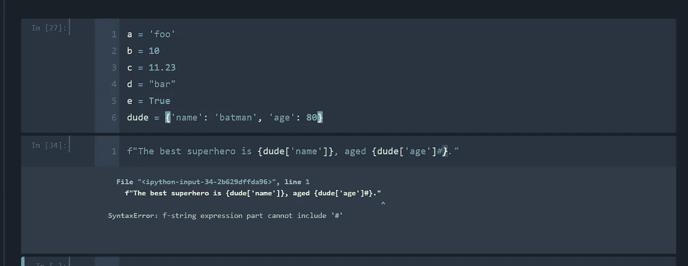

However, some symbols cannot be used within an f-string. Most operator keys like @,&,!,= can.

4. **IPython Magic**

IPython 有一个名为 magic 的内置库，允许用户只需以%符号开头就可以运行特定的命令。魔法有两种形式:

*   行魔法:它们类似于命令行调用。它们以%字符开始。该行的其余部分是传递的参数，没有括号或引号。线条魔术可以用作表达式，它们的返回值可以赋给变量。
*   细胞魔术:他们有%%字符前缀。与线路魔术功能不同，它们可以在呼叫下方的多条线路上操作。事实上，他们可以对接收到的输入进行任意修改，甚至根本不需要是有效的 Python 代码。它们将整个块作为单个字符串接收。

有许多神奇的命令，最著名的是%timeit(乘以你的代码)和%matplotlib inline。要获得可以调用的命令的完整列表，只需运行以下单元格:

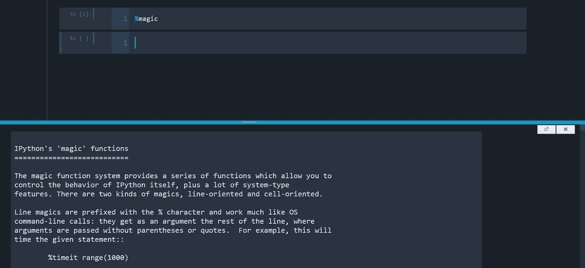

Just type %magic into your notebook for a complete doc on available commands

5. **Walrus 操作符(python 3.8 的新功能)**

对于那些运行 3.8 的人来说(注意:在这篇文章发表时，并不是所有的包都准备好了 3.8)，这里有一个新的操作符，它使得执行操作更有效率。=运算符、赋值运算符或 walrus 运算符(因为它看起来像长着獠牙的眼睛)允许用户在指定的函数或方法中为变量赋值。虽然在[文档](https://www.python.org/dev/peps/pep-0572/)中可以举例说明几种用法，但这里只举例说明最简单的使用情况:

```
#old way
answer = False
print(answer)#new way
print(answer := False)
```

这里的希望是，也许您发现了一些有助于提高 Python 效率的东西，或者激发您的兴趣去探索一些更高效的方法。请随意回复任何其他效率提示。节日快乐！