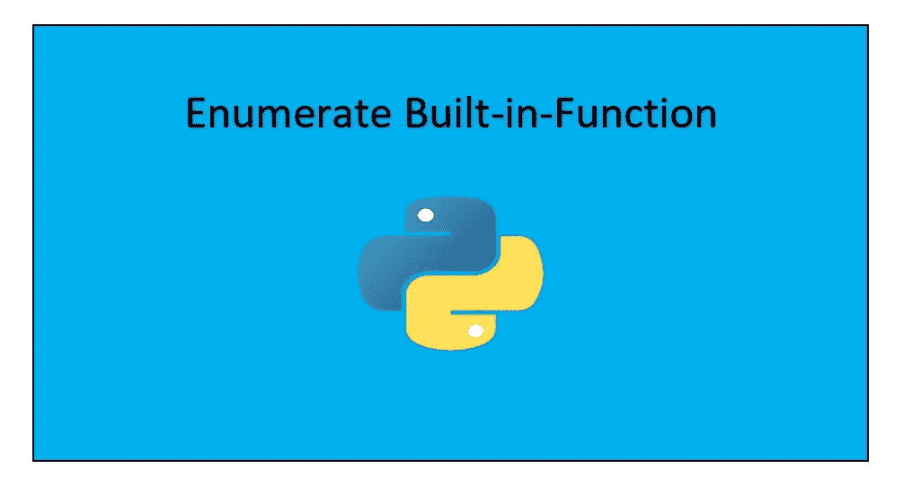

# Python enumerate()内置函数

> 原文：<https://towardsdatascience.com/python-enumerate-built-in-function-acccf988d096?source=collection_archive---------16----------------------->

在本教程中，让我们了解 python 中的枚举内置函数。



# 定义

枚举器内置函数 ***将可迭代数*** 的计数器添加到所提供的整数、字符或字符串等数据结构中。现在，数据结构可能是任何列表、元组、字典或集合。如果计数器不是由用户提供的，那么默认情况下它从 0 开始。基于所提供的数字，枚举器函数进行迭代。

# 句法

**枚举器内置函数的语法如下:**

```
**enumerate(iterable, start)**
```

## 因素

**枚举器函数的参数是 iterable 和 start。**

1.  **iterable:** 这是希望迭代的数据结构的名称。
2.  **start:** 这是您想要开始迭代计数器的数字。

> **注意:iterable 必须是支持迭代的对象。**

如果您想知道枚举函数的实际语法，只需在您的 IDE 上键入 help(enumerate ),然后您将获得以下结果。因为你需要了解这些东西。

```
**Help on class enumerate in module builtins:** **class enumerate(object)  
|  enumerate(iterable[, start]) -> iterator for index, value of      |  iterable  
|    
|  Return an enumerate object.  iterable must be another object that |  supports iteration.  The enumerate object yields pairs containing |  a count (from start, which defaults to zero) and a value yielded |  by the iterable argument. enumerate is useful for obtaining an              |  indexed list:(0, seq[0]), (1, seq[1]), (2, seq[2]), ...  
|    
|  Methods defined here:  
|    
|  __getattribute__(self, name, /)  
|      Return getattr(self, name).  
|    
|  __iter__(self, /)  
|      Implement iter(self).  
|    
|  __new__(*args, **kwargs) from builtins.type  
|      Create and return a new object.  See help(type) for accurate |      signature.  
|    
|  __next__(self, /)  
|      Implement next(self).  
|    
|  __reduce__(...)  
|      Return state information for pickling.**
```

# 返回类型

枚举函数的返回类型是 ***对象*** 类型。因此 enumerate 函数通过向对象添加迭代计数器值来返回该对象。还可以将枚举器对象转换成 list()、tuple()、set()等等。

**让我们看一个例子，了解一下枚举函数。**

```
programmming = ["Python", "Programmming", "Is", "Fun"]
print(type(programmming))enum = enumerate(programmming)print(type(enum))*#Converting to a list* print(list(enum))*#Converting to a tuple* print(tuple(enum))*#Converting to a set* print(set(enum))
```

当您运行该程序时，您将获得以下输出:

```
**<class 'list'>
<class 'enumerate'>
[(0, 'Python'), (1, 'Programmming'), (2, 'Is'), (3, 'Fun')]
((0, 'Python'), (1, 'Programmming'), (2, 'Is'), (3, 'Fun'))
{(3, 'Fun'), (2, 'Is'), (0, 'Python'), (1, 'Programmming')}**
```

# 可选参数

枚举函数也接受可选参数，您也可以传递数据结构的名称以及您想要启动计数器的特定索引。例如，认为列表的默认值从 0 开始，然后计数器继续迭代。现在你想从 5 开始计数，然后递增计数。这可以按如下所示完成:

```
programmming = ["Python", "Programmming", "Is", "Fun"]# Counter value starts from 0
enum = enumerate(programmming)
print(list(enum))# Counter value starts from 5
enum = enumerate(programmming, 5)
print(list(enum))
```

当您运行该程序时，您将获得以下输出:

```
**[(0, 'Python'), (1, 'Programmming'), (2, 'Is'), (3, 'Fun')]****[(5, 'Python'), (6, 'Programmming'), (7, 'Is'), (8, 'Fun')]**
```

# 遍历枚举对象

让我们看看如何循环遍历枚举，如下所示:

```
programmming = ["Python", "Programmming", "Is", "Fun"]for i in enumerate(programmming):
    print(i)for i in enumerate(programmming, 10):
    print(i)
```

当您运行该程序时，输出将是:

```
**(0, 'Python') 
(1, 'Programmming') 
(2, 'Is') 
(3, 'Fun')****(10, 'Python') 
(11, 'Programmming') 
(12, 'Is') 
(13, 'Fun')**
```

关于“ ***Python enumerate()内置函数*** ”的教程到此结束，这是一个很短的教程，因为这个概念很小，你用它能做的事情不多。了解枚举函数的概念真的很重要，这样你就可以在其他地方应用这个概念了。要阅读枚举函数的官方文档，请访问下面的链接:

 [## 内置函数- Python 3.8.0 文档

### Python 解释器内置了许多始终可用的函数和类型。它们被列出…

docs.python.org](https://docs.python.org/3/library/functions.html#enumerate) 

此外，完整的代码可以在下面我的 [GitHub 库](https://github.com/Tanu-N-Prabhu/Python/blob/master/Python_enumerate()_built_in_function.ipynb)中找到:

[](https://github.com/Tanu-N-Prabhu/Python/blob/master/Python_enumerate%28%29_built_in_function.ipynb) [## 塔努-北帕布/Python

### 此时您不能执行该操作。您已使用另一个标签页或窗口登录。您已在另一个选项卡中注销，或者…

github.com](https://github.com/Tanu-N-Prabhu/Python/blob/master/Python_enumerate%28%29_built_in_function.ipynb) 

好了，该说再见了，请继续关注阅读更多 python 教程。我希望你喜欢阅读本教程。祝你今天开心！玩的开心！