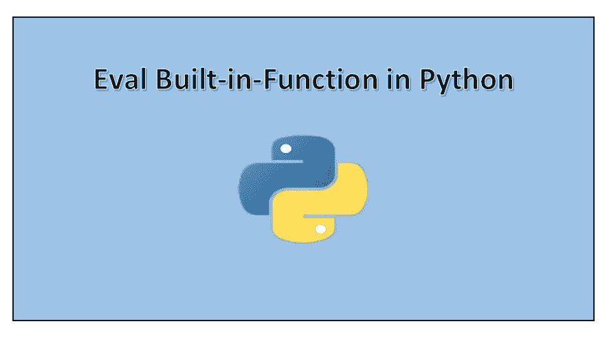

# Python eval()内置函数

> 原文：<https://towardsdatascience.com/python-eval-built-in-function-601f87db191?source=collection_archive---------1----------------------->

让我们了解一下 python 中的 eval()内置函数。



这将是一篇关于 python 中的 eval 函数的短文，其中我将向您解释 eval 函数、它的语法以及面试中经常被问到的几个问题，以便您清楚地理解它并轻松地回答这些问题。要获得完整代码，请点击下面的我的 [GitHub 库](https://github.com/Tanu-N-Prabhu/Python/blob/master/Eval_built_in_function.ipynb):

[](https://github.com/Tanu-N-Prabhu/Python/blob/master/Eval_built_in_function.ipynb) [## 塔努-北帕布/Python

### 此时您不能执行该操作。您已使用另一个标签页或窗口登录。您已在另一个选项卡中注销，或者…

github.com](https://github.com/Tanu-N-Prabhu/Python/blob/master/Eval_built_in_function.ipynb) 

## 让我们开始吧:

# 1.python 中的 eval()是什么，语法是什么？

**回答:** eval 是 python 中使用的内置函数，eval 函数解析 expression 参数并将其作为 python 表达式求值。**简单来说，eval 函数像 python 表达式一样对“字符串”求值，并将结果作为整数返回。**

## 句法

**eval 函数的语法如下所示:**

```
**eval(expression, [globals[, locals]])**
```

## 自变量或参数

eval 函数的自变量或参数是字符串，也可以是全局的，局部变量可以用作 eval 函数内部的自变量，但是全局变量必须表示为字典，局部变量表示为映射对象。

## 返回值

返回值将是计算表达式的结果。返回类型通常是整数。

# 2.eval 函数在哪里最常用？

Eval 函数主要用于需要计算数学表达式的场合或应用。此外，如果用户希望将字符串转换为代码，那么可以使用 eval 函数，因为 eval 函数会计算字符串表达式并返回整数作为结果。

# 3.input()和 eval()有什么区别？

现在大家都知道 input()接受用户输入，但是当用户输入一个整数作为输入时，input 函数返回一个字符串，但是在 eval 的情况下，它会将返回值从字符串计算为整数。我知道你们大多数人都很困惑，让我举个例子来消除你们的困惑:

```
input = input("Enter any number of your choice:")
print(input)
print(type(input))
--------------------------------------------------------------------**Enter any number of your choice: 10 + 10 
10 + 10 
<class 'str'>**
```

看，就像我说的，我输入了一个整数 **10+ 10** ，我期望的结果是 **20 (10 + 10)** ，但是输入方法返回了一个与输入相同的字符串。

```
eval = eval(input("Enter any number of your choice"))
print(eval)
print(type(eval))
--------------------------------------------------------------------**Enter any number of your choice: 10 + 10 
20 
<class 'int'>**
```

在 eval 的情况下，它以整数的形式返回计算后的表达式 **20** ，给定字符串作为输入。 **10 + 10 是一个结果为 20 的表达式。**

# 4.能否用 eval 函数进行数学运算，举个例子？

是的，我们可以使用 eval 函数执行数学运算，如下所示:

```
evaluate = input(“Enter what operation x has to perform: “)
print(evaluate)
print(type(evaluate))
--------------------------------------------------------------------
**Enter what operation x has to perform: x + x + 100 - 35 + 5 * 80 
x + x + 100 - 35 + 5 * 80 
<class 'str'>**x = 10
print(type(x))
--------------------------------------------------------------------**<class 'int'>**expression = eval(evaluate)
print(expression)
print(type(expression))
--------------------------------------------------------------------
**485 
<class 'int'>**
```

就像我说的，如果你以字符串的形式给出输入，eval 函数计算表达式，并以整数的形式返回结果。

这就是你开始使用 python 中的 eval 函数所需要知道的一切，现在你已经知道了上述问题的所有答案。同样的问题可能不会一直被问到，关键是要更好地了解概念，然后你才能回答任何问题。如果您想花些时间阅读一些关于 eval 函数的材料，我建议大家阅读下面所示的 eval 函数文档:

 [## 内置函数- Python 3.8.0 文档

### Python 解释器内置了许多始终可用的函数和类型。它们被列出…

docs.python.org](https://docs.python.org/3/library/functions.html#eval) 

谢谢各位，这是文章的结尾就像我说的这是一篇小文章。如果你们有什么疑问或者遇到了什么困难，请在下面的评论区告诉我，我一定会回答你们所有的问题。好了，该说再见了，祝你有美好的一天。