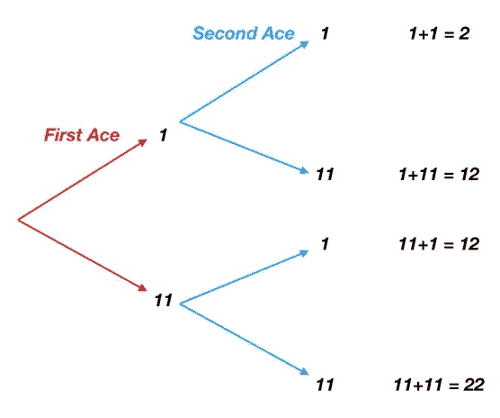

# Python 练习:计算一手 A 牌的所有可能值

> 原文：<https://towardsdatascience.com/python-exercise-calculating-all-possible-values-of-a-hand-of-aces-98a218dbd0f7?source=collection_archive---------22----------------------->


## 这比我最初想的更有趣/复杂，因此写了这篇文章

我最近发表了一篇关于如何用 Python 模拟 21 点的博客。我仍然在做那个博客的后续工作，但是我想在那里得到这个免费的帖子。

在[我发表了我最初的 21 点帖子](/lets-play-blackjack-with-python-913ec66c732f)后不久，Twitter 用户@DonBeham 友好地指出，在某些情况下(因为 ace)，我的代码产生的手牌值将是错误的。

所以我去修复我的错误，并意识到计算 ace 值比我最初想象的要复杂得多。我们来探究一下原因。

你可以在我的 GitHub 上找到下面的代码以及我的 21 点代码[。](https://github.com/yiuhyuk/blackjack)

# 挑战

> 写一个函数来计算一手牌的 21 点数值。

似乎很简单。

除了 a 可以值 1 分或 11 分，这取决于你手牌其余部分的价值。如果你的其他牌值 9 分，那么 a 值 11 分，这样你总共有 20 分。另一方面，如果你的其他牌值 19 分，a 现在值 1 分，这仍然给你 20 分。

听起来不算太糟，对吧。让我们看看复杂性是从哪里来的:

1.  一手牌可以有任意数量的 a。鉴于赌场通常使用至少六副牌的牌叠，你最终可能拿到三张、四张甚至五张 a，这是非常不可能的，但肯定不是不可能的。所以我们需要逻辑来解释这些罕见的情况。
2.  你手中 a 的价值不仅取决于你拿到 a 时已经有的牌，还取决于你将来会拿到的牌。例如，如果你的手牌是[a，7]，那么它现在值 11+7=18 点。你得到一张王牌，这是一手更新的[王牌，7，王牌]——你的牌值增加到 11+7+1 = 19；不太复杂，因为我们知道，我们获得的每一个额外的 ace 都只值 1 分(因此我们不会超过 21 分)。现在，让我们把它变得更复杂一点——你拿到一张 5，给你[a，7，a，5]。保持之前的 ace 值 11 和 1，我们的手牌值为 11+7+1+5=24。这将超过 21，因此破产，所以现在我们拥有的每张 a 应该只值 1 分。

# 二十一点解决方案

针对 21 点的解决方案还不算太差。事情是这样的:

*   如果我们手中没有 a，那么 a 的值显然为零——首先我们需要检查这一点。
*   我们知道我们手里的 a 只有一张能值 11 分。否则我们会破产——例如，11+11=22。
*   因此，如果我们手里一张王牌值 11，其他值 1 的牌总数小于或等于 21，那么保留当前的王牌值(其中一张值 11，其余值 1)。
*   否则，如果一张 a 值 11，其他值 1 的手牌总数大于 21，则将所有 a 值设为 1。

```
#Check if the value of non-ace cards plus aces with one ace worth 11 #and the rest worth 1 is less than or equal to 21if num_aces > 0:
    if non_ace_total + 11 + (num_aces - 1)*1 <= 21:
        ace_value = 11 + (num_aces - 1)*1
    else:
        ace_value = num_aces*1
else:
    ace_value = 0

hand_total = non_ace_total + ace_value
```

很简单。但是，除了 21 点以外，还有什么更通用的解决方案呢？现在，我们知道只有一张 a 值 11，这对我们很有帮助。但是如果破产的门槛本身就是一个可变的变量呢？你也许仍然可以用一堆“如果语句”来做这件事，但是会很麻烦。相反，让我们写一个更一般的解决方案。

# 广义解

让我们试着想出一个更通用的解决方案。我想到的是用树。

*   我想找出 ace 值的所有排列。例如，对于两个 ace，它将是[1，1]，[1，11]，[11，1]，[11，11]。我实际上想找到 ace 值的所有组合，但我发现先得到排列，然后过滤掉重复的更容易。
*   然后我把它们加起来——2，12，12，22。
*   最后，我想要唯一的值— 2，12，22。从这组值中，我可以选择最符合我的游戏规则的数字。

那么我们如何得到所有的排列呢？我首先想到的是嵌套的 for 循环。但这只有在你预先知道有多少个 ace 的情况下才有效，例如，如果你有 3 个 ace，那么你需要循环 A，B 和 C，其中 C 嵌套在 B 中，B 又嵌套在 A 中。

```
ace_values = []for A in [1,11]:
    for B in [1,11]:
        for C in [1,11]:
            ace_values.append(A+B+C)unique_ace_values = set(ace_values)
```

但关键是我们不知道会有多少个 a——所以我们不知道我们需要多少个 for 循环。

我的回答是用一棵树。我们可以把每个 ace 看作两个分支(如果我的树术语不正确，我道歉)，其中第一个分支对应于 1，第二个分支对应于 11。如果我们持有第二张 a，那么每个分支再次分裂，因此总共有 4 个叶节点，对应于手牌值 2、12、12 和 22。下图显示了我刚才描述的两个 ace 案例。



Using a tree to find all permutations for two aces

使用我们的树结构，我们可以通过遍历树直到到达每个叶节点来得到每个排列:

1.  向上，向上—在第一次分割时获取 1，然后在叶节点再次获取 1。
2.  向上，向下—得到 1，然后是 11。
3.  向下，向上—得到 11，然后是 1。
4.  向下，向下——得到 11 个，然后 11 个。

那么如何用 Python 代码实现这一点呢？受过传统训练的计算机科学家可能会创建一个树类，然后递归地遍历它。但那是周日晚上，我不是递归的大师，所以我用快速而肮脏的方法遍历了我的树。

# 遍历树

下面是我的代码。我会一步一步地教你。

第一个块是主要功能。它将 ace 的数量作为一个整数变量 num_aces，创建一个名为 temp_list 的列表，然后将该列表传递给一个助手函数 get_ace_values，该函数产生最终结果。在我传递给 get_ace_values 的列表变量 temp_list 中，每个 ace 都表示为[1，11] —所以如果有三个 ace，temp_list = [[1，11]，[1，11]，[1，11]]。

```
# Convert num_aces, an int to a list of lists
# For example if num_aces=2, the output should be [[1,11],[1,11]]
# I require this format for the get_ace_values functiondef ace_values(num_aces):
    temp_list = []
    for i in range(num_aces):
        temp_list.append([1,11])
    return get_ace_values(temp_list)
```

现在该迭代了。我没有递归地遍历树，而是将树重新想象成一个数组，其中每一行对应于树的一次端到端遍历。这是三张 a 的情况:

```
[[ 1\.  1\.  1.]     # up, up, up
 [ 1\.  1\. 11.]     # up, up, down
 [ 1\. 11\.  1.]     # up, down, up
 [ 1\. 11\. 11.]     # up, down, down
 [11\.  1\.  1.]     # down, up, up
 [11\.  1\. 11.]     # down, up, down
 [11\. 11\.  1.]     # down, down, up
 [11\. 11\. 11.]]    # down, down, down
```

你看到模式了吗？首先，遍历树有 2 = 8 种可能的方式(因为有三个 ace)。在我们的数组的第一列中，数字每四个元素切换一次(从 1 到 11)。在第二列中，它们每两个交换一次。在最后一栏，他们转换了所有元素。

下面是我的 get_ace_values 函数的代码。这肯定不是最优雅的解决方案。我在下面的项目符号中解释了它是如何工作的。

```
def get_ace_values(temp_list):
    sum_array = np.zeros((2**len(temp_list), len(temp_list)))
    # This loop gets the permutations
    for i in range(len(temp_list)):
        n = len(temp_list) - i
        half_len = int(2**n * 0.5)
        for rep in range(int(sum_array.shape[0]/half_len/2)):
            sum_array[rep*2**n : rep*2**n+half_len, i]=1
            sum_array[rep*2**n+half_len : rep*2**n+half_len*2, i]=11
    return [int(s) for s in np.sum(sum_array, axis=1)]
```

*   第一个 for 循环运行的次数等于我们拥有的 ace 数 temp _ list 的长度等于我们拥有的 ace 数。for 循环的每一次运行都会产生 sum_array 的一列，即我上面描述的数组。
*   变量 n 只是从 ace 的数量开始向下计数，一直到 1。例如，如果有三个 ace，n 将从 3 开始，然后在第二次循环中减少到 2，最后在 1 结束。
*   变量 half_len 告诉我们在切换到打印 11 之前连续打印 1 的次数(相同的次数)。如果你还记得我在上面给你看的 sum_array 矩阵，在第一列，我们打印了四个 1 后面跟着四个 11。因此，对于 for 循环的第一次运行(对于三个 ace 的情况)，half_len 等于 2 * 0.5 = 4。在第二列中，我们每两个元素交换一次，因此 half_len 等于 2 * 0.5 = 2。
*   对于三个 ace 的情况，第二个 For 循环(嵌套循环)在外部 for 循环的第一次运行时运行一次，在外部循环的第二次运行时运行两次，最后在外部循环的最后一次运行时运行四次。这个嵌套循环用于在我们需要的地方打印 1 和 11。

```
THREE ACE CASEIn the first run of the outer loop, since half_len=4, the nested for loop runs once (8/half_len/2 = 1) and prints four 1s followed by four 11s onto sum_array:
[[ 1\.  0\.  0.]
 [ 1\.  0\.  0.]
 [ 1\.  0\.  0.]
 [ 1\.  0\.  0.]
 [11\.  0\.  0.]
 [11\.  0\.  0.]
 [11\.  0\.  0.]
 [11\.  0\.  0.]]In the second run of the outer loop, since half_len=2, the nested for loop runs twice (8/half_len/2 = 2), each time printing two 1s followed by two 11s onto sum_array:
[[ 1\.  1\.  0.]
 [ 1\.  1\.  0.]
 [ 1\. 11\.  0.]
 [ 1\. 11\.  0.]
 [11\.  1\.  0.]
 [11\.  1\.  0.]
 [11\. 11\.  0.]
 [11\. 11\.  0.]]In the third run of the outer loop, since half_len=1, the nested for loop runs four times (8/half_len/2 = 4), each time printing a 1 followed by a 11 onto sum_array:
[[ 1\.  1\.  1.]
 [ 1\.  1\. 11.]
 [ 1\. 11\.  1.]
 [ 1\. 11\. 11.]
 [11\.  1\.  1.]
 [11\.  1\. 11.]
 [11\. 11\.  1.]
 [11\. 11\. 11.]]
```

*   差不多了 sum _ array 的每一行现在都可以用来表示我们的树的一个端到端遍历，这意味着每一行都是一个排列。所以我们要做的就是取 sum_array 中每行的和，得到所有可能的 ace 值。

让我们为三种 ace 情况运行 ace_values:

```
Running:
  ace_values(3)Produces:
  [3, 13, 13, 23, 13, 23, 23, 33]Taking the set of this:
  set(ace_values(3))Produces what we want:
  {3, 13, 23, 33}
```

我很喜欢编码，但是我还有很多要学的，所以我会经常发表这样的散漫的文章。请原谅我。

干杯，下次再见！

*我最近的一些帖子，希望你能看看*

*[*让我们玩 21 点(用巨蟒)*](/lets-play-blackjack-with-python-913ec66c732f)*

*[*你的公司真的是数据驱动的吗？*](/is-your-company-truly-data-driven-2cf5feaa3cfb)*

*[*数据科学家挣多少钱？*](/how-much-do-data-scientists-make-cbd7ec2b458)*

*[*数据科学家挣多少钱第二部*](/how-much-do-data-scientists-make-part-2-cb959a0d05f)*

*[*软件工程师挣多少钱？*](/how-much-do-software-engineers-make-60565f50f579)*

*[*技能提升的更好方法*](/a-better-way-to-skill-up-b2e5ee87dd0a)*