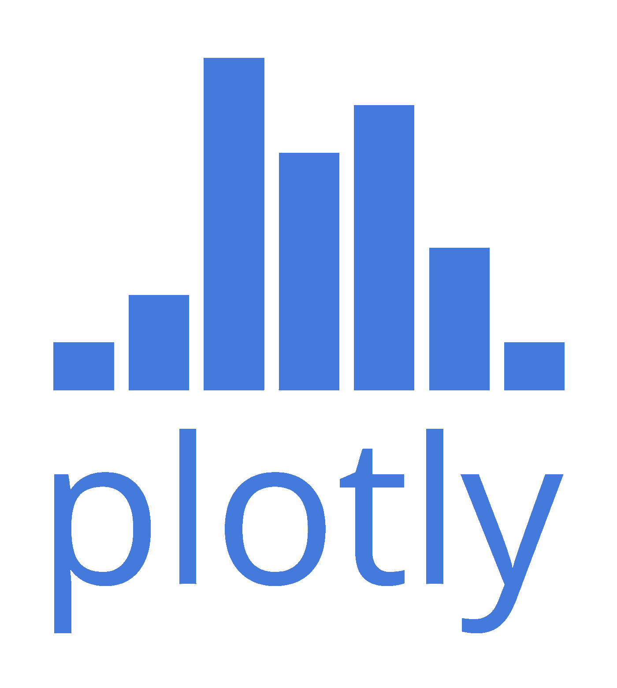
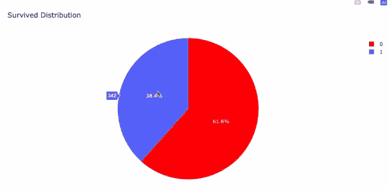
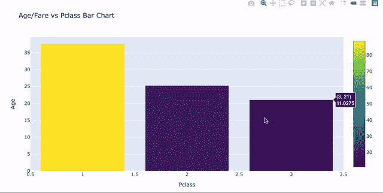

# 面向数据科学的 python——Plotly 数据可视化指南

> 原文：<https://towardsdatascience.com/python-for-data-science-a-guide-to-data-visualization-with-plotly-969a59997d0c?source=collection_archive---------3----------------------->

## 现在是 2020 年，是时候停止使用 Matplotlib 和 Seaborn 了


Photo by [Carlos Muza](https://unsplash.com/@kmuza?utm_source=medium&utm_medium=referral) on [Unsplash](https://unsplash.com?utm_source=medium&utm_medium=referral)

问候我的数据从业者同事们，欢迎回到我的数据之旅的另一集。本周我们将讨论数据的可视化，它们有多重要，以及你应该使用什么样的 python 库来制作它们。所以上车吧，放松，享受旅程。

如果你像我一样是一名数据从业者，你应该经历过需要向别人解释你的数据的情况。你需要讲一个故事，表达你的观点，说服你的同事、主管甚至你的首席执行官。现在，想象你试图解释不到 20%的男性在[泰坦尼克号数据集](https://www.kaggle.com/c/titanic/data)中幸存。
会是什么样子？


Male Survivability (Titanic Dataset)

正如你所看到的，可视化在解释你的数据方面发挥了巨大的作用。在屏幕上显示数字并不适用于某些人。视觉效果的确与众不同。

可视化帮助数据科学家**理解**和**发现**数据中隐藏的故事。在一个实例中，一个简单的直方图可以告诉你比你自己试图找出分布更多的信息。
这是[泰坦尼克号数据集](https://www.kaggle.com/c/titanic/data)的票价分布。


Distribution for Fares (Titanic Dataset)

直截了当地绘制出来告诉我们，我们的大多数客户的票价都在 100 美元以下。这是很好的信息，但是它没有告诉我们的全部情况。

> 想象给了你一些你不知道的问题的答案。本·施奈德曼

# 水流

当数据可视化首次成为一件事情时，数据从业者在与熊猫一起探索数据时绘制图表。使这成为可能的库叫做 Matplotlib，它是一个好的库，因为它是:

*   使用方便
*   快的
*   与熊猫和谐相处

然而，使用时间足够长的人会觉得它很乏味。甚至 Matplotlib 的官方功能也声明:

> Matplotlib 主要用于基本绘图。— Matplotlib

因此，想要一个由更多绘图模式、选项和更简单语法组成的更有趣的库的数据从业者蜂拥至 **Seaborn 库。在那个时候，Seaborn 是很多人的首选。这是我们刚刚绘制的直方图的一张 **Seaborn** 图。**


Distribution for Fares (Titanic Dataset) in Seaborn

**Seaborn** 图书馆还提供了数量惊人的情节，从 **Hexbin 情节**到 **Violin 情节**，那种你从未想过你会需要的情节。这里有一个他们提供的情节类型的简要预览。


Seaborn’s Official Gallery

然而，仍然有一个问题。所有这些库都提供静态图。这些图只能告诉你它们在屏幕上显示的内容。你不能更深入地研究这些图，将鼠标悬停在点上来查找信息或添加过滤器。

能够执行此类功能的绘图被命名为
**交互式可视化。**

互动可视化很受欢迎，因为它可以在你呈现的情节上添加大量信息，释放可能性，让你看起来**10 倍** **酷**。很难用语言表达，让我们想象一下我想告诉你的事情。
这是[泰坦尼克号数据集](https://www.kaggle.com/c/titanic/data)中同样的票价分布图。


Distribution of Fares (Titanic Dataset)

请注意，我们可以将鼠标悬停在直方图上，了解我们所指的**分布**
(男性或女性)，了解我们所悬停的**值**，**放大和缩小**以深入了解这些值，以及**过滤**男性或女性。你已经可以想象这是多么强大，这将如何有助于你用数据讲述故事。

使这成为可能的库被称为**通俗地说就是**。



Plotly

# Plotly

Plotly 是**用于**交互式**数据可视化的** Python 库。Plotly 允许你绘制比 Matplotlib 或 Seaborn 更好的交互式图形。

# Plotly 绘制什么样的图形？

*   所有 Matplotlib 和 Seaborn 图表
*   **统计图表**，包括但不限于平行分类和概率树图
*   **你从未想到的科学图表**从网络图到雷达图
*   **财务图表**对时间序列分析有用，例子包括蜡烛图、漏斗图和子弹图
*   **地质图**和允许你与之互动的三维绘图


Plotly Examples from [Plotly](https://medium.com/plotly/introducing-plotly-express-808df010143d) Announcement

# 为什么 Plotly 这么受欢迎？

*   **互动**剧情
*   比 Matplotlib/Seaborn 漂亮(有待商榷？)
*   提供更详细的可视化效果，有助于探索、理解和交流您的数据
*   为您的绘图提供最大化定制，包括添加滑块和过滤器的

*   更加清晰易懂的代码库
*   由一家名为 **Plotly** 的公司支持，该公司开发基于网络的交互式可视化和网络应用程序

# 我如何安装 Plotly？

安装 Python，

```
pip install plotly
pip install cufflinks
```

# 先决条件

在本指南中，我们将与**熊猫**一起工作。因此，需要对熊猫的基本知识有一个扎实的了解。
这里有一篇我写的关于熊猫的文章[](/python-for-data-science-basics-of-pandas-5f8d9680617e)****让你快速了解。****

****不管它带来多少好处，人们倾向于避免它，因为:****

*   ******令人困惑的**代码的语法****
*   ****进口商品可能会吓跑一些人****
*   ****被可用的**工具**淹没(袖扣和仪表板)****
*   ****缺乏一个好的**指南**来策划(这就是为什么我做了这个)****

****不要害怕，我会牵着你的手度过这段艰难的时光。抓起一杯咖啡，坐在一个舒适的位置，准备做一些代码。****

# ****进口****

****在本指南中，我们将使用 **Jupyter 笔记本**。让我们把这一个做好。****

```
**from plotly.offline import init_notebook_mode,iplot
import plotly.graph_objects as go
import cufflinks as cf
init_notebook_mode(connected=True)**
```

****由于 Plotly 的操作方式，它会将您的绘图保存到一个单独的 html 文件中，并直接在不同的窗口中打开它。当您在**控制台/终端**中运行代码时，就会发生这种情况。因此，我们使用 plotly.offline、iplot 和 init_notebook 模式来帮助我们在 Jupyter 笔记本本身上绘制图形**。******

****在本指南中，我将重点介绍原始的 plotly 语法，因为它为您的图形提供了最大限度的定制。 **Plotly Express** 和 **Cufflinks** 为简单的代码绘制提供了更好的选择，但是它们没有像原始语法那样提供很多工具。****

# ****定义需要绘制的内容****

****在策划任何事情之前，你需要知道你想策划什么。问自己这样的问题:****

*   ****你想传达什么样的信息？****
*   ****您是在绘制数值还是分类值**呢？******
*   ****你想画出多少变量？****

****回答完其中的一些问题，你就可以开始规划你的剧情了。****

****我们将使用经典的 [**泰坦尼克号数据集**](https://www.kaggle.com/c/titanic/data) ，从我写的 [**熊猫指南**](/python-for-data-science-basics-of-pandas-5f8d9680617e) 继续我们的数据探索。****

******导入数据集******

```
**df = pd.read_csv(filepath)**
```

********

****Titanic Dataset****

****同样，这个数据集的主要目的是研究什么是影响泰坦尼克号上人员生存能力的**因素。******

****我首先想到的是显示泰坦尼克号失事中有多少乘客**幸存。因此，可视化幸存的**柱本身将是一个好的开始。********

# **数据、布局和图形**

**在 Plotly 中，我们定义要绘制的图形对象。绘图所需的 3 个主要参数是**数据、布局和图形**参数。
因此，我们需要用一种清晰简洁的方式来定义它们，这样其他人就能理解我们试图绘制的内容。**

**由于我们是单独绘制幸存的列的**，我们的**数据**将是一个****

# **圆形分格统计图表**

```
#labels
lab = df["Survived"].value_counts().keys().tolist()
#values
val = df["Survived"].value_counts().values.tolist()trace = go.Pie(labels=lab, 
                values=val, 
                marker=dict(colors=['red']), 
                # Seting values to 
                hoverinfo="value"
              )data = [trace]
```

**Plotly 的饼状图带入**必需的参数**，默认为**标签**和**值**。因此，我们将**标签**定义为**幸存**列的**唯一值**，在本例中为值 1 和 0。我们试图显示的**值**是这些唯一值的**计数**。然后，我们将数据定义为一个包含我们刚刚定义的饼图对象的列表。**

****布局** 布局顾名思义，就是你的情节的布局。
在这里，您可以定义**绘图标题**，x 和 y 轴标题**，显示**图例**，激活**过滤器/滑块**以及更多对图表的定制。由于我们只为单个列绘制了一个饼图，所以不要把它做得太花哨。****

```
layout = go.Layout(title="Survived Distribution")
```

**我们正在创建一个**布局** **对象**，这里只包含**标题**参数。**

****图
图**图是你想要绘制的，它默认接受我们已经定义好的**数据**和**布局**参数。**

```
fig = go.Figure(data = data,layout = layout)
```

**然后，我们可以通过用 Plotly 按字面意义绘制它来显示这个图。**

```
iplot(fig)
```

****

**Pie Chart**

**瞧，你已经成功地绘制了一个**交互图**。请注意，当悬停在每个部分上时，我们能够看到实际值。这在以干净专业的方式呈现可视化效果时非常有用。尝试为**性别**和**p 类别**列绘制一个饼图。**

**接下来，让我们探索一些**数字**列，它们是**年龄**和**费用**列。当单独绘制**数字**列时，我们会想到一个分布图。在这种情况下，我将使用**直方图**。**

# **柱状图**

```
# defining data
trace = go.Histogram(x=df['Age'],nbinsx=40,histnorm='percent')
data = [trace]# defining layout
layout = go.Layout(title="Age Distribution")# defining figure and plotting
fig = go.Figure(data = data,layout = layout)
iplot(fig)
```

****

**Histogram**

**完美。我们可以清楚地看到乘客的年龄在这里是如何分布的。
注意，我们可以调整直方图的两个有用参数，它们是:**

*   **Histnorm —绘制直方图所依据的值，它被设置为“百分比”,以便我们显示对分布有贡献的条柱的百分比。如果留空，默认情况下显示箱子的数量。**
*   **nbinsx —要分配到的值的箱数。箱数越多，分布越详细。**

**酷毙了。到目前为止，我们只绘制了一个变量的图表。现在让我们通过绘制这些变量之间的相互关系来研究它们之间的关系。**

**让我们找出我们的年龄和票价列之间的关系。这将有助于回答这样的问题——老年人是否倾向于购买更贵的机票？**

**当绘制两个数值时，
散点图将是一个很好的起点。**

# **散点图**

```
#defining data
trace = go.Scatter(x = df['Age'],y=df['Fare'],text = df['Survived'],mode='markers')data=[trace]#defining layout
layout = go.Layout(title='Fare Vs Age Scatter Plot',xaxis=dict(title='Age'),yaxis=dict(title='Fare'),hovermode='closest')#defining figure and plotting
figure = go.Figure(data=data,layout=layout)
iplot(figure)
```

****

**Scatter Plot**

**请注意，我在该图中添加了一些微妙的特征，即 x 和 y 轴标题以及悬停在该点上时显示的**值**。您可以通过更改代码中的**文本**参数来自定义**显示** **值**。**

**观察这个情节，我们并没有真正看到列之间的线性关系。票价往往会触及 300 英镑以下的价格上限。我们还观察到，老年人也买便宜的机票。除此之外，单纯依靠这个情节，我们真的说不出太多。**

**我们可以通过查看 **Pclass** 列进一步研究这个问题，这是乘客的机票等级。通过绘制每个阶层的平均年龄和费用，我们可以看到这里是否有联系。**

# **条形图**

**让我们绘制一个显示这些信息的条形图。对于每个 Pclass，我们希望显示该 Pclass 中的**平均年龄**和**费用**。如果你注意到了，我们在这里开始处理多个变量，确切地说是 3 个。**

**为了简单起见，我将在我们的条形图中以色标的形式绘制 x 轴上的 Pclass，y 轴上的平均年龄和平均票价。因此，我们需要首先计算每个等级的平均年龄和票价。**

```
y=[]
fare = []
for i in list(df['Pclass'].unique()):
    result = df[df['Pclass']==i]['Age'].mean()
    fares = df[df['Pclass']==i]['Fare'].mean()
    y.append(result)
    fare.append(fares)
```

**之后，我们可以绘制图表。**

```
#defining data
trace = go.Bar(x = list(df['Pclass'].unique()),y=y,marker=dict(color=fare,colorscale='Viridis',showscale=True),text = fare)
data=[trace]#defining layout
layout = go.Layout(title='Age/Fare vs Pclass Bar Chart',xaxis=dict(title='Pclass'),yaxis=dict(title='Age'),hovermode='closest')#defining figure and plotting
figure = go.Figure(data=data,layout=layout)
iplot(figure)
```

****

**Bar Chart**

**我们在这里添加了两个新参数，它们是:**

*   **颜色—与色标相关的值**
*   **色标-显示数值大小的色标类型**

**酷毙了。将鼠标悬停在条形上方，我们可以看到每个等级的平均年龄和票价，更不用说定义票价的清晰色标了。条形图清楚地显示了年龄和票价随着 Pclass 的增加而降低。**

**我们也可以通过绘制每个 Pclass 的年龄和票价的**分布**来证实这一点。这将为我们提供每类数据的清晰图像，而不是平均值。为此，我们将使用 distplot。**

# **分布图**

**分布图类似于直方图，但它们在底部包括另一个计数图，以便更好地显示分布。
我们必须为分布图导入一个额外的库。**

```
import plotly.figure_factory as ff
```

**让我们分别根据年龄和票价
绘制两张图表。**

```
#defining data
a = df[df['Pclass']==1]['Fare']
b = df[df['Pclass']==2]['Fare']
c = df[df['Pclass']==3]['Fare']
hist_data=[a,b,c]
group_labels=['1','2','3']#defining fig and plotting
fig = ff.create_distplot(hist_data,group_labels,bin_size=
[1,1,1],show_curve=False)
fig.update_layout(title_text='Distribution for Fares')
iplot(fig)
```

****

**Distribution of Fares**

```
a = df[df['Pclass']==1]['Age']
b = df[df['Pclass']==2]['Age']
c = df[df['Pclass']==3]['Age']
hist_data=[a,b,c]
group_labels=['1','2','3']
fig = ff.create_distplot(hist_data,group_labels,bin_size=[1,1,1],show_curve=False)
fig.update_layout(title_text='Distribution for Age')
iplot(fig)
```

****

**Distribution of Age**

**两张分布图都清楚地表明，较低的社会阶层
与较高的年龄和较高的票价相关。通俗地说，就是头等舱机票价格更高，年纪大的人更倾向于购买头等舱机票。**

**得出这个结论后，我们想知道**生存能力**与这些变量有什么关系。我们可以用气泡图来绘制针对他们的生存能力图。气泡图允许可视化多达 4 个变量，这可以帮助我们传达我们的观点。**

# **气泡图**

**气泡图类似于散点图，但它们有一个额外的大小参数来定义每个点的半径。**

```
#defining data
data=[
    go.Scatter(x = df['Age'],y=df['Fare'],
               text=df['Pclass'],
                mode='markers',
               marker=dict(size=df['Pclass']*15, color=df['Survived'],showscale=True),
              )]#defining layout
layout = go.Layout(title='Fare vs Age with Survivability and Pclass',xaxis=dict(title='Age'),yaxis=dict(title='Fare'),hovermode='closest')#defining figure and plotting
figure = go.Figure(data=data,layout=layout)
iplot(figure)
```

****

**Bubble Plot**

**从泡沫图中，我们可以看出:**

*   **更高的年龄不会导致更高的票价**
*   **所有高于 50 英镑的票价都被视为头等票**
*   **如果所有其他变量不变，1 级具有更高的生存能力**
*   **如果所有其他变量不变，年龄越高，存活率越低**

**这里是本文中所有可视化的完整代码。**

**[](https://github.com/nickefy/data-visualization-with-plotly/blob/master/A%20Guide%20to%20Data%20Visualization%20with%20Plotly.ipynb) [## nickefy/数据可视化与绘图

### 此时您不能执行该操作。您已使用另一个标签页或窗口登录。您已在另一个选项卡中注销，或者…

github.com](https://github.com/nickefy/data-visualization-with-plotly/blob/master/A%20Guide%20to%20Data%20Visualization%20with%20Plotly.ipynb)** 

# **恭喜**

****

**Basic Charts from [Plotly](https://plot.ly/python/basic-charts/)**

**通过和我一起完成这个数据探索课程，你已经从 Plotly 学会了大部分的基本图表。仅仅依靠基本图表就能得出的结论是不是很神奇？现在，你应该意识到**强大的**可视化在探索和理解你的数据中是多么的重要。**

# **在你走之前**

**我们还没有完成对这个数据集的数据探索和可视化。我正在做更多的**高级**可视化文章，比如添加滑块/过滤器等等，你绝对可以期待更多这样的帖子。与此同时，请随意查看我的其他文章，以暂时满足您对数据的渴望。**

**最后，我总是会引用一句话。**

> **现在是 2020 年，停止使用 **Matplotlib** 和 **Seaborn** ，**提升**你的可视化。**

## **订阅我的时事通讯，保持联系。**

**也可以通过 [**我的链接**](https://nickefy.medium.com/membership) 注册中等会员来支持我。你将能够从我和其他不可思议的作家那里读到无限量的故事！**

**我正在撰写更多关于数据行业的故事、文章和指南。你绝对可以期待更多这样的帖子。与此同时，可以随时查看我的其他 [**文章**](https://medium.com/@nickmydata) 来暂时填补你对数据的饥渴。**

*****感谢*** *阅读！如果你想与我取得联系，请随时通过 nickmydata@gmail.com 联系我或我的* [*LinkedIn 个人资料*](https://www.linkedin.com/in/nickefy/) *。您也可以在我的*[*Github*](https://github.com/nickefy)*中查看之前的撰写代码。***