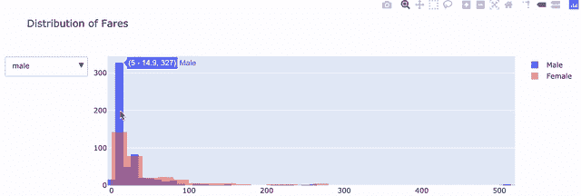
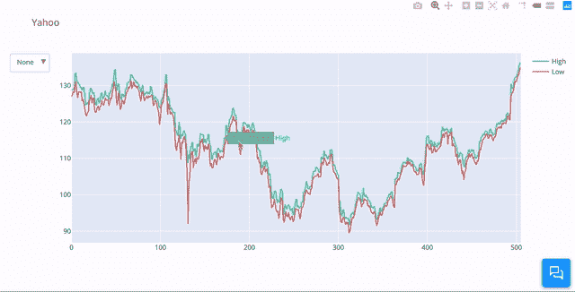
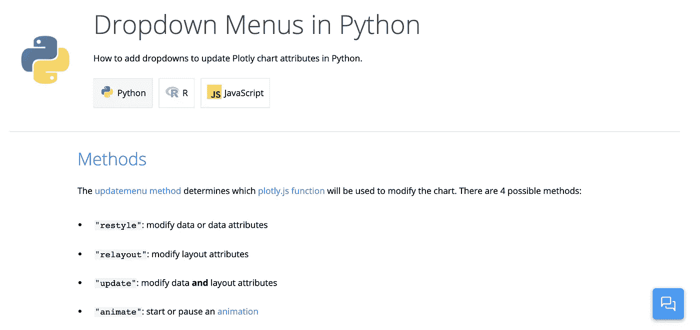
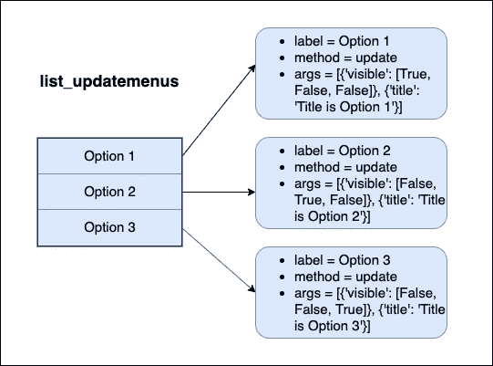
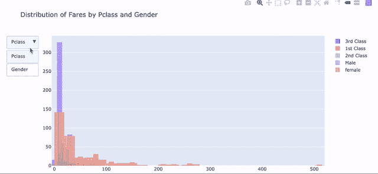
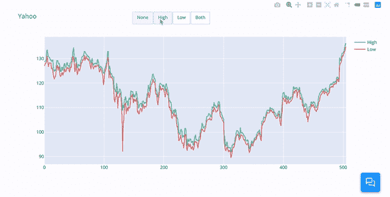
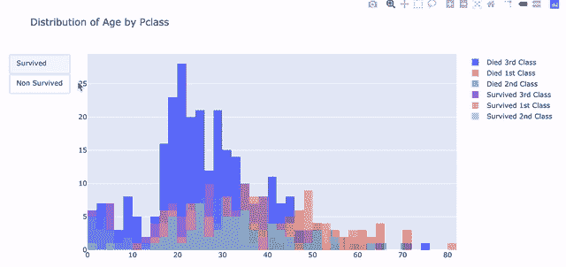
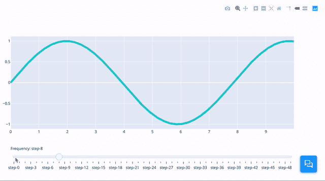
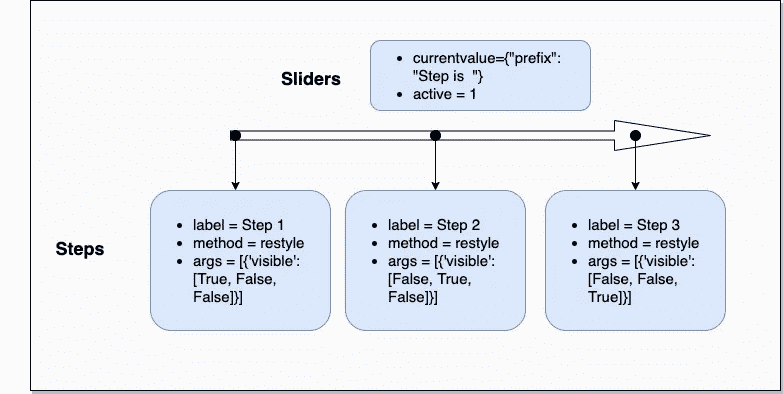
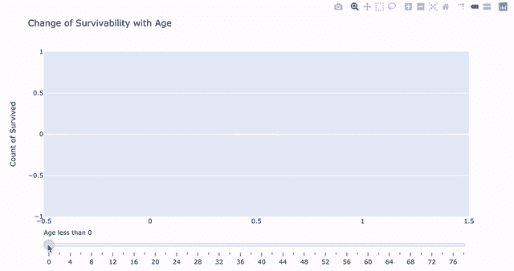

# 用于数据科学的 Python 使用 Plotly 进行数据可视化的高级指南

> 原文：<https://towardsdatascience.com/python-for-data-science-advance-guide-to-data-visualization-with-plotly-8dbeaedb9724?source=collection_archive---------6----------------------->

## 如何在 Plotly 中添加和自定义滑块、下拉菜单和按钮


嗨，读者，如果你像我一样，你会每天都想学习新的东西。我可以帮忙。这是我每周写的另一篇关于数据行业的文章。本周，我们将再次谈论**数据可视化**。
找个舒服的地方，喝杯咖啡，准备写点代码。

上周，我们谈到了**数据可视化的重要性。** 我们了解到 **Plotly** 与经典的 Matplotlib 和 Seaborn 相比，在解释和探索数据方面非常有用。我们还学会了用 Plotly 绘制**基本的** **可视化**，如条形图、饼状图和气泡图。
我们在我写的第一篇 [**文章**](/python-for-data-science-a-guide-to-data-visualization-with-plotly-969a59997d0c) 中谈到过。

[](/python-for-data-science-a-guide-to-data-visualization-with-plotly-969a59997d0c) [## 面向数据科学的 python——Plotly 数据可视化指南

### 现在是 2020 年，是时候停止使用 Matplotlib 和 Seaborn 了

towardsdatascience.com](/python-for-data-science-a-guide-to-data-visualization-with-plotly-969a59997d0c) 

在我们接触了 Plotly 之后，是时候通过使用它提供的交互式工具来挖掘它的真正潜力了。当我们用 Plotly 可视化数据时，我们能够添加**某些工具**来允许我们**定制**可视化体验。在向企业主展示数据时，这一点可能是至关重要的，因为它能够更清晰地传达你的观点。

这里有一个关于 [**泰坦尼克号数据集**](https://www.kaggle.com/c/titanic/data) ，
的例子，说我们想同时显示女性和男性的票价分布**以及能够分别显示它们**。我们可以为此添加一个下拉菜单，Plotly 会为我们完成剩下的工作。****

********

****Distribution of Fares by Gender****

****通过使用 plotly，我们可以自定义交互地在图表上显示什么和不显示什么。我们通过添加**下拉框**、**滑块**、**按钮**和其他选项来做到这一点。这里的男性和女性选项可能看起来很简单，但是我们将在本文中看到它是多么有用。****

****在本指南中，我将全面介绍如何添加和定制你自己的下拉菜单、滑块和按钮来改善你的视觉效果。****

# ****先决条件****

****显然，在本指南中，我们将大量使用 Plotly。
因此，请确保你在继续阅读本进阶指南之前，对有一个坚实的理解。你可以在这里参考我写的关于的文章。****

****通过与 Plotly 一起工作，你应该也能轻松地与熊猫**一起工作。
真巧。我碰巧也写了一本熊猫指南。请务必回忆一下。******

****[](/python-for-data-science-basics-of-pandas-5f8d9680617e) [## 用于数据科学的 Python 熊猫指南

### 10 分钟内完成数据探索指南

towardsdatascience.com](/python-for-data-science-basics-of-pandas-5f8d9680617e) 

Plotly，熊猫等。来吧，你知道我有你。**** 

# ****进口****

****像往常一样，我们将使用 Jupyter 笔记本。****

```
**#all plotly
from plotly.offline import init_notebook_mode,iplot
import plotly.graph_objects as go
import cufflinks as cf
init_notebook_mode(connected=True)#others
import pandas as pd
import numpy as np**
```

## ****导入数据集****

```
**df = pd.read_csv(filepath)**
```

# ****下拉菜单****

****让我们使用我在本文中第一次展示的选项，
下拉菜单。****

********

****Dropdown Menu from [Plotly](https://plot.ly/python/dropdowns/)****

****如果您想在**保留地块上的空间**的同时允许一系列选项，下拉菜单非常有用。我们不想让那些看你图表的人被一堆选项淹没。因此，我们将它们**隐藏在下拉列表中**,如果他们愿意，允许他们访问这些选项。****

****如果你还没有读过我的关于 Plotly 基础的文章，
我们需要在 Plotly 中定义 3 个重要参数。
**数据**、**布局**和**图**参数。
我们在绘图中添加下拉菜单的方法是在 Plotly 的**布局**参数中添加该命令。****

```
**layout=go.Layout(updatemenus=list([dict(buttons= list_updatemenus)]))**
```

****这将为我们设置下拉菜单。然而，我们需要定义在下拉菜单上显示什么，以及在选择这些选项时要应用的更改。我们可以通过定义 **list_updatemenus** 参数来实现以上所有功能。****

******特别说明**:plot ly 中的下拉菜单不仅可以改变数据，还可以改变你的布局和播放动画。在本文中，我们将只讨论与数据的交互。你可以在这里做更多的研究，也许有一天我会写这个话题。嗯（表示踌躇等）..精神食粮。****

********

****Dropdown Menu by [Plotly](https://plot.ly/python/dropdowns/)z****

****回到手头的事情， **list_updatemenus** 是一个字典列表。
对于每个字典，下拉菜单中都会生成一个选项。
我们在每个字典中定义了这些选项的功能。****

****当我这么说的时候，听起来很混乱，
，但是当你用代码来处理它的时候，它实际上要简单得多。
我们开始吧。****

****对于 **list_updatemenus、** 中的每一个字典，我们可以把这个字典的每一个都称为一个**选项。** 对于每个**选项**，我们至少需要定义 3 个参数:****

*   ****标签(字符串)—要在下拉菜单上显示的文本****
*   ****方法(字符串)-选择选项时要执行的更新方法****
*   ******args** (list) —包括将改变显示数据的参数****

****对于 **args** 参数，我们应该在列表中至少有两个参数:****

*   ****可见(列表)-确定应该和不应该显示哪些数据****
*   ****标题(字符串)-显示为图形标题的文本****

****这里有一个图表可以帮助你理解正在发生的事情。****

********

****Dropdown Menu Simplified****

## ****可见参数****

******Args** 中的‘**Visible**’定义了我们的图中显示的内容。
是我们在 plotly 中定义的**数据**参数对应的布尔值列表。****

****同样，我们的**数据**参数是我们为绘制图表而定义的图表对象列表。通过定义 visible 参数，我们可以选择交互显示哪个/哪些图形对象。****

****这里有个例子，假设我们的数据是****

```
**data= [
go.Histogram(x=option1,name='option1'),
go.Histogram(x=option2,name='option2',
go.Histogram(x=option3,name='option3')
]**
```

****通过使用这里的 visible 参数，我们可以选择只显示列表中图形对象的任意组合。****

```
**#Show first graph object
{'visible':[True, False, False]}#Show second graph object
{'visible':[False, True, False]}#Show first and third graph object
{'visible':[True, False, True]}**
```

****既然你已经理解了每样东西的含义，这里有一个模板来定义你的下拉菜单。****

```
**list_updatemenus = 
[{'label': 'Option 1',
  'method': 'update',
  'args': [{'visible': [True, False, False]}, {'title': 'Title is Option 1'}]},
 {'label': 'Option 2',
  'method': 'update',
  'args': [{'visible': [False, True, False]}, {'title': 'Title is Option 2'}]},
 {'label': 'Option 3',
  'method': 'update',
  'args': [{'visible': [False, False, True]}, {'title': 'Title is Option 3'}]}]layout=go.Layout(title = 'default title',
updatemenus=list([dict(buttons= list_updatemenus)]))**
```

****这里有一个关于[泰坦尼克号数据集](https://www.kaggle.com/c/titanic/data)的例子。
我们想按等级和性别显示票价的分布。
我们可以通过以下方式实现:****

```
**#defining list_updatemenus
list_updatemenus = [{'label': 'Survived',
  'method': 'update',
  'args': [{'visible': [False, False, False, True, True, True]}, {'title': 'Distribution of Age for Survived Passengers'}]},
 {'label': 'Non Survived',
  'method': 'update',
  'args': [{'visible': [True, True, True, False, False, False]}, {'title': 'Distribution of Age for Non-Survived Passengers'}]}]#defining all graph objects
x_pclass3 = df[df['Pclass']==3]['Fare']
x_pclass1 = df[df['Pclass']==1]['Fare']
x_pclass2 = df[df['Pclass']==2]['Fare']
x_male = df[df['Sex']=='male']['Fare']
x_female = df[df['Sex']=='female']['Fare']#defining data
data=[go.Histogram(x=x_pclass3,name='3rd Class'),go.Histogram(x=x_pclass1,name='1st Class',opacity = .5,nbinsx=60),go.Histogram(x=x_pclass2,name='2nd Class',opacity = .5),go.Histogram(x=x_male,name='Male',opacity = .5),go.Histogram(x=x_female,name='female',opacity = .5)]#defining layout
layout=go.Layout(title='Distribution of Fares by Pclass and Gender',updatemenus=list([dict(buttons= list_updatemenus)]),barmode='overlay')#defining figure and plotting
fig = go.Figure(data,layout)
iplot(fig)**
```

********

****Distribution of Fares by Gender and Pclass****

****从这个图中，我们可以**与它交互**来显示按性别或阶级的票价分布。然后我们可以通过点击图例分别显示每个 p 类或性别**或集体显示**。现在，你应该意识到这有多强大了。********

******在这个例子中，我们只使用直方图。您也可以选择其他图，以不同的方式可视化相同的指标。在这一点上，如何呈现数据完全取决于你的想象。******

# ******自定义按钮******

************

******Custom Buttons from [Plotly](https://plot.ly/python/custom-buttons/)******

******自定义按钮的作用与下拉菜单相同。唯一不同的是，自定义按钮将所有选项**提前**显示在图上，让全世界都能看到。如果你想让你的观众提前知道你所有的选择，这可能会也可能不会帮助他们更好地理解你试图展示的东西。******

****添加自定义按钮的语法也与下拉菜单非常相似。
唯一不同的是你在**布局**中添加了“type = buttons”。****

```
**layout=go.Layout(updatemenus=list([dict(buttons= list_updatemenus), type = buttons]))**
```

****差不多就是这样。让我们来看另一个例子。****

****对于这个例子，我们试图通过 Pclass 显示幸存和非幸存乘客的年龄分布。****

```
**#defining list_updatemenus
list_updatemenus = [{'label': 'Survived',
  'method': 'update',
  'args': [{'visible': [False, False, False, True, True, True]}, {'title': 'Distribution of Fares by Pclass'}]},
 {'label': 'Non Survived',
  'method': 'update',
  'args': [{'visible': [True, True, True, False, False, False]}, {'title': 'Distribution of Fares by Gender'}]}]#defining graph objects
x_pclass3_nonsurvived = df[df['Pclass']==3][df['Survived']==0]['Age']
x_pclass1_nonsurvived = df[df['Pclass']==1][df['Survived']==0]['Age']
x_pclass2_nonsurvived = df[df['Pclass']==2][df['Survived']==0]['Age']
x_pclass3_survived = df[df['Pclass']==3][df['Survived']==1]['Age']
x_pclass1_survived = df[df['Pclass']==1][df['Survived']==1]['Age']
x_pclass2_survived = df[df['Pclass']==2][df['Survived']==1]['Age']#defining data
data=[go.Histogram(x=x_pclass3_nonsurvived,name='Died 3rd Class',nbinsx=60),go.Histogram(x=x_pclass1_nonsurvived,name='Died 1st Class',opacity = .5,nbinsx=60),go.Histogram(x=x_pclass2_nonsurvived,name='Died 2nd Class',opacity = .5,nbinsx=60),go.Histogram(x=x_pclass3_survived,name='Survived 3rd Class',nbinsx=60),go.Histogram(x=x_pclass1_survived,name='Survived 1st Class',opacity = .5,nbinsx=60),go.Histogram(x=x_pclass2_survived,name='Survived 2nd Class',opacity = .5,nbinsx=60)]#defining layout
layout=go.Layout(title='Distribution of Age by Pclass',updatemenus=list([dict(buttons= list_updatemenus,type = 'buttons')]),barmode='overlay')#defining layout and plotting
fig = go.Figure(data,layout)
iplot(fig)**
```

********

****观察剧情，我们可以看到大多数非幸存者购买了泰坦尼克号上的**3 级**T7 级。这些第三类非幸存者的年龄大多在 **15** 和 **35** 之间。这让我相信，Pclass 列肯定在决定幸存者是否幸存方面发挥了作用。****

****有了自定义按钮，对观众来说更加**明显**你在过滤幸存和非幸存的乘客。在某些情况下，这将使你的演示看起来更专业，更容易理解。****

# ****滑块****

********

****Sliders from [Plotly](https://plot.ly/python/sliders/)****

****虽然按钮和下拉菜单擅长显示不同的图表，但我发现滑块擅长在**改变** **某些变量的值**时显示图表。如果所述变量是连续的**数字**变量，则更加明显。年龄可以是一个完美的例子。****

****滑块的工作方式与下拉菜单和按钮相同。不同之处在于，滑块允许你在与滑块交互时显示大量的选项。滑块本身也给人一种增加和减少某个值的错觉，但事实可能并非如此。****

****我们可以像使用下拉菜单和按钮一样使用滑块，通过从**不同角度**切片数据来显示不同类型的图表。然而，我更喜欢展示某个情节，同时能够**操纵**一个变量来更好地讲述一个故事。****

****就像下拉菜单和按钮一样，我们在绘图中添加滑块的方式是在我们的**布局**中添加一个简单的参数。****

```
**layout=go.Layout(
    sliders=sliders
)**
```

****我们通过定义**滑块和步骤**参数来定义在滑块上显示的内容和应用的更改，就像我们如何定义下拉菜单的 **list_updatemenus** 一样。****

****类似地，**滑块**参数是一个字典列表。
对于每个字典，在图上生成一个滑块。****

******滑块**保存定义默认值的参数，如:****

*   ****currentvalue(字典)—显示在滑块顶部的文本****
*   ****活动(整数)-要显示的默认步骤****
*   ******步骤**(列表)—包括将改变显示数据的参数****

******步骤**参数相当于下拉菜单的 **list_updatemenus** 。
这是一个字典列表，每个字典在滑块上生成一个选项。我们通过定义以下内容来定义这些选项的功能:****

*   ****标签(字符串)—要在滑块上显示的文本****
*   ****方法(字符串)-选择选项时要执行的更新方法****
*   ******args** (列表)—包括将改变显示数据的参数****
*   ******可见**(列表)—决定哪些数据应该显示，哪些不应该显示****

****这里有一个图表可以帮助你理解正在发生的事情。****

********

****让我们看一个例子来帮助你更好地理解这一点。
为此，我们打算展示随着泰坦尼克号上乘客年龄的增长，生存能力的**变化**。****

****在我的脑海中，我正在描绘一个条形图，显示我们操作滑块时幸存的 0 和 1 的计数。既然我们在操纵年龄，我们应该为年龄设置滑块。我们还必须为年龄增长的每一步创建一个图表对象。我们是这样做的。****

```
**# Create figure
fig = go.Figure()# Create Graph Object for every increase of 2 years of Age
for step in np.arange(0, 80, 2):
    y=[]
    for i in list(df['Survived'].unique()):
        result = df[df['Age']<=step][df['Survived']==i]['Survived'].count()
        y.append(result)
    fig.add_trace(
        go.Bar(
            visible=False,
            x = list(df['Survived'].unique()),
            y= y,
            name="Age = " + str(step)))**
```

****对于这个代码块，我们为从 0 岁到 80 岁的每两步增长创建一个图形对象(条形图)。因此，我们这里基本上有 40 个**步骤**和**图形对象**。滑块将能够有效地浏览这些步骤和图形对象。****

****接下来，我们定义我们的**滑块**和**步进**参数。****

```
**#defining sliders
sliders = [dict(
    currentvalue={"prefix": "Age less than "},
    active=1,
    steps=steps
)]#defining steps 
steps = []
for i in range(len(fig.data)):
    step = dict(
        label = str([i for i in np.arange(0, 80, 2)][i]),
        method="restyle",
        args=["visible", [False] * len(fig.data)],
    )
    step["args"][1][i] = True  # Toggle i'th trace to "visible"
    steps.append(step)**
```

****在这个代码块中，我们创建了一个字典，并将其追加到年龄每增加 2 岁的 steps 参数中，同时包含了对每个步骤所做的所有更改。****

****最后，我们定义我们的布局并绘制图表。****

```
**#defining layout and plotting 
fig.update_layout(
    title = 'Change of Survivability with Age',
    yaxis=dict(title='Count of Survived'),
    sliders=sliders
)
fig.show()**
```

********

****瞧，多么美丽的情节。我们看到，一旦我们到了 18 岁，非幸存者人数开始超过幸存者人数。我们也可以有把握地说，对于所有 18 岁以下的乘客，他们中的大多数都活了下来。这可能为我们的分析提供有用的信息。****

****如果你还没明白，滑块在显示数值变化方面非常有效。如果您试图显示相对于时间**和时间**的数据，它也会发挥巨大的作用。这是一个非常强大的工具，我希望你开始在你的分析中更多地使用它。****

****下面是我们刚刚在本文中运行的所有内容的完整代码:****

****[](https://github.com/nickefy/advance-guide-to-data-visualization-with-plotly/blob/master/Advance%20Guide%20to%20Data%20Visualization%20with%20Plotly.ipynb) [## nickefy/advance-用绘图引导数据可视化

### 此时您不能执行该操作。您已使用另一个标签页或窗口登录。您已在另一个选项卡中注销，或者…

github.com](https://github.com/nickefy/advance-guide-to-data-visualization-with-plotly/blob/master/Advance%20Guide%20to%20Data%20Visualization%20with%20Plotly.ipynb)**** 

# ****恭喜****

********

****Photo by [bruce mars](https://unsplash.com/@brucemars?utm_source=medium&utm_medium=referral) on [Unsplash](https://unsplash.com?utm_source=medium&utm_medium=referral)****

****欢欣鼓舞。你坚持到了最后。要接受的东西很多。我明白了。****

****在本指南中，您已经学习了 Plotly 的 3 个主要交互工具，它们是:****

*   ****下拉菜单****
*   ****小跟班****
*   ****滑块****

****这些工具在试图理解数据集、执行有价值的分析和向利益相关者展示时，肯定会给你带来优势。****

# ****在你走之前****

****我们的数据之旅还没有结束。我正在撰写更多关于数据行业的故事、文章和指南。你绝对可以期待更多这样的帖子。与此同时，请随意查看我的其他文章，以暂时满足您对数据的渴望。****

****现在继续吧，我的朋友们，向世界展示我们数据从业者有多强大。
和往常一样，我以一句名言结束。****

> ****如果没有大数据，你会又瞎又聋，还在高速公路上。—杰弗里·摩尔****

## ****[订阅我的时事通讯，保持联系。](https://www.nicholas-leong.com/sign-up-here)****

****也可以通过 [**我的链接**](https://nickefy.medium.com/membership) 注册中等会员来支持我。你将能够从我和其他不可思议的作家那里读到无限量的故事！****

****我正在撰写更多关于数据行业的故事、文章和指南。你绝对可以期待更多这样的帖子。与此同时，可以随时查看我的其他 [**文章**](https://medium.com/@nickmydata) 来暂时填补你对数据的饥渴。****

*******感谢*** *阅读！如果你想与我取得联系，请随时联系我在 nickmydata@gmail.com 或我的* [*LinkedIn 个人资料*](https://www.linkedin.com/in/nickefy/) *。也可以在我的*[*Github*](https://github.com/nickefy)*中查看之前的撰写代码。*****