# 用于数据科学的 Python 熊猫指南

> 原文：<https://towardsdatascience.com/python-for-data-science-basics-of-pandas-5f8d9680617e?source=collection_archive---------4----------------------->

## 10 分钟内完成数据探索指南


各位数据从业者好。对我来说，这是忙碌的一周，但我回来了。

首先，我想亲自感谢那些从第一天起就决定追随我的人。我最近达到了 100 个追随者的大关。这并不多，但当我的内容被证明为某个随机的男孩/女孩提供了**价值**时，它对我来说就意味着整个世界。我开始写作是为了帮助人们解决他们的一些问题，因为当我面对他们时，我没有太多的资源可以参考。感谢您的关注，我将继续努力为您提供**值**，就像任何数据科学家都会做的那样。

但是够了，你不是为了那个而来，
你是为了那个**数据科学的本质**。
你想成为能够对数据执行
**惊人技术**的人，以获得你需要的东西。
你想成为提供**难以置信的洞察力**的人，这些洞察力影响
产品经理做出**关键决策**。

嗯，你来对地方了。进来吧。

我们今天将讨论最重要的
**Python 对于** **数据科学**库。

这是…

*鼓形辊


Photo by [chuttersnap](https://unsplash.com/@chuttersnap?utm_source=medium&utm_medium=referral) on [Unsplash](https://unsplash.com?utm_source=medium&utm_medium=referral)

**熊猫**是的。我相信任何有经验的数据科学家都会同意我的观点。在你所有幻想的机器学习之前，你必须彻底探索、清理和处理你的数据。为此，你需要熊猫。

本指南假设您已经掌握了一些非常基础的 python 知识，并且已经安装了 python。如果没有，就在这里 安装 [**。我们也在**](https://realpython.com/installing-python/) **[**Jupyter 笔记本**](https://jupyter.org/) 上跑熊猫。确保你有它。我将很快向你介绍熊猫的基本知识。
努力跟上。**

# 熊猫

Pandas 官方代表“Python 数据分析库”，**当今数据科学家使用的**最重要的 Python 工具。

# 什么是熊猫，它是如何工作的？

Pandas 是一个开源的 Python 库，它允许用户以极其高效的方式探索、操作和可视化数据。它实际上是 Python 中的 Microsoft Excel。

# 熊猫为什么这么受欢迎？

*   它很容易阅读和学习
*   它速度极快，功能强大
*   它与其他可视化库集成得很好
*   它同时是黑人、白人和亚洲人

# 熊猫带什么样的数据？

熊猫可以接受各种各样的数据，最常见的是 csv、excel、sql 甚至一个网页。

# 我如何安装熊猫？

如果你有[蟒蛇](https://www.anaconda.com/)，那么

```
conda install pandas
```

应该能行。如果没有，请使用

```
pip install pandas
```

既然你知道自己会陷入什么样的境地。
让我们直接开始吧。

# 导入

```
import pandas as pd
import numpy as np
```

# 数据帧和系列

**系列**像列，而**数据帧**是你在熊猫中完全展开的表格。你将会经常接触到这两个部分。所以要习惯它们。

**从 a:** 创建您自己的系列

*   目录

```
test_list = [100,200,300]
pd.Series(data=test_list)
```

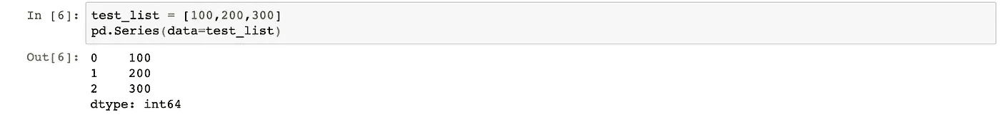

*   词典

```
dictionary = {‘a’:100,’b’:200,’c’:300}
pd.Series(data=dictionary)
```

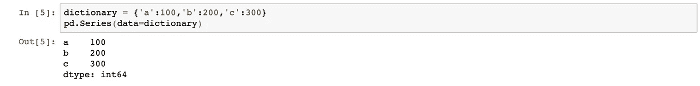

**从 a:** 创建您自己的数据框架

*   目录

```
data = [[‘thomas’, 100], [‘nicholas’, 200], [‘danson’, 300]] 
df = pd.DataFrame(data, columns = [‘Name’, ‘Age’])
```

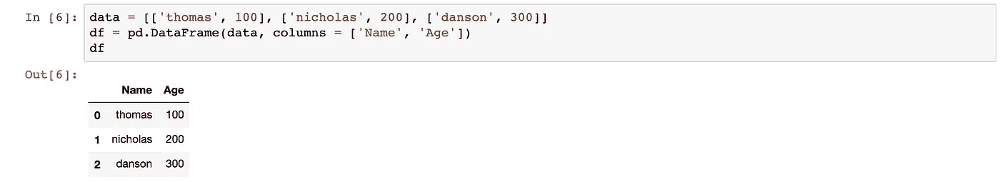

*   词典

```
data = {‘Name’:[‘thomas’, ‘nicholas’, ‘danson’, ‘jack’], ‘Age’:[100, 200, 300, 400]} 
df = pd.DataFrame(data)
```

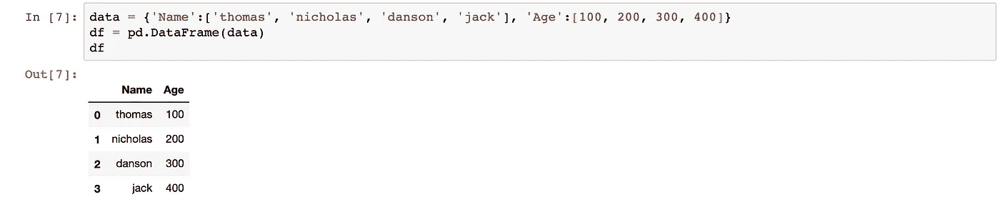

通常，我们不会创建自己的数据框架。取而代之的是，我们通过导入数据到一个数据框架中来研究、操作和可视化熊猫中的数据。
熊猫可以阅读多种格式，但常用的是 csv。这里是熊猫可以读取的文件类型的官方列表。

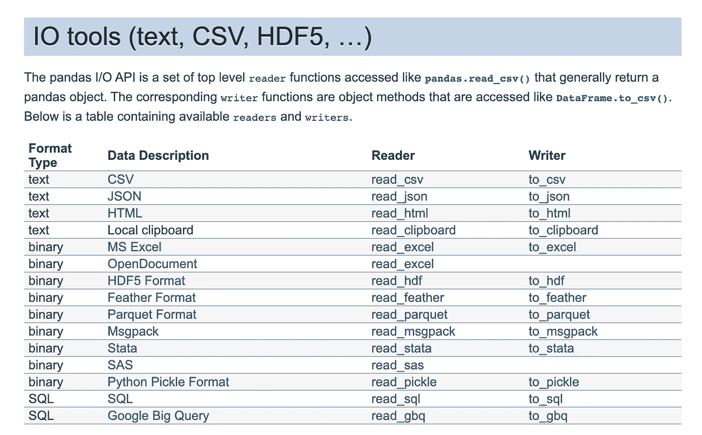

我们将在这里导入 [**泰坦尼克号数据集**](https://www.kaggle.com/c/titanic/data) 。

```
df = pd.read_csv(filepath)
```

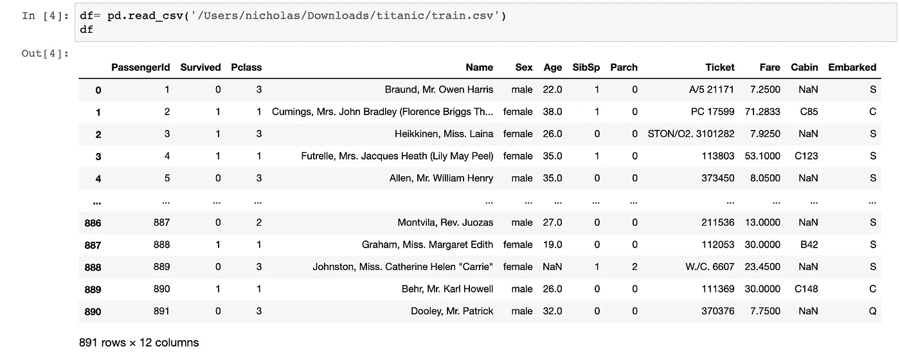

该数据集的主要目的是研究影响泰坦尼克号上人员生存能力的**因素。让我们通过研究数据来找出确切的答案。**

导入数据后，您想体验一下。下面是一些基本操作:

# 数据集摘要

```
df.info()
```

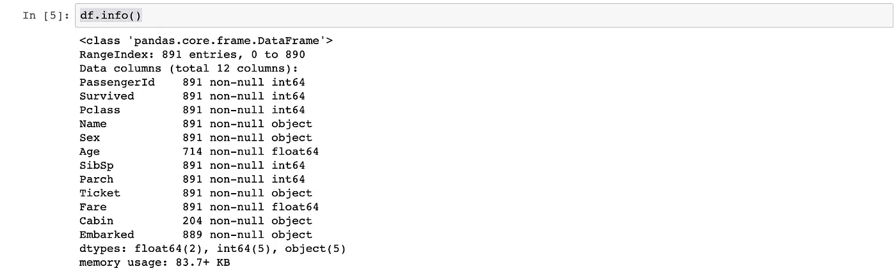

仅通过这个命令，我们就可以知道行数和列数、列的数据类型以及它们是否存在空值。

# 每列的唯一值

```
df.unique()
```

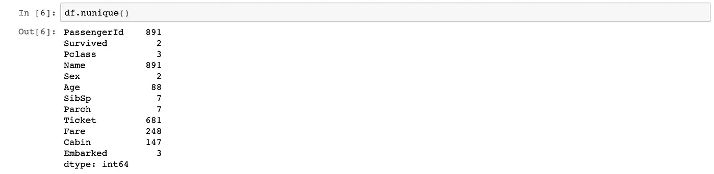

df.unique()命令允许我们更好地理解每一列的含义。看着**幸存的**和**性**列，他们只有 2 个唯一值。这通常意味着它们是分类列，在这种情况下，应该是真或假的幸存和男性或女性的性别。

我们还可以观察到其他分类列，如**abowed**、 **Pclass** 等等。我们真的说不清 **Pclass** 代表什么，让我们多探索一下。

# 数据选择

在熊猫中选择你想要的数据是极其容易的。
假设我们现在只想查看 **Pclass** 列。

```
df[‘Pclass’]
```

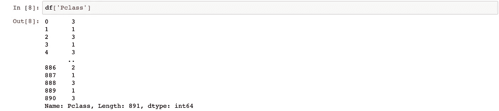

我们观察到，这 3 个唯一值实际上是 1、2 和 3，分别代表 1 级、2 级和 3 级。我们现在明白了。

我们也可以一次选择多个列。

```
df[[‘Pclass’,’Sex’]]
```

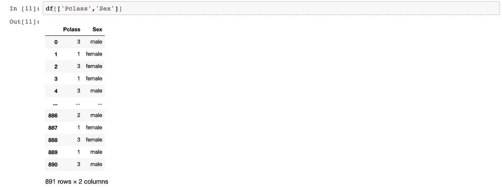

这个命令对于包含/排除您需要/不需要的列非常有用。

由于我们不需要**姓名**、**乘客 id** 和**车票**，因为它们在决定乘客是否幸存时根本不起作用，所以我们在数据集中排除这些列，这可以通过两种方式完成。

```
df= df[[‘Survived’,’Pclass’,’Sex’,’Age’,’SibSp’,’Parch’,’Fare’,’Cabin’,’Embarked’]]ordf.drop(['PassengerId', 'Name', 'Ticket'], axis = 1, inplace=True)
```

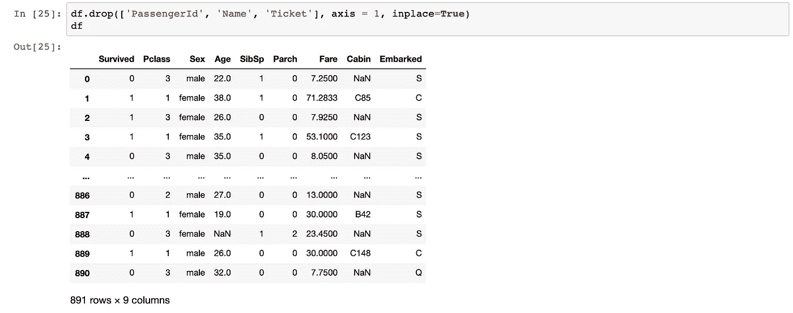

inplace=True 参数告诉 Pandas 将您想要做的事情自动分配给原始变量本身，在本例中是 df。

我们也可以通过**行**选择数据。假设我们想要调查数据集的第 300 到 310 行。

```
df.iloc[500:511]
```

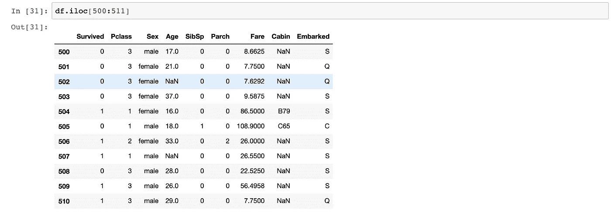

它的工作原理就像一个 python 列表，其中区间的第一个数字(500)是**包含**，区间的最后一个数字(511)是**不包含**。

# 条件选择

我们也可以通过数据**过滤**。假设我们只想观察男性乘客的数据。

```
df[df['Sex'] == 'male']
```

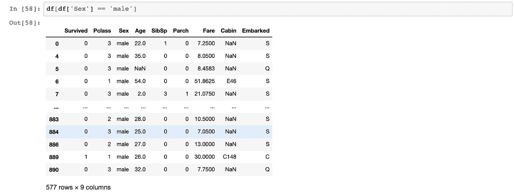

命令*df[' Sex ']= ' male '*将为每一行返回一个布尔值。在它上面嵌套一个 df[]将返回男性乘客的整个数据集。这就是熊猫的工作方式。

这个命令对于未来可视化数据非常强大。让我们把到目前为止所学的结合起来。

```
df[[‘Pclass’,’Sex’]][df[‘Sex’] == ‘male’].iloc[500:511]
```

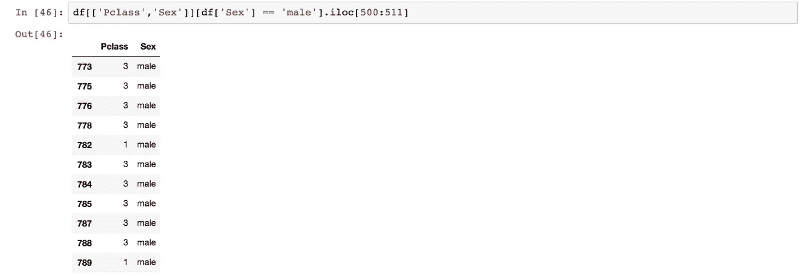

使用该命令，我们只显示男性乘客的 **Pclass** 和 **Sex** 列的**第 500 到 510 行**。试着使用这些命令，以便更好地使用它们。

# 聚合函数

既然我们知道如何浏览数据，是时候对其进行一些**聚合**了。首先，我们可以使用 describe 函数找出数据集的分布、最大值、最小值和有用的统计数据。

```
df.describe()
```

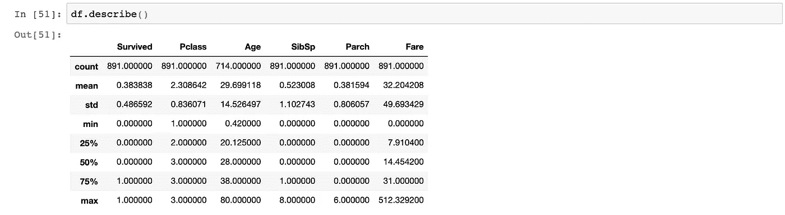

请注意，这些数学命令中仅包含**数字**列。其他列将被自动排除。

我们还可以运行以下命令来返回各自的聚合，请注意，聚合也可以通过条件选择来运行。

```
df.max()
df[‘Pclass’].min()
df.iloc[100:151].mean()
df.median()
df.count()
df.std()
```

我们还可以对这些列做一个相关矩阵，找出它们之间的关系。

```
df.corr()
```

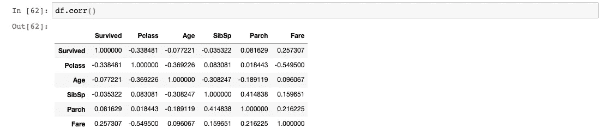

看起来对乘客生存能力有贡献的前 3 个数字列是**票价**、**p 等级**和 **Parch** ，因为它们相对于**幸存**列拥有最高的绝对值。

我们还可以查看每列的**分布**。在表格格式中，更容易解释**分类**列的分布。

```
df[‘Sex’].value_counts()
```

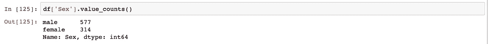

看起来我们的乘客都是男性。

# 数据清理

如果你已经跟上了，你现在已经对我们的数据有了很好的感觉。你想做一些汇总/可视化来展示你的发现。在那之前，你通常需要在做任何事情之前清理你的数据集。

您的数据集通常包含脏数据，如:

*   空值
*   空值
*   时间戳不正确
*   更多更多

当我们使用命令 df.info()时，我们已经知道是否有任何空值。这里还有一个:

```
df.isnull().sum()
```

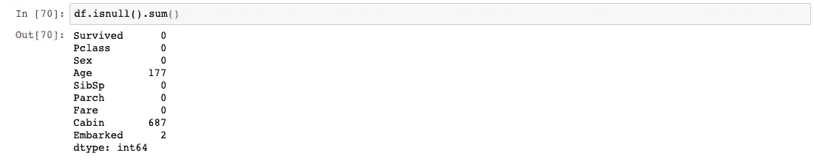

我们可以看到在**年龄**、**舱**和**上船**列中有空值。当这些特定列中的值为空时，您可以看到这些行的样子。

```
df[df[‘Age’].isnull()]
```

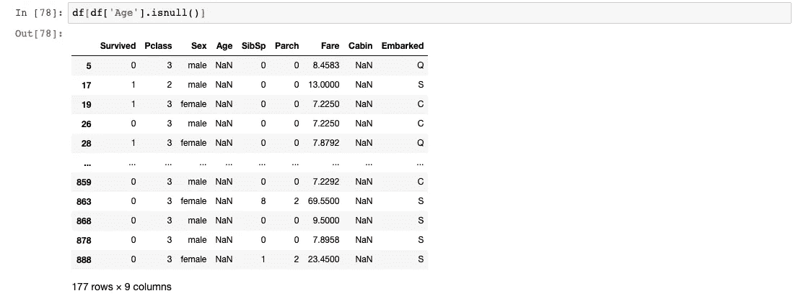

由于某种原因，除了**年龄**和**舱室**之外的所有其他数据都在这里。
空值的处理完全取决于你。为了简单起见，我们将**删除**所有包含空值的行。

```
df.dropna(inplace=True)or#df.dropna(axis=1, inplace=True) to drop columns with null values
```

如果我们愿意，我们也可以用一个值替换所有的空值。

```
df[‘Age’].fillna(df[‘Age’].mean())
```

此命令用年龄列的平均值替换年龄列中的所有空值。在某些情况下，这是处理空值的好方法，因为它不会扰乱值的偏斜度。

# 分组依据

所以现在你的数据是干净的。我们可以开始通过小组探索数据。假设我们想要找出每个 Pclass 中一名乘客的平均值/最大值/最小值
( **在此处插入数字列**)。

```
df.groupby(‘Pclass’).mean()
or
df.groupby('Pclass')['Age'].mean()
```

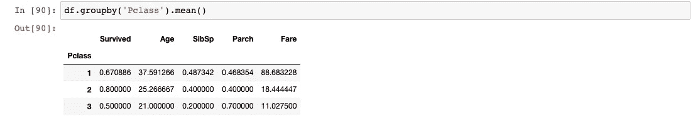

这告诉了我们很多东西。首先，它告诉我们每个等级的平均年龄和票价(T21)。看起来头等舱的票价是最贵的，而且是最老的。有道理。

我们也可以对组进行分层。假设现在我们还想知道每个**p 阶级**的平均**年龄**和**费用**对于**男性**和**女性**。

```
df.groupby([‘Pclass’,’Sex’]).mean()
```

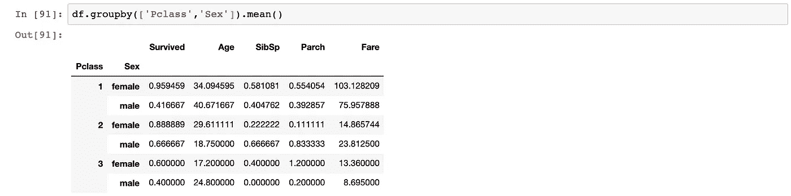

我们只需通过 GroupBy 函数传递组列表就可以做到这一点。我们可以根据这些复杂的分组开始分析并作出某些假设。我能做的一个观察是，一等舱**的**女性**的平均**票价**是所有乘客中最高的，他们也有最高的**生存能力**。另一方面，三等舱
**中**雄**的平均**票价**最低，生存能力**最低**。****

**我想钱确实能拯救生命。**

# **连接和合并**

**经过一些分析后，我们发现需要在数据中添加一些行/列。我们可以通过连接和合并数据帧轻松做到这一点。
我们通过以下方式添加行:**

```
first_5 = df.head()
last_5 = df[178:]
combined = pd.concat([first_5,last_5], axis = 0)
```

**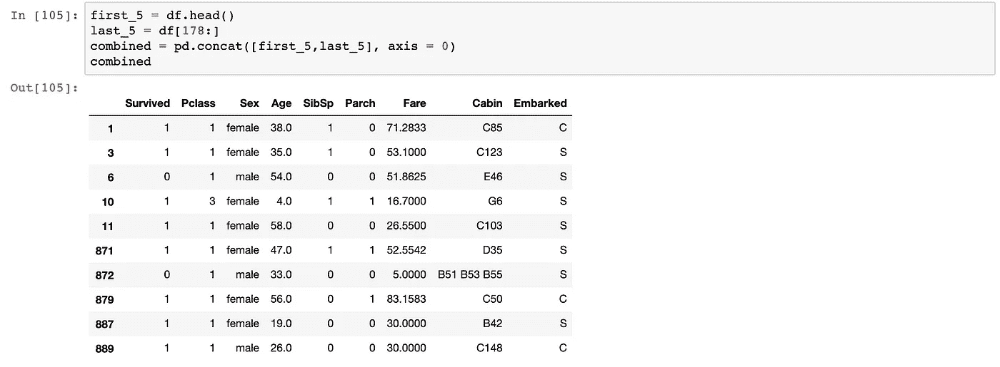**

**请注意，连接时，数据帧之间的列必须匹配。它就像 SQL 联合一样工作。**

**如果我们想通过连接来添加列。我们合并了。**

**假设我们有一个包含乘客体重和身高的外部数据集。为此，我将为 3 名乘客创建自己的数据集。**

```
data = [[‘Braund, Mr. Owen Harris’, 80, 177.0], [‘Heikkinen, Miss. Laina’, 78, 180.0], [‘Montvila, Rev. Juozas’, 87, 165.0]] 
df2 = pd.DataFrame(data, columns = [‘Name’, ‘weight’, ‘height’])
```

**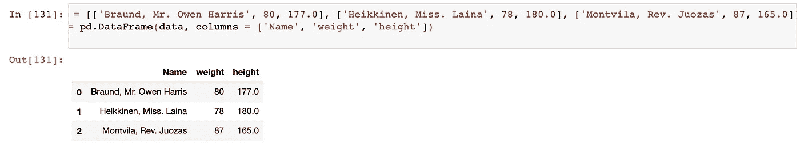**

**现在，我们想将体重和身高数据添加到我们的泰坦尼克号数据集中。**

```
df3 = pd.merge(df,df2, how=’right’, on=’Name’)
```

**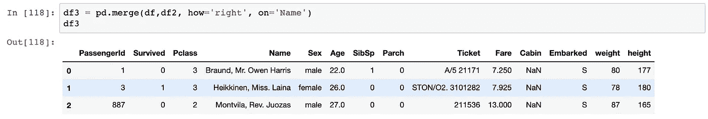**

**merge 的工作方式与 SQL joins 完全一样，使用 left、right、outer 和 inner 方法。我在这里使用了 right join 来只显示记录了体重和身高的乘客。如果我们使用左连接，结果将显示完整的 titanic 数据集，其中没有身高和体重。**

```
df3 = pd.merge(df,df2, how=’left’, on=’Name’)
```

**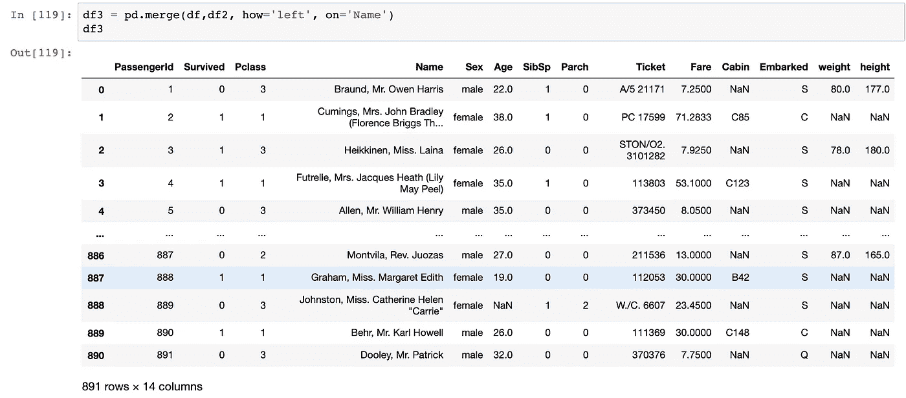**

# **数据操作**

**我们现在进入了更高级的领域，我们希望对数据中的值进行大量的操作。我们可能想要添加我们自己的自定义列，更改值的类型，甚至在数据中实现复杂的函数。**

# **数据类型**

**这是一个相当直接的操作。有时我们可能想改变数据的类型，为其他函数提供可能性。一个很好的例子是将一个**字符串**的‘4000’改为一个**整数**‘4000’。**

**让我们把现在浮点型的重量数据改成整数。**

```
df2[‘weight’].astype(int)
```

**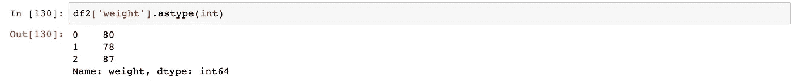**

**请注意， **astype()** 函数遍历数据的每一行，并尝试将数据类型更改为您提到的任何类型。因此，每种类型的数据都有一定的规则可循。**

**例如:**

*   **数据不能为 null 或空**
*   **当将浮点数改为整数时，小数必须是. 0 形式**

**因此， **astype()** 函数有时会很棘手。**

# **应用功能**

**应用功能是熊猫最强大的功能之一。
它让你以任何你想要的形式操作数据。以下是方法。**

****步骤 1:定义一个函数** 假设我们想要将 **Pclass** 重命名为它们的实际名称。
1 =一级
2 =二级
3 =三级**

**我们首先定义一个函数。**

```
def pclass_name(x):
    if x == 1:
        x = '1st Class'
    if x == 2:
        x = '2nd Class'
    if x == 3:
        x = '3rd Class'
    return x
```

****步骤 2:应用函数** 然后我们可以将该函数应用于 **Pclass** 列的每个值。
该过程将通过函数传递 **Pclass** 列的每条记录。**

```
df3[‘Pclass’] = df3[‘Pclass’].apply(lambda x: pclass_name(x))
```

**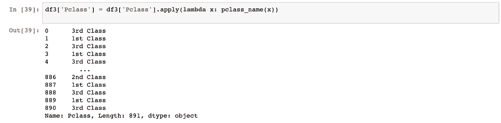**

****Pclass** 列的记录现在已经更改。如何处理你的数据完全取决于你的想象力。这里是你发挥创造力的地方。**

# **自定义列**

**有时，我们希望创建自定义列，以便更好地解释我们的数据。例如，让我们用乘客的身体质量指数创建一个列。**

**身体质量指数的公式是:**

```
weight(kg) / height²(m)
```

**因此，让我们先把我们的身高值从**厘米**转换成**米**和**平方**的值。我们将使用我们刚刚学过的 apply 函数来实现这一点。**

```
def convert_to_bmi(x):
 x = (x/100)**2
 return xdf4[‘height’] = df4[‘height’].apply(lambda x: convert_to_bmi(x))
```

**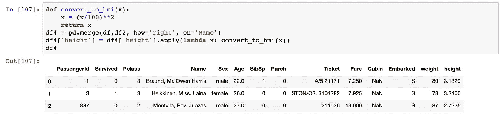**

**然后，我们创建一个新列，其中的值是体重除以身高。**

```
df4[‘BMI’] = df4[‘weight’]/df4[‘height’]
```

**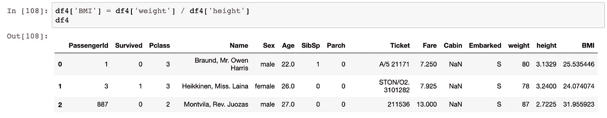**

**如果我们有所有乘客的体重指数，我们就可以用身体质量指数得出进一步的结论，但我不会深入研究。你明白了。**

# **定稿和导出**

**完成所有工作后，您可能希望对列进行排序和重命名。**

```
df3.rename(columns={'BMI':'Body_Mass_Index','PassengerId':'PassengerNo'}, inplace = True)df3 = df3.sort_values('Body_Mass_Index')
```

**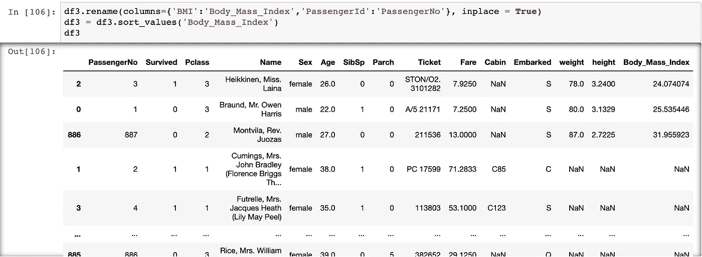**

**我们将身体质量指数重新命名为它的全名，并在这里按身体质量指数排序。
注意，排序后，索引不变，这样信息不会丢失。**

**最后但同样重要的是，
我们可以将我们的数据导出为多种格式(参考顶部的列表)。
让我们将数据导出为 csv 文件。**

```
df3.to_csv(filepath)
```

# **结论**

**如果你已经走了这么远，给自己一点鼓励。
你已经**正式**掌握了熊猫的基本知识，
每个数据科学家的必备工具。**

**今天你所学的**知识**:**

*   **创建和导入数据框架**
*   **数据帧的汇总功能**
*   **在数据框架中导航**
*   **价值的聚合**
*   **清理数据**
*   **分组依据**
*   **连接和合并**
*   **数据操作(***应用功能***)**
*   **定稿和导出**

**让它留在你的脑海里，因为我发誓你以后会经常用到它。
一如既往，我引用一句话作为结束。**

> **你可以有没有信息的数据，但你不能有没有数据的信息——丹尼尔·凯斯·莫兰**

## **订阅我的时事通讯，保持联系。**

**也可以通过 [**我的链接**](https://nickefy.medium.com/membership) 注册一个中等会员来支持我。你将能够从我和其他不可思议的作家那里读到无限量的故事！**

**我正在撰写更多关于数据行业的故事、文章和指南。你绝对可以期待更多这样的帖子。与此同时，你可以随时查看我的其他 [**文章**](https://medium.com/@nickmydata) 来暂时填补你对数据的渴望。**

*****感谢*** *阅读！如果你想和我取得联系，请随时通过 nickmydata@gmail.com 联系我或者我的* [*LinkedIn 个人资料*](https://www.linkedin.com/in/nickefy/) *。也可以在我的*[*Github*](https://github.com/nickefy)*中查看之前写的代码。***