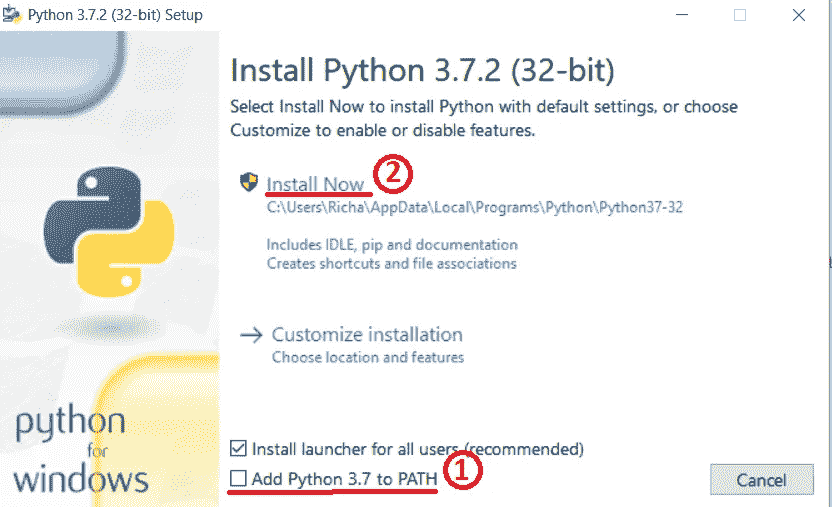
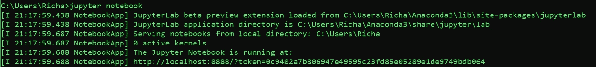
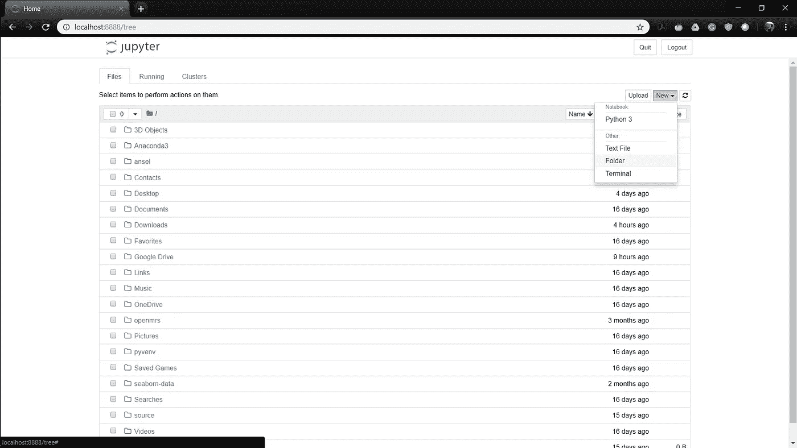
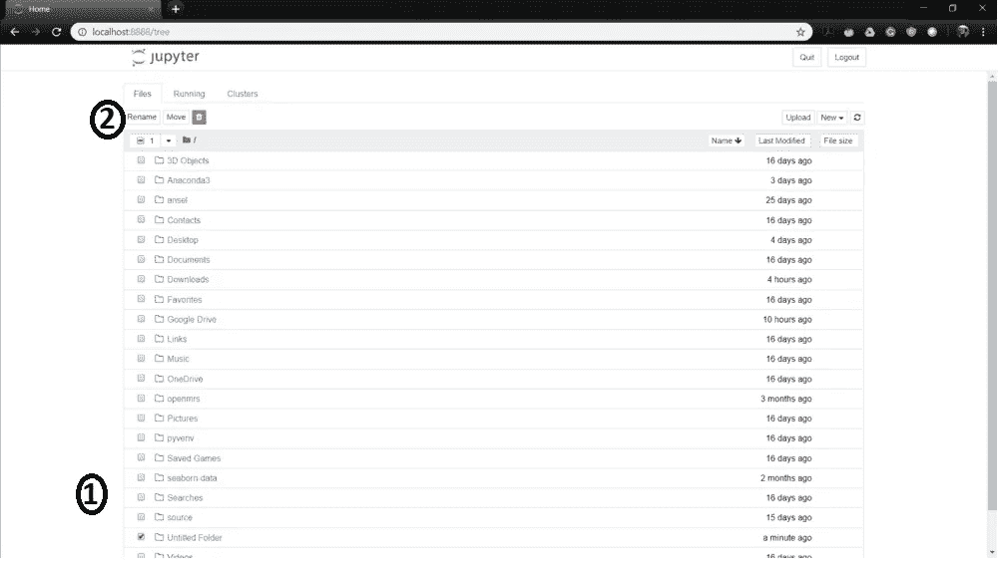
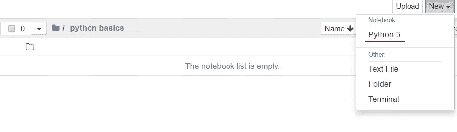
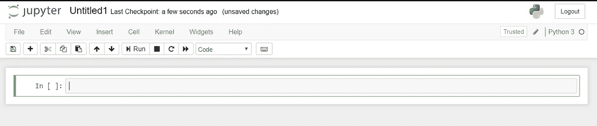
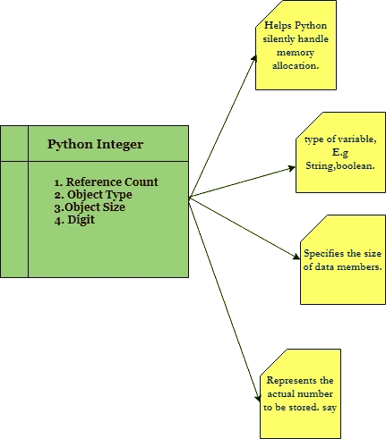
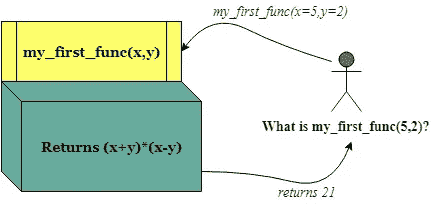

# 用于数据科学的 Python:从头开始(第一部分)

> 原文：<https://towardsdatascience.com/python-for-data-science-from-scratch-part-i-390f01d91748?source=collection_archive---------12----------------------->


Fig.1: Mr. Van Rossum in 2014

众所周知，了解 Python 对于数据科学来说是必不可少的。Python 有广泛的库，允许我们轻松地执行核心数据分析活动。为了不浪费更多的语言来证明数据人员了解 Python 有多重要，我们将直接进入冰冷的海洋。跟着我直到底部！😉。

本文是 Python 数据科学系列的第一篇，该系列涵盖了与 Python 相关的所有内容，从基础到“酷”的东西。在这篇特别的文章中，将包括以下几点:

1.  Python 简介
2.  安装 Python 和 Jupyter 笔记本
3.  Python 基础知识

**第一部分:简介**

首先，我们将从 Python 的简介开始。Python 于 1991 年由 Python 软件基金会发布。

由**吉多·范·罗苏姆**创作，以 20 世纪 70 年代的英国喜剧系列《巨蟒剧团的飞行马戏团》命名。Van Rossum 被 python 社区称为“终身仁慈的独裁者(BDFL)”。在领导 python 部落约 30 年后，Van Rossum 于 2018 年 7 月卸任。谢谢你所做的一切，范罗森先生！❤

**第二部分:安装和设置**



Fig.2 Only two steps you need to do to install python.

要下载 Python，去这个[链接](https://www.python.org/downloads/)。打开。exe 文件下载后，做 2 个步骤(在图 2)和 Ta-da！python 已安装在您的系统中。✌🎉。如果您不检查步骤 1，您将不得不手动添加 python 到 PATH 环境变量。有关设置环境变量的正确文档，请遵循本[指南](https://docs.python.org/3/using/windows.html)的第 3.6.1 节。但还是要确定一下，让我们交叉检查一下我们的安装。打开命令提示符，只需键入以下命令。

```
python -V
```

您应该看到您在系统中安装的 python 版本，在我的例子中是 Python 3.7.2。让我们继续安装 Jupyter 笔记本。

**Jupyter Notebook:**Jupyter Notebook 是一个开源平台，可以在一个 web 文档中编写和解释 python 代码以及一些解释。Jupyter 因其支持的三种语言而得名，即 **Ju** lia、 **Pyt** hon 和 **R** 。

1.  要安装 Jupyter notebook，只需点击[链接](https://jupyter.readthedocs.io/en/latest/install.html)并下载 anaconda(在这里可以找到更多关于 anaconda [的信息)。遵循顺序:下一步- >同意- >安装。](https://www.anaconda.com/what-is-anaconda/)
2.  第二种方式是使用 CMD 和 *pip* (Python 的包管理器)*进行安装。*首先，确保你有最新的 pip 旧版本可能在某些依赖项上有问题:

```
pip3 install --upgrade pip
```

然后使用以下方法安装 Jupyter 笔记本电脑:

```
pip3 install jupyter
```

**第三部分:基础知识**

安装完 Python 和 Jupyter Notebook，我们来深入了解一下 Python 的基础知识。首先，我们在系统中打开 jupyter 笔记本。因此，要打开笔记本，请在 CMD 窗口中键入“ *jupyter notebook* ”。



Fig. 3 Initialising Jupyter

同时，您将在默认网络浏览器中看到一个如图 4 所示的屏幕，单击“*文件夹*”创建一个目录来保存您将在本教程中创建的所有笔记本。让我们把这个文件夹命名为“python 基础”。点击“python 3 ”,在当前目录下创建一个新的 python 文件。



Fig. 4 Jupyter’s Landing Page

只要您单击文件夹选项，就会创建一个名为“无标题文件夹”的空文件夹。我们重新命名吧。遵循图 5 中的两个步骤。



Fig 5.renaming the folder



Fig 6\. Opening a python file..Finally!



Fig. 7 A fresh Python Notebook

重命名文件夹后，在文件夹内导航并创建一个新的 python 文件。这个新创建的文件看起来如图 7 所示。继续编写一个打印命令，向 print()函数添加任何语句，如下面的代码所示。在编写了第一个 Python print 语句之后，继续使用键盘上的 CTRL + Enter 键运行 print 命令。

要在当前单元格下添加新单元格，只需点击“In [ ]”并按键盘上的“B ”,一个新单元格将被创建。要在当前单元格上方创建一个单元格，请重复上述步骤，但按“A”键。重命名您的笔记本并保存它！

你应该在这些单元格中运行下面的所有代码。你练习得越多，你对 Jupyter 笔记本电脑就越熟练。

**第 3.1 部分。缩进:**你首先要知道的是 python 使用空格来结构化代码。许多其他语言如 Java、C++使用括号来显示每个特定代码的范围细节。但是在 python 中，它看起来像下面这样:

在给定的代码中，声明《摩诃婆罗多》中的角色名称列表。然后我们遍历列表，注意冒号表示后面是一个缩进块，这个缩进块下的每个语句都有相同数量的空格。添加缩进块不仅使代码可读性更好，也使经常搞砸偶数括号的编码者更容易理解。

**第 3.2 部分。理解 Python 中的数据类型:**有效的数据驱动洞察需要对我们正在处理的数据类型及其在内存中的存储方式有透彻的了解。

Python 支持整数、字符串、布尔数据类型。Python 的一个重要特点是它是一种动态类型语言。动态类型化是语言本身*推断*给定变量的类型。另一方面，静态类型是指在使用变量之前必须声明变量的类型。

简而言之，动态类型意味着我们可以将任何类型的数据赋给任何变量，而不用担心声明什么类型的数据或它的兼容性。为了更好地理解，请参考 Python 和 c 中的两个赋值示例。我们可以很容易地在 Python 中重新声明给定变量的值。但是在其他语言中，它会导致编译错误或其他意想不到的结果。

但是这种级别的灵活性也指出了一个事实，即 Python 变量不仅仅是它们的赋值。这意味着每个 Python 对象只是一个巧妙伪装的 C 结构(因为标准的 Python 实现是用 C 编写的)。



Fig . 8 Structure of a Python Integer

假设我们用 Python 声明一个整数，比如 x = 999，x 不仅仅是一个‘原始’整数。它实际上是一个指向包含几个参数的复合 C 结构的指针。这些参数如图 8 所示。因此，我们得出结论，python 整数是指向内存中包含所有 Python 对象信息的位置的指针。同样的逻辑也适用于其他数据类型。

**第 3.3 部分。控制流:**和其他一些语言一样，Python 也有一套简单而结构化的数据流方式。

**if -block** 是检查的第一个条件语句，如果发现为真，则执行其下的缩进块。

**elif-block** 代表 else-if 语句，即如果 if 语句不为真，则检查该语句。可以有多个 elif 块，但是如果没有一个满足条件，则执行 **else 块**。

接下来，我们讨论循环结构。我们讨论两个循环语句: *for loops* 当我们想要遍历一个列表、元组或者迭代器时使用。一个 *while 循环*指定了一个条件和一个要执行的代码块，直到该条件结束为 FALSE 或者遇到 break 语句。通过下面的例子来弄清楚它的用法。

**第 3.4 部分。函数:**函数是 Python 中代码表示和重用的主要和最重要的方法。有时候，我们需要经常使用某组语句。函数是一种使代码可读性更好的方法，它为一组您希望经常重用的语句命名。例如，如果您想将数据集中所有合适的列的所有“Null”值替换为 999，只需编写一个执行相同操作的函数，并每次使用新的列名进行重复。



Fig 9\. A function Representation.

1.  使用 ***def*** 关键字声明一个函数，使用 ***return*** 关键字返回结果。
2.  函数声明中提到的参数(x，y)是局部变量。它们的作用域仅限于函数体，也就是说，如果我们想在函数体外使用变量(x，y ),就会产生错误。
3.  可以有多个 return 语句和多个 return 变量。如果解释器没有遇到 return 语句，并且到达了代码的末尾，则简单地返回“None”。在数据分析中，你会发现自己经常会返回多个变量。所以它背后的技巧是，函数只返回一个包含所有响应变量的对象，然后这个对象被解包并赋给声明的变量。
4.  可以有两种类型的参数，*位置参数和关键字参数。*关键字参数主要用于指定默认值或可选参数。位置参数根据它们作为参数传递的顺序工作。
5.  如果同时使用关键字和位置参数，请始终将关键字参数写在位置参数之后。
6.  您可以按任意顺序指定关键字参数，这样您就不用再去记忆函数参数的顺序了。

**Lambda 函数:** Python 支持所谓的匿名或 Lambda 函数，这是一种编写只有一条语句的函数的方式，输出返回值。它们被定义为带有*λ*关键字，意思就是“我在声明一个匿名的单行语句！”。与编写函数声明相比，传递 lambda 函数通常需要较少的输入。

这就是我们系列的第一部分的结尾。我真诚地希望，到目前为止，本文提供的信息对于 Python 的基础知识来说已经足够了。如果你现在还舒适地坐在你的椅子上，我会敦促你留在船上，直到下一篇文章到来，那时真正的挑战和“酷”的事情将最终开始出现！如果有任何更正或疑问，请随时添加您的回复。下次见，学习者！