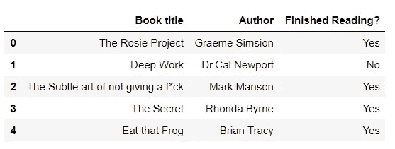
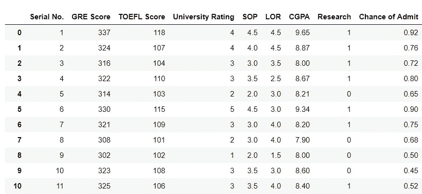

# 用于数据科学的 Python:从头开始(第二部分)

> 原文：<https://towardsdatascience.com/python-for-data-science-from-scratch-part-ii-e4dd4b943aba?source=collection_archive---------11----------------------->

## 学习 Python 中的数据结构和重要包，如 Numpy 和 Pandas。


One word for this epic shot: [PERSEVERANCE](https://www.nationalgeographic.com/travel/destinations/north-america/mexico/2017-travel-photographer-of-the-year-colima-volcano/)!

本文是 Python 数据科学系列的第二部分。如果您还没有阅读 Python 的介绍(第 1 部分)，请继续阅读那篇文章[这里](/python-for-data-science-from-scratch-part-i-390f01d91748)。了解了基础知识之后，是时候沉迷于更具挑战性的 Python 主题了。在本文中，我们将研究 Python 在数据表示和操作方法中的应用。将涵盖以下主题:

1.  **数据结构**:元组、列表、字典。
2.  **套餐** : Numpy，熊猫。

剧透提醒:文末可以期待奖金啦！🤫

# 第一部分。数据结构

Python 提供了简单而熟练的数据结构，帮助数据人员根据需要表示、操作和存储不同形式的数据。让我们一个一个熟悉这些微妙的结构。

## 1.1 元组:

tuple 是 Python 对象的一个*不可变的固定长度序列*。

*   您可以简单地用逗号分隔的值序列创建一个元组。并不总是强制的，但是建议将序列用括号括起来。
*   像许多其他语言一样，默认索引从 0 开始。
*   可以通过在方括号“[<index_number>]”中声明所需的索引号来访问元组的元素</index_number>
*   您还可以创建一个称为嵌套元组的元组。
*   如果您有一个想要转换成元组的字符串或序列，只需使用 tuple()方法。

**元组操作:**元组是不可变的，即一旦定义了元组的内容，就不能修改。

*   虽然存储在元组中的对象本身可能是可变的，但是元组本身是不可变的。
*   如果元组中的对象是可变的，比如列表，那么可以就地修改它。
*   您可以使用“+”运算符连接两个元组。这个操作符简单地将一个元组附加到另一个元组的尾部。
*   将一个元组与一个整数相乘只是将该元组的副本数量连接起来。

**解包元组:**解包时。这些值被分配给最右边的相关变量。

*   考虑旁边显示的例子，值被逐个分配到变量序列中。
*   嵌套元组可以类似地解包。如果您没有在正确的括号中表示变量，嵌套元组的一个括号中的元组值将被分配给单个变量。
*   rest 运算符用于强调几个变量的赋值。剩余运算符负责值的*剩余*。查看示例，更清楚地了解它是如何工作的。
*   最后一个是 count()方法，顾名思义，它是用来统计重复元素的频率的。

## 1.2 列表:

列表是可变长度和可变的数据结构。

*   您可以使用方括号[]或使用 **list** 类型函数来定义列表。
*   和在 tuple 中一样，列表中的索引也是从零开始，到列表的长度结束。

**添加和删除元素:**

*   可以使用*追加*功能将元素追加到列表的末尾。
*   使用*插入*功能，您可以在列表中的指定位置插入元素。insert 函数往往比 append 函数开销更大，因为解释器必须在内部移动前面的元素，以便为当前元素腾出空间。
*   或者，如果您只是想修改列表中的一个元素，那么您可以按照代码中的描述就地修改它。
*   关于删除元素，与*插入*功能相反的是*弹出*方法。
*   您只需要指定您想要弹出的元素的索引，它将从列表中删除，将被删除元素的右边的元素移动到左边。
*   假设列表很长，并且您不知道要删除的值的索引，您可以使用 *remove* 关键字定位第一个这样的值并将其从列表中删除。

**组合并连接列表:**

与元组类似，用+将两个列表加在一起会将它们连接起来。或者，如果已经定义了一个列表，可以使用 extend 方法追加多个元素。使用扩展运算符时，请确保将值放在方括号内。

**切片:**切片是根据您的选择，在您定义的列表中选择部分。


Remember these indices to understand slicing!

*   您可以通过指定切片符号从列表中提取数据块，切片符号的基本形式是 *start_index:stop_index 传递给索引操作符[]。*

*   *T* 开始索引包含在输出中，而停止索引不包含在输出中，因此结果中的元素数量为**停止-开始。**
*   可以省略开始或停止索引，在这种情况下，它们分别默认为序列的开始和序列的结束。
*   负索引相对于结尾分割序列。
*   使用双冒号打印“每隔一个”,比如 my_list[::2]打印 my_list 的“每隔一个元素”。
*   使用双冒号像 python stud 一样打印列表的反面(见代码)！😎

*注*:练刀法真的很难。你练习得越多，你对指数的理解就越好。而负索引总是记住以'-1 '开始最后一个元素，并继续到第一个元素。

## 1.3:格言:

Python 中的 dict 或字典是一种无序的、可变的和索引的数据结构。它被认为是 Python 中最重要和最详细的数据结构。

*   Python 中的 dict 或字典是一种无序的、可变的和索引的数据结构。
*   数据在字典中表示为 *key: value* 格式。这里的键和值都是 python 对象。
*   每个键都有一个值或分配给它的值列表。
*   每个键、值对都应该用逗号分隔。
*   你可以用花括号“{}”创建一个空字典。
*   如果你想访问一个特定的值，只需在你的字典的方括号中传递*键*数据。
*   如果您有一个类似 my_dict 中的“Cast”键的值列表，并且如果您想要访问列表中的某个特定元素，只需在方括号中的键声明后使用方括号中的索引值，例如:my _ dict[“Cast”][0]

*   要在字典中添加一个新的 key: value 对，只需使用方括号添加一个新的键，并将给定的值赋给它。
*   使用关键字中的*来检查字典中是否存在某个元素。<在<字典名称>中的>处键入您的密钥。*
*   如果字典中存在给定的键，则输出为真，否则为假。
*   要从字典中删除一对，可以使用 *del* 关键字。该关键字删除整个密钥记录。如果你不指定一个键，整个字典将被删除。
*   第二个选项是使用 *pop* 方法，该方法从字典中移除键，并返回分配给该键的值。
*   下面是一些处理字典时可能会很方便的通用方法:

在这里，我宣布我们已经研究了 Python 中用于分析的基本数据结构，这些数据结构不需要导入包。接下来，我们将重点关注一些已知对分析非常有帮助的重要包。

# 第 2 部分:Python 中的包

Python 是一个开源项目，有成千上万的开发者贡献，他们上传了大量的包，帮助我们通过简单地导入和使用该包来执行活动。下面是对其中几个包的研究。

## 2.1.NumPy:

Numpy 是数值 Python 的缩写，是 Python 中最重要的数值计算包之一。大多数提供科学功能的包使用 NumPy 的数组对象作为数据交换的通用语言。

在某些方面，NumPy 的数组对象很像 Python 的内置列表类型，但当我们处理海量数据时，NumPy 是赢家。无论您对数据科学的哪个领域感兴趣，深入了解 NumPy 最终都是有价值的！

*   Numpy 的关键特性之一是 ndarray 或 N 维数组对象，它是 Python 中大型数据集的快速、灵活的容器。
*   数组使程序员能够对具有相似语法的整个数据块执行数学运算。
*   让我们首先导入 Numpy 包并生成一个小的随机数数组。
*   ndarray 是一个通用的多维容器，用于存储同类数据，即所有数据点都应该是同一类型。
*   创建数组最简单的方法是使用 array 函数。这个函数接受任何类似序列的对象，并产生一个包含传递数据的 Numpy 数组，例如一个列表。
*   嵌套序列，像等长列表的列表，将被转换成多维数组。
*   由于代码示例中的列表是列表的列表，因此 NumPy 数组有两个维度，其形状是从数据中正确推断出来的。
*   除了 np.array 函数之外，还有许多其他函数可以用来创建新的数组。请浏览 Numpy_intro.py 中的给定内容，了解声明数组的各种方法。

**Numpy 数组属性:**

让我们从一些用于获取数组信息的基本数组属性开始。首先，我们将创建三个数组，一维、二维和三维随机数组。

*   我们设置了*种子*，这样每次运行代码时都会生成相同的随机数组。
*   使用 *randint* 生成*低(含)*到*高(不含)*之间的随机整数。格式为 *numpy.random.randint(低，高，大小，dtype)。*
*   现在是时候深入研究数组的一些属性了， *ndim* 属性，用作< array_name >。ndim，产生维数。
*   然后使用 *shape* 属性我们可以找到每个维度的大小，而 *size* 属性决定了整个数组的大小。

**访问数组元素:**如果你熟悉 Python 的列表索引，Numpy 中的索引会觉得相当好理解。在一维数组中，通过在索引操作符中指定第*个*索引，即[]，可以从 0 开始访问第*个*值。对于多维数组，您应该使用逗号分隔的索引元组来指定元素的详细位置。索引和切片在执行时最容易理解。我敦促你练习并思考以下要点中给出的每个例子。

## 2.2 熊猫:

Pandas 是 Python 的一个开源库，专门用于数据操作和分析大量数据。Pandas 提供了健壮的数据结构和函数来轻松操作数据。


Photo by [Debbie Molle](https://unsplash.com/@djmle29n?utm_source=medium&utm_medium=referral) on [Unsplash](https://unsplash.com?utm_source=medium&utm_medium=referral)

但是等等，那也是 lists，dict 和 Numpy 的 ndarrays 能做的，那么为什么是熊猫呢？嗯，有很多正当的理由。其中之一是，在大多数情况下，数据人员将获得 csv 文件格式的数据。Pandas 非常出名，它可以很容易地从这些 csv 文件中自动识别列标题。总之熊猫就是牛逼！🐼🤗Pandas 中的两个主要数据结构是序列(一维)和数据帧(二维)。

首先，我们可以通过调用 import 方法来使用 Pandas 库

```
import pandas as pd
```

**2.2.1 系列:**

系列是索引数据的一维数组，可以保存任何类型的数据。轴标签统称为*索引*。生成系列的基本方法是:

```
my_series = pd.Series(data, index=index)
```

其中*数据*可以是 Python 字典、ndarray 甚至是标量值(比如 7)，*索引*可以是轴标签列表。因此，我们将根据*数据*是什么来研究一些情况

**a .来自 ndarray:**

如果使用 ndarray 作为序列的数据，则索引的长度应该相同。如果没有定义索引，将创建一个缺省索引，其值为[0，…，len(data)-1]。

**b .从字典:**

正如我们之前了解到的，字典是关键:数据的值表示。我们可以用一个字典来定义一个系列对象。在这里，如果我们不传递索引值，dict 定义中提到的“key”将被用作索引。key 属性出现在索引中的顺序与字典中定义的顺序相同。另一方面，如果索引是在序列定义中定义的，那么只有对应于 dict 中使用的键的数据才会被提取出来。剩余的索引标签将被记录为 Nan，而不是数字，这是缺失数据的标准数据标记。

**c .从标量值:**

如果数据是标量值或常量，那么我们肯定需要指定一个索引。相同的常数值将被复制到对应于每个索引点的索引长度。

下面的笔记本展示了一个特定函数的列表，这些函数提取关于 series 对象的信息。

**2.2.2。数据帧:**

数据帧是具有不同数据类型的列的二维索引数据结构。它可以被认为是一系列共享相同索引的字典。数据帧是最方便的，因此被广泛使用的数据结构。您可以将数据帧视为电子表格或 SQL 表。像 Series 一样，我们可以通过多种方式构建数据帧，如下所示:

```
data = pd.Dataframe(data,index,columns)
```



A Dataframe

其中可以选择指定您选择的索引和列。否则，默认索引为[0…(len-1)]作为所有列的共同索引。在给出的图表中，我们将索引指定为 0 到 4，而列是书名、作者、阅读完了吗？。表格中的所有内容都是数据。

你可以从可能的其他数据结构中创建一个数据帧(在这里继续[学习数据帧的构造)。为了让我们的研究与数据科学相关，我向您保证，您将使用 dataframes 作为大型。csv 文件，。数据文件或任何其他存储数据的文件格式。因此，我们从您可能使用的最基本的文件格式开始，即逗号分隔值以及如何加载这样的文件。](https://pandas.pydata.org/pandas-docs/version/0.23.4/generated/pandas.DataFrame.html)

```
data = pd.read_csv("‪path_to_file\file_name.csv")
```



A CSV file loaded into a dataframe

我从 kaggle 下载了一个[数据集，并使用上面的语法读取它。读取后的数据集看起来像旁边的图。让我们从一些有助于分析数据帧的基本命令开始。](https://www.kaggle.com/mohansacharya/graduate-admissions#Admission_Predict.csv)

**索引和选择数据:**

这一节的主要目标是如何切片、切割以及获取和设置熊猫对象的子集。就像 Numpy 数组一样，我们可以选择和索引数据，唯一的区别是在 Series 和 Dataframe 中我们可以使用一个 list 甚至一个 slice 标签。

```
dataframe[0]                 #select the zeroth index data
dataframe[0:10]              #select data from zeroth to ninth index
dataframe[[0,5,6,4,7]]       #select specific index in a list
dataframe[dataframe.SOP > 3.0] #select all rows where SOP > 3.0
```


我们使用。iloc 关注基于整数的位置或数据位置，从 0 开始直到任一轴的长度-1。但是它也可以与布尔数组一起使用。如果 iloc 发现提到的索引或索引片段超出界限，它将引发 IndexError。如果我们只打算使用列选择，在行选择中使用冒号操作符是很重要的。

另一方面，loc 用于基于标签的数据提取。我们必须指定实际的标签或索引名和列名作为参数。

我们可以选择这些列的一部分，甚至是一个布尔数组。当找不到项目时，loc 将引发一个 KeyError。如果是整数，我们可以将行索引指定为 0 到 length -1。请注意，这里的整数不是一个位置，而是一个“标签”。对于列，我们应该使用各自的列名，比如“列 1”、“列 2”等。

**从轴上放下数据:**

我们可以使用 drop 方法从数据帧中删除特定的数据条目。这个 drop 方法从对象中删除指定的数据点，并且不修补原始数据对象，它只是返回一个反映删除内容的新对象。

在 dataframe 中使用 drop 方法时，我们可以通过简单地在引号中引用值来删除行中的值。否则，如果我们想要清除某个特定的列，我们必须指定一个额外的参数， *axis =1 或 axis =' columns '。(轴=0 暗示行数)*

每当我们使用 drop 时，数据都反映在一个新的对象中，同时保护原始数据。如果你想修改原始数据，使用参数 *inplace=True。*使用 inplace 时要小心，因为它会永久删除原始对象中的数据。

**分组方式:**

pandas 中的 GroupBy 函数类似于 SQL 中的 group by。它对整个数据帧进行分组，只考虑一个特定的列。以这种方式对数据帧进行分组后，我们可以对这个集合数据执行各种操作，如最小值、最大值或寻找平均值。任何 groupby 操作都涉及对原始数据对象的下列操作之一:

*   根据某些标准分割数据。
*   将函数独立应用于每个组。
*   将结果组合成数据结构。

**使用数据透视表整形:**

创建电子表格样式的数据透视表作为数据框架。数据通常以所谓的“堆叠”或“记录”格式存储在 CSV 文件或数据库中。同样，我们可以使用 pivot 函数快速汇总我们的数据。为了理解数据透视表的应用，我决定使用一个实际的数据集。所以，请点击这里，从 Kaggle [下载黑色星期五数据集。该数据集记录了超过 50，000 条消费者在黑色星期五购物的记录。假设你想知道每个年龄组的男人和女人的总购买量是多少？或者说不同城市类别的男女所做的均值购买是怎样的？](https://www.kaggle.com/mehdidag/black-friday)

简单，用下面的代码画一个数据透视表，


pivot_table 的语法有四个重要参数，一个是*值*，它是要聚合的列或列列表。*索引和列*可以是一个单独的列，也可以是一组列。 *aggfunc* 是应用于聚合数据的函数或函数列表。我们可以在聚合中使用均值、最小值、最大值、总和、中值和更多函数。

**处理缺失数据:**

很多时候，我们必须处理的数据包含缺失值，也就是说，这些数据要么从未被记录，要么根本不存在。我们所说的“丢失”是指 NA(“不可用”)。虽然 NaN 是默认的缺失值标记，但我们需要能够轻松地检测各种不同类型的值:float、int、boolean、general object。然而，在许多情况下，有可能得到' *None* '，这也应被视为缺失或不可用。

*   isna()检查给定的数据对象是否缺少值。如果有任何 nan 值，则该命令返回 True，否则返回 False。
*   同样，notna()检查真值或实际值。如果找到任何真数据，则返回 true，否则返回 false。
*   我们使用 value_counts()方法来计算每种情况下的实例数。
*   有时在处理数据时，需要用实际数据来填补缺失的数据，所以我们使用 fillna()来填充缺失的值，然后继续我们的分析。我们可以用相关数据对象的平均值、众数或中位数来代替 nans。
*   有时，当数据有太多缺失值或 nan 值时，建议忽略整个数据对象。为此，我们使用 dropna()。dropna()方法有三种用法，如下面的要点所述，参数 axis=0 会删除整个数据集中有 nan 值的所有行。axis = 1 删除所有具有 nan 值的列。在 dataframe 定义中使用特定的列名会删除整个列，而不会影响相邻的数据点。
*   interpolate()方法用于将有意义的数据插入缺失值中。请参考[本](https://pandas.pydata.org/pandas-docs/stable/generated/pandas.DataFrame.interpolate.html#pandas.DataFrame.interpolate)文件，以便进一步阅读。

**连接数据对象:**

通常需要组合或连接两个系列或两个数据帧。在本节中，您将学习做同样的事情。当我必须将训练和测试样本合并到一个单一的数据框架中时，我个人会使用这种方法。因此，请在您自己的笔记本上练习以下命令。

一篇很长的文章，不是吗？但我希望它能提供丰富的信息，并且易于理解。一个人可以阅读成千上万篇文章并继续前进。然而，对事物的真正理解来自于我们的实践。我坚持要求你在你的系统中彻底练习上述 gists 中的例子。

## 正如所承诺的，我已经创建了一个 Github 存储库，其中包含了上面解释的每个主题的问题及其各自的解决方案。克隆存储库，练习，练习，再练习！

在这里找到仓库。

欢迎指正或讨论(也欢迎赞美！😄).下次见，学习者！