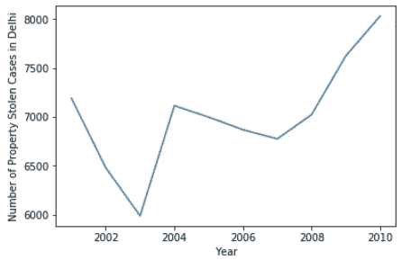
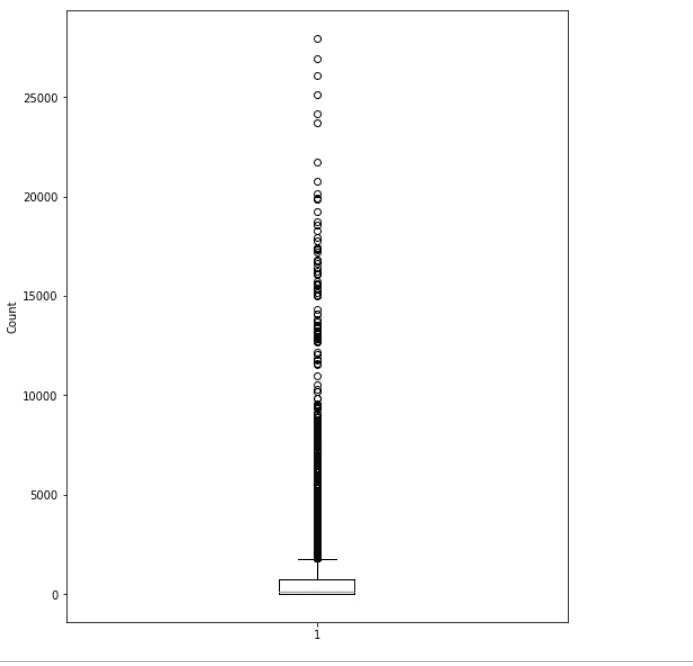

# 用于数据科学的 Python:从头开始(第三部分)

> 原文：<https://towardsdatascience.com/python-for-data-science-from-scratch-part-iii-7755f6defcc3?source=collection_archive---------15----------------------->

## 构建可视化和你的第一个机器学习模型。


Iris!

在学习了 [python 101](/python-for-data-science-from-scratch-part-i-390f01d91748) 、[切片和切块数据结构](/python-for-data-science-from-scratch-part-ii-e4dd4b943aba)之后，是时候给我们的项目添加创意了。在本文中，我们将探讨数据可视化，以及它如何揭示数据最深层和最黑暗的秘密。接下来，我们将建立我们的第一个机器学习模型，以了解它到底是什么！

# 一.数据可视化

想象一下当你还是一个天真的小怪物时，你最喜欢的睡前故事书。你记得它曾经有小句子，但真正迷人的图片，对不对？让我们暂时改变一下那个东西，把我们最喜欢的彩色睡前故事书变成一张白纸，用黑色墨水写下故事的一行行。你就像~


I can’t do it! It’s torture.

在数据科学中，您所拥有的只是一千行数据和大量的列需要处理。想象一下，如果您必须检查每一条记录并理解它在数据集中的重要性，会有多可怕。但是，如果您将数据可视化或绘制成最适合的图表，您可以在一秒钟内获得每个数据点的重要性。

数据可视化是如此糟糕，它有一个不同的专门的工作配置文件。因此，我们在这里理解了什么是可视化，甚至没有阅读一个无聊的定义！哈哈！🤫😉

## Matplotlib

[Matplotlib](https://matplotlib.org/) 是一个适用于 python 平台的数据可视化库。它以条形图、直方图、箱线图和其他几种基本图表的形式提供 2D 表示。首先，你应该知道你永远不会对数据可视化有足够的了解，你会一直学习和成长。还有许多其他优秀的库，比如 Plotly、Bokeh，它们给了你迷人的表现。但是理解了 matplotlib 里面的基础，然后就可以逐步掌握其他的了。

1.  **折线图:**

我认为在实际数据上可视化比任何虚拟数据点更有意义。为此，我使用了来自 Kaggle 的[印度犯罪](https://www.kaggle.com/rajanand/crime-in-india)数据集。折线图是一种 2D 表示，显示一个变量相对于另一个变量的趋势。



Fig.1\. Line Chart

嗯（表示踌躇等）...2003 年前后，入室盗窃案件的数量急剧下降。我想知道后来发生了什么？也许窃贼变得足够富有并决定退休？！然后他们把他们的财富花在赌博上，所以他们不得不在 2004 年左右再次贪婪地偷窃？

Matplotlib.pyplot 库存储看起来像 Matlab 的方法。在 matplotlib.pyplot 中，保留了关于绘图图形(这里是 plt)和绘图区域的某些状态。无论可能使用什么样的进一步方法，都假定是针对这个特定的地块本身的。

*   不管怎样，plt.plot()函数绘制 X-Y 轴上的点。
*   已经给出了 x 轴和 y 轴标签。
*   最后，我们使用 show()函数在控制台上显示图表，并将命令返回给 IPython shell。

2.**条形图**


Fig. 2\. Bar Chart

条形图用于显示分类变量的频率或度量。

在 matplotlib.pyplot 中，我们使用 bar()方法来构建图表。bar 方法需要两个强制参数，一个是 x 轴标签，另一个是这些标签的高度。

**3。饼状图:**


Fig.3 .Piechart

上面的条形图很棒，但我们无法计算出记录的案例中有多少比例来自哪个州。就此而言，为了清楚地了解每个州所占的百分比，我们构建了一个饼图。

这里，pie()方法强制需要两个参数，一个是标签，另一个是将分配给特定标签的大小或角度。 *autopct* 属性用于给饼图扇区添加标签。

**4。散点图:**


Fig.4\. Scatter Plot

散点图用于检查变量的分布或变量之间的关系。因此，我们需要在 x 轴和 y 轴上绘制至少 2 个字段。我使用了一个随机数发生器，简单地分配给一种颜色。

5.**直方图:**

直方图是查看变量分布的好方法。柱或桶的概念在直方图中非常重要。容器大小定义了数据可以落入该“容器”的程度。假设容器大小为 10，则表示为 0–10、10–20、20–30 等等。现在假设容器大小为 50，则表示为 0–50、50–100 等。


Fig.5\. Histogram

我们可以解释说，大多数案件是少于 2000 件物品的抢劫。

**6。箱线图:**

箱线图用于绘制变量的分布并检测其异常值。所有的异常值都用圆圈标出。虽然矩形框说明了数据最集中的位置，但它也说明了最小值、最大值和四分位数范围，以及实际上是中位数的线。



Fig.6\. Boxplot

该箱线图表明数据严重倾斜，并且存在多个异常值。这正是直方图所传达的信息，但表达方式不同。在这里，我们对异常值及其数量有了清晰的认识，但在直方图中却不是同样清晰的图像。

在我看来，箱线图和直方图都可以用来考虑一个变量的分布。选哪个就看你自己决定了！

现在，知道这些图表就足够了。相信我，你会随机应变的！

# 二。机器学习:

在这个转折点上，我们已经获得了关于 python 以及如何让它为我们服务的原始知识。但是光靠知识你能做什么？！一位智者曾经说过…

> 知识就是知道什么是电开关。智慧就是不要把湿手指放进插座里！

这句话的意思是，在学习 Python 这么久之后，我们现在需要应用它！让我们明智一点。

## 什么是机器学习？

让我们回到 20 世纪 50 年代，你是一个受欢迎的有才华的演员的私人助理。现在这位著名的名人收到了成千上万封信，比如来自他的粉丝、崇拜者、导演、制片人、广告公司、演员同事等等。现在那位名人正忙于他的工作，而你的工作是在午餐时间准时给他送去所有重要和紧急的信件。因此，你整个上午都在浏览和阅读一大堆信件，并为这个大个子筛选出重要的信件。这时你会叹息说，“我希望我有一根魔杖，可以把这些字母排列起来，我就可以安静地吃我的煎饼当早餐了！唉！”。这时天使出现了，说:“如你所愿，可怜的人！”。

快进 60 年，那根魔杖就是今天的机器学习。虽然建立一个机器学习模型不像旋转魔杖那么容易，但如果做得对，结果确实是神奇的！

回到技术层面，机器学习是自动处理大量数据，从数据中学习并从中产生有价值的东西。

考虑一个垃圾邮件过滤程序，它会阻止所有包含“新人寿保险”一词的电子邮件。我们开发了一种机器学习算法来找到所有可能的单词，如“新人寿保险”，然后将它们扔进垃圾邮件箱。但是等等，我可以写一个简单的 IF-THEN 语句来完成我的工作。机器学习为什么要炫耀？

> 机器学习是让系统或机器像人一样思考，这样人类就不必浪费时间从收件箱中过滤愚蠢的垃圾邮件。

在现实生活中，数据从来没有如此分类和精确。每一组新数据都有惊人的差异。我们人类有区分相关和不相关的智能。我们试图将这种智能复制到机器学习模型中。机器学习模型会自我进化，并尝试从它们获得的每个新数据模式中学习。

## 机器学习的类型:

1.  **监督学习-** 简单说就是跟着老师学习。

你的老师教一朵花的结构；什么是花冠，什么是花萼，花瓣等。你学习并写一个测试。老师检查答案并告诉你你表现如何。她*监督*你。类似地，在监督学习中，我们已经知道给定的输入变量集的结果变量是什么。我们必须根据输入数据训练模型，使其产生期望的目标。模型不断学习和适应，直到达到近乎完美的结果。

**2。无监督学习**:没有老师的学习。

你有没有注意到“你可能也喜欢..”关于亚马逊的部分？这是无监督学习的一个很好的例子。这里的学习是没有导师的，是用来挖掘隐藏在黄金数据矿里的黄金的。因此，当你从亚马逊购买白板时，它会运行一个模型，自动聚集所有其他相关对象，如记号笔、除尘器和其他几个对象作为推荐。如果购买对象也发生变化，这些建议也会迅速改变，对吗？看，模型并不知道推荐的是洗碗机还是空调，它只是学习并提供结果。

## sci kit-学习:

S cikit-learn 是一个开源库，包含了几种让我们对给定数据进行机器学习的方法。它依赖于 SciPy 和 NumPy 库，所以在我们开始使用它之前，请确保您已经加载了所有的枪。虽然安装 Anaconda 时会安装 sklearn ,但是如果您遇到任何问题，请使用

```
pip install sklearn
```

我们将在 iris 数据集上工作，以获得更多关于 scikit-learn 的实践经验。我保证你会学到所有必要的术语以及它们的含义。

想象一下，有一个热情的植物学家，她喜欢收集鸢尾花。所以她每天早上都去野外，一边散步一边尽可能地收集所有可能的鸢尾花。然后当她回家后，她测量花瓣的长度和宽度，以及萼片的长度和宽度。根据这四种长度，她将采集到的花朵分为三种:刚毛花、杂色花或海滨花。这意味着给定一组输入的测量值，我们的植物学家就可以确定它可能属于哪个物种。我们假设野外只有这三个职业。

我们的任务是建立一个机器学习模型，它可以根据测量结果正确地告诉我们花的种类。由于我们已经知道输出将是三类虹膜中的任何一类，这是一个监督学习问题。此外，这是一个*分类*的问题，正如你所看到的，我们正在*将一朵给定的花*分类到预定义的类别(物种)中。更准确地说，这是一个三级分类问题。让我们来看看数据:

1.  **召唤所有必要的库如下:**

你可以在这里找到 ipynb 笔记本。


Importing libraries

2.**导入 iris 数据集:**在 Iris 的 [UCI 库](https://archive.ics.uci.edu/ml/machine-learning-databases/iris/)或我的 [Github 库](https://github.com/anna-list/python_for_data_science_part3.git)的数据集文件夹中找到数据集。由于数据集本身不提供列标题，我们首先将列标签放在一个名为 columns 的列表中，然后使用 read_csv 函数加载数据集以及刚刚声明的列。


Loading the dataset

**3。理解数据:**

好了，我们已经将数据集声明为花瓣和萼片的测量值和一个目标类。但是对于一个门外汉来说，花瓣和萼片是什么？


Fig.7\. IRIS classes

萼片是保护花蕾和保持花瓣位置的叶子。正如我们大多数人所知，花瓣是形成花朵并包围其生殖部分的修饰过的叶子。至于鸢尾花，这些长度决定了它们属于哪种物种。


Shape means dimensions of dataset

shape()方法输出数据集中的行数和列数。这里(x，y)其中 x 是行数，y 是列数。


describe returns the summary of numeric columns

describe()函数告诉我们数字变量的概要。这里我们可以看到每列的计数是 150，即。没有空值。然后我们得到每列的平均值、标准差、最小值、最大值。

**4。数据可视化:**最后我们用之前学过的！

4.i .单变量分析更好地理解每个变量。在这里，我们创建了一个所有测量的箱线图。


Fig. 8\. Boxplot

*   我们可以看到萼片长度范围从 4 到 8.0 个单位，没有异常值
*   而萼片有一些异常值，正好三个。
*   花瓣长度和宽度没有异常值。

4.二。多变量分析检查变量之间的关系。我们使用 seaborn 包来查看这个分析。Seaborn 是另一个优秀的绘图包，它实际上是基于 matplotlib 的。


pairplot()方法绘制所有给定的 4 个测量值，并尝试在它们之间建立关系。每个测量值都要与其他测量值以及自身进行比较。


Fig. 9\. Pairplot

从给定的图表中，我们可以清楚地看到，每朵花的测量值都集中在一个特定的数字范围内。因此，我们可以成功地运行分类算法，并获得所需的虹膜物种。

**5。拆分数据:**

在开始根据这些参数建立机器学习模型之前，我们需要一些确认，即我们作为花的“类”产生的任何输出都是正确的。但是从逻辑上来说，我们不能用训练模型的数据来测试模型。我们需要看不见的新数据，实际上有它的预测输出类变量。我们将在这些新数据上运行我们的模型，并获得结果类。如果结果类和存储的输出类相同，瞧！。

出于这个目的，机器学习的一般规则是在你的 75%的数据上训练任何模型，称之为*训练数据或训练集*。剩下的 25%的数据是*测试数据，测试集或保留集。*


Python 提供了一个内置函数来处理拆分，输入带有两个重要参数，即输入 X 列和输出 y 变量。默认的 test_size 是 0.25，即整个数据的 25%是测试数据，我们使用 random_state = 0，这使我们能够混淆数据，然后随机选择拆分。假设如果我们将最后 25%的数据作为测试数据，我们将只有 iris-virginica 输出。这对于训练来说是非常误导的，因此出现了随机分裂。

注:输入变量用大写的 X，输出变量用小写的 y，这只是惯例。

**6。建立模型:**

现在，我们进入最后也是最有趣的一步，建立一个机器学习模型来学习这些价值。

对于这个数据集，我们将使用 KNN 分类模型。

**KNN 算法:** KNN 代表 K-最近邻。你有没有听说过这样一种信念:你是和你相处时间最长的五个人的平均！用这个类比来理解 KNN 算法。KNN 考虑给定数据点的邻居，并根据这些邻居属于哪一类来决定给定数据点的类。该算法中的“K”是我们在分析中考虑的邻居数量，假设 k=3，则使用 3 个邻居。


*   KNN 算法位于 sklearn.neighbors 包中，称为 KNeighborsClassifier。
*   为了使用这个算法，我们需要从给定的类中实例化一个对象。我们称这个物体为“knn”。为简单起见，我们仅使用一个邻居进行训练。别担心，我们稍后会解决这个问题。
*   使用 fit()方法，我们在训练集上训练模型。fit()方法有两个参数，一个是包含所有测量值的 X_train，第二个参数是包含这些测量值的所有标签的 y_train。

但是训练模型是不够的，我们需要测试它！


使用测试向量 X_test，我们在它上面部署训练好的 knn 模型。score()方法计算给定测试数据的平均准确度。它获取测试数据点及其测试数据标签，并输出精度。对于我们的模型，我们得到了高达 97%的准确率。拍拍你的背，伙计们！你部署了你的第一个机器学习模型。

# 结论:

首先祝贺你的第一个机器学习模型！几个月前，我出于同样的原因拍了拍后背😄。通过这篇文章，我总结了 Python 用于数据科学系列。这么多蟒蛇足够你一个人在波涛汹涌的大海上航行了。

我要感谢勤奋的读者，这些出版物背后的动机是通过分享我所拥有的任何微弱的知识来成长。

我相信，即使一个人能够从我的出版物中学到一个话题，我也对社区有所回报。那是我最大的成就！✌

你可以在这里找到早期的出版物:

1.  用于数据科学的 python[第一部分](/python-for-data-science-from-scratch-part-i-390f01d91748)
2.  用于数据科学的 python[第二部分](/python-for-data-science-from-scratch-part-ii-e4dd4b943aba)

我很高兴宣布下一个系列，即使用 Python 的机器学习，这些系列将深入涵盖 sklearn 包，我们将在现实生活的数据集上工作，使用微妙的算法解决有趣的问题。所以来见我吧，学习者们！

*关注我上*[*LinkedIn*](https://www.linkedin.com/feed/)*。*