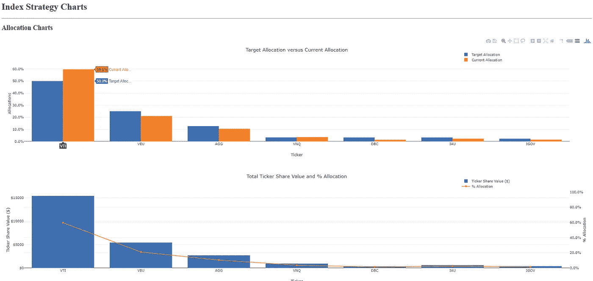
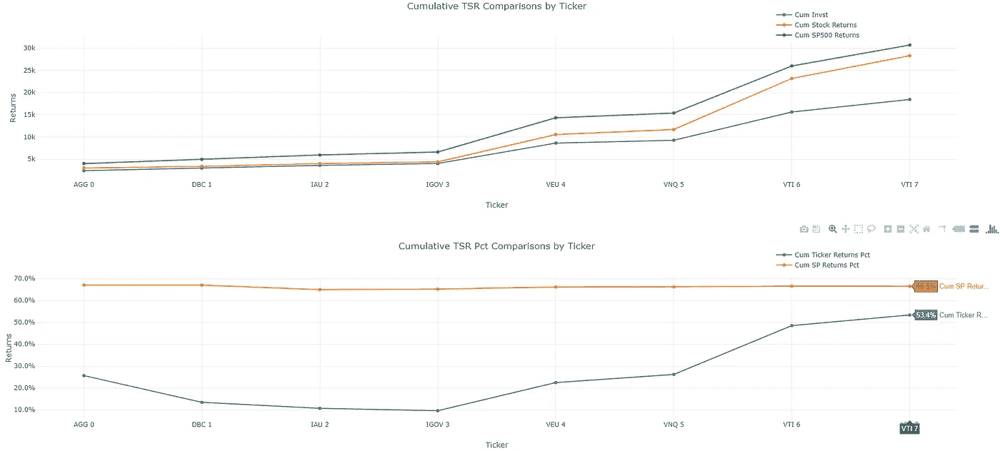

# 面向金融的 python:Robo 顾问版

> 原文：<https://towardsdatascience.com/python-for-finance-robo-advisor-edition-36571e0fd48e?source=collection_archive---------11----------------------->

## 扩展股票投资组合分析和 Dash by Plotly 跟踪类似 Robo Advisor 的投资组合。


Photo by Aditya Vyas on Unsplash.

# 利用 Python 进行股票投资组合分析的第 3 部分。

# 引言。

这篇文章是我关于利用`Python`融资的系列文章的第三部分，特别是股票投资组合分析。在[第一部分](/python-for-finance-stock-portfolio-analyses-6da4c3e61054)中，我查看了一个 Jupyter 笔记本，上面有从雅虎金融 API 中提取金融时间序列数据所需的所有代码，并创建了一个丰富的数据框架，用于分析单个股票的投资组合表现。代码还包含了对一些关键投资组合度量的审查，以及使用`Plotly`库创建的几个可视化。在[第 2 部分](/python-for-finance-dash-by-plotly-ccf84045b8be)中，我扩展了第 1 部分的分析和可视化，提供了获取生成的数据集并在`Dash by Plotly` ( `Dash` ) web 应用程序中可视化它们所需的代码。

在这个系列的继续中，我将提供 Robo Advisors 的概述，然后分享关于如何评估多样化指数策略的额外代码和细节。这种策略可以用于几个个人金融用例，包括作为将 ETF 与个股和债券相结合的整体方法的一部分。它还可以用来评估 Robo 顾问和个人管理的 ETF 策略的有效性。

最后，我最初方法的最大限制之一是，分析没有考虑股息和比较[股东总回报](https://www.investopedia.com/terms/t/tsr.asp)。股东总回报现在已经纳入其中——在我看来，这是我在散户投资者个人投资组合应用中看到的最大差距之一。很难全面了解投资组合的表现，包括不同的投资时机和获得的股息。我的方法现在兼顾了这两者，这是我个人的一个痛点，促使我用自己的产品来解决这个问题。我将继续改进这个投资组合绩效 web 应用程序；我将分享未来的更新，看看这种方法作为面向消费者的应用程序是否有更广阔的市场。

**披露:**本帖内容不应被视为投资建议。过去的表现不一定代表未来的回报。我写的是一般化的例子，并展示了如何使用 pandas 为模型投资组合导入数据。你应该向你的财务顾问提出所有与投资相关的问题，并对本文中提到的任何投资进行尽职调查。因此，我对使用本文中描述的方法可能遭受的任何损失不承担任何责任，并且在此明确否认任何此类责任。

# Robo Advisors 概述。

根据 [NerdWallet](https://www.nerdwallet.com/blog/investing/best-robo-advisors/) 的说法，机器人顾问是“一种在线的、自动化的投资组合管理服务”。Robo Advisors 使用算法，这些算法基于个人用户输入的答案，并根据个人的风险承受能力和投资范围(也称为退休时间和/或财务目标)推动个人的投资选择。机器人顾问提供的成本比传统的人力财务顾问低得多，代价是你通常没有任何人可以就你的财务目标进行个人咨询。Robo Advisors 通常最适合被动投资者，他们喜欢别人建立和优化个人投资组合，也没有复杂的财务状况。

一些主要和最知名的机器人顾问包括 Wealthfront、SoFi 和 Betterment。个人资本是这一领域的另一个选择，尽管该公司不认为它应该被归类为机器人顾问——这是因为个人资本将复杂的预算和投资组合监控应用程序与虚拟人力财务顾问相结合。个人资本市场本身是一个金融技术平台，也可以为拥有更复杂财务状况的高净值个人和家庭提供建议。

在本帖中，我们将利用个人资本在其[财富管理表现页面](https://www.personalcapital.com/wealth-management/performance)上提供的一个多元化 ETF 例子。我相信这是有益的，因为我尊重个人资本的方法，他们对自己相对于基准的表现非常透明。

# 被动与主动投资策略。

自从我开始投资以来的这些年里，**我越来越注重让我的投资策略尽可能地乏味**。这意味着我更倾向于被动投资策略，我承认试图战胜市场是极其困难的。在本系列的第一部分，我注意到，从长期来看，20 只积极管理的国内基金中有 1 只跑赢了指数基金( [link](https://www.marketwatch.com/story/why-way-fewer-actively-managed-funds-beat-the-sp-than-we-thought-2017-04-24) )。长期的优异表现很难保持，以前的优异表现往往会恢复到长期基准表现的平均值。进一步强调这一点，最近宣布，连续第九年，[积极型基金经理落后于标准普尔 500 指数&](https://www.cnbc.com/2019/03/15/active-fund-managers-trail-the-sp-500-for-the-ninth-year-in-a-row-in-triumph-for-indexing.html)。先前声称在波动性增加的时期会做得更好的主动型经理，将不得不再次从头开始。

有鉴于此，我的部分关注点是多样化的 ETF 策略——这种策略采用高质量的 ETF，它们具有非常低的成本结构，并提供跨资产类别的多样化。虽然我更喜欢我的投资策略越无聊越好，但我也继续投资符合几个投资标准的个股，包括加速收入增长、收益表现优异，以及理想情况下，开发我个人喜爱的产品。本系列的第 1 部分和第 2 部分详细介绍了如何跟踪相对于标准普尔 500 的个股表现，这与我们在本文中评估多元化 ETF 策略的方式类似。

# 第 3 部分的代码实现。

**设置。**与第 1 和第 2 部分类似，我在 GitHub 上创建了一个 repo，其中包含了创建最终`Dash`仪表板所需的所有文件和代码。在这篇文章中，我将解释代码的以下方面:

1.  ETF 相对于当前分配的目标分配。
2.  将每个头寸和基准相加，以计算相对于基准的总股东回报。
3.  相对于单一基准(在本例中为标准普尔 500)评估模型投资组合的总股东回报。

本文回购中的 Jupyter 笔记本有从头到尾所需的所有代码，但如果您想要关于生成投资组合数据集的完整解释，请参考[第 1 部分](/python-for-finance-stock-portfolio-analyses-6da4c3e61054)。如果你想了解更多关于使用 Anaconda、虚拟环境和 Dash 的细节，请参见[第二部分](/python-for-finance-dash-by-plotly-ccf84045b8be)中的**入门**部分。

正如在第 2 部分的结尾所讨论的，以前的方法的局限性是:I)它没有考虑分红；ii)它评估了活跃的头寸，并且没有包括以前撤资的头寸 iii)通过生成可以输入到实时 web 应用程序的数据管道，有机会使整个过程自动化。

在我看来，不包括股息和无法评估股东总回报(TSR)是最大的差距；本文中更新的方法评估 TSR。我不太关心被撤资的头寸，因为这种评估对于评估您的战略执行情况最有用，如果有您继续持有的头寸，您可能不应该持有，例如，落后于基准，因此代表整体业绩阻力和不持有更好投资的机会成本。虽然我想完全自动化这一过程，但我已经降低了优先级，以利于完善我的整体战略。如果我决定追求完全自动化的方法，我会决定它是否值得一个单独的职位。

**目标分配。**关于代码讨论，我们将回顾 Jupyter 笔记本的部分内容——互动版本可在[这里](/python-for-finance-stock-portfolio-analyses-6da4c3e61054)找到。如果您想了解数据框架开发和结束高评估的详细信息，请查看[第 1 部分](/python-for-finance-stock-portfolio-analyses-6da4c3e61054)。下面我将强调 dataframe 开发的主要补充，即理解和比较目标分配与当前分配。在我们的模型投资组合中，我们希望将 50%的投资分配给 VTI，这是一个针对美国股票的总股票指数 ETF。随着投资后价格的变化，我们的配置将根据该资产以及模型投资组合中其他资产的变动而偏离 50%。因此，我们应该监控这一变动，例如每季度一次，并调整所持有的资产，以便回到我们的目标配置。例如，如果 VTI 的涨幅超过 50%，VEU 跌至 25%以下，那么我们应该卖出一些 VTI，买入更多 VEU，以回到我们的目标(假设你希望你的模型投资组合的整体投资保持中性，这类似于机器人顾问策略)。下面的内容从笔记本的第 32 行开始，到第 36 行结束。

```
*# This dataframe will only look at the positions with an intended contribution, if applicable.*merged_portfolio_sp_latest_YTD_sp_contr **=** merged_portfolio_sp_latest_YTD_sp[merged_portfolio_sp_latest_YTD_sp['Target_Alloc']**>**0]merged_portfolio_sp_latest_YTD_sp_contr*# Shorten dataframe to focus on columns that will be used to look at intended versus current allocations.*merged_portfolio_sp_latest_YTD_sp_contr_subset **=** merged_portfolio_sp_latest_YTD_sp_contr[['Ticker', 'Target_Alloc', 'Cost Basis', 'Ticker Share Value']]merged_portfolio_sp_latest_YTD_sp_contr_subset*# If you've bought multiple positions at different times, this pivot table will aggregate the sums for each position.*merged_portfolio_sp_latest_YTD_sp_contr_subset_pivot **=** merged_portfolio_sp_latest_YTD_sp_contr_subset**.**pivot_table(
    index**=**['Ticker', 'Target_Alloc'], values**=**'Ticker Share Value', aggfunc**=**'sum')merged_portfolio_sp_latest_YTD_sp_contr_subset_pivot**.**reset_index(inplace**=**True)merged_portfolio_sp_latest_YTD_sp_contr_subset_pivot*# These new columns calculate the actual allocation to compare to the target allocation.*merged_portfolio_sp_latest_YTD_sp_contr_subset_pivot['Total'] **=** merged_portfolio_sp_latest_YTD_sp_contr_subset_pivot**.**loc[:, 'Ticker Share Value']**.**cumsum()merged_portfolio_sp_latest_YTD_sp_contr_subset_pivot['Allocation'] **=** merged_portfolio_sp_latest_YTD_sp_contr_subset_pivot['Ticker Share Value'] **/** merged_portfolio_sp_latest_YTD_sp_contr_subset_pivot**.**iloc[**-**1, **-**1]merged_portfolio_sp_latest_YTD_sp_contr_subset_pivotmerged_portfolio_sp_latest_YTD_sp_contr_subset_pivot**.**sort_values(by**=**'Target_Alloc', ascending**=**False, inplace**=**True)merged_portfolio_sp_latest_YTD_sp_contr_subset_pivot
```

*   在我们读到的文件中，我们查看了我们用目标分配记录的所有头寸；如果您想跟踪某个头寸的表现，但最初没有投资，这就提供了灵活性。
*   我们对数据框架进行子集划分，然后使用 pivot_table 方法来合计每只股票的总市值。正如代码中所指出的，我们运行这个支点是因为，在几年的时间里，你可能会多次投资于这个模型投资组合中的头寸——这个支点让你可以根据每个模型的当前市场价格查看你的全部配置。
*   然后，我们将每个头寸的总市值(股票价值)相加，并除以整个投资组合的总市值；这使您可以根据市场价格变化，将当前分配与您的初始目标分配进行比较。

**股东总回报。在笔记本第 54 行的上方，你会看到一个股息部分。在这里，我收集了每个职位的股息数据，您将在笔记本中看到您可以收集股息数据的网站的 URL。我将在这里自我批评，并承认这部分代码有一些改进的空间。我研究了如何访问 Quandl 的 API 来自动导入股息数据，但我认为现在不值得付费订阅(股息数据是有付费墙的)。我也在考虑为这些网站开发一个刮刀；但现在，我正在将网站上的数据复制/粘贴到历史股息 excel 文件中，并手动清理一点。这通常是好的，因为股息往往按季度支付，而模型投资组合总共只有 7 个头寸。我绝对欢迎任何关于如何改进这部分代码的建议。请注意，无论您如何决定汇总股息数据，您都应该确保您只考虑您的头寸收购日期早于或等于除权日期的股息(参见第 60 行的函数，如下面的第一个代码块所示)。**

```
*# This function determines if you owned the stock and were eligible to be paid the dividend.***def** **dividend_post_acquisition**(df):
    **if** df['Ex-Div. Date'] **>** df['Acquisition Date'] **and** df['Ex-Div. Date'] **<=** stocks_end:
        val **=** 1
    **elif** df['Ex-Div. Date'] **<=** df['Acquisition Date']:
        val **=** 0
    **else**:
        val **=** 0
    **return** val*# subset the df with the needed columns that includes total dividends received for each position.*merged_subsets_eligible_total **=** merged_subsets_eligible**.**pivot_table(index**=**['Ticker #', 'Ticker', 'Acquisition Date', 'Quantity'
                                                                           , 'Latest Date', 'Equiv SP Shares']
                                                                          , values**=**'Dividend Amt', aggfunc**=**sum)merged_subsets_eligible_total**.**reset_index(inplace**=**True)merged_subsets_eligible_total
```

*   一旦您创建了符合条件的股息数据框架，基于您持有股票以来每只股票的除权日期，上面的代码合计了每个头寸收到的总股息，还包括 Equiv SP Shares 列；这是比较每一个位置的总股息收到相对于 TSR 一个等价的 SP500 投资将返回的需要。

```
*# This df adds all of the columns with the SP500 dividends paid during the range that each stock position was held.*
*# For comparative holding period purposes.*dividend_df_sp500_2 **=** dividend_df_sp500agg0_start_date **=** datetime**.**datetime(2014, 4, 21)
dbc1_start_date **=** datetime**.**datetime(2014, 4, 21)
igov3_start_date **=** datetime**.**datetime(2014, 4, 21)
veu4_start_date **=** datetime**.**datetime(2014, 4, 21)
vnq5_start_date **=** datetime**.**datetime(2014, 4, 21)
vti6_start_date **=** datetime**.**datetime(2014, 4, 21)
vti7_start_date **=** datetime**.**datetime(2014, 5, 5)dividend_df_sp500_2**.**loc[:, 'agg0_sum'] **=** dividend_df_sp500_2[(dividend_df_sp500_2['Ex-Div. Date'] **>** agg0_start_date) **&** (dividend_df_sp500_2['Ex-Div. Date'] **<=** stocks_end)]**.**sum()['Amount']dividend_df_sp500_2**.**loc[:, 'dbc1_sum'] **=** dividend_df_sp500_2[(dividend_df_sp500_2['Ex-Div. Date'] **>** dbc1_start_date) **&** (dividend_df_sp500_2['Ex-Div. Date'] **<=** stocks_end)]**.**sum()['Amount']dividend_df_sp500_2**.**loc[:, 'igov3_sum'] **=** dividend_df_sp500_2[(dividend_df_sp500_2['Ex-Div. Date'] **>** igov3_start_date) **&** (dividend_df_sp500_2['Ex-Div. Date'] **<=** stocks_end)]**.**sum()['Amount']dividend_df_sp500_2**.**loc[:, 'veu4_sum'] **=** dividend_df_sp500_2[(dividend_df_sp500_2['Ex-Div. Date'] **>** veu4_start_date) **&** (dividend_df_sp500_2['Ex-Div. Date'] **<=** stocks_end)]**.**sum()['Amount']dividend_df_sp500_2**.**loc[:, 'vnq5_sum'] **=** dividend_df_sp500_2[(dividend_df_sp500_2['Ex-Div. Date'] **>** vnq5_start_date) **&** (dividend_df_sp500_2['Ex-Div. Date'] **<=** stocks_end)]**.**sum()['Amount']dividend_df_sp500_2**.**loc[:, 'vti6_sum'] **=** dividend_df_sp500_2[(dividend_df_sp500_2['Ex-Div. Date'] **>** vti6_start_date) **&** (dividend_df_sp500_2['Ex-Div. Date'] **<=** stocks_end)]**.**sum()['Amount']dividend_df_sp500_2**.**loc[:, 'vti7_sum'] **=** dividend_df_sp500_2[(dividend_df_sp500_2['Ex-Div. Date'] **>** vti7_start_date) **&** (dividend_df_sp500_2['Ex-Div. Date'] **<=** stocks_end)]**.**sum()['Amount']dividend_df_sp500_2**.**head()*# Subset the above df and re-label the SP500 total dividend amount column.*dividend_df_sp500_2 **=** dividend_df_sp500_2**.**iloc[0, 10:]dividend_df_sp500_2 **=** dividend_df_sp500_2**.**to_frame()**.**reset_index()dividend_df_sp500_2**.**rename(columns**=**{213: 'SP500 Div Amt'}, inplace**=**True)dividend_df_sp500_2*# This function is used to assign the Ticker # column so that this df can be joined with the master df.***def** **ticker_assigner**(df):
    **if** df['index'] **==** 'agg0_sum':
        val **=** 'AGG 0'
    **elif** df['index'] **==** 'dbc1_sum':
        val **=** 'DBC 1'
    **elif** df['index'] **==** 'igov3_sum':
        val **=** 'IGOV 3'
    **elif** df['index'] **==** 'veu4_sum':
        val **=** 'VEU 4'
    **elif** df['index'] **==** 'vnq5_sum':
        val **=** 'VNQ 5'
    **elif** df['index'] **==** 'vti6_sum':
        val **=** 'VTI 6'
    **elif** df['index'] **==** 'vti7_sum':
        val **=** 'VTI 7'
    **else**:
        val **=** 0
    **return** val
```

**上面的代码是最不优雅的，也是最需要改进的，但是它暂时完成了工作。**

*   在第一个代码块(第 68 行)中，根据每个头寸的收购日期为每个头寸设置一个变量。
*   然后创建一个新列，对每个头寸在等价持有期内支付的 SP500 股息进行求和。
*   在下一个代码块中，您抓取第一行和第 11 列及其后的`.iloc[0, 10:]`。这从笨拙的解决方案中删除了重复的行，在每个单个头寸的持有期间获取了 SP500 红利。
*   在上面的最后一个代码块中，您将 SP500 红利的总和分配给主数据框架中的每个相关位置，以便计算每个持股的可比 TSR。例如，`agg0_sum`跟踪自您持有第一笔 AGG 投资以来所有 SP500 股息的总和。您正在将它分配给主数据帧中的“AGG 0”行。

在第 74 行，您将看到一些熟悉的计算，以及一些新的计算，为了创建关键指标，我们将比较相对于 SP500 的每个位置。

*   SP500 Tot Div——这是一股 SP500 股票的 SP500 股息总额，乘以你在每个位置投资的美元可以在 SP500 购买的股票数量。
*   创建了总收益/(损失)列，合计每个头寸的收益或损失，也就是自买入以来股票上涨或下跌的百分比，以及自买入该头寸以来收到的总股息。这些指标允许你计算你的个人头寸和他们的可比 SP500 持仓的 TSR。
*   和往常一样，你的回报是由持有价值除以其原始成本基础决定的。
*   与第 1 部分和第 2 部分类似，我们计算累积回报，以便除了考察单个头寸的表现之外，还考察我们的总投资组合回报相对于 SP500 基准投资组合回报的表现。

# 仪表板输出的简要观察。

以下两种可视化效果都可以在 Jupyter 笔记本中看到，也可以在本地运行`Dash`仪表盘。关于设置`Dash`的说明，请参见[第 2 部分的](/python-for-finance-dash-by-plotly-ccf84045b8be) **与仪表板**一起工作一节。



*   在上面的可视化中，您可以看到相对于您的目标配置，您在该模型投资组合中每个头寸的当前配置。
*   在这个例子中，这些头寸自 2014 年 4 月以来一直持有，VTI 在此期间(截至 2019 年 4 月 18 日)的回报率约为 70%。
*   由于 VTI 的回报高于所有其他头寸，它现在代表了你投资组合的近 60%——这就是投资组合再平衡的切入点。
*   保持投资组合中的投资金额不变，你会想卖出一些 VTI，并用所得资金购买其他头寸，以回到最初的目标配置。
*   像 Betterment 和 Wealthfront 这样的机器人顾问的好处是，他们会自动为你重新平衡投资组合。需要注意的是，他们提供这项服务显然是要收费的；但机器人顾问可能会为你节省与重新平衡交易相关的交易成本。



*   这种可视化结合了相对于基准 SP500 回报的 TSR 美元比较和 TSR 百分比比较。
*   请注意，在“股票行情与 SP500 的对比”可视化图中可以找到每个位置的头对头表现。
*   从正面来看，我们知道在 TSR 的基础上，VNQ 和 VTI 在过去的 5 年里都超过了 SP500。
*   然而，总体而言，仅 SP500 投资组合的表现比模型投资组合高出约 13 个百分点。

这是否意味着你的模特组合很差？在我看来，答案是否定的。这种观点的一些原因包括:

*   五年的持有期相对较短。我认为，大多数投资者应该将投资视野一直延伸到退休，对一些人来说，可能是 30-40 年后。
*   这一策略旨在提供美国股票以外的多元化投资，在这种情况下，这将降低您的投资组合风险和潜在的总体回报。
*   更精确的比较将包括每个 ETF 更好的基准，例如，AGG 提供投资级债务的风险敞口。它的目的不是战胜 SP500，而是提供比股票策略更低的风险和回报。
*   我相信将这个模型组合与 SP500 进行比较是有益的，但它也帮助我们简化了本文中讨论的比较框架。
*   最佳解决方案很可能包括本文中的比较，以及对多个基准的更高级的分析。
*   分散投资让你有更好的机会参与有利的资产类别，而不必把握市场时机，也就是永远投资并“坚持到底”。
*   这个模型投资组合的很大一部分，VTI，实际上跑赢了 SP500。
*   实现类似指数的回报是一个伟大的成就。正如杰克·博格尔所说:“指数基金并不提供平均表现；它们给投资者带来了最高的十分之一的回报。”

# 结论。

我还没有找到一种服务可以复制这种类型的分析，我认为这是一个有价值的框架，可以确保你正确地投资退休储蓄，或者无论你的特定财务目标是什么。我见过的几乎所有金融网站和在线经纪商都会显示资产的资本回报，但它们不会提供股东总回报。在我看来，TSR 非常重要——你可以持有一个表现稍逊于 SP500 的头寸，但它可以提供更高的收益率，因此在那个时候可能是一个更好的选择。

机器人顾问采用的策略与我们在这篇文章中讨论的类似，机器人顾问自动化了所有的投资组合管理，包括投资组合的重新平衡。但是，你投资的每一块钱都受制于他们的收费结构，而不是你运行可比策略的时间。Robo Advisors 还提供节税策略，本文没有涉及，但它是帮助您的投资获得额外回报的另一个杠杆。无论如何，我希望这篇文章对 robo-advisors 有所帮助，并提供一个有用的框架，作为整体多元化投资战略的一部分。

如果你喜欢这篇文章，如果你能点击“拍手”图标让我知道并帮助增加我的作品的发行量，那将是非常棒的。

你也可以在推特上联系我， [@kevinboller](https://twitter.com/kevinboller) ，我的个人博客可以在这里找到。感谢阅读！