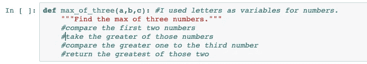
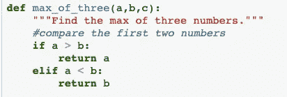
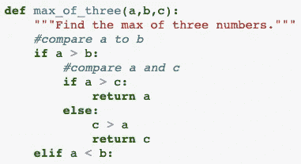
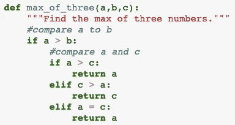
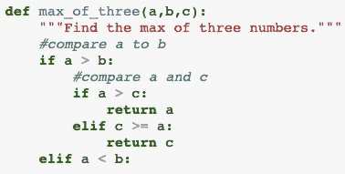
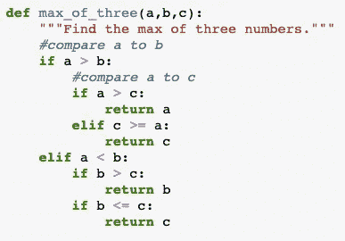
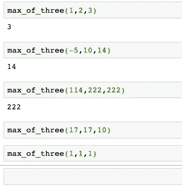
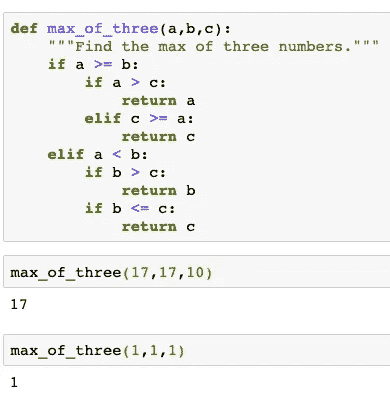
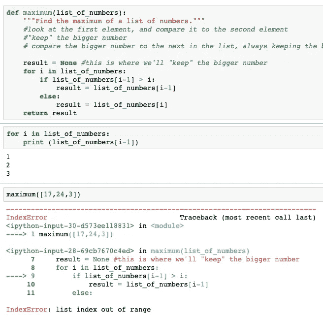

# Python 以慢动作运行

> 原文：<https://towardsdatascience.com/python-functions-in-slow-motion-5481fc9f961b?source=collection_archive---------27----------------------->

## 那些努力自信地编写 Python 函数的人的策略和实践问题

人们普遍认为，我们要么是右脑型(富有想象力的自由精神)，要么是左脑型逻辑机器人。原来，[都是神话](https://ed.ted.com/lessons/the-left-brain-vs-right-brain-myth-elizabeth-waters)。我们甚至没有大脑！

至少这是我开始学习数据科学时的感觉。有时候，我无法处理我的眼睛和耳朵拼命想吸收的所有信息。其他时候，我觉得我在自动驾驶仪上，内置的公式和库在做所有的工作。你可能认为后者是一种理想的状态，但我更想知道“引擎盖下”发生了什么

写函数是一个甜蜜点，称之为中脑？—创造力与解决问题以最明显的方式重叠在一起:你*创造*一些东西，然后*解决一个问题。*在你正在进行的更大项目的背景下，取得这个小小的成功是很好的——看到你放在引擎盖下的东西*起作用了。*

问题是，当我写函数的时候，我还不是很有信心。我将与你分享我在变得更加自信的过程中所学到的写作技巧。

我假设如果您还在阅读，您至少已经尝试过编写一些函数。我跳过了一些主要的定义和要求(大量的教程和文档已经涵盖了它们),取而代之的是专注于我们初学者可以做的实际的事情，来帮助我们自己在需要编写 python 函数的时候编写它们。*注意:如果你是一个喜欢列表的人，我在本文中概述的过程的总结可以在最后找到！*

## 放松

Sometimes, when I’m asked to write a function…

当我需要写一个函数的时候，我会立刻紧张起来。我能做到吗？第一次尝试？够快吗？首先，当我被这样毫无意义的问题分散注意力时，我很难有创造力或逻辑。

即使在技术面试中，功能输出和你花了多长时间并不重要，重要的是你的决心、足智多谋和解决问题的方法。我们应该像玩拼图游戏一样编写函数，而不是害怕。

Gettin’ jiggy with it

有些人先把所有边缘的碎片放在一起，有些人把所有颜色相似的碎片放在一起，有些人不停地看着盒子，有些人喜欢和一群人或其他人一起工作，大多数人按照自己的节奏移动，享受把它们放在一起的过程。我从来不会紧张拼拼图。事实上，这很放松。

[采取积极的心态对任何任务都很重要](https://en.wikipedia.org/wiki/Carol_Dweck)，对于编写 Python 函数也是如此！

## 减速以加速

也许你也像我一样，刚刚开始学习 Python。作为一个初学者，我经常不必要地催促自己。我不确定为什么！如果有人看着我，他们很可能会支持我成功地编写函数。我知道很少有面试官支持他们的候选人，在这种情况下，你可能无论如何都不想和这些人一起工作。如果你是结对编程，你的同伴希望你成功，他们对你没有时间限制。对速度的需求全在我们的脑袋里！

“放慢速度以加快速度”的想法在一些应用中非常有价值，尤其是在学习新东西的时候。如果我们在开始的时候从容不迫，花*几个小时*去理解一个主题，那么我们可能会节省*几周*的工作时间。坚持这一理念意味着我们不能掩饰我们自己没有编写的函数的解决方案。我们也必须花时间去理解这些。

很明显我们没有足够的时间。用“更聪明地工作，而不是更努力地工作”这句古老的格言来平衡你的时间，并且知道你什么时候到达了收益递减的点，这几乎肯定不是在你自己尝试几次之前。如果没有人亲自求助，[栈溢出就是*惊人*](https://stackoverflow.com/) 。

> 如果我们多花几个小时去理解一个话题，那么我们就可以省下几周的工作。

## 想想你的想法

好了，现在我们要享受解决这个问题的过程，我们根本不需要着急。让我们开始吧。

> 写一个寻找三个数中最大值的函数。

在我们开始给计算机下命令之前，让我们关注一下人类将如何解决这个问题。一旦我们思考了自己的想法，我们就会把它翻译成 Python。

对于这个问题，倒推对我是有帮助的。(你可能会想出一个不同的方法。)*如果我们寻找最大值，那么我们的输出将是输入之一。我如何知道返回哪个输入？*

如果我用三个数字做这道题，比如 1，2，3，我会怎么找到最大值？*看看前两个数字，看看哪个更大。然后将较大的数字与第三个数字进行比较。返回两者中最大的那个数。*

## ***写出你的想法***

在评论中写下你想让代码做什么是一个很好的过渡步骤，可以跟踪你大脑之外的想法。旧的观念是，如果你能解释一些事情，那么你就完全理解它，这在这里是正确的——如果我们能通过注释解释函数应该做什么，那就成功了一半。

Type your thoughts as comments before you start writing the function.

提示:要一次注释掉多行，按下 **command /。**试试看！

## 翻译成 Python

记住没有时间限制，现在我试着翻译成 python。

诚然，作为初学者，这有时是最难的部分。我们不知道什么是可能的，不得不经常查阅文档、例子，或者查看[备忘单](https://ehmatthes.github.io/pcc/cheatsheets/README.html)。然而，对我来说，犯错误是学习新信息的最好方法之一。这就像一种很好的创伤:每当我处于类似的情况下，我更有可能被“触发”，并被提醒如果我再次犯同样的错误会发生什么。

对于我们的 *max_of_three* 示例，通过比较，我认为我应该使用一个关于前两个数的值的 if 语句:

现在，我想象运行这个函数。当我对我的解决方案更有信心时，我会测试这个函数，但现在我只是刚刚开始，只是简单地想象输入值。我意识到我根本不处理第三个数 *c* 。因此，根据我的注释，在我返回任何东西之前，*我需要将我的 a 和 b 与第三个数字 c 进行比较。因此，似乎我应该在每种情况下将最大的数字与 c 进行比较，因为我没有对数字进行排序，而是只返回最大的一个。*注意这与我最初的评论不同，但没关系！我会试试看:

我认为我的逻辑是合理的。此时，我可能会转到 *elif* 语句，但是我刚刚意识到我遗漏了一个步骤！*如果 a 和 c 相等呢？在这种情况下，我返回什么数字(a 或 c)并不重要，因为最大值将等于这两个数字。*

顺便说一下，我并不完全确定我是否正确地使用了 if 和 elif 语句，所以我谷歌了“if elif 文档”，并且[验证了](https://docs.python.org/3/tutorial/controlflow.html):“可以有零个或更多的`[elif](https://docs.python.org/3/reference/compound_stmts.html#elif)`部分，并且`[else](https://docs.python.org/3/reference/compound_stmts.html#else)`部分是可选的。”

酷毙了。但是因为我花了时间，我意识到我可以通过删除第二个 elif 行并用一个字符替换它来使它更容易阅读: **> =**

现在我想我已经完成了当 *a* 大于 *b* 时的函数。当 *b* 大于 *a:* 时，我会做类似的事情

Time to test my function!

## 测试功能

Python 最棒的部分之一是反馈——带有箭头的错误描述告诉您错误发生的确切位置。如果我在运行我的函数时出错，我就离正确运行更近了一步。为了测试我的功能，我将尝试几个不同的三重奏:

直到最后两个例子，一切看起来都很好。没有输出。我一定是遗漏了什么，因为没有错误，也没有返回任何东西。我错过了什么？

在每一个没有输出的例子中，我都有 *a = b.* 看着代码，我记得考虑过 *a* 或 *b* 什么时候**等于**到 *c* ，但是我忘记了 *a* 和 *b* 彼此相等的情况！这很容易添加和测试:

提示:在不同的步骤中使用打印语句来查看您的函数中“幕后”发生了什么，尤其是当您无法确定自己哪里出错时。这对于[递归函数](https://dev.to/jessicabetts/recursive-functions-for-beginners-1j8g)特别有帮助，当我们到达那里的时候。

## 给自己一个鼓励

看起来我已经完成了这个函数的编写。我忍不住想，“有什么大不了的——我打赌很多人可以做得更快，我甚至不确定我是对的。”但是，我必须记住，速度和准确性都不是这个练习的重点。目的是更好地编写函数。因为我忽略了一些地方，所以回去修复了它们，我成功了！

此外，我永远不会使用 *max_of_three* ，因为有一个名为 *max* 的内置 Python 函数，它可以找到任意数字的最大值。但是我是一个初学者，更好地编写函数的最快方法不是立即看别人写了什么而是自己不断练习编写函数。(FWIW，剩下的[这些](https://www.w3resource.com/python-exercises/python-functions-exercises.php)我以后再去试试。)在这个例子中我学到了什么？比较整数的时候，别忘了它们可以相等。在写的时候，我确实在两个不同的场合忘记了。

说到 *max* 函数，自己编写这个函数可能是一个有趣的挑战！我知道 Python 函数允许不同类型的输入，但是如果我把自己限制在一个列表中，我打赌我可以做到。

快进一个小时，我没有复制出最大功能。当我试图将我的想法翻译成 Python 时，我已经到了出错的地步。我休息了几次，想对这个问题有一个新的看法，但我几乎停滞不前了。这是我试过的一个版本:

Great, an error! (no sarcasm)

在这之后，我尝试使用枚举功能。那没有解决我的问题。我决定偷看一下 Python 源代码，但是我意识到我实际上不知道如何去做，并且当我试图看的时候找不到它。我做了更多的搜索，[在栈溢出](https://stackoverflow.com/questions/8608587/finding-the-source-code-for-built-in-python-functions)上发现了一个类似的问题，我并不完全理解。

所以，看起来我失败了。对吗？

不对！

记住，我们的目标绝不是复制 *max* 函数。目标是*通过尝试复制 *max* 函数来学习一些东西*。那么，我学到了什么？

*   我在列表中的元素和元素的索引之间反复出错。最终这让我意识到我有时会把*误解为循环* / *列表理解*，以后应该特别注意。我做了中的[第二个练习题，以确保我在继续之前理解了 *for loops* 和*list*。](https://www.w3resource.com/python-exercises/python-functions-exercises.php)
*   我得复习一下*是如何列举*的。我仍然需要更多的练习，但我现在理解得多了。
*   我参加了一个寻找 Python 源代码的寻宝游戏，明天我会和我的老师谈谈，以便更清楚地知道如何找到它。
*   最令人惊讶的是，我了解到 Python 的源代码并不总是用 Python 编写的！这不仅是一个可以考虑的很酷的概念，而且我意识到，考虑到我刚刚开始使用 Python，这个难度对我来说可能有点太高了。我需要记住，一些内置函数可能有简单的语法，但实际上非常复杂。毕竟，它们的使用频率可能不是它们内置的唯一原因。

简而言之，我试图复制内置于 Python 中的东西，但失败了，反正我是不会用的。然而，通过尝试和失败，我学到的东西比我只是敷衍了事要多。额外收获:我有办法优化自己的时间，不会因为发呆、心烦意乱或长时间休息后回来重复自己的工作而浪费时间。当我的进步停止时，我“寻求帮助”

这是一次成功！

Being a superstar may look different than what you imagined.

# 摘要:编写 Python 函数的过程

1.  **不用担心疗效。采取成长的心态。**重要的是旅程，而不是目的地。把这看作是一个有趣的挑战，它会教会你一些新的东西，而不是一个你必须面对的任务。
2.  **减速加速。**给自己留出合理的时间。当你已经到了一个你在挣扎却没有学习的地步时，寻求外界的帮助。确保你理解解决方案的每一部分或其他地方的提示。
3.  **在评论中写下你的想法。向自己解释这些步骤将有助于你记录你的逻辑，也是一种快速“落笔”的方式**
4.  将你的想法翻译成 Python。教计算机像你一样思考。思考创建算法的每一步的逻辑。从文档、其他人和网站获得帮助。
5.  **测试功能。使用不同的输入来检查你没有遗漏任何东西，阅读并使用所有对你有利的警告和错误。**
6.  **回忆一下你在这次经历中**学到了什么，并且**祝贺**自己学到了**！对任何你不明白的事情进行跟进。**

你做了我在这篇文章中遗漏的事情吗？如果有就加个评论！我很想听听你的意见，听听你个人在编写 Python 函数时遇到的困难。