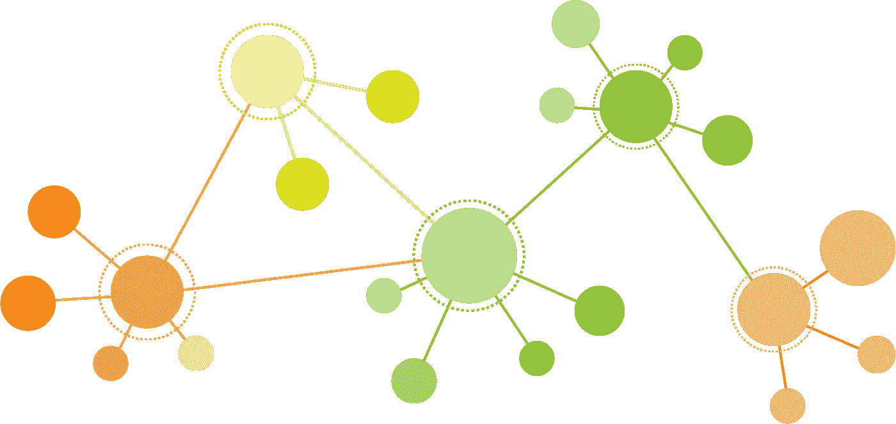

# 使用 NetworkX、Plotly 和 Dash 的 Python 交互式网络可视化

> 原文：<https://towardsdatascience.com/python-interactive-network-visualization-using-networkx-plotly-and-dash-e44749161ed7?source=collection_archive---------0----------------------->



他们说一张图胜过一千个单词。我完全同意。为了理解复杂的网络模式，我更喜欢看网络图，而不是通读冗长的文档。

这篇文章是关于 Python 交互式网络可视化应用的。在前半部分，它涵盖了网络可视化应用程序的特性，并介绍了我用来开发这个应用程序的工具。在第二部分，将讨论如何使用 NetworkX、Plotly 和 Dash 的技术细节。

# 1.网络可视化应用功能

网络图揭示了模式，有助于发现异常。金融领域的网络可视化应用潜力巨大，例如欺诈监控和洗钱监控。对于这个项目，我将创建一个虚拟的事务数据集，并构建一个网络可视化应用程序来交互式地绘制显示这些事务的图形。

首先，该应用程序将读入虚拟交易数据集，并生成交易网络的图形表示。在这里，我想自定义图形表示，例如根据交易时间对边进行颜色编码，根据交易金额改变边的宽度。这样，很容易快速理解交易网络图。

其次，它将是一个交互式应用程序。当用户悬停在一个节点或边上时，将显示丰富的信息。此外，用户应该能够输入要搜索的帐户和要显示的时间范围。然后，响应用户的输入，应用程序将相应地显示交易网络图。

# 2.图书馆简介

我找到了几个有用的 python 包来支持这个应用程序的开发，包括 [NetworkX](https://networkx.github.io/documentation/stable/) 、 [Plotly](https://plot.ly/python/) 和 [Dash](https://plot.ly/dash/) 。本节将简要介绍这些库，并讨论它们如何对该应用程序的开发有用。

**2.1 图论和网络 X**

为了表示交易网络，图由节点和边组成。这里，节点表示帐户，相关属性包括客户名称和帐户类型。边是具有交易日期和交易金额的相关属性的交易。交易网络是一个有向图，每条边都从源账户指向目标账户。

NetworkX 是一个 Python 包，用于创建、操作和研究复杂网络的结构、动态和功能。它只需要几行代码就可以快速构建和可视化图形:

```
import networkx as nx
import matplotlib.pyplot as plt
G = nx.Graph()
G.add_edge(1,2)
G.add_edge(1,3)
nx.draw(G, with_labels=True)
plt.show()
```

除了使用内嵌数据构建简单的图形之外，NetworkX 还支持使用从 csv 或数据库导入的数据集构建更复杂的图形。在这里，我导入了包含交易记录的虚拟 csv 文件，并使用 NetworkX 构建了交易网络。

**2.2 互动图和情节图**

Python 附带了几个有用的绘图库。与静态的 Matplotlib 和 Seaborn 库不同，Plotly 制作交互式图形。它支持许多常见的图表类型，包括折线图、散点图、条形图、直方图和热图。与 ipywidgets 一起，它允许在 Jupyter 笔记本中进行交互式数据分析。

**2.3 反应式网络应用和破折号**

Jupyter 笔记本在数据科学家中很受欢迎。但是我想更进一步，让其他 stackholders 也能使用这个应用程序，他们可能不需要有数据分析的背景。Web 应用程序成为一个很好的选择，因为每个人都可以使用浏览器轻松访问 web 应用程序。

然后，我找到了 Dash，这是一个用于创建反应式 web 应用程序的开源 Python 库。Dash 允许 Python 数据分析代码与前端 HTML、CSS 和 Javascript 无缝集成。利用 Dash 提供的 Python 接口和反应式装饰器，Python 数据分析代码被绑定到交互式的基于 web 的组件上。由于 Dash 是基于 Flask framework 和 React.js 构建的前端渲染，所以我可以很容易地从开源社区获得大量支持。最后但同样重要的是，Dash 与 Plotly 完全兼容，这意味着我可以将使用 Plotly 创建的网络图集成为 Dash 应用程序中的一个组件，并进一步添加其他基于 web 的组件来与我的数据分析代码进行交互。

# 3.编码

现在，让我们继续真正的编码！

**3.1 初始化 Dash App**

因为 Dash 是建立在 Flask 框架上的，所以看到启动 Dash 应用程序和启动 Flask 应用程序几乎相同的语法就不足为奇了。

**3.2 定义布局**

借助 Python 接口 dash_html_components 和 dash_core_components，html 和基于 web 的交互式组件可轻松集成到 Python 分析代码中。这里，布局设计遵循自举网格系统。这个交易网络可视化应用程序包括 RangeSlider(定义时间范围)、输入框(键入要搜索的帐户)、Plotly graph(根据用户输入显示交易网络)、悬停框(当用户悬停在图形上时显示详细信息)和单击框(当用户单击图形时显示详细信息)等组件。


**3.3 绑定到分析代码**

当用户对 RangeSlider 或输入框进行更改时，绘图数字会相应地改变。当用户悬停或单击绘图图中的节点或边时，悬停框和单击框会显示与该节点或边相关联的详细信息。

**3.4 定义 Plotly 图形**

这里，代码定义了如何构建交易网络、启动 Plotly 图，以及如何响应用户的输入来更改 Plotly 图。基本上，这里的代码定义了网络图的逻辑。

首先，导入数据集并将日期字符串转换为 Python 能够理解的 Datetime 对象。

然后，使用 NetworkX 构建网络。

用 Plotly 定义节点。

用 Plotly 定义边。这里，定义定制的边不像定义节点那样简单。边的定制有两种方式:边的颜色代表交易的时间，交易越早，边的颜色越浅；此外，边的宽度代表交易金额，边越宽，交易金额越大。

定义边缘上不可见的中间点，以允许边缘上的悬停效果。由于 Dash 只允许数据点上的悬停效果，所以我在边上添加了一个不可见的中间点，以在边上创建一个额外的数据点。

最后，定义 Plotly 图形的布局。

最终交易网络可视化应用程序的工作方式如下:

如果你对代码感兴趣，请在 [Github](https://github.com/jhwang1992/network-visualization) 上查看。