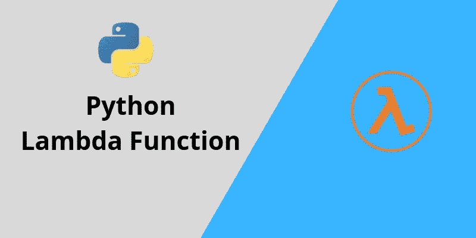
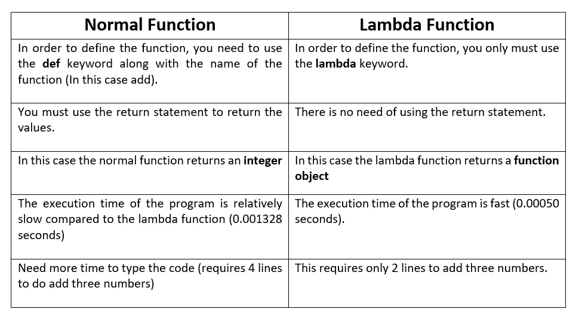

# Python Lambda 函数

> 原文：<https://towardsdatascience.com/python-lambda-function-b6e1fa3420c1?source=collection_archive---------5----------------------->

在本文中，您将了解更多关于 python 中 lambda 函数的知识。我们如何使用 lambda 函数，lambda 函数的语法是什么，我们为什么需要它们？



Image Credits: [TechGeekBuzz](http://www.techgeekbuzz.com/python-lambda-function/)

# 什么是 lambda 函数，它有什么特点？

λ函数也叫 ***匿名函数*** 。匿名函数是没有名字的函数。众所周知，要在 python 中定义一个普通函数，需要使用`def`关键字。但是在这个匿名函数的例子中，我们使用`lambda`关键字来定义函数。阿隆佐·邱奇在 20 世纪 30 年代向数学领域引入了λ函数。

**此外，本教程的完整代码可以在我的** [**GitHub 资源库**](https://github.com/Tanu-N-Prabhu/Python/blob/master/Python_Lambda_Function.ipynb) **下面找到:**

[](https://github.com/Tanu-N-Prabhu/Python/blob/master/Python_Lambda_Function.ipynb) [## 塔努-北帕布/Python

### 此时您不能执行该操作。您已使用另一个标签页或窗口登录。您已在另一个选项卡中注销，或者…

github.com](https://github.com/Tanu-N-Prabhu/Python/blob/master/Python_Lambda_Function.ipynb) 

## λ函数的特征是:

1.  lambda 函数可以接受许多参数，但只能返回一个表达式。这里的表达式只是 lambda 函数返回的结果。
2.  Lambda 函数在语法上被限制为返回单个表达式。
3.  您可以在其他函数中使用它们作为匿名函数。
4.  lambda 函数不需要返回语句，它们总是返回一个表达式。

> **在短时间内需要匿名函数时，使用 lambda 函数。—我不知道他们为什么这么说，如果你知道，请告诉我，我很好奇。**

# lambda 函数的语法是什么？

**lambda 函数的语法如下所示:**

> lambda 参数:表达式

**表达式总是被执行并返回。**

让我们理解 lambda 函数的工作原理，我们将使用简单的逻辑，通过增加两个数来理解 lambda 函数的工作原理。首先，我会写程序，然后向你解释它是做什么的？

```
add = lambda a: a + a
print(add(20))**40**
```

**好的，首先，你明白这个节目的内容了吗，别担心，我会一步一步给你解释的。**

1.  首先，使用`lambda`关键字定义匿名/ lambda 函数。
2.  只需记住 lambda 函数的语法如下所示:***lambda arguments:expression，*** 然后只需使用变量“ **a** ”作为参数，使用“ **a + a** ”作为表达式，记住我们正在添加两个数字(a + a)。
3.  然后，为了存储最终相加的结果，让我们使用一个变量“ **add** ”。
4.  然后就像调用一个普通的函数一样，我们通过发送一个参数“ **20** ”来调用 lambda 函数的变量名“ **add** ”来执行加法，然后打印出来“ **print(add(20))** ”。
5.  这是最后一步，在这里，当我们打印结果时，我们得到 40，因为“ **20+20** ”，因为我们添加了“ **a+a** ”。看这里，我没有使用返回语句。

既然我们知道了 lambda 函数是如何工作的，现在我们来玩玩它。 **Lambda 函数带多个实参，我们来看看这个说法是真是假。**

```
add = lambda a, b, c: a + b + c
print(add(10, 10, 10))**30**
```

哇，上面的陈述实际上是正确的，因为我向 lambda 函数传递了多个参数，然后它就工作了。

# python 中 lambda 函数和普通函数的区别？

这是最难回答的问题之一，在做了一些研究后，我差不多可以回答上面的问题了。我不想做笼统的假设，而是想借助一个例子来回答这个问题:

## 示例 1:使用 normal 函数将三个数相加。

```
**def** add(a,b,c):
    return a+b+cresult = add(10, 10, 10)
print(result)**30**print(type(result))**int**
```

## 示例 2:使用 lambda 函数将三个数相加。

```
add = **lambda** a, b, c: a + b + c
print(add(10, 10, 10))**30**print(type(add))**function**
```

基于以上两个例子，我在正常函数和 lambda 函数之间做了一些区别。希望有帮助。



你想知道我是如何计算程序的执行时间的。很简单，我只是使用了时间库。好吧，我会给你提供下面的代码。

```
import **time**start_time = time.time()
add = **lambda** a, b, c: a + b + c
print(add(10, 10, 10))
print("--- %s seconds ---" % (time.time() - start_time))**30
 --- 0.0005075931549072266 seconds ---**
```

# 为什么要用 lambda 函数？

我们可以在 python 的任何普通函数中使用 lambda 函数**作为匿名函数。这就是 lambda 函数的真正超能力。因为它的简单性，你可以毫不费力地编写一个 lambda 函数。现在你只需要写一个普通的函数，把每个数字和当前给定的数字相加。**

> 困惑，好吧，想象一下现在你有 100 这个常数，而每次你需要添加另一个数字，比如 200，300，400，…到现有的号码。这里，您不用在同一个函数中定义另一个函数，而是使用 lambda 函数，如下所示。

```
def add(n):
    return lambda a : a + nresult = add(100)
print(result(200))**300**
```

使用 lambda 函数只需一步就可以完成这项工作。就像我说的，与普通函数相比，另一个函数内部的简单性和可用性是 lambda 函数的主要特征。

# 我们能重用 lambda 函数吗？

我想答案是肯定的，因为在下面的例子中，我可以重用同一个 lambda 函数将数字添加到现有的数字中。

```
def add(n):
    return lambda a : a + nresult = add(100)
print(result(200))
print("-------------------")
print(result(300))
print("-------------------")
print(result(400))
print("-------------------")
print(result(500))**300 
------------------- 
400 
------------------- 
500 
------------------- 
600**
```

好了，现在你们应该对 lambda 函数有了更好的理解。这是“ ***Python Lambda 函数*** ”教程的结尾，还有更重要的概念比如贴图、滤镜等等。这些是完全不同的概念，我将很快把它们写成单独的教程。敬请期待！！。再见，祝你愉快。