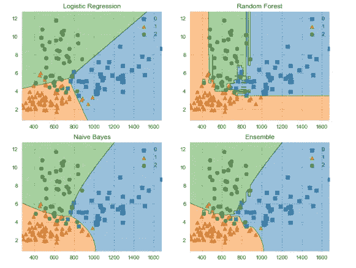
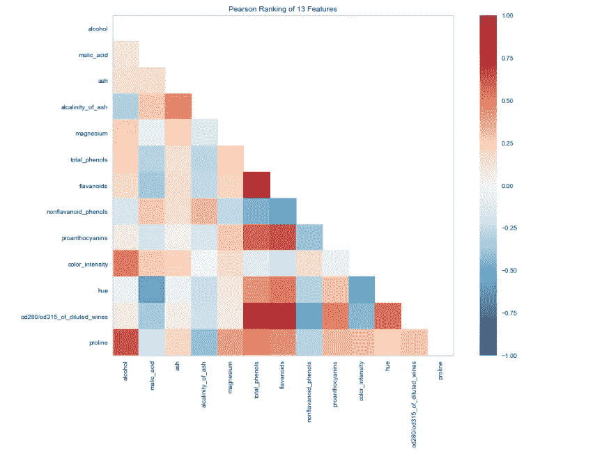
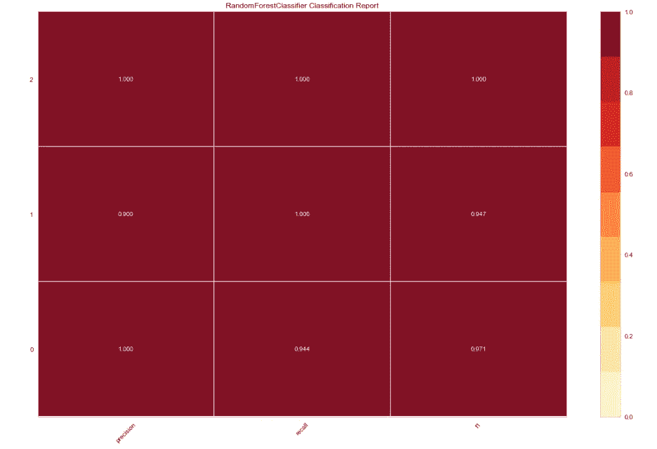
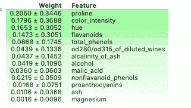
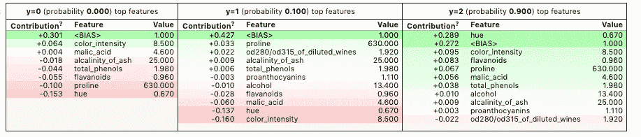
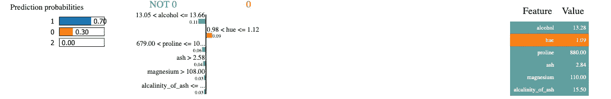

# 用于可解释机器学习的 Python 库

> 原文：<https://towardsdatascience.com/python-libraries-for-interpretable-machine-learning-c476a08ed2c7?source=collection_archive---------8----------------------->

## 4 个用于更好地可视化、解释和诠释模型的库



随着对人工智能偏见的担忧变得越来越突出，企业能够解释他们的模型产生的预测以及模型本身如何工作变得越来越重要。幸运的是，正在开发越来越多的 python 库来尝试解决这个问题。在下面的帖子中，我将简要介绍四个最常用的解释和说明机器学习模型的软件包。

下面的库都是 pip 可安装的，带有很好的文档，并且强调可视化解释。

## [黄砖](https://www.scikit-yb.org/en/latest/quickstart.html)

这个库本质上是 scikit-learn 库的扩展，为机器学习模型提供了一些非常有用和漂亮的可视化。visualiser 对象，核心接口，是 scikit-learn 评估器，所以如果你习惯于使用 scikit-learn，工作流程应该很熟悉。

可以呈现的可视化包括模型选择、特征重要性和模型性能分析。

让我们看几个简单的例子。

该库可以通过 pip 安装。

```
pip install yellowbrick
```

为了说明一些特性，我将使用一个名为[葡萄酒识别](https://scikit-learn.org/stable/modules/generated/sklearn.datasets.load_wine.html#sklearn.datasets.load_wine)集的 scikit-learn 数据集。该数据集有 13 个特征和 3 个目标类，可以直接从 scikit-learn 库中加载。在下面的代码中，我导入数据集并将其转换为数据框。数据可以在分类器中使用，无需任何额外的预处理。

```
import pandas as pd
from sklearn import datasetswine_data = datasets.load_wine()
df_wine = pd.DataFrame(wine_data.data,columns=wine_data.feature_names)
df_wine['target'] = pd.Series(wine_data.target)
```

我还使用 scikit-learn 将数据集进一步分为测试和训练。

```
from sklearn.model_selection import train_test_splitX = df_wine.drop(['target'], axis=1)
y = df_wine['target']X_train, X_test, y_train, y_test = train_test_split(X, y, test_size=0.2)
```

接下来，让我们使用 Yellowbricks visualiser 来查看数据集中特征之间的相关性。

```
from yellowbrick.features import Rank2D
import matplotlib.pyplot as pltvisualizer = Rank2D(algorithm="pearson",  size=(1080, 720))
visualizer.fit_transform(X_train)
visualizer.poof()
```



现在让我们安装一个 RandomForestClassifier 并使用另一个可视化工具评估性能。

```
from yellowbrick.classifier import ClassificationReport
from sklearn.ensemble import RandomForestClassifiermodel =  RandomForestClassifier()
visualizer = ClassificationReport(model, size=(1080, 720))visualizer.fit(X_train, y_train)
visualizer.score(X_test, y_test)
visualizer.poof()
```



## [ELI5](https://eli5.readthedocs.io/en/latest/)

ELI5 是另一个可视化库，用于调试机器学习模型并解释它们产生的预测。它可以与最常见的 python 机器学习库一起工作，包括 scikit-learn、XGBoost 和 Keras。

让我们使用 ELI5 来检查我们上面训练的模型的特征重要性。

```
import eli5eli5.show_weights(model, feature_names = X.columns.tolist())
```



默认情况下，`show_weights`方法使用`gain`来计算权重，但是您可以通过添加`importance_type`参数来指定其他类型。

也可以用`show_prediction`来考察个别预测的原因。

```
from eli5 import show_predictionshow_prediction(model, X_train.iloc[1], feature_names = X.columns.tolist(), 
                show_feature_values=True)
```



## [石灰](https://github.com/marcotcr/lime)

LIME(本地可解释模型不可知解释)是一个用于解释机器学习算法所做预测的包。Lime 支持对来自各种分类器的单个预测的解释，并且内置了对 scikit-learn 的支持。

让我们使用 Lime 来解释我们之前训练的模型的一些预测。

石灰可以通过 pip 安装。

```
pip install lime
```

首先，我们构建解释器。这将训练数据集作为一个数组，模型中使用的功能的名称和目标变量中的类的名称。

```
import lime.lime_tabularexplainer = lime.lime_tabular.LimeTabularExplainer(X_train.values,                                            feature_names=X_train.columns.values.tolist(),                                        class_names=y_train.unique())
```

接下来，我们创建一个 lambda 函数，使用该模型对数据样本进行预测。这是借用这个优秀的，更深入的，关于石灰的[教程](https://www.guru99.com/scikit-learn-tutorial.html)。

```
predict_fn = lambda x: model.predict_proba(x).astype(float)
```

然后，我们使用解释器来解释一个选定例子的预测。结果如下所示。Lime 产生了一个可视化效果，显示了这些特征是如何促成这一特定预测的。

```
exp = explainer.explain_instance(X_test.values[0], predict_fn, num_features=6)
exp.show_in_notebook(show_all=False)
```



## [MLxtend](http://rasbt.github.io/mlxtend/)

这个库包含了许多机器学习的辅助函数。这涵盖了像堆叠和投票分类器，模型评估，特征提取和工程和绘图。除了文档之外，这篇[文章](https://sebastianraschka.com/pdf/software/mlxtend-latest.pdf)也是一个很好的资源，有助于更详细地理解这个包。

让我们使用 MLxtend 来比较投票分类器与其组成分类器的决策边界。

同样，它可以通过 pip 安装。

```
pip install mlxtend
```

我使用的导入如下所示。

```
from mlxtend.plotting import plot_decision_regions
from mlxtend.classifier import EnsembleVoteClassifier
import matplotlib.gridspec as gridspec
import itertoolsfrom sklearn import model_selection
from sklearn.linear_model import LogisticRegression
from sklearn.naive_bayes import GaussianNB
from sklearn.ensemble import RandomForestClassifier
```

下面的可视化一次只能处理两个特征，所以我们将首先创建一个包含特征`proline`和`color_intensity`的数组。我选择这些是因为它们在我们之前使用 ELI5 检查的所有特性中权重最高。

```
X_train_ml = X_train[['proline', 'color_intensity']].values
y_train_ml = y_train.values
```

接下来，我们创建分类器，使它们适合训练数据，并使用 MLxtend 可视化决策边界。输出显示在代码下方。

```
clf1 = LogisticRegression(random_state=1)
clf2 = RandomForestClassifier(random_state=1)
clf3 = GaussianNB()
eclf = EnsembleVoteClassifier(clfs=[clf1, clf2, clf3], weights=[1,1,1])value=1.5
width=0.75gs = gridspec.GridSpec(2,2)fig = plt.figure(figsize=(10,8))labels = ['Logistic Regression', 'Random Forest', 'Naive Bayes', 'Ensemble']for clf, lab, grd in zip([clf1, clf2, clf3, eclf],
                         labels,
                         itertools.product([0, 1], repeat=2)):

    clf.fit(X_train_ml, y_train_ml)
    ax = plt.subplot(gs[grd[0], grd[1]])
    fig = plot_decision_regions(X=X_train_ml, y=y_train_ml, clf=clf)
    plt.title(lab)
```


这绝不是一个用于解释、可视化和解释机器学习模型的详尽的库列表。这篇优秀的[帖子](https://skymind.ai/wiki/python-ai)包含了一长串其他有用的库供您尝试。

感谢阅读！