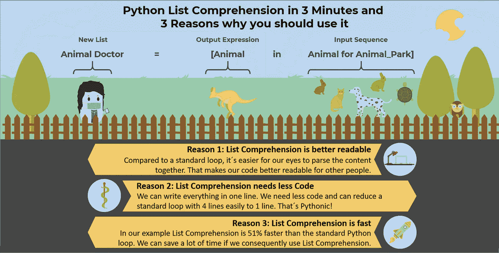
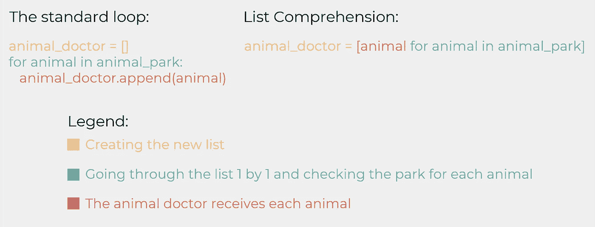
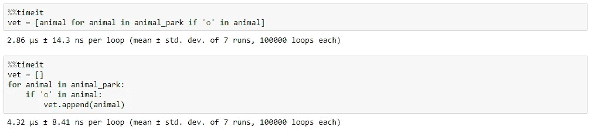

# 3 分钟内理解 Python 列表

> 原文：<https://towardsdatascience.com/python-list-comprehension-in-3-minutes-and-3-reasons-why-you-should-use-it-bf398654caf9?source=collection_archive---------17----------------------->

## 让我们创建自己的动物公园，学习如何使用列表理解



列表理解是一种从现有列表创建新列表的强大方法。如果你开始使用 Python，理解列表可能看起来很复杂，但是你应该尽快熟悉它。您可以从列表中选择特定元素来创建新元素。你可以比较不同的列表，选择你需要的元素。你甚至可以用 Pandas 系列或者 Numpy 数组来理解列表。让我们深入了解一下！

## 什么是列表理解？

如果你有一个现有的列表，你可以选择一些元素来创建一个新的列表。你可以用一个标准的 Python 循环来做到这一点，但是用列表理解，你肯定需要更少的代码。列表可以被迭代，这使得这些对象非常方便。迭代只是一个表达式，表示你可以一个一个地遍历列表。
想象你有一个拥有不同动物的动物园。每只动物每年都需要接受一次动物医生的检查。动物公园是我们的名单。我们可以穿过动物园，一只一只地挑选动物。动物医生是我们的新名单，他接收我们的条目，在这个例子中是动物。

```
#Creating our animal park
animal_park = ['Rabbit','Rabbit','Rabbit','Rabbit',
'Cat','Cat','Cat','Cat','Cat','Cat','Cat',
‘Turtle’,’Turtle','Turtle','Turtle','Turtle','Turtle','Turtle',
'Dog','Dog',
'Kangaroo','Kangaroo','Kangaroo','Kangaroo','Kangaroo','Kangaroo']#Creating a new list for our animal doctor with all animals
animal_doctor = []
for animal in animal_park:
   animal_doctor.append(animal)
```

我们的代码非常简单。首先我们创建了我们的动物公园，然后我们创建了我们的动物医生。下一步，我们将走遍我们的动物公园，把每只动物一只一只地交给我们的动物医生。

现在我们把这个循环重写为列表理解:

```
animal_doctor = [animal for animal in animal_park]
```

您可以看到，我们将行数从 3 减少到了 1。如果我们比较两个版本，我们会发现我们做的完全一样:



Figure 1: Comparison of the standard loop and List Comprehension

## 条件句——今天我们只想检查一下捕食者

在很多情况下，我们都想使用条件语句。在我们的标准循环中，它可能是这样的:

```
animal_doctor = []
for animal in animal_park:
   if animal != 'Dog' and animal != 'Cat':
      animal_doctor.append(animal)
```

如您所见，我们必须为条件语句添加另一行代码。我们的动物医生今天正在检查食肉动物。我们可以对我们的列表理解做同样的事情:

```
animal_doctor = [animal for animal in animal_park if animal != 'Dog' and animal != 'Cat']
```

我们仍然可以在一行中写出整个表达式，这比循环版本可读性更好。

## 如果你还不相信，列表理解是很快的

我们看到列表理解需要更少的代码，可读性更好。让我们比较一下标准循环和列表理解的速度:



Figure 2: Comparison of List Comprehension and a standard loop in terms of speed

如你所见，列表理解比标准循环快 51%。如果你可以使用列表理解从另一个列表中创建一个新列表，那么就一直使用它。没有理由使用较慢的标准循环。

## 结论

我们看到，如果基本概念清楚，列表理解很容易使用。它是从其他列表创建新列表的强大工具，如果您想从一个或多个现有列表创建新列表，应该总是使用它:它比标准循环可读性更好，需要的代码更少，速度更快。

[如果您喜欢中级和高级数据科学，并且还没有注册，请随时使用我的推荐链接加入社区。](https://medium.com/@droste.benedikt/membership)