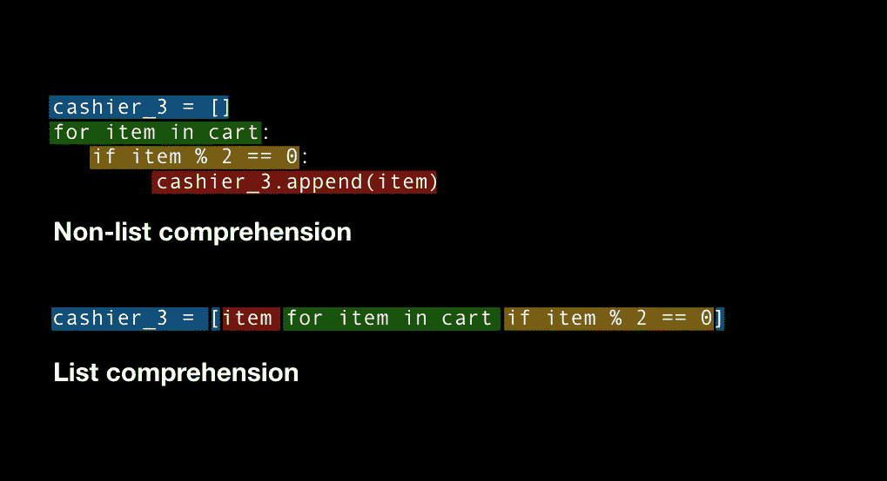

# 5 分钟内理解 Python 列表

> 原文：<https://towardsdatascience.com/python-list-comprehensions-in-5-minutes-40a68cbe4561?source=collection_archive---------3----------------------->

## 对这些棘手的 Pythonic 命令行程序的可视化介绍

```
Just show me the code! Quick link: [**Jupyter Notebook on GitHub**](https://github.com/mrdbourke/python-list-comprehensions-tutorial/blob/master/python-list-comprehensions-in-5-minutes.ipynb)
```

你为什么想要理解 Python 列表？

为了节省代码行。

可能有更多的原因，但根据我的经验，这是唯一的原因——如果你有更好的原因，请留下评论，我会更新文章。

你可以用几行额外的代码完成完全相同的事情。但是浏览任何 Python 栈溢出问题，你很可能会发现有人在问*Python 版本*或*Python 单行程序*。

列表理解是用 iterables(列表)实现 Pythonic 式一行程序的一种方式。

单行定义:

*   **List** =可以迭代的 Python 对象(iterable)。
*   **迭代过** =逐个经历某事。

一个很好的例子是在收银台清空你的购物车，你把每样东西一件一件拿出来放在柜台上，你的购物车可以被认为是可重复的。

我们将用这个例子来看一些代码。我们在一家数学商店购物，所以我们买的都是数字。

```
# Create a list of numbers (our shopping cart)
cart = [3, 4, 12, 17, 19, 21, 23, 26, 30]# Pass items to the cashier
cashier = []
for item in cart:
    cashier.append(item)
print(cashier)# The output is the same as the cart
Output: [3, 4, 12, 17, 19, 21, 23, 26, 30]
```

这里发生了什么？

1.  我们在`cart`中创建了一个项目列表
2.  我们创建了一个空的`cashier`列表(`cashier`还没有我们的任何项目)
3.  我们使用 for 循环来迭代我们的`cart`中的每个`item`
4.  对于每个`item`，我们用`.append()`将其添加到收银台列表中
5.  然后我们用`print()`检查`cashier`有哪些项目

我们怎样才能做同样的事情呢？

```
# Pass items to second cashier but with a list comprehension
cashier_2 = [item for item in cart]
print(cashier_2)# The output is the same as cashier (and the same as cart)
Output: [3, 4, 12, 17, 19, 21, 23, 26, 30]
```

这里发生了什么？

与上面完全相同的步骤，只是以不同的方式编写。我们来对比一下。


A non-list comprehension and list comprehension comparison of the same code.

1.  `cashier`是用蓝色创建的。在左边，它是在自己的行上创建的。在右边，它是在其他事物被创造的同时被创造的。
2.  `cart`正在被绿色迭代。`item`创建为 for 循环运行。这一步与从购物车中一次取出一个`item`并将其交给收银员是一样的。
3.  `cashier`随着每个`item`更新为红色。唯一的区别在左边，需要一个`.append()`语句。右边的列表理解否定了对`.append()`语句的需要

我们用 1 行代码而不是 3 行代码完成了相同的步骤。这可能看起来不多，但是假设你有一个 1000 行的 Python 项目。你可以将你的项目从 1000 行减少到 300 行。这种减少不会总是发生，但它是如何用*python 一行程序*完成相同任务的一个例子。

# 你还能用 Python 列表理解做什么？

现在你已经有了一点直觉，让我们再看几个例子。

只处理偶数。我们该如何处理这件事？

通过使用一个**条件**。

*   **条件** =另一种说法，真则做某事，假则停止。

```
# Make a new cart
cart = [5, 7, 9, 10, 12, 15, 19, 20, 22]# Only give cashier_3 even numbers
cashier_3 = []
for item in cart:
    if item % 2 == 0:
        cashier_3.append(item)
print(cashier_3)# Thanks to the conditional the output is only the even numbers
Output: [10, 12, 20, 22]
```

用列表理解怎么样？

```
cashier_3 = [item for item in cart if item % 2 == 0]
print(cashier_3)# The output is the same as above
Output: [10, 12, 20, 22]
```

这里发生了什么事？



Example of a non-list comprehension and a list comprehension with a conditional.

这类似于上面的例子，除了黄色的条件。

1.  `cashier_3`以蓝色创建。
2.  `cart`正在被绿色迭代。`item`在 for 循环运行时被创建。
3.  当每个`item`被传递到`cashier_3`时，它被检查是否与黄色的条件匹配。
4.  只要满足黄色条件，每个`item`都会以红色更新`cashier_3`。

## 100 多岁

`cashier_4`只接受 100 以上的奇数。你怎么能这样做？

```
# Reminder of what cart looks like
cart = [5, 7, 9, 10, 12, 15, 19, 20, 22]# Non-list comprehension for cashier_4
cashier_4 = []
for item in cart:
    item += 100 # add 100 to each item to bring them over 100
    if item % 2 == 1: # check to see if they're odd or not
        cashier_4.append(item)
print(cashier_4)# The output is all odd numbers over 100
Output: [105, 107, 109, 115, 119]
```

现在用列表理解。

```
# List comprehension for cashier_4
cashier_4 = [item+100 for item in cart if item % 2 == 1]
print(cashier_4)# The output is all odd numbers over 100 (same as above)
Output: [105, 107, 109, 115, 119]
```

# 下一步是什么？

本教程仅仅触及了 Python 列表理解的皮毛。一旦您开始掌握它们，您将开始意识到它们对于编写简洁而强大的 Pythonic 代码是多么有价值。

如果你想了解更多，我建议查看 DataCamp 上的 [Python 列表理解教程。](https://www.datacamp.com/community/tutorials/python-list-comprehension)

本文中的所有代码都可以在 GitHub 上找到，本文的视频版本可以在 YouTube 上找到。

对下一篇文章有建议？请随意留下回复或通过 [Twitter](http://bit.ly/mrdbourketwitter) 、 [LinkedIn](http://bit.ly/mrdbourkelinkedin) 、 [Email](mailto:daniel@mrdbourke.com) 联系。