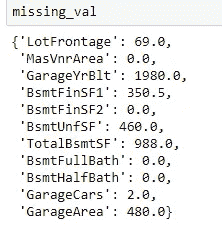
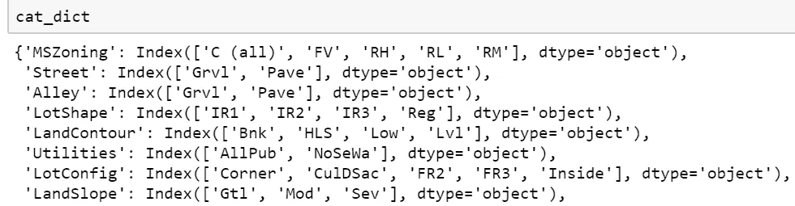
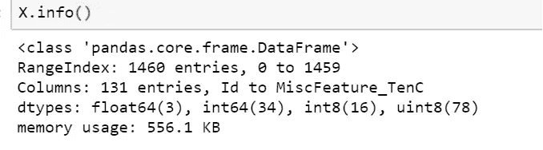

# Python 模块，方便初学者进行数据预处理

> 原文：<https://towardsdatascience.com/python-module-for-easy-data-pre-processing-for-beginners-40f0f6b407a8?source=collection_archive---------21----------------------->


Photo by [Mika Baumeister](https://unsplash.com/@mbaumi?utm_source=medium&utm_medium=referral) on [Unsplash](https://unsplash.com?utm_source=medium&utm_medium=referral)

结构化数据中的特征可以有多种形式，包括连续、分类、日期时间等。通常，为了构建预测模型，我们会查看特征选择或特征工程，以收集更多见解或将更多相关数据输入到模型中。然而，在数据具有大量特征的情况下，特征工程会变得非常快。需要快速处理这些数据，并创建一个初始模型来更好地理解您的数据集或手头的问题。在任何特征工程之前创建模型有以下好处:

1.  了解所有特性的相对特性和重要性
2.  大致了解哪些模型可行，哪些不可行
3.  提供帮助特征工程/特征选择的洞察力

[fast . ai 的程序员机器学习简介](https://www.fast.ai/)使用了这种方法，并实现了杰瑞米·霍华德所说的“机器学习驱动的 EDA”。探索性数据分析是根据模型告诉你的内容进行的，而不是领域知识或预先确定的问题假设。

在这里，我用自己编写的 python 模块给出了一个简单的数据预处理实现。

该模块可以在 https://github.com/Benlau93/easy_processing 的 GitHub 中找到

您可以下载该模块并将其放在与笔记本相同的目录中，然后使用

```
import easy_processing as ep
```

为了测试这个模块，我将在 kaggle 竞赛的两个数据集上使用它。一个是回归问题，另一个是分类任务。两者都使用来自 [sklearn.ensemble](https://scikit-learn.org/stable/modules/classes.html#module-sklearn.ensemble) 库中的 RandomForest 模型。

首先，房价:高级回归技术数据集。

导入库和数据集

```
import numpy as np
import pandas as pddf = pd.read_csv("train.csv",low_memory=False)
X = df.drop(["SalePrice"],axis = 1)
y=df["SalePrice"]
```

我们从处理数据中缺失的值开始。`proc_miss`将连续变量中的 NaN 替换为相应特征列中非缺失值的中值

```
X, missing_val = ep.proc_miss(X)
```

返回的 missing_val 是一个字典，其中包含缺失值的列作为键，中值作为值被替换



为了处理分类变量，`proc_cat`将用户以列表形式给出的分类列转换成 pandas 分类对象。在没有给定`cat_cols`的情况下，具有“对象”数据类型的列被转换。`max_cardi`是将被转换为虚拟变量的特征的最大基数。基数只是指每个分类特征中的类的数量。

```
X, cat_dict = ep.proc_cat(X,max_cardi=5)
```

返回的 cat_dict 是一个字典，其中分类列作为键，Series.cat.categories 作为值



只需两行代码，您的数据就可以输入到模型中了。要检查是否所有要素都是数字格式，



训练模型，

```
from sklearn.ensemble import RandomForestRegressor
m = RandomForestRegressor(n_jobs=-1)
m.fit(X,y)
m.score(X,y)
```

获得的分数是 0.9711 (R2)

我们现在可以在我们的测试数据集上测试它，获得一个初始预测，提交给 kaggle 并获得一个初始分数。

```
df_test = pd.read_csv("test.csv",low_memory=False)
X_test, missing_val = ep.proc_miss(df_test,missing_val)
X_test, cat_dict = ep.proc_cat(X_test,cat_dict=cat_dict,max_cardi=5)
y_pred = m.predict(X_test)
```

对于测试/验证集，`proc_miss`需要一个 missing_val 参数，以便它替换测试集每一列中的相同中值。如果在不在训练集中的测试集的列中发现缺失值，将更新 missing_val 变量。同样的逻辑也适用于`proc_cat`，这里需要 cat_dict 作为参数，以确保编码的一致性。

y_pred 现在可以导出为 csv 格式，提交给 kaggle。该数据集的得分为 0.15296，在排行榜中排名前 68%。现在，您可以查看相对特性重要性、超参数调整和特性工程，以进一步提高您的分数。

第二个数据集我将使用[保诚人寿保险评估](https://www.kaggle.com/c/prudential-life-insurance-assessment)

库和数据的加载

```
import numpy as np
import pandas as pd
import easy_processing as epdf = pd.read_csv("insurance_train.csv",low_memory=False)
X = df.drop(["Response"],axis = 1)
y=df["Response"]
```

经历与之前完全相同的步骤，但是使用 [RandomForestClassifier](https://scikit-learn.org/stable/modules/generated/sklearn.ensemble.RandomForestClassifier.html) 而不是 [RandomForestRegressor](https://scikit-learn.org/stable/modules/generated/sklearn.ensemble.RandomForestRegressor.html)

```
X, missing_val = ep.proc_miss(X)
X, cat_dict = ep.proc_cat(X,max_cardi=5)from sklearn.ensemble import RandomForestClassifier
m = RandomForestClassifier(n_jobs=-1)
m.fit(X,y)
m.score(X,y)
```

这里得到的分数是 0.98939054

处理测试集，

```
df_test = pd.read_csv("insurance_test.csv",low_memory=False)
X_test, missing_val = ep.proc_miss(df_test,missing_val)
X_test, cat_dict = ep.proc_cat(X_test,cat_dict=cat_dict,max_cardi=5)
y_pred = m.predict(X_test)
```

将 y_pred 提交给 kaggle 后，我在公开评分中获得了 0.50516 的分数，在私人排行榜中获得了 0.51187 的分数。远远不够好，但这是一个开始。

声明:fastai 对此有一个类似的、更优化、更高效的库。我的实现是一个简洁的版本，可以帮助初学者浏览整个代码并理解每个实现。所有文档也可以在 GitHub([https://github.com/Benlau93/easy_processing](https://github.com/Benlau93/easy_processing))中找到。

感谢阅读。