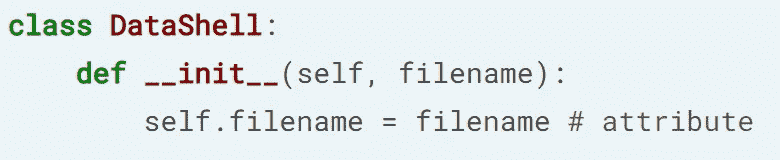
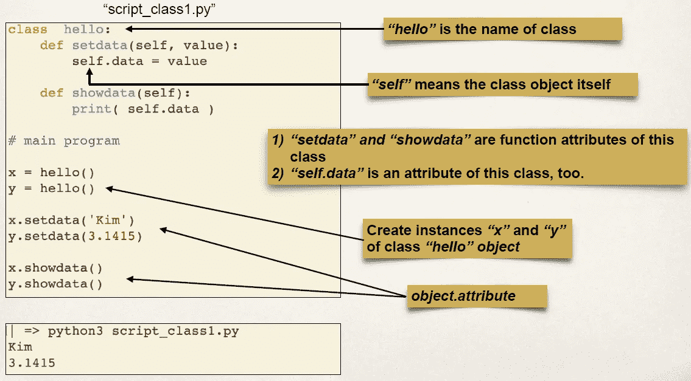
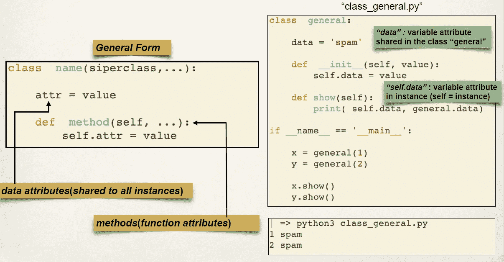
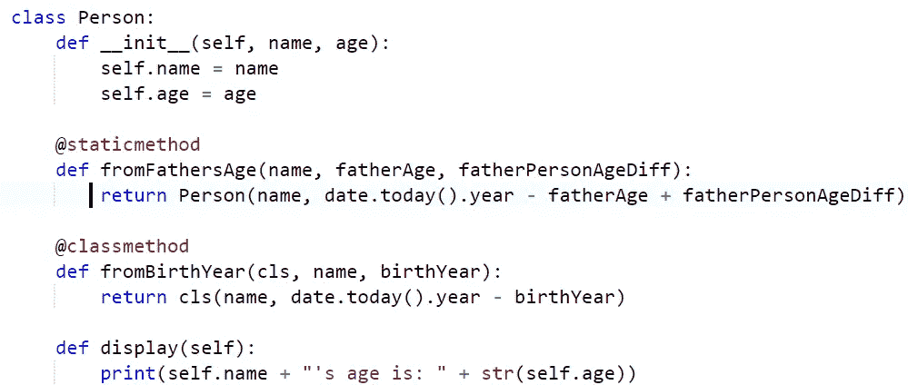
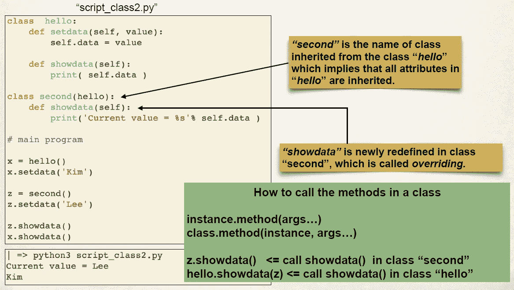
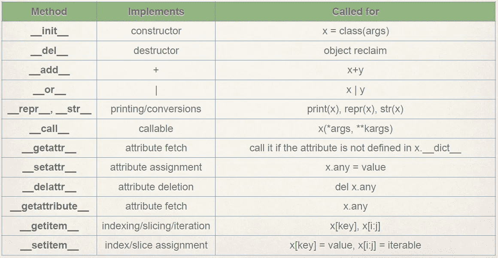
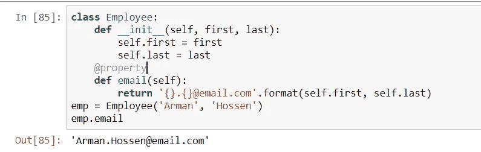

# Python 中的面向对象编程——科里·斯查费和 DataCamp

> 原文：<https://towardsdatascience.com/python-oop-corey-schafer-datacamp-be6b0b3cafc6?source=collection_archive---------12----------------------->

***面向对象编程(OOP)*** 是一种基于***【Object】***的编程范式，是一种将编程语言中包含变量的东西定义为“字段/属性”，功能为“方法”的方式。*OOP**允许程序员创建自己的拥有方法和属性的对象。OOP 允许用户创建他们自己的可重复和有组织的对象。*

*在本文中，我试图总结我对 python 中 OOP 的看法。我要感谢[何塞·马西亚尔·波尔蒂利亚](https://medium.com/u/703ff67f629f?source=post_page-----be6b0b3cafc6--------------------------------)、[数据营团队](https://medium.com/u/e18542fdcc02?source=post_page-----be6b0b3cafc6--------------------------------)和[科里·谢弗](https://www.youtube.com/playlist?list=PL-osiE80TeTsqhIuOqKhwlXsIBIdSeYtc)他们精彩的描述性教程。这对我帮助很大。我会尽快为此添加一个 GitHub 库。*

# ***为什么上课？***

*类是具有方法和变量的可重用代码块。准确地说，类是对象的模板。类允许我们对数据和函数进行逻辑分组，这种方式易于重用，如果需要的话也易于构建。在这里，数据和函数被称为属性和方法。在下图中，定义了一个没有传递任何属性的类数据外壳。`**pass**`什么都不做，只是一个*占位符*。*

**

*Defining a class **Datashell** without passing any attributes*

# ***属性的初始化器或构造器***

**

*Class **Datashell** with Initializer/Constructor **__init__** of it.*

*`**self**`表示对象本身的实例。大多数面向对象语言将其作为隐藏参数传递给方法。任何东西都可以代替`**self**`，但是为了让其他人更容易理解，我们应该用`**self**`。要打印一个方法，我们需要在最后使用圆括号`**()**`。如果我们跳过`**()**`，那么它只打印方法而不是*返回值*。类、方法和实例通过下图被清晰地描述。*

*`**<blockquote>**`*

**

*Class **hello** with methods **setdata** and **showdata** and instances **x** and **y***

# ***类变量***

*在 OOP 中，类级别的变量被称为类变量，而对象级别的变量被称为实例变量。下图描述了类变量的一般形式和示例。这里*‘spam’*被定义为类变量 ***数据*** ，它在后面的几个*方法* ***中被用作实例变量。****

**

***data** as Class variable*

*如果我们通过调用类来改变类变量，那么所有地方的值都会改变，而如果我们通过实例来改变变量，那么只有那个值会改变。假设如果我们将*数据*的值更改为“*非垃圾信息*，那么包括数据在内的所有实例值都将被更改，但是如果我们在任何*方法*中更改实例变量，那么它将只在那个*方法*中。*

# *类方法和静态方法*

***常规方法**自动将实例作为第一个参数传递，我们称之为`**self.**` **类方法**自动将类作为第一个参数传递，我们称之为`**cls**` **。静态方法**不自动传递任何东西，它们不传递实例或类，它们的行为就像一个常规函数，它们与类有一些逻辑联系。以上所有例子中提到的方法都是常规方法。但是对于类方法和静态方法，我们需要在应用之前提到它[ `**@classmethod / @staticmethod**` ]。*

```
*@classmethod
def set_raise(cls,amount):
    cls.raise = amount*
```

**

***Static method** and **class method***

# *继承(创建子类)*

*继承允许我们从父类继承属性和方法。这是重用和降低复杂性的能力。我们可以创建子类并获得父类的所有功能，然后我们可以覆盖或添加全新的功能，而不会以任何方式影响父类。下面的例子清楚地描述了继承。*

**

***Inheritance** in OOP*

*现在，如果我们想从另一个类中复制任何属性，并在其上添加更多的属性，那么我们可以通过以下方式来完成。我们可以在应该避免使用`**self**`的地方使用`**super()**` ，或者我们可以直接调用提到`**self**` **的类。***

```
*class hi(hello):
    def __init__(self, name, age):
        **super().__init__(data)** *or *     "**hello.__init__(self, data)"***
```

# *特殊(魔法/邓德)方法*

*特殊的方法允许我们模拟 python 中的一些内置行为。通过定义我们自己的特殊方法，我们将能够改变一些内置的行为和操作。特殊方法总是被`**__method__**`包围。很多人称它们为双下划线 *Dunder* **。**下面是一些常见的特殊方法:*

*`**__init__(self)**` **:** 当我们创建我们的对象时隐式调用，它设置所有属性。*

*`**__repr__(self)**` :对象的明确表示，应该用于调试和日志记录*

*`**__str__(self)**` :对象的可读表示，旨在向最终用户显示。*

*`**__add__(self)**` :添加对象。*

*`**__len__(self)**` :生成物体的长度。*

**

*Some special **methods***

# *属性装饰器(Getter、Setter 和 Deleters)*

*Property decorator 允许我们定义一个方法，但是我们可以像访问属性一样访问它。在下面的例子中，name 是一个方法，但是我们可以像调用属性一样调用它。*

**

*Using **Property** to call a **method** just like an **attribute***

*我对 python 中 OOP 的了解到此为止。我已经尽力在我的限度内详细描述了。如果您能对此提出意见或批评，我们将不胜感激。我不是 CS 出身，但我每天都在学习。如果你喜欢这篇文章，那么你可以看看我的另一篇关于**Markdown Cells——Jupyter 笔记本的文章。***

*[](/markdown-cells-jupyter-notebook-d3bea8416671) [## 降价单元格— Jupyter 笔记本

### 我不知道如何开始。这将是我第一个与编程相关的故事。今天我将努力缩小…

towardsdatascience.com](/markdown-cells-jupyter-notebook-d3bea8416671) 

# **参考链接:**

1.  [https://camp . data camp . com/courses/object-oriented-programming-in-python/getting-ready-for-object-oriented-programming？ex=1](https://campus.datacamp.com/courses/object-oriented-programming-in-python/getting-ready-for-object-oriented-programming?ex=1)
2.  [https://www.youtube.com/playlist?list = PL-osie 80 tetshiuoqkhwlxsibidseytc](https://www.youtube.com/playlist?list=PL-osiE80TeTsqhIuOqKhwlXsIBIdSeYtc)
3.  [https://www.udemy.com/course/complete-python-bootcamp/](https://www.udemy.com/course/complete-python-bootcamp/)*