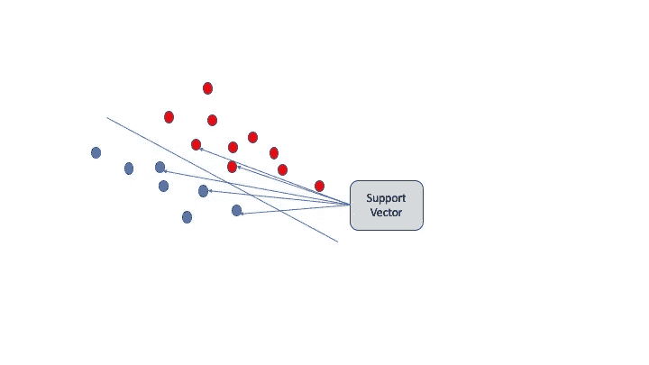

# Python、甲骨文 ADWC 和机器学习

> 原文：<https://towardsdatascience.com/python-oracle-adwc-and-machine-learning-27ace24abe22?source=collection_archive---------13----------------------->

## 如何使用开源工具分析通过 **Oracle 自治数据仓库云(ADWC)** 管理的数据。

# 介绍

**Oracle 自治数据库**是 Oracle 数据库技术的最新发展。帮助管理和分析云中大量数据的技术更容易、更快、更强大。

**ADWC** 是这种技术在数据仓库和高级数据分析方面的专业化。这是一种简化上传、转换数据并使业务用户和非数据库管理员能够访问高级分析工具的技术。可以说，这些工具是数据科学家包袱的一部分。

然而，在这篇文章中，我不仅想深入探讨 ADWC 可用的工具，而且想从一个稍微不同的角度来看问题。

我将试着用一个例子来解释:想象自己是一名数据科学家，知道来自开源世界的所有机器学习和数据探索工具。为了给出具体的例子，工具例如:

*   计算机编程语言
*   Jupyter 笔记本
*   NumPy，Pandas，Scikit-学习模块
*   最终 Keras(如果我们想使用深度学习模型的话)

但是需要分析的数据存储在 ADWC 中。此外，我们的“英雄”了解一些 SQL 知识(好吧，也许相反才奇怪)，并且理解一些处理应该用 SQL 来完成。

我们的“探索者”**如何做到两全其美？**

# 自上而下。

我不想把这篇文章变成一系列命令，在没有清楚理解的情况下执行。所以，即使我想提供所有的细节来简化那些想尝试追随我的人的生活，我也想自上而下地进行。我将首先尝试将事情解释到更高的抽象层次，没有太多的细节，但我保证稍后会添加实现的细节。

# 云。

不管你喜不喜欢，云会一直存在。目前，ADWC 是一项公共云 Oracle 服务。

为了避免在我的 MacBook 和云数据中心之间传输太多数据，我想到了一个主意，就是将所有的分析工具放在 Oracle 云基础设施(OCI)中的一个虚拟机上。对我来说，一个拥有 Ubuntu Linux 和八个 OCPU(核心)的虚拟机就足够了，只在需要的时候才打开。

在这台虚拟机上，我安装了:

*   Anaconda Python 发行版
*   一些 Python 模块:Pandas、cx_Oracle、scikit-learn
*   用于配置笔记本扩展的服务器(nbextensions)
*   Oracle 客户端库(即时客户端 18.3)
*   libaio1 系统库

我还在 Anaconda 中创建了一个专用的虚拟 Python 环境(用命令“source activate <environment name="">”激活)。</environment>

只要有一点经验和耐心，并在两个小时内进行一些“谷歌搜索”,环境就可以运行了。

ADWC 是从 Oracle 云基础架构控制台创建的。你只需要指定数据库名称，磁盘空间(TB)和 OCPU 的数量。大约十分钟后，它就启动并运行了；甚至连喝咖啡休息的时间都没有。

# 如何连接到甲骨文 ADWC 公司

没什么复杂的。最后，ADWC 始终是一个 Oracle 数据库，从客户端的连接是以 Oracle 工作人员熟知的方式完成的。唯一真正相关的细节是，连接必须受到保护并且**被加密**。

因此，要连接任何客户端，我们必须:

*   从我们 ADWC 的控制台下载钱包，其中包含识别您正在连接的用户的详细信息，以及验证服务器和加密所需的证书
*   将钱包放在我们的虚拟机上的一个目录中，并对其进行解包(它以 zip 文件的形式提供)
*   拥有有权读取数据的数据库用户的有效凭据(用户和密码)

也许在这个阶段，我们的数据科学家会得到一位更有“Oracle 经验”的同事的帮助，或者有一点耐心阅读文档。

# 如何与数据库交互

真正的乐趣从这里开始！

将要使用的工具是 **Jupyter Notebook** ，其中我启用了“ExecuteTime”扩展来记录每条指令的执行时间。

在笔记本中，我们可以通过两种方式与数据库交互(执行查询等):

*   使用 Python 指令
*   直接使用 SQL 语句

美妙之处在于，我们可以根据自己的喜好、便利和当下的灵感，将这两种模式结合起来。今天，SQL 让我厌烦透了，我更喜欢“Pythonic 式的生活方式？”，好吧！不，用 Python 太慢或者太复杂，我用 SQL 来做。

让我们试着更具体一些。让我们从 Python 开始(今天…)

```
import cx_Oracle
import pandas as pd
import config as cfgconnection = cx_Oracle.connect(cfg.USER, cfg.PWD, ‘db4ml_medium’)data = pd.read_sql("select * from my_credit_scoring", con=connection)
```

让我们暂时把细节放在一边。相反，我们应该赞美简单:仅用两行代码，我们就将 MY_CREDIT_SCORING 表中包含的所有数据加载到一个 **Pandas DataFrame** 中。

在这一点上，我们敬爱的数据科学家并没有从快乐中退缩。他已经猜到了如何完成这个故事:如果他愿意，他可以按照几十本书名为“机器学习和 Python”的书教给他的方式进行，并且必须只(嗯…只？)做一些预处理、数据清理、缩放、模型建立、超参数优化、模型训练、与过拟合作斗争等。但是，它不需要 Oracle 的任何其他知识。

我们现在给它一个特定的(否则时间延长的目的是什么？):从 ADWC 数据库加载 100，000 条记录(每条记录有 86 列)只需要 6 秒多一点的时间。这也是因为 Oracle 云基础架构中的高速低延迟网络。

与数据库交互的另一种方式是使用笔记本的"**神奇扩展 sql** :

```
%load_ext sql%sql $cfg.CONN_STRING%%sql 
select count(*) from my_credit_scoring
```

这里是另一个细节:第二条指令连接到数据库，我将连接字符串(CONN_STRING)存储在 config.py 文件中，不想在笔记本中显式显示用户名和密码。

然而，在这里，我想添加另一个细节(该系列的“我们希望结合两个世界的优点”):我们的数据科学家可以通过 Oracle 管理模式中一个名为 CREDIT_SCORING_100K 的表“只读”访问原始数据。但是因为他假设(您永远不知道)他想在数据库中对这些数据进行一些处理(清理等)，所以他在自己的私有方案中创建了一个表的“私有”副本。

这个在 SQL 中完成的操作只用一条指令就完成了！

```
%%sql 
create table my_credit_scoring as select * from admin.credit_scoring_100k
```

只需要 7 秒钟。在这里，我们看到了来自 ADWC 的简单和力量。(也许我选择一个 1000 万条记录的表会做得更好，会更有效果，但我手头没有，抱歉)。Oracle ADWC 基于 Oracle 数据库云服务器技术，这样的指令充分利用了数据库云服务器的存储技术和 SQL 卸载。

合理的好奇心:但是如果我想**结合“% sql”和 Python** ？

好吧，这里有个例子:

```
%%sql 
result << select credit_score_bin, count(*) num from my_credit_scoring group by credit_score_bindata_bin = result.DataFrame()
```

并且结果再次存储在熊猫数据帧中。

# 但是模型是用来做什么的呢？

对……除了技术，我们不能忽视商业目的。在被选择来说明该方法的例子中，数据被用来创建“信用评分”模型。一种分类模型，银行或金融公司可以使用它来决定一个人是否是一个好的债务人，从而决定是否接受他的抵押和/或贷款申请。

具有这种数据的这种类型的模型是通过“监督学习”方法和二元分类器(CREDIT_SCORE_BIN 列只包含两个不同的值)实现的:我们训练模型，然后我们给模型一系列与信贷申请人相关的数据，模型说:“信用良好，继续”或“其他信用，不继续”。

# 复杂性。

在这里，我们的 ADWC 对此无能为力，或者只能提供帮助。现实世界中的数据是“脏的”，有“漏洞”，必须清理和完成。从这个角度来看，我示例中的表格是真实的。

(100，000 个样本中)有数千个数据缺失。并且许多 scikit-learn ML 算法在这样的条件下不能很好地工作。

有许多特征(85)并且许多是分类的，因此必须被编码(翻译成数字)。对于数字特征，需要将它们都放在相同的范围内。

一旦数据被加载到 Pandas 数据框架中，我们就可以使用“仅 Python”方法，处理时间是可以接受的。

在这里，最起码的智慧会激励你不要立即尝试一个非常复杂的模型，包括所有的特征，而是从几十个开始，建立一个比较更复杂和清晰的模型的基准。

第一个基准是显而易见的:模型的准确性必须**高于 50%，**否则我们应该换工作(好吧，一个通过扔硬币来决定是否批准贷款的官员其实不是最好的，但在没有其他工具的情况下……)。

# 模特就像孩子，他们学习我们教的东西。

哦对了，总有“算法偏差”的问题。我们必须尽可能确定，不要通过“只”插入某些类型的数据来限制预测。

例如，如果只有很少一部分样本显示“良好信用”，我们的“指令算法”将知道它必须总是回答:“其他信用”。

在 SQL 中，检查很容易:

```
%%sql 
select credit_score_bin, count(*) from my_credit_scoring group by credit_score_bin
```

*   良好信用:25%
*   其他信贷:75%

这可不错，显然那些发放贷款的人倾向于“谨慎”，过去经历了太多的“苦难”。

# 机器学习模型

即使我们将主题“如何与 Oracle ADWC 交互”留在这里，一些人也会有兴趣阅读如何用 scikit-learn 制作二进制分类器。

我想澄清一点:实现“一个模型”的几行 Python 代码并不是这个问题的严肃答案。模型具有需要优化的“超参数”,这需要工作(网格优化),从计算的角度来看，这是非常繁重的工作。

但是我们可以满足好奇心(当然，我试图快速建立一个模型),而无需花费太多时间进行超参数优化。但只是警告说，没有这项活动，我们只是朝着解决问题迈出了第一步。

另一个问题:用哪个算法？

回答:“**T**[这里没有免费的午餐](https://en.wikipedia.org/wiki/No_free_lunch_theorem) ”(维基百科)。

也就是说，我选择使用**支持向量机(SVM)** 。这是一种通常在具有许多特征的问题中给出良好结果的算法。

什么是 SVM？或多或少，在每个分类器中，我们可以说我们试图找到两个集合之间的分离面。如果我们能找到一个超平面，这个问题可以说是“线性可分的”。

SVM 中的支持向量是最接近决策面的数据点。

SVM 将利润最大化。此外，使用“非线性”核(如 rbf ),我们可以将数据点投影到一个更高维的空间中，其中两个集合(良好信用，其他信用)是线性可分的(这或多或少是这个想法)。



A quick explanation of SVM

使用 scikit-learn，Python 中的代码是:

```
from sklearn.svm import SVCsvm = SVC(kernel = 'rbf', C = 1.0, gamma=0.1, random_state = 0)svm.fit(X_train_std, y_train)print('Train accuracy:', svm.score(X_train_std, y_train))
Train accuracy: 0.88145print('Test accuracy:', svm.score(X_test_std, y_test))
Test accuracy: 0.8978987
```

一些注意事项:

*   我选择使用非线性核( **rbf)** ，假设问题不是线性可分的；实际上，这个选择被这样一个事实所证实，使用线性核，我的精度大约低了三个点；
*   RBF 代表[径向基函数](https://en.wikipedia.org/wiki/Radial_basis_function_kernel)
*   将超参数(C，γ)的两个值设置为起点；优化在这里适用；
*   该模型有轻微的过度拟合(90%对 88%)。

我们得到的精确度？好的 **88%** 。考虑到这是快速的第一步，还不错。另一个比较连续的更复杂模型的基准。

如果我们想改进模型，首先要做的重要工作是对超参数进行优化。通过 GridSearchCV 类，可以使用 VM 的所有处理能力(因此是 8 个内核，甚至不是很多)来完成

代码示例:

```
gsc = GridSearchCV(
        estimator=SVR(kernel='rbf'),
        param_grid={
            'C': [0.1, 1, 100, 1000],
            'epsilon': [0.0001, 0.0005, 0.001, 0.005, 0.01, 0.05, 0.1, 0.5, 1, 5, 10],
            'gamma': [0.0001, 0.001, 0.005, 0.1, 1, 3, 5]
        },
        cv=5, scoring='neg_mean_squared_error', verbose=0, n_jobs=-1)
```

# 一些反思

数据在 ADWC，受到保护，我们没有在我们的虚拟机上下载任何数据。从安全的角度来看。

在给定的前提下(熟知开源的数据科学家)，我主要使用 **scikit-learn** 和 pandas 实现了这个目的，但也使用了 ADWC 提供的一些优势明显的工具(例如:Oracle 表的副本)。

我们所做的事情很容易理解，即使对 Oracle 没有太多经验的人也能理解。我希望如此。

模型开发使用 ADWC 吗？在某种程度上。我在 VM 上用 Python 和笔记本做了很多，在 ADWC 上做的比较少。但这是预见到的(还是那句话，看前提)。

处理时间？

在这里，演讲可能会很长。即使训练集中有 80000 个样本(80:20 分割), SVM 的训练也只需要大约 10 分钟。如果我们看看 CPU 的使用情况，我们会发现实际上只有一个线程在工作。因此，即使有这么多可用的内核，我们也无法使用它们。但是，如前所述，计算复杂的部分是超参数的优化，这种操作需要 N 次模型训练(对于超参数的每次选择)。利用所有可用的内核，该部分可以轻松实现并行化。正是在这一点上，拥有如此多的内核可以带来改变(而云有助于实现这一点)。

根据我们的选择，我们没有使用 ADWC 中包含的算法实现，作为 Oracle 高级分析选项的一部分。使用这个实现，我们可以利用 ADWC 的并行引擎。

Python？好吧。好消息是，在甲骨文开放世界(2018 年 10 月)上，甲骨文宣布推出一个 Python 接口，可以使用所有甲骨文高级分析算法。这款名为 **OML4Py** 的接口即将面世。在以后的文章中，我将对此进行研究。

# 一些细节

查找如何安装 cx_Oracle 的信息的最佳位置:

 [## cx_Oracle 7 安装- cx_Oracle 7.1.1 文档

### 编辑描述

cx-oracle.readthedocs.io](https://cx-oracle.readthedocs.io/en/latest/installation.html#quick-start-cx-oracle-installation) 

# 所有的细节。

像往常一样，时间不够做我想做的事情。这篇文章变得比我想要的还要长。

因此，我决定用另一篇文章来讲述所有的细节。回头见。