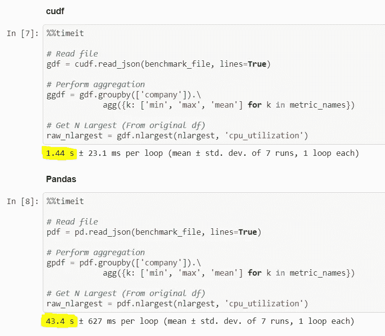
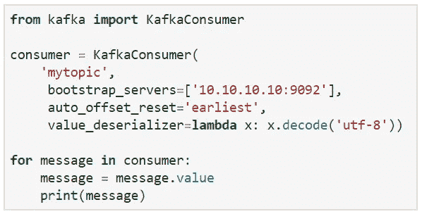
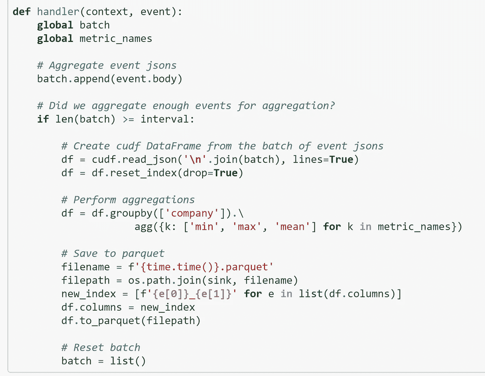

# 极致性能的 Python 熊猫

> 原文：<https://towardsdatascience.com/python-pandas-at-extreme-performance-912912b1047c?source=collection_archive---------3----------------------->

今天，我们都在简单的 [Python](https://www.python.org/) 工具(熊猫、 [Scikit-learn](https://scikit-learn.org/) )、可伸缩的 [Spark](https://spark.apache.org/) 和 [Hadoop](https://hadoop.apache.org/) 以及可操作的 [Kubernetes](https://kubernetes.io/) 之间做出选择。我们最终会用光它们。我们保留了独立的面向 Python 的数据科学家团队、Java 和 Scala Spark 大师，以及一大批开发人员来管理这些孤立的解决方案。

数据科学家与熊猫一起探索。然后，其他数据工程师团队对相同的逻辑进行重新编码，并使其大规模工作，或使用 Spark 使其与直播流一起工作。当数据科学家需要改变逻辑或为他/她的模型使用不同的数据集时，我们会一次又一次地经历这种迭代。

除了处理业务逻辑，我们还在 Hadoop 或 Kubernetes 甚至两者上构建集群，并通过整个 CI/CD 管道手动管理它们。底线是我们都在努力工作，但没有足够的业务影响来证明这一点…

如果您可以用 Python 编写简单的代码，并且运行起来比使用 Spark 更快，不需要任何重新编码，并且没有 devops 开销来解决部署、扩展和监控问题，会怎么样？

我猜你可能会“说我是个梦想家”😊。我是一个梦想家，但我不是唯一的一个！这篇文章将证明今天使用 NVIDIA 孵化的免费开源数据科学加速平台 [Nuclio](https://nuclio.io/) 和 [RAPIDS](https://rapids.ai/) 是可能的。

在过去的几个月里，我们一直在与 NVIDIA 密切合作，将 [RAPIDS](https://rapids.ai/) 与 [Nuclio](https://nuclio.io/) 开源无服务器项目和 [Iguazio 的](https://www.iguazio.com/) PaaS 进行整合。现在，使用相同的 Python 代码，以最小的操作开销(由于采用了无服务器方法),就有可能实现大幅加快的数据处理速度和可伸缩性。

我将展示处理由基于 Json 的日志组成的实时数据的同样广泛流行的用例。我将对它执行一些分析任务，并将聚合结果转储为压缩的 Parquet 格式，以便进一步查询或 ML 训练。我们将研究批处理和实时流(是的，用简单的 Python 代码实现实时流)。但首先，概述一下。

# 是什么让 Python 速度慢，不可伸缩？

当在小数据集上处理 pandas 时，性能还不错，但前提是整个数据集适合内存，并且处理是在 pandas 和 NumPy 层下用优化的 C 代码完成的。处理大量数据涉及密集的 IO 操作、数据转换、数据复制等。很慢。由于臭名昭著的 GIL，Python 本质上是同步的，在处理复杂任务时效率非常低，异步 Python 更好，但会使开发复杂化，并且不能解决固有的锁定问题。

像 [Spark](https://spark.apache.org/) 这样的框架具有异步引擎( [Akka](https://akka.io/) )和内存优化数据布局的优势。它们可以将工作分配给不同机器上的多个工作人员，从而带来更好的性能和可伸缩性，使它们成为事实上的标准。

# 急流城给 Python 注入了类固醇

我们在 NVIDIA 的朋友想出了一个绝妙的主意:保留 pandas、Scikit-learn 和 [XGBoost](https://xgboost.readthedocs.io/en/latest/) 等流行框架的面向 Python 的 API，但在 GPU 中以高性能 C 代码处理数据。他们采用了内存友好的 Apache [Arrow 数据格式](https://arrow.apache.org/)来加速数据传输和操作。

[RAPIDS](https://developer.nvidia.com/rapids) 支持数据 IO (cuIO)、数据分析( [cuDF](https://github.com/rapidsai/cudf) )和机器学习( [cuML](https://github.com/rapidsai/cuml) )。这些不同的组件共享相同的内存结构，因此数据接收、分析和 ML 的管道基本上无需将数据来回复制到 CPU 中即可运行。

下面的例子演示了一个使用 pandas API 读取大型 Json 文件(1.2GB)和聚合数据的用例。我们可以看到，同样的代码在使用 RAPIDS ( [查看完整笔记本在这里](https://github.com/nuclio/rapids/blob/master/demo/benchmark_cudf_vs_pd.ipynb))的情况下运行**快了 30 倍**，如果我们比较没有 IO 的计算，它快了 100 倍，这意味着我们有空间对数据进行更复杂的计算。

我们使用了单个 GPU ( [英伟达 T4](https://www.nvidia.com/en-us/data-center/tesla-t4/) )，这使服务器的价格增加了约 30%，性能提高了 30 倍。我们刚刚使用几行 Python 代码每秒处理了 1gb 的复杂数据。哇！！

如果我们将这段代码打包到一个无服务器函数中，它可以在每次用户请求时运行，或者定期运行，并读取或写入动态连接的数据卷。

# Python 可以实现实时流吗？

你试过用 Python 做实时流吗？嗯，我们做到了。以下代码摘自 Kafka 最佳实践指南，它从一个流中读取数据并做最少的处理。

问题是 Python 本质上是同步的，当涉及到实时或复杂的数据操作时，效率相当低。这个程序每秒只生成几千条消息，而且没有做任何有趣的工作。当我们添加上一个示例中使用的 json 和 pandas 处理时([参见笔记本](https://github.com/nuclio/rapids/blob/master/demo/python-agg.ipynb))，性能进一步下降，我们每秒只处理 18MB。那么，我们需要回到 Spark 进行流处理吗？

不等等。

最快的无服务器框架是 Nuclio，它现在也是 kube flow(Kubernetes ML 框架)的一部分。Nuclio 运行由实时和高度并发的执行引擎包装的各种代码语言。Nuclio 并行运行多个代码实例(使用高效的微线程)，无需额外编码。Nuclio 处理流程内和跨多个流程/容器的自动伸缩([参见这篇技术报道博客](https://theburningmonk.com/2019/04/comparing-nuclio-and-aws-lambda/))。

Nuclio 以高度优化的二进制代码处理流处理和数据访问，并通过简单的函数处理程序调用函数。支持 14 种不同的触发或流协议(包括 HTTP、 [Kafka](https://kafka.apache.org/) 、 [Kinesis](https://aws.amazon.com/kinesis/data-analytics/) 、Cron、batch)，通过配置指定(无需更改代码)，支持快速访问外部数据卷。单个 Nuclio 功能每秒可以处理数十万条消息，吞吐量超过千兆字节/秒。

然而最重要的是，Nuclio 是当今唯一一个具有优化的 NVIDIA GPU 支持的无服务器框架。它知道如何确保 GPU 利用率最大化，并在需要时扩展到更多进程和 GPU。

我这里明显有偏见，但也全是真的。

# 无需开发运维，流处理速度提高 30 倍

让我们结合 Nuclio + RAPIDS 来获得 GPU 加速的、基于 Python 的流处理的完整体验。下面的代码与批处理情况没有太大的不同，我们只是将它放在一个函数处理程序中，并将传入的消息收集到更大的批处理中，以减少 GPU 调用([参见完整的笔记本](https://github.com/nuclio/rapids/blob/master/demo/nuclio-cudf-agg.ipynb))。

我们可以用 HTTP 或 Kafka 触发器测试相同的功能:在这两种情况下，Nuclio 都将处理并行性，并将流分区分配给多个工作器，而无需我们进行任何额外的开发工作。我们测试的设置使用的是一个 3 节点 Kafka 集群和一个**单** Nuclio 函数进程(在一个带有一个 [NVIDIA T4](https://www.nvidia.com/en-us/data-center/tesla-t4/) 的双插槽英特尔服务器上)。我们设法处理 638 MB/s，这比编写自己的 Python Kafka 客户端快 30 倍，并且它可以自动扩展以处理任何数量的流量。而且它使用了小而琐碎的 Python 代码！！

在我们的测试中，我们注意到 GPU 没有得到充分利用，这意味着我们可以对数据进行更复杂的计算(连接、ML 预测、转换等)。)同时保持相同的性能水平。

好吧，我们用更少的开发获得了更快的性能，但是无服务器解决方案的真正好处在于它们是“无服务器的”([阅读我的文章](/serverless-can-it-simplify-data-science-projects-8821369bf3bd))。拿同样的代码，在笔记本([见这个笔记本例子](https://github.com/nuclio/rapids/blob/master/demo/nuclio-cudf-agg.ipynb))或你最喜欢的 IDE 中开发，在一个命令中它被构建、打包并运送到一个 [Kubernetes](https://kubernetes.io/) 集群，该集群具有完整的工具(日志、监控、自动扩展……)和安全加固。

Nuclio 与 Kubeflow 管道整合。构建多级数据或 ML 管道，只需最少的努力即可实现数据科学工作流程的自动化，收集执行和工件元数据，从而轻松重现实验结果。

在这里下载 Nuclio [并将其部署在您的 Kubernetes 上(](https://nuclio.io/)[参见 RAPIDS 示例](https://github.com/nuclio/rapids))。

查看这篇相关文章[Hadoop 之后的生活:让数据科学为您的企业服务](/life-after-hadoop-getting-data-science-to-work-for-your-business-c9ab6605733f)