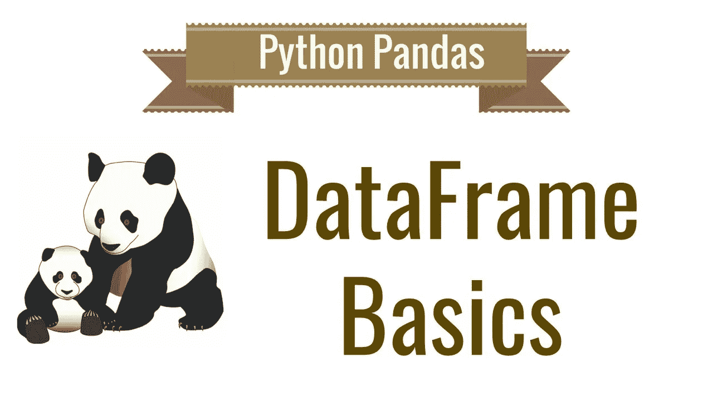
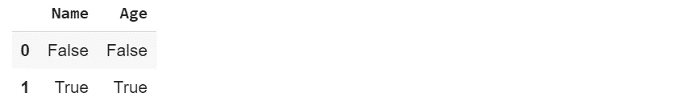

# Python 熊猫数据框基础知识

> 原文：<https://towardsdatascience.com/python-pandas-data-frame-basics-b5cfbcd8c039?source=collection_archive---------4----------------------->

## 让我们从零开始了解熊猫数据框架的基本知识。



Credits: [codebasics](https://www.youtube.com/channel/UCh9nVJoWXmFb7sLApWGcLPQ)

在开始之前，让我先给你介绍一下 [Pandas](https://pandas.pydata.org/) ，Pandas 是一个 python 库，它为 Python 编程语言的数据分析工具提供了高性能、易于使用的数据结构，如系列、数据框和面板。此外，Pandas 数据帧由主要组件组成，即数据、行和列。要使用熊猫的库和它的数据结构，你所要做的就是安装并导入它。要更好地理解和安装指南，请参阅 Pandas 库的文档。这里的完整代码可以在我的 [GitHub](https://github.com/Tanu-N-Prabhu/Python/blob/master/Pandas/Pandas_DataFrame.ipynb) 页面上找到。

# 可应用于熊猫数据框的基本操作如下所示。

1.  创建数据框。
2.  对行和列执行操作。
3.  数据选择、添加、删除。
4.  处理缺失数据。
5.  重命名数据帧的列或索引。

## **1。创建数据框。**

Pandas 数据框可通过从外部现有存储(如数据库、SQL 或 CSV 文件)加载数据来创建。但是熊猫数据帧也可以从列表、字典等创建。创建熊猫数据框的方法之一如下所示:

```
# import the pandas library
import pandas as pd
# Dictionary of key pair values called data
data = {'Name':['Ashika', 'Tanu', 'Ashwin', 'Mohit', 'Sourabh'],
        'Age': [24, 23, 22, 19, 10]}
data**{'Age': [24, 23, 22, 19, 10],  'Name': ['Ashika', 'Tanu', 'Ashwin', 'Mohit', 'Sourabh']}**# Calling the pandas data frame method by passing the dictionary (data) as a parameter
df = pd.DataFrame(data)
df
```


## **2。对行和列执行操作。**

数据帧是一种二维数据结构，数据存储在行和列中。下面我们可以对行和列执行一些操作。

**选择列:**为了选择一个特定的列，我们所能做的就是调用数据框内的列名。

```
# import the pandas library
import pandas as pd
# Dictionary of key pair values called data
data = {'Name':['Ashika', 'Tanu', 'Ashwin', 'Mohit', 'Sourabh'],
        'Age': [24, 23, 22, 19, 10]}
data**{'Age': [24, 23, 22, 19, 10],  'Name': ['Ashika', 'Tanu', 'Ashwin', 'Mohit', 'Sourabh']}**# Calling the pandas data frame method by passing the dictionary (data) as a parameter
df = pd.DataFrame(data)
# Selecting column
df[['Name']]
```


**选择行:** Pandas 数据框提供了一个名为“loc”的方法，用于从数据框中检索行。此外，还可以通过使用“iloc”功能来选择行。

```
# Calling the pandas data frame method by passing the dictionary (data) as a parameter
df = pd.DataFrame(data)
# Selecting a row
row = df.loc[1]
row**Name    Tanu 
Age       23 
Name: 1, dtype: object**
```

要选择一个特定的列，我们所能做的就是调用数据框内的列名。如上所述，要使用“loc”方法，您必须将数据框的索引作为参数传递。loc 方法只接受整数作为参数。所以在上面的例子中，我想访问“Tanu”行，所以我将索引 1 作为参数传递。现在给你们一个快速作业，用“iloc”方法，告诉我结果。

## **3。数据选择、添加、删除。**

您可以在语义上将 DataFrame 视为一个相似索引系列对象的字典。获取、设置和删除列的语法与类似的字典操作相同:

```
# import the pandas library
import pandas as pd
# Dictionary of key pair values called data
data = {'Name':['Ashika', 'Tanu', 'Ashwin', 'Mohit', 'Sourabh'],
        'Age': [24, 23, 22, 19, 10]}# Calling the pandas data frame method by passing the dictionary (data) as a parameter
df = pd.DataFrame(data)
# Selecting the data from the column
df['Age']**0    24 
1    23 
2    22 
3    19 
4    10 
Name: Age, dtype: int64**
```

可以像使用字典一样删除列，只需使用 del 操作。

```
del df[‘Age’]
df
```


可以使用插入功能添加数据。插入功能可用于在列中的特定位置插入:

```
df.insert(1, ‘name’, df[‘Name’])
df
```


## **4。处理缺失数据。**

当我们访问大数据集时，丢失数据会发生很多次。它经常像 NaN(不是数字)一样出现。为了填充那些值，我们可以使用“isnull()”方法。该方法检查数据帧中是否存在空值。

**检查缺失值。**

```
# importing both pandas and numpy libraries
import pandas as pd
import numpy as np# Dictionary of key pair values called data
data ={‘First name’:[‘Tanu’, np.nan],
 ‘Age’: [23, np.nan]}df = pd.DataFrame(data)
df
```


```
# using the isnull() function
df.isnull()
```



如果空值不存在，isnull()返回 false，如果为空值，则返回 true。现在我们已经找到了丢失的值，下一个任务是用 0 填充这些值。这可以如下所示完成:

```
df.fillna(0)
```


## **5。重命名数据帧的列或索引。**

要为数据框的列或索引值赋予不同的值，最好使用。rename()方法。为了更好地理解，我特意更改了列名。

```
# import the pandas library
import pandas as pd
# Dictionary of key pair values called data
data = {‘NAMe’:[‘Ashika’, ‘Tanu’, ‘Ashwin’, ‘Mohit’, ‘Sourabh’],
 ‘AGe’: [24, 23, 22, 19, 10]}# Calling the pandas data frame method by passing the dictionary (data) as a parameter
df = pd.DataFrame(data)
df
```


```
newcols = {
 ‘NAMe’: ‘Name’,
 ‘AGe’: ‘Age’
 }
# Use `rename()` to rename your columns
df.rename(columns=newcols, inplace=True)
df
```


```
# The values of new index
newindex = {
 0: ‘a’,
 1: ‘b’,
 2: ‘c’,
 3: ‘d’,
 4: ‘e’
}
# Rename your index
df.rename(index=newindex)
```


以上是 Python 中熊猫数据框架的非常重要的技术或方法。一些例子是从 GeeksforGeeks 引用的。我用一种简单的方式写了这个，这样每个人都能理解和掌握 Python 中数据框的概念。如果你们对代码有什么疑问，评论区就是你们的了。

谢谢你。