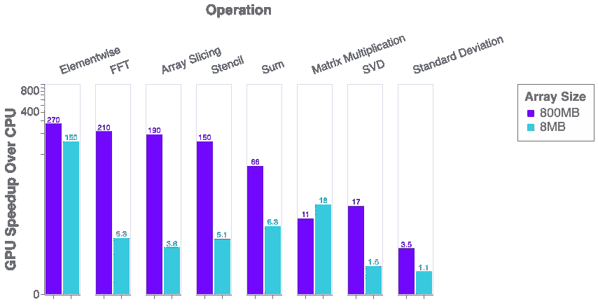
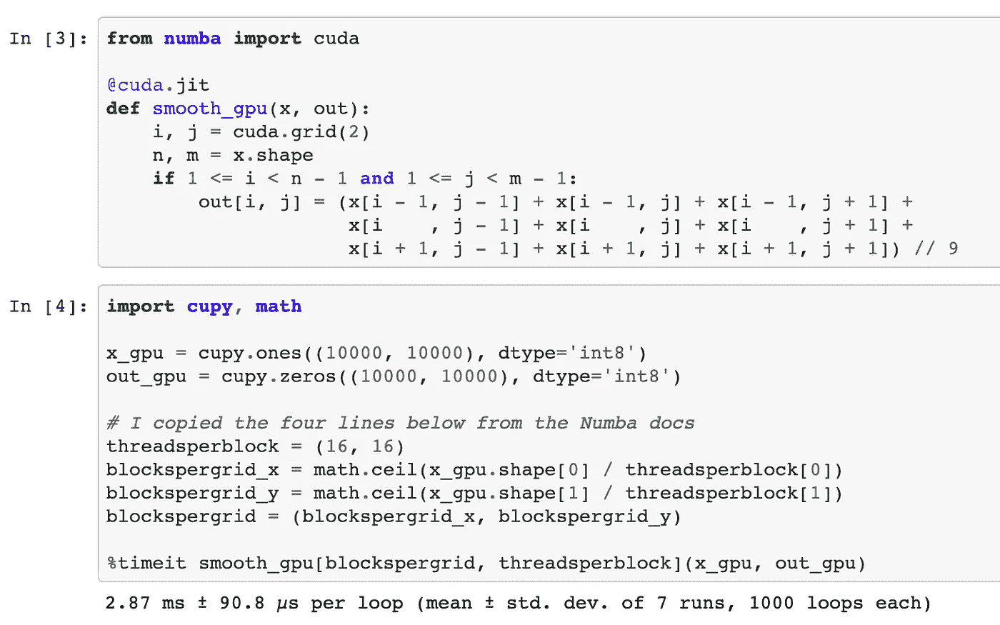
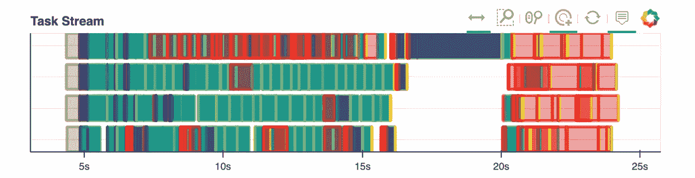
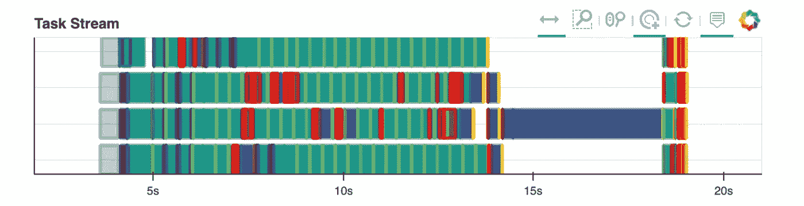

# Python、性能和 GPU

> 原文：<https://towardsdatascience.com/python-performance-and-gpus-1be860ffd58d?source=collection_archive---------0----------------------->

## Python 中使用 GPU 加速器的状态更新

*这篇博文是在最近的* [*PASC 2019*](https://pasc19.pasc-conference.org/) *大会上以谈话形式发表的。* [*演讲的幻灯片在这里*](https://docs.google.com/presentation/d/e/2PACX-1vSajAH6FzgQH4OwOJD5y-t9mjF9tTKEeljguEsfcjavp18pL4LkpABy4lW2uMykIUvP2dC-1AmhCq6l/pub?start=false&loop=false&delayms=60000) *。*

# 行动纲要

我们正在改进 Python 中可扩展 GPU 计算的状态。

这篇文章展示了当前的状态，并描述了未来的工作。它还总结并链接了最近几个月的其他几篇博客文章，这些文章深入到不同的主题，供感兴趣的读者阅读。

概括地说，我们简要地涵盖了以下几个类别:

*   用 CUDA 写的 Python 库比如 CuPy 和 RAPIDS
*   Python-CUDA 编译器，特别是 Numba
*   使用 Dask 扩展这些库
*   与 UCX 的网络通信
*   用康达包装

# GPU 加速的 Python 库的性能

对于 Python 程序员来说，获得 GPU 性能的最简单方法可能就是使用 GPU 加速的 Python 库。这些提供了一组通用的操作，它们被很好地调整和集成在一起。

许多用户知道用于深度学习的库，如 PyTorch 和 TensorFlow，但还有其他几个用于更通用计算的库。这些倾向于复制流行的 Python 项目的 API:

*   GPU 上的 numpy:[CuPy](https://cupy.chainer.org/)
*   GPU 上的 Numpy(再次): [Jax](https://github.com/google/jax)
*   GPU 上的熊猫:[激流 cuDF](https://docs.rapids.ai/api/cudf/nightly/)
*   sci kit-在 GPU 上学习:[急流城累计](https://docs.rapids.ai/api/cuml/nightly/)

这些库构建了流行 Python 库的 GPU 加速变体，如 NumPy、Pandas 和 Scikit-Learn。为了更好地理解相对性能差异 [Peter Entschev](https://github.com/pentschev) 最近整理了一个[基准测试套件](https://github.com/pentschev/pybench)来帮助进行比较。他制作了下图，展示了 GPU 和 CPU 之间的相对加速比:



那里有很多有趣的结果。彼得在他的博客中对此进行了更深入的探讨。

然而，更广泛地说，我们看到了性能的可变性。我们关于 CPU 快慢的心理模型并不一定适用于 GPU。幸运的是，由于一致的 API，熟悉 Python 的用户可以很容易地试验 GPU 加速，而无需学习 CUDA。

# Numba:将 Python 编译成 CUDA

*另见本* [*最近关于 Numba stencils*](https://blog.dask.org/2019/04/09/numba-stencil) *的博文以及附带的* [*GPU 笔记本*](https://gist.github.com/mrocklin/9272bf84a8faffdbbe2cd44b4bc4ce3c)

像 CuPy 和 RAPIDS 这样的 GPU 库中的内置操作，涵盖了最常见的操作。然而，在现实世界的设置中，我们经常会发现需要编写一些自定义代码的混乱情况。在这些情况下，切换到 C/C++/CUDA 可能会很有挑战性，尤其是对于主要是 Python 开发人员的用户。这就是 Numba 的用武之地。

Python 在 CPU 上也有同样的问题。用户通常懒得学习 C/C++来编写快速定制代码。为了解决这个问题，有像 Cython 或 Numba 这样的工具，它们让 Python 程序员无需学习 Python 语言以外的知识就能编写快速的数字代码。

例如，Numba 在 CPU 上将 For 循环风格的代码加速到 500 倍以下，从缓慢的 Python 速度提高到快速的 C/Fortran 速度。

```
**import** **numba**  *# We added these two lines for a 500x speedup*

@numba.jit    *# We added these two lines for a 500x speedup*
**def** sum(x):
    total = 0
    **for** i **in** range(x.shape[0]):
        total += x[i]
    **return** total
```

在不切换 Python 上下文的情况下下降到底层高性能代码的能力是有用的，特别是如果您还不知道 C/C++或者没有为您设置的编译器链的话(目前大多数 Python 用户都是这种情况)。

这种优势在 GPU 上更加明显。虽然许多 Python 程序员懂一点 C 语言，但很少有人懂 CUDA。即使他们这样做了，他们可能也很难设置编译器工具和开发环境。

进入 [numba.cuda.jit](https://numba.pydata.org/numba-doc/dev/cuda/index.html) Numba 的 cuda 后端。Numba.cuda.jit 允许 Python 用户以交互方式创作、编译和运行用 Python 编写的 cuda 代码，而无需离开 Python 会话。这是一个在 Jupyter 笔记本中编写模板计算来平滑 2d 图像的图像:



下面是 Numba CPU/GPU 代码的简化对比，比较编程风格。GPU 代码的速度比单个 CPU 内核快 200 倍。

# CPU — 600 毫秒

```
@numba.jit
**def** _smooth(x):
    out = np.empty_like(x)
    **for** i **in** range(1, x.shape[0] - 1):
        **for** j **in** range(1, x.shape[1] - 1):
            out[i,j] = (x[i-1, j-1] + x[i-1, j+0] + x[i-1, j+1] +
                        x[i+0, j-1] + x[i+0, j+0] + x[i+0, j+1] +
                        x[i+1, j-1] + x[i+1, j+0] + x[i+1, j+1])//9 **return** out
```

或者如果我们使用花哨的 numba.stencil 装饰器…

```
@numba.stencil
**def** _smooth(x):
    **return** (x[-1, -1] + x[-1, 0] + x[-1, 1] +
            x[ 0, -1] + x[ 0, 0] + x[ 0, 1] +
            x[ 1, -1] + x[ 1, 0] + x[ 1, 1]) // 9
```

# GPU — 3 毫秒

```
@numba.cuda.jit
**def** smooth_gpu(x, out):
    i, j = cuda.grid(2)
    n, m = x.shape
    **if** 1 <= i < n - 1 **and** 1 <= j < m - 1:
        out[i, j] = (x[i-1, j-1] + x[i-1, j] + x[i-1, j+1] +
                     x[i  , j-1] + x[i  , j] + x[i  , j+1] +
                     x[i+1, j-1] + x[i+1, j] + x[i+1, j+1]) // 9
```

Numba.cuda.jit 已经存在很长时间了。它容易接近，成熟，玩起来很有趣。如果你有一台装有 GPU 的机器，并有一些好奇心，那么我们强烈建议你尝试一下。

```
conda install numba
# or
pip install numba>>> **import** **numba.cuda**
```

# 使用 Dask 扩展

正如在以前的博客文章( [1](https://blog.dask.org/2019/01/03/dask-array-gpus-first-steps) 、 [2](https://blog.dask.org/2019/01/13/dask-cudf-first-steps) 、 [3](https://blog.dask.org/2019/03/04/building-gpu-groupbys) 、 [4](https://blog.dask.org/2019/03/18/dask-nep18) )中提到的，我们已经一般化了 [Dask](https://dask.org/) ，不仅可以操作 Numpy 数组和 Pandas 数据帧，还可以操作任何看起来足够像 Numpy(像 [CuPy](https://cupy.chainer.org/) 或 [Sparse](https://sparse.pydata.org/en/latest/) 或 [Jax](https://github.com/google/jax) )或足够像 Pandas(像【T16 这很有效。下面是一个简短的视频，展示了 Dask array 并行计算一个 SVD，并展示了当我们用 CuPy 替换 Numpy 库时会发生什么。

我们看到计算速度提高了大约 10 倍。最重要的是，我们能够在 CPU 实现和 GPU 实现之间切换，只需一行代码，但继续使用 Dask Array 的复杂算法，就像它的并行 SVD 实现一样。

我们也看到了交流的相对放缓。总的来说，今天几乎所有重要的 Dask + GPU 工作都变得与通信密切相关。我们的计算速度已经够快了，交流的相对重要性已经显著增加。

# 与 UCX 的通信

*见* [*本谈*](https://developer.download.nvidia.com/video/gputechconf/gtc/2019/video/S9679/s9679-ucx-python-a-flexible-communication-library-for-python-applications.mp4) *经* [*或查看*](https://github.com/Akshay-Venkatesh)

*也参见* [*这篇最近关于 UCX 和达斯克*](https://blog.dask.org/2019/06/09/ucx-dgx) 的博文

我们一直在用[的 UCX-Py](https://github.com/rapidsai/ucx-py) 将[的 OpenUCX](https://openucx.org/) 库集成到 Python 中。UCX 提供对 TCP、InfiniBand、共享内存和 NVLink 等传输的统一访问。UCX-Py 是第一次可以从 Python 语言轻松访问这些传输协议。

一起使用 UCX 和 Dask，我们能够获得显著的加速。以下是添加 UCX 前后的 SVD 计算轨迹:

**在 UCX 之前**:



**UCX 之后**:



尽管如此，这里仍有大量工作要做(上面链接的博客文章在未来工作部分有几个条目)。

人们可以用高度实验性的康达套装试用 UCX 和 UCX-Py:

```
conda create -n ucx -c conda-forge -c jakirkham/label/ucx cudatoolkit=9.2 ucx-proc=*=gpu ucx ucx-py python=3.7
```

我们希望这项工作也将影响使用 Infiniband 的 HPC 系统上的非 GPU 用户，甚至是消费类硬件上的用户，因为他们可以轻松访问共享内存通信。

# 包装

在之前的[博文](https://matthewrocklin.com/blog/work/2018/12/17/gpu-python-challenges)中，我们讨论了安装与系统上安装的 CUDA 驱动程序不匹配的 CUDA 支持包的错误版本所带来的挑战。幸运的是，由于 Anaconda 的 Stan Seibert 和 Michael Sarahan 最近的工作，Conda 4.7 现在有了一个特殊的元包，它被设置为已安装驱动程序的版本。这将使用户在未来安装正确的软件包变得更加容易。

Conda 4.7 刚刚发布，除了`cuda`元包之外，还有许多新特性。你可以在这里了解更多信息[。](https://www.anaconda.com/how-we-made-conda-faster-4-7/)

```
conda update conda
```

今天在包装领域仍有大量的工作要做。每个构建 conda 包的人都用自己的方式，导致头痛和异构。这很大程度上是因为没有集中的基础设施来构建和测试支持 CUDA 的包，就像我们在 [Conda Forge](https://conda-forge.org/) 所做的那样。幸运的是，Conda Forge 社区正在与 Anaconda 和 NVIDIA 合作来帮助解决这个问题，尽管这可能需要一些时间。

# 摘要

这篇文章更新了 Python 中 GPU 计算背后的一些努力。它也为将来的阅读提供了各种各样的链接。如果您想了解更多信息，我们在下面列出了它们:

*   [幻灯片](https://docs.google.com/presentation/d/e/2PACX-1vSajAH6FzgQH4OwOJD5y-t9mjF9tTKEeljguEsfcjavp18pL4LkpABy4lW2uMykIUvP2dC-1AmhCq6l/pub?start=false&loop=false&delayms=60000)
*   GPU 上的 numpy:[CuPy](https://cupy.chainer.org/)
*   GPU 上的 Numpy(再次): [Jax](https://github.com/google/jax)
*   GPU 上的熊猫:[激流 cuDF](https://docs.rapids.ai/api/cudf/nightly/)
*   sci kit-在 GPU 上学习: [RAPIDS cuML](https://docs.rapids.ai/api/cuml/nightly/)
*   [基准测试套件](https://github.com/pentschev/pybench)
*   [数字 CUDA JIT 笔记本](https://gist.github.com/mrocklin/9272bf84a8faffdbbe2cd44b4bc4ce3c)
*   关于 UCX 的演讲
*   [一篇关于 UCX 和达斯克的博文](https://blog.dask.org/2019/06/09/ucx-dgx)
*   [康达 4.7](https://www.anaconda.com/how-we-made-conda-faster-4-7/)