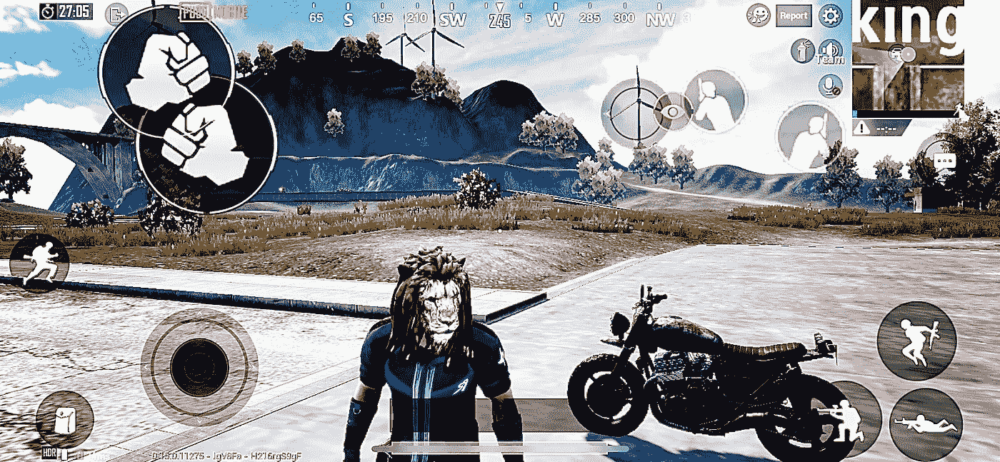
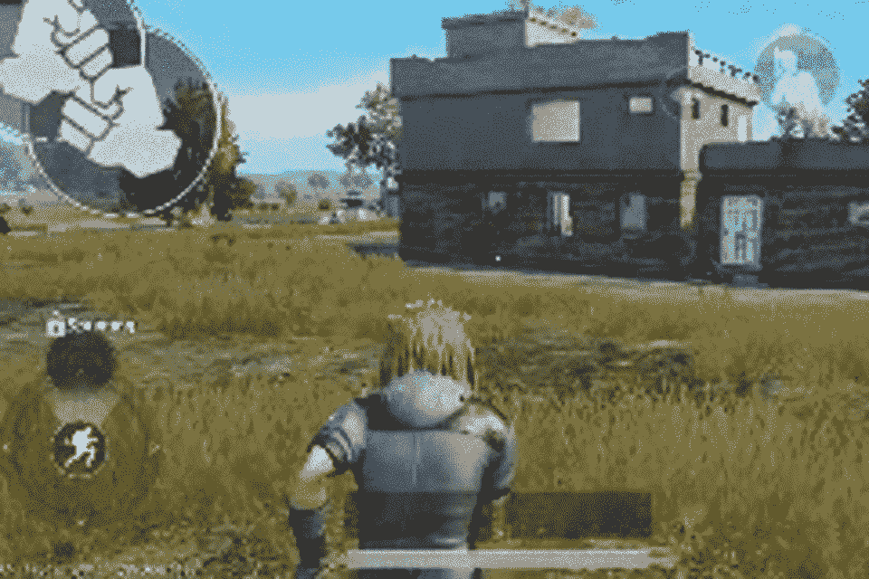
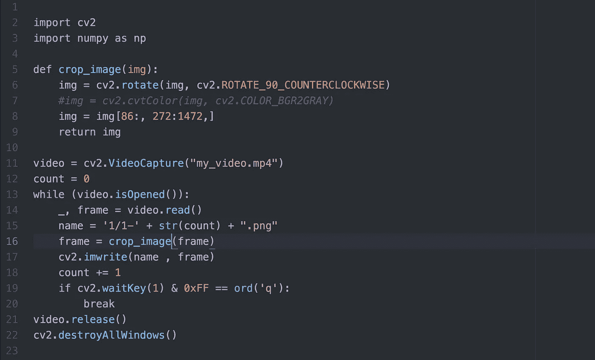
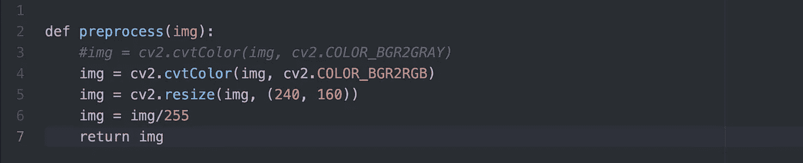
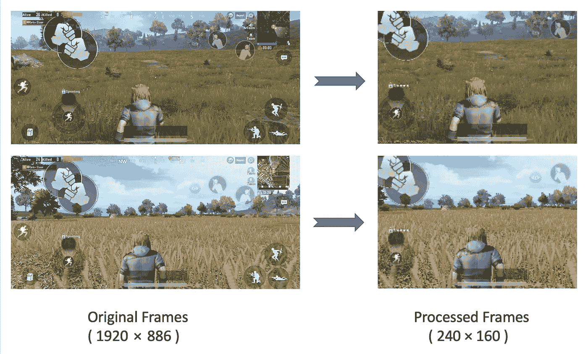
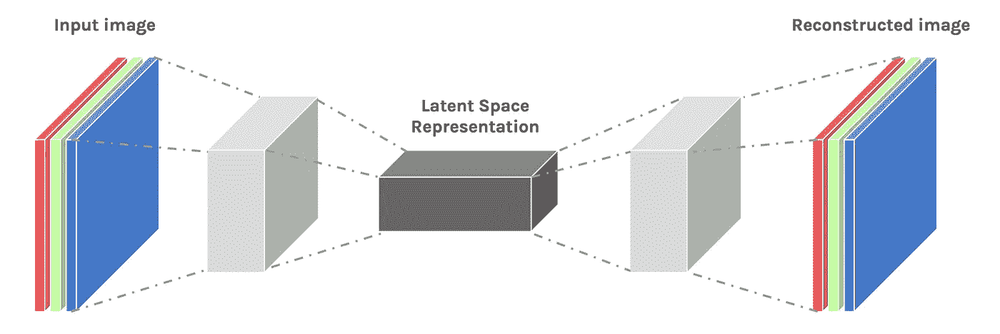
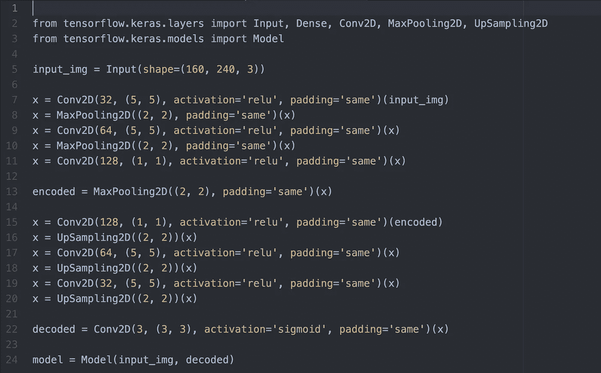
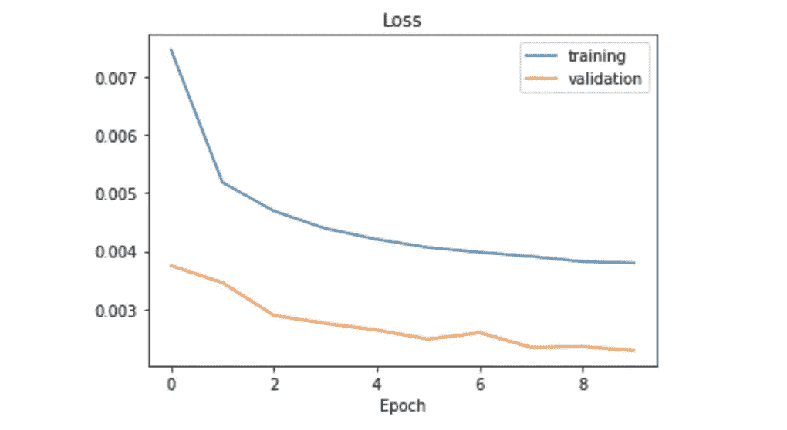
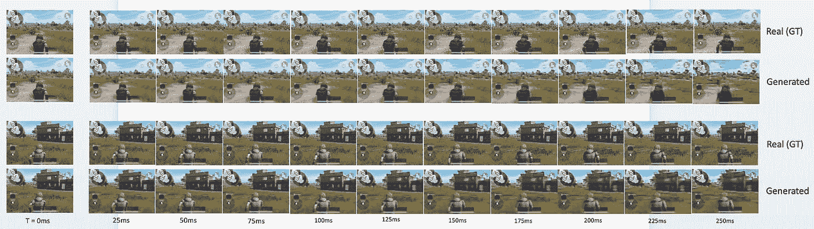

# Python 预测 PUBG 移动

> 原文：<https://towardsdatascience.com/python-predicts-pubg-mobile-6876720b978c?source=collection_archive---------41----------------------->

使用 Python 预测视频数据中未来帧的简单方法



My PUBG character :D

# **简介:**

预测未来是不可能的！(*除非你有* [*时间石*](https://en.wikipedia.org/wiki/Infinity_Gems) *-:)* )。但是预测不远的将来对我们来说并不难。我们在现实生活中经常这样做——在玩游戏或看电影时，人们可以很容易地预测即将发生的事情。我们大脑的这种能力有助于我们提前计划行动和做出决定。(例如，在空中接球，躲避迎面而来的石头……等等)。

我们不能躲避子弹，因为我们不够快。如果我们能把大脑的这种能力给愚蠢的机器，然后造一个[奥创](https://en.wikipedia.org/wiki/Ultron) -:)会怎么样。

问题是——机器真的能做到吗？

答案是肯定的。这个小实验证明了这一点。这也是一个活跃的研究领域——给定一个小视频，你能生成未来的视频吗？这是这个实验产生的数据的一瞥—

> 下面的视频完全是人工的，由深度学习模型生成。



**Artificially Generated Video**

> 如何在我的电脑上完成？

只需几个小时，你就可以在自己的电脑上完成。也不需要 GPU。

如果你是计算机视觉和深度学习的新手，我建议你在进一步阅读之前对以下主题有一个基本的了解—

1.  [打开简历](https://en.wikipedia.org/wiki/OpenCV)
2.  [卷积神经网络](https://en.wikipedia.org/wiki/Convolutional_neural_network)
3.  [自动编码器](https://en.wikipedia.org/wiki/Autoencoder)

现在让我们把整件事分成五个小部分。我们将一个接一个地检查每一部分——

1.  **数据生成**
2.  **数据准备**
3.  **型号**
4.  **结果**
5.  **结论**

# **数据生成:**

生成数据非常简单。在我的移动设备上的屏幕录制器的帮助下，我能够捕捉到一个 15 分钟长的视频(事实证明这对我们的小实验来说是足够的数据)。在这个视频中，我将我的 PUBG 角色设置为冲刺模式，让它在随机方向上连续跑大约 15 分钟。

一旦我有了这个视频，我需要做的就是按固定的时间间隔将它切割成多个帧。使用`OpenCV toolkit`，这种视频到帧的转换非常简单快捷。这些帧相距大约`~25ms`，这使得它成为`**40fps (frames per second)**`。两个连续帧之间的差异很小，但相当明显。

> 这是一个简单的 python 代码，它将视频转换为帧。(*不同机器上的帧速率可能有所不同，因为它取决于您系统的处理速度。)



Video to Frame conversion

# **数据准备:**

之前的练习给了我们大约 30k 帧。在这 30k 帧中，前 29k 帧作为训练数据，其余 1k 帧作为验证数据。

这些相框的尺寸真的很大`800 * 1200`。为了使模型简单快速，在将每一帧传递给模型进行训练之前，将每一帧的大小调整为`240 * 160`。

> 下面是一个用于数据预处理的简单 python 函数。



Preprocessing function

> 这是处理过的图像的样子——
> 
> 在 1 之后。裁剪图像，仅保留图像的相关部分。
> 
> 第二年。将图像调整为较小的尺寸(240*160)，因为原始图像非常大。(调整图像大小时，[纵横比](https://en.wikipedia.org/wiki/Aspect_ratio_(image))保持不变)。



Image preprocessing

# **型号:**

1.  **训练数据:**

来自先前练习的预处理帧成对排列，使得每对帧`(frame_x, frame_y)` 具有两个连续的帧——例如，如果`frame_x`出现在视频中的`n’th`位置，那么`frame_y`应该来自`(n+1)’th`位置。

以这种方式，我们为训练数据保留的那些 29k 帧可以构成`29k — 1`这样的训练数据对。类似地，剩余的 1k 验证帧可以构成 1k 验证数据对。

**2。模型架构:**



Encoder — Decoder Architecture

在该实验中使用了简单的 [**编码器-解码器**](https://en.wikipedia.org/wiki/Autoencoder) 模型架构。这里的`encoder`部分模型是一个三层的`2D CNN (convolutional neural network)`和`MaxPooling`层。该模型的`decoder`部分也是`2D CNN with UpSampling layers`或(转置卷积神经网络)。卷积层的核大小保持不变，以便我们在解码后得到相同大小的图像。

> 下面是使用 tensorflow 的 keras api 实现的模型的架构。



Model Architecture

**3。模型训练:**

现在，对于每个训练对，模型将`frame_x`作为输入，并学习猜测`frame_y`(下一个直接帧)。

采用梯度下降算法训练模型，以`mean squared error`为损失函数……

```
**--- Model Parameters ---**
batch_size    : 32
epochs        : 10
optimizer     : 'adam'
learning_rate : 0.001
loss          : 'mse'
```

在仅仅训练`10 epochs`之后，学习的权重被保存用于推断。

```
Training time : approximately 8 hours (on CPU)
Hardware      : Macbook Pro, 16GB, 2.6 GHz, Intel Core i7
```

> 培训和验证损失图



Loss Chart

# **结果:**

为了检查模型在看不见的数据上的性能，从验证集中选取一个随机帧。现在，使用这个单一的帧，我们可以通过将预测的帧一次又一次地传递给模型作为输入来生成任意数量的未来帧。

模型能够从单个输入帧生成前 10-12 个未来帧，具有相当高的精度。在第 15 帧之后，它变得非常嘈杂，因为预测误差在每次新的预测时都会增加。需要注意的一件重要事情是`static parts of the frames (my PUBG control buttons) are intact as model is able to learn what is static and what is changing`这部分也不会模糊。

> 下面是由模型生成的两个示例图像序列，以及顶部的地面真实图像。



Image sequences generated by model

# **结论:**

有趣的是，这个模型能够很容易地用一张图像生成这么多未来的图像。这很简单，因为这个实验是受控的 PUBG 视频中的人只进行一项活动(总是跑步)。因此，模型只需要学习他的运动以及背景如何随时间变化。

预测真实的生活场景并不容易。这也是一个活跃的研究领域。这很难，因为在现实世界中有无限的可能性。多个对象可以同时改变环境。为了对这样的场景建模，我们需要一个更好、更强大的模型架构。还有大量高质量的真实世界数据。

感谢 [Raghav Bali](https://medium.com/u/dff4008c1908?source=post_page-----6876720b978c--------------------------------) 和 [Dipanjan (DJ) Sarkar](https://medium.com/u/6278d12b0682?source=post_page-----6876720b978c--------------------------------) 的点评。

请与我分享您的意见/反馈。