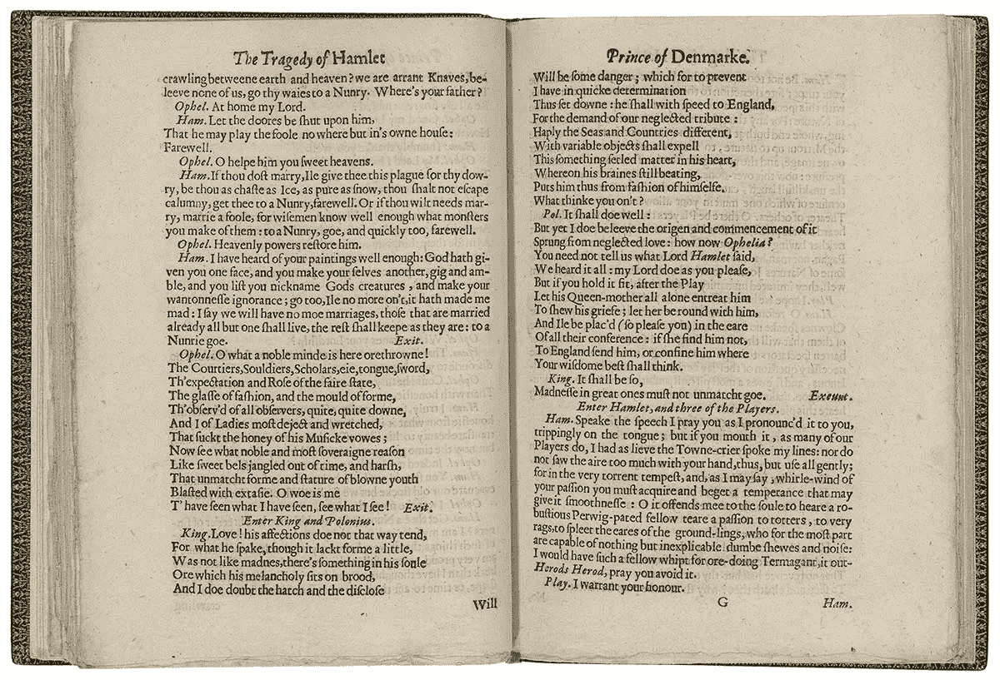

# Python Pro 提示:开始使用 Python defaultdict 和 Counter 代替字典

> 原文：<https://towardsdatascience.com/python-pro-tip-start-using-python-defaultdict-and-counter-in-place-of-dictionary-d1922513f747?source=collection_archive---------7----------------------->

## [蟒蛇短裤](https://towardsdatascience.com/tagged/python-shorts)

## 如何使用 defaultdict 和 Counter 使你的代码简短易读


Photo by [Brooke Lark](https://unsplash.com/@brookelark?utm_source=medium&utm_medium=referral) on [Unsplash](https://unsplash.com?utm_source=medium&utm_medium=referral)

学习一门语言很容易。每当我开始学习一门新的语言时，我会按照下面的顺序专注于几件事情，开始用任何语言编写代码都是轻而易举的事情。

*   运算符和数据类型:+，-，int，float，str
*   条件语句:if，else，case，switch
*   循环:For，while
*   数据结构:列表，数组，字典，散列表
*   定义函数

***但是，学会写语言和用优化的方式写语言是两回事。***

每种语言都有一些独特的成分。

然而， ***一个新的程序员对任何语言总会做一些被迫的过度适应。*** 举例来说，一个刚接触 [python](https://amzn.to/2XPSiiG) 的 Java 程序员，可能会编写这段代码来添加列表中的数字。

```
x=[1,2,3,4,5]sum_x = 0
for i in range(len(x)):
    sum_x+=x[i]
```

虽然 python 程序员会很自然地这样做:

```
sum_x = sum(x)
```

在这一系列名为**‘Python Shorts’**的帖子中，我将解释由 [Python](https://amzn.to/2XPSiiG) 提供的一些简单构造、一些基本技巧以及我在数据科学工作中经常遇到的一些用例。

***这个系列讲的是高效可读的代码。***

# 计数器和默认值—用例



***假设我需要统计一段文本中出现的单词数。*** 也许对于《哈姆雷特》这样的书来说。我怎么能这么做呢？

Python 总是为我们提供多种方法来做同样的事情。但只有一种方式我觉得很优雅。

这是一个使用`dict`对象的 ***幼稚 Python 实现*** 。

```
text = "I need to count the number of word occurrences in a piece of text. How could I do that? Python provides us with multiple ways to do the same thing. But only one way I find beautiful."word_count_dict = {}
for w in text.split(" "):
    if w in word_count_dict:
        word_count_dict[w]+=1
    else:
        word_count_dict[w]=1
```

我们可以使用`***defaultdict***`来减少代码中的行数。

```
from collections import defaultdict
word_count_dict = defaultdict(int)
for w in text.split(" "):
    word_count_dict[w]+=1
```

我们也可以使用`***Counter***`来做到这一点，在我看来，这是解决这个问题的最佳方法。

```
from collections import Counter
word_count_dict = Counter()
for w in text.split(" "):
    word_count_dict[w]+=1
```

如果我们使用`Counter`，我们也可以使用一个简单的函数得到最常见的单词。

```
word_count_dict.most_common(10)
---------------------------------------------------------------
[('I', 3), ('to', 2), ('the', 2)]
```

计数器的其他使用案例:

```
# Count Characters
Counter('abccccccddddd')
---------------------------------------------------------------
Counter({'a': 1, 'b': 1, 'c': 6, 'd': 5})# Count List elements
Counter([1,2,3,4,5,1,2])
---------------------------------------------------------------
Counter({1: 2, 2: 2, 3: 1, 4: 1, 5: 1})
```

# 那么，为什么曾经使用过`defaultdict`？


注意在`Counter`中，值总是一个整数。

如果我们想解析一个包含颜色和水果的元组列表会怎么样。并希望创建一个键和值列表的字典。

一个`defaultdict`提供的主要功能是，如果在`defaultdict`中没有找到，它默认一个键为空/零。

```
s = [('color', 'blue'), ('color', 'orange'), ('color', 'yellow'), ('fruit', 'banana'), ('fruit', 'orange'),('fruit','banana')]d = defaultdict(list)for k, v in s:
     d[k].append(v)print(d)
---------------------------------------------------------------
defaultdict(<class 'list'>, {'color': ['blue', 'orange', 'yellow'], 'fruit': ['banana', 'orange', 'banana']})
```

`banana`在`fruit`中出现两次，我们可以用`set`

```
d = defaultdict(set)for k, v in s:
     d[k].add(v)print(d)
---------------------------------------------------------------
defaultdict(<class 'set'>, {'color': {'yellow', 'blue', 'orange'}, 'fruit': {'banana', 'orange'}})
```

# 结论

总结一下，我要说的是 ***在***[***Python***](https://amzn.to/2XPSiiG)中总有一种做任何事情的美好方式。在编写代码之前搜索它。去 StackOverflow 没问题。我被困的时候去过很多次。永远记住:

> 为已经提供的东西创建一个函数不是 pythonic 式的。

另外，如果你想了解更多关于 Python 3 的知识，我想向你推荐密歇根大学的一门优秀的中级 Python 课程。一定要去看看。

将来我也会写更多初学者友好的帖子。让我知道你对这个系列的看法。在 [**媒体**](https://medium.com/@rahul_agarwal) 关注我，或者订阅我的 [**博客**](http://eepurl.com/dbQnuX) 了解他们。一如既往，我欢迎反馈和建设性的批评，可以通过 Twitter [@mlwhiz](https://twitter.com/MLWhiz) 联系。