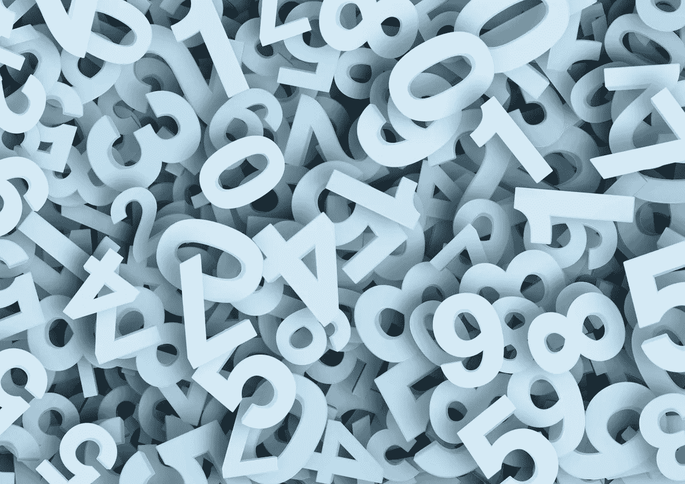

# Python Pro 提示:使用迭代器、生成器和生成器表达式

> 原文：<https://towardsdatascience.com/python-pro-tip-use-itertools-generators-and-generator-expressions-1b84911c978?source=collection_archive---------9----------------------->

## [蟒蛇短裤](https://towardsdatascience.com/tagged/python-shorts)

## 对于编码来说，理解是至关重要的


Photo by [Aziz Acharki](https://unsplash.com/@acharki95?utm_source=medium&utm_medium=referral) on [Unsplash](https://unsplash.com?utm_source=medium&utm_medium=referral)

谈到编程，Python 在很多方面都让我们的生活变得更加轻松。

它有许多库和功能，有时我们会忘记关注它提供的一些有用的东西。

其中一个功能是生成器和生成器表达式。我拖延了很长时间去学习它们，但是它们很有用。

你有没有在 Python 代码中遇到过`yield`而不知道它是什么意思？或者一个`iterator`或一个`generator`是什么意思，我们为什么使用它？或者你在使用 Keras 的时候使用过`ImageDataGenerator`却不明白后端发生了什么？那么这篇文章是给你的。

在这一系列名为**'**[**Python Shorts**](https://towardsdatascience.com/tagged/python-shorts)**，‘**的帖子中，我将解释 Python 提供的一些简单构造、一些基本技巧以及我在数据科学工作中经常遇到的一些用例。

***这篇文章是关于用一种简单易懂的方式解释一些难懂的概念。***

# 问题陈述:



***假设我们需要运行一个超过 1000 万素数的 for 循环。***

为了便于理解，我在这种情况下使用质数，但它可以扩展到我们必须处理数据库或大数据中的大量图像或文件的情况。

你会如何处理这样的问题？

简单。我们可以创建一个列表，将所有的质数保存在那里。

真的吗？ ***想想这样一个列表会占用多少内存。***

如果我们有某种东西可以保存我们检查过的最后一个素数，并返回下一个素数，那就太好了。

这就是迭代器可以帮助我们的地方。

# 迭代器解决方案

我们创建了一个名为素数的类，并用它来生成素数。

```
def check_prime(number):
    for divisor in range(2, int(number ** 0.5) + 1):
        if number % divisor == 0:
            return False
    return Trueclass Primes:
    def __init__(self, max):
        # the maximum number of primes we want generated
        self.max = max
        # start with this number to check if it is a prime.
        self.number = 1
        # No of primes generated yet. We want to StopIteration when it reaches max
        self.primes_generated = 0
    def __iter__(self):
        return self
    def __next__(self):
        self.number += 1
        if self.primes_generated >= self.max:
            raise StopIteration
        elif check_prime(self.number):
            self.primes_generated+=1
            return self.number
        else:
            return self.__next__()
```

然后，我们可以将它用作:

```
prime_generator = Primes(10000000)for x in prime_generator:
    # Process Here
```

这里我定义了一个迭代器。这就是大多数像`xrange`或`ImageGenerator`这样的功能是如何工作的。

每个迭代器都需要:

1.  一个返回 self 的`__iter__`方法，以及
2.  返回下一个值的`__next__`方法。
3.  表示迭代器结束的异常。

每个迭代器都采用上述形式，我们可以根据自己的喜好在样板代码中调整函数来做我们想做的事情。

注意，我们并没有把所有的质数都保存在内存中，只是保存了迭代器的状态，就像

*   我们返回的最大质数是多少
*   我们已经归还了多少质数。

但是代码好像有点多。我们能做得更好吗？

# 发电机解决方案


Simple yet beautiful..

简而言之，生成器为我们提供了使用`yield`语句轻松编写迭代器的方法。

```
def Primes(max):
    number = 1
    generated = 0
    while generated < max:
        number += 1
        if check_prime(number):
            generated+=1
            yield number
```

我们可以将该函数用作:

```
prime_generator = Primes(10)
for x in prime_generator:
    # Process Here
```

读起来简单多了。但是什么是`yield`？

我们可以认为`yield`是一个`return`语句，只是因为它返回值。

但是当`yield`发生时，功能的状态也被保存在存储器中。所以在 for 循环的每次迭代中，像`number, generated and max`这样的函数变量都存储在内存中的某个地方。

因此，上面的函数通过使用`yield`语句为我们处理所有的样板代码。

更像蟒蛇。

# `Generator Expression Solution`


So Much Cleaner!!!

虽然没有明显优于前面的解决方案，但我们也可以使用生成器表达式来完成相同的任务。但是我们可能会失去一些功能。它们的工作方式与列表理解完全一样，但它们不会将整个列表保存在内存中。

```
primes = (i for i in range(1,100000000) if check_prime(i))for x in primes:
    # do something
```

功能损失:我们可以产生 1000 万个素数。但是我们不能产生 1000 万个素数。对于生成器表达式，我们只能做这么多。

但是生成器表达式让我们做了一些很酷的事情。

***假设我们希望所有的毕达哥拉斯三元组都小于 1000。***

怎么才能得到呢？

使用发电机，现在我们知道如何使用它们。

```
def triplet(n): # Find all the Pythagorean triplets between 1 and n
    for a in range(n):
        for b in range(a):
            for c in range(b):
                if a*a == b*b + c*c:
                    yield(a, b, c)
```

我们可以这样使用:

```
triplet_generator = triplet(1000)for x in triplet_generator:
    print(x)------------------------------------------------------------
(5, 4, 3)
(10, 8, 6)
(13, 12, 5)
(15, 12, 9)
.....
```

或者，我们也可以在这里使用生成器表达式:

```
triplet_generator = ((a,b,c) for a in range(1000) for b in range(a) for c in range(b) if a*a == b*b + c*c)for x in triplet_generator:
    print(x)------------------------------------------------------------
(5, 4, 3)
(10, 8, 6)
(13, 12, 5)
(15, 12, 9)
.....
```

> *Python 不好看吗？*

我讨厌中等代码块，有时是因为代码中断和复制粘贴问题。所以你可以看到这个 [kaggle 内核中的所有代码。](https://www.kaggle.com/mlwhiz/iterators-and-generators/)

# 结论

***我们必须时刻努力减少***[***Python***](https://amzn.to/2XPSiiG)***中的内存占用。迭代器和生成器为我们提供了一种通过惰性求值来实现的方法。***

***我们如何选择使用哪一个？我们可以用生成器表达式做什么，我们也可以用生成器或迭代器做什么。***

这里没有正确答案。每当我面临这样的困境时，我总是从功能性和可读性的角度来考虑。一般来说，

功能方面:迭代器>生成器>生成器表达式。

可读性:来自密歇根大学的迭代器<generators expressions.=""></generators>

It is not necessary that you end up using them in your code now. But I guess understanding how these things work helps mitigate some of the confusion and panic one faces whenever these constructs come up.

> Understanding is vital when it comes to coding

Also if you want to learn more about Python 3, I would like to call out an excellent course on Learn [中级 Python](https://coursera.pxf.io/0JMOOY) 。一定要去看看。

将来我也会写更多初学者友好的帖子。让我知道你对这个系列的看法。在 [**中**](https://medium.com/@rahul_agarwal) 关注我，或者订阅我的 [**博客**](http://eepurl.com/dbQnuX) 了解他们。一如既往，我欢迎反馈和建设性的批评，可以通过 Twitter [@mlwhiz](https://twitter.com/MLWhiz) 联系到我。