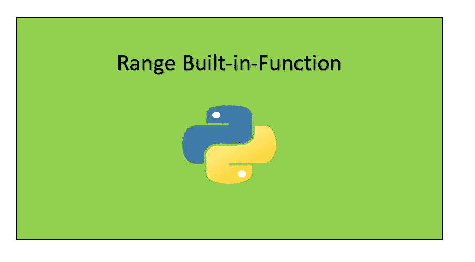

# Python range()内置函数

> 原文：<https://towardsdatascience.com/python-range-built-in-function-b2489ea99660?source=collection_archive---------7----------------------->

让我们了解一下 python 中 range()函数的基础知识。



现在让我们来理解 python 中 range 函数()的概念，下面展示的概念和例子将帮助你们以一种清晰的方式理解 range()。另外，请访问我的 GitHub 库，在下面找到更多关于 range 函数的详细信息:

[](https://github.com/Tanu-N-Prabhu/Python/blob/master/Range_built_in_function.ipynb) [## 塔努-北帕布/Python

### 此时您不能执行该操作。您已使用另一个标签页或窗口登录。您已在另一个选项卡中注销，或者…

github.com](https://github.com/Tanu-N-Prabhu/Python/blob/master/Range_built_in_function.ipynb) 

# **我们开始吧！！！**

# 定义

range()函数是 python 中使用的内置函数，**用来生成一个数列**。如果用户希望在给定起始值和结束值的情况下生成一个数字序列，那么他们可以将这些值作为 range()函数的参数。range()函数将根据用户的要求生成一系列数字。

# 句法

range()函数的语法如下所示:

```
**range(start, stop, step)**
```

# 因素

range()内有三个参数:**开始，停止，步进**。当您考虑这三个参数时，它类似于下面将要讨论的真实场景。

```
***Start:*** *Optional — An integer number that specifies where to start     (Default value is 0)***Stop**: Required — An integer number that specifies where to stop.**Step:** Optional — An integer number that specifies how much to increment the number (Default value is 1)
```

# 返回值

range 函数的返回值是一系列数字，具体取决于所定义的参数。

# **例题**

**1。让我们看看当我们打印值为 10 的 range 函数时会发生什么。**

```
x = range(10)
print(x)**range(0, 10)**
```

如上所示，值 10 表示范围功能的终止值，0 值默认作为起始值添加。

**2。让我们看看当我们把 range 函数放入 for 循环时会发生什么。**

```
x = range(10)
for i in x:
    print(i)**0 
1 
2 
3 
4 
5 
6 
7 
8 
9**
```

如上所示，我们可以得到从 0 到 10 的值，但不包括 10，因为范围函数的停止值总是返回**值-1** 。因此值为 0-10。

**3。让我们看看，当我们给 range 函数一个起始值和终止值时，会发生什么。**

```
x = range(1, 10)
for i in x:
    print(i)**1
2 
3 
4 
5 
6 
7 
8 
9**
```

如上所示，它打印出从 1 到 9 的值，因为起始值被定义为 1。

**4。让我们看看当我们给距离函数一个步长值时会发生什么。**

```
x = range(1, 10, 2)
for i in x:
    print(i)**1 
3 
5 
7 
9**
```

如上所述，步长用于增加数字，在这种情况下，步长为 2，因此数字增加 2。

一般来说，可以这样认为范围函数就像现实生活中的场景:

1.  你开始走— **开始**
2.  你踏出你的步伐(脚步)——**步**
3.  你停下来行走，因为你已经到达了目的地。

即使在这种情况下你没有声明 step 变量，你也会一次走一步，显然，没有人会一次走两步。

# 范围函数的类型为 class

是的，range 函数是一个类，因为当你使用 type()检查 range 函数的类型时，你就会得到答案。

```
x = range(10)
print(type(x))**<class 'range'>**
```

# 不要在 range 函数中传递任何浮点值。

range 函数不适用于浮点值，因为根据 range 函数，浮点对象不能被解释为整数。因此，通常在范围函数中指定整数值。

```
x = range(10.0, 100.5)
for i in x:
    print(i)**--------------------------------------------------------------------****TypeError                         Traceback (most recent call last)**[**<ipython-input-23-55e80efae649>**](/<ipython-input-23-55e80efae649>) **in <module>()
----> 1 x = range(10.0, 100.5)
      2 for i in x:
      3     print(i)****TypeError: 'float' object cannot be interpreted as an integer**
```

如果你需要解决它，你可以把它转换成一个整数，如下所示:

```
x = range(int(10.0), int(100.5))
for i in x:
    print(i)**10 
11 
12 
13 
14
-
-
-
-
99**
```

为了支持这种情况，我对 [StackOverflow](https://stackoverflow.com/questions/7531945/python-range-function) 做了一些研究，然后我看到了一个问题，它被表述为“**我想从 0 到 100 循环，但步长为 1/2** ”现在这不是一个简单的问题，因为上面的概念适用于此，所以你需要使用一些逻辑，现在我已经使用了一些我的逻辑来解决这个问题，如下所示:

```
x = range(0, 100 * 2)
for i in x:
    print(i * 0.5)**0.0 
0.5 
1.0 
1.5 
2.0
-
-
-
99.5**
```

你可以自由地用你的逻辑解决上述问题，并在下面的评论区提供解决方案。

# xrange 函数

这也是 python 中的一个内置函数，我认为它的工作方式与 range()相同，当我尝试执行它时，我得到了一个奇怪的错误:

```
x = xrange(1, 5)
for i in x:
    print(i)**--------------------------------------------------------------------****NameError                       Traceback (most recent call last)**[**<ipython-input-30-969120b3b060>**](/<ipython-input-30-969120b3b060>) **in <module>()
----> 1 x = xrange(1, 5)
      2 for i in x:
      3     print(i)****NameError: name 'xrange' is not defined**
```

然后经过一番研究，我根据[栈溢出](https://stackoverflow.com/questions/17192158/nameerror-global-name-xrange-is-not-defined-in-python-3)得知 xrange 是 range 的增量版本。其中一个说 Python2 用的是 xrange()，Python3 用的是 range，所以你不用担心。

# 范围函数也可以用于列表

范围函数也可用于 python 列表。一种简单的方法如下所示:

```
names = [‘India’, ‘Canada’, ‘United States’, ‘United Kingdom’]
for i in range(1, len(names)):
    print(names[i])**Canada 
United States 
United Kingdom**
```

# 使用范围函数增加和减少

我想现在你们应该知道该怎么做了。但无论如何，我会提供这个问题的解决方案。在这种情况下，您只需使用**步进参数**即可。

**递增**

```
x = range(1, 10, 2)
for i in x:
    print(i)**1 
3 
5 
7 
9**
```

**递减**

```
x = range(10, 1, -2)
for i in x:
    print(i)**10 
8 
6 
4 
2**
```

这就是你需要知道的关于 python 中 range 函数的全部内容，推荐你阅读 Python 的官方指南:

 [## 内置函数- Python 3.8.0 文档

### Python 解释器内置了许多始终可用的函数和类型。它们被列出…

docs.python.org](https://docs.python.org/3/library/functions.html#func-range) 

感谢你们阅读这个简短的教程，我希望你们喜欢它，让我知道你的意见，如果你有任何疑问，评论区都是你的。