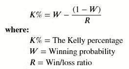
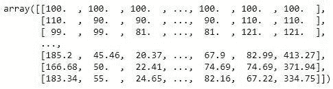
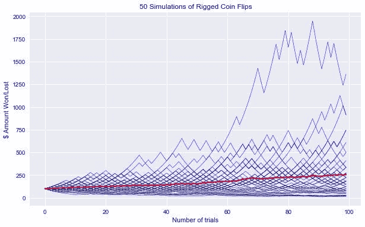
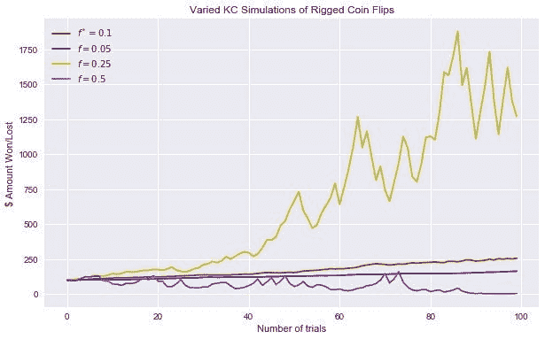
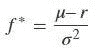
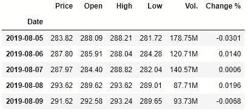
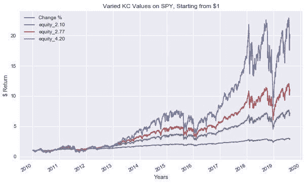

# Python 风险管理:凯利标准

> 原文：<https://towardsdatascience.com/python-risk-management-kelly-criterion-526e8fb6d6fd?source=collection_archive---------8----------------------->


从最近金融市场调整的事件来看，我认为这将是一个谈论风险管理的有趣时刻。具体来说，我们将通过 Python 中的一个具体例子来回顾 Kelly 准则。首先，我们将讨论凯利标准的简要概述。接下来，我们来看一个简单的抛硬币的例子。最后，我们将举一个简单的例子，并将其应用于一个金融指数。

本文的数据收集自:[https://www.investing.com/etfs/spdr-s-p-500-historical-data](https://www.investing.com/etfs/spdr-s-p-500-historical-data)

# 简要凯利标准概述

约翰·凯利是美国电话电报公司·贝尔实验室的科学家。当时，凯利听说了职业赌徒，并对赌徒在面对不确定性时如何管理他们的资本感到好奇。有趣的是，他并不关心他们赚了多少钱，而是关心他们如何设置下注规模以获得最多的钱。像大多数成功的赌博故事一样，Kelly 应用信息论中的数学创建了 Kelly 准则(KC) [1]。从 KC 来看，如果一个赌徒知道自己赢和输的几率，她可以做出最好的赌注，从长远来看获得最多的钱。

凯利标准(KC)有两个主要部分:赢概率和赢/赔率。在数学公式形式中，那将是[2]:



但是 KC 的应用不仅仅是赌博。它适用于任何我们知道变量值的决策。

# 投资者如何应用凯利

在谷歌上快速搜索一下，你会发现很多人引用价值投资者的话，比如[3]:

> *我不能参与 50 或 75 件事情。这是一种诺亚方舟式的投资方式——你最终会得到一个动物园。我喜欢在一些事情上投入有意义的钱。—沃伦·巴菲特*
> 
> *当世界给智者提供机会时，他们会下大赌注。他们有胜算的时候会下大注。其他时候，他们不会。就是这么简单。—查理·芒格*

这些大牌价值投资者大多不再直接应用 KC 了。当然，他们在他们的投资组合中使用集中下注，但是 KC 要求可重复下注以获得最佳回报[4]。这就是为什么如果你进一步挖掘，这些投资者大多会放弃 KC。不是因为 KC 不好，而是哲学上的投资差异。价值投资包括选择一些公司，并持有一段时间，使其达到公允价值。在计算公允价值时，大多数没有足够的可重复概率。这就是为什么大多数使用 KC 的投资者倾向于使用更多的量化策略来反映赌场的优势。

# 作弊抛硬币示例

背景介绍到此为止，让我们来看一些编码示例！现在，我们来看一下如何应用 KC，当你以 55%的优势掷硬币下注时(一枚公平的硬币有 50%的胜算)。对于我们的例子，让我们假设你赢了 1 美元或输了 1 美元，因为正面或反面的结果与风险的大小有关。换句话说，我们假设每注的 KC 或风险金额是 1 比 1。接下来的代码也是从用于金融的 [Python 修改而来的](https://amzn.to/2KuHPRG) [5]。

```
#Import libraries
import math
import time
import numpy as np
import pandas as pd
import datetime as dt
import cufflinks as cf
from pylab import plt

np.random.seed(1) # For reproducibility
plt.style.use('seaborn') # I think this looks pretty
%matplotlib inline # To get out plots#Coin flip variable set up
p = 0.55 #Fixes the probability for heads.f = p - (1-p) #Calculates the optimal fraction according to the Kelly criterion.
f
```

f = 0.10

以上是最佳凯利标准最佳尺寸(f)。这意味着，对于 1 比 1 的回报和 55%的获胜机会，我们应该将总资本的 10%用于最大化我们的利润。

```
# Preparing our simulation of coin flips with variables
I = 50 #The number of series to be simulated.
n = 100 #The number of trials per series.

def run_simulation(f):
    c = np.zeros((n, I)) #Instantiates an ndarray object to store the simulation results.
    c[0] = 100 #Initializes the starting capital with 100.
    for i in range(I): #Outer loop for the series simulations.
        for t in range(1,n): #Inner loop for the series itself.
            o = np.random.binomial(1, p) #Simulates the tossing of a coin.
            if o > 0: #If 1, i.e., heads …
                c[t, i] = (1+f) * c[t-1,i] #… then add the win to the capital.
            else: #If 0, i.e., tails …
                c[t, i] = (1-f) * c[t-1,i] #… then subtract the loss from the capital.
    return c

c_1 = run_simulation(f) #Runs the simulation.
c_1.round(2) #Looking at a simulation
```



当运行模拟时，我有时喜欢检查数据看起来如何，只是为了看看没有什么疯狂的事情发生。我们将这些数据形象化，使其更容易理解。

```
plt.figure(figsize=(10,6))
plt.plot(c_1, 'b', lw=0.5) #Plots all 50 series.
plt.plot(c_1.mean(axis=1), 'r', lw=2.5); #Plots the average over all 50 series.
plt.title('50 Simulations of Rigged Coin Flips');
plt.xlabel('Number of trials');
plt.ylabel('$ Amount Won/Lost');
```



对于上面的图，蓝线代表我们运行的 50 次模拟抛硬币，红线代表所有模拟的平均值。有趣的是，即使我们以微弱的优势(55%的优势)获胜，也很少有我们仍然失败的情况。这可能就是为什么很多人在评估与机会有关的情况的盈利能力时会有问题。

除了始终用 10%的资金下注之外，其他下注规模/不同的 KC 值会发生什么？

```
c_2 = run_simulation(0.05) #Simulation with f = 0.05.
c_3 = run_simulation(0.25) #Simulation with f = 0.25.
c_4 = run_simulation(0.5) #Simulation with f = 0.5.plt.figure(figsize=(10, 6))
plt.plot(c_1.mean(axis=1), 'r', label='$f^*=0.1$')
plt.plot(c_2.mean(axis=1), 'b', label='$f=0.05$')
plt.plot(c_3.mean(axis=1), 'y', label='$f=0.25$')
plt.plot(c_4.mean(axis=1), 'm', label='$f=0.5$')
plt.legend(loc=0);
plt.title('Varied KC Simulations of Rigged Coin Flips');
plt.xlabel('Number of trials');
plt.ylabel('$ Amount Won/Lost');
```



从我们不同的 KC，我们可以看到回报(金额韩元)差异很大。具体来说，我们增加的 KC 越高，我们赢得更多钱的机会就越大，但风险也越大。到目前为止，我们的最佳值 0.10 确实看起来最好(持续盈利回报)，而更高的值在回报方面有巨大的变化(f=0.25)甚至亏损(f=0.5)。

# 凯利去做间谍

现在让我们从简单的例子中走出来，把它推向现实世界。我们将把 KC 应用于标准普尔 500 股票指数。为了应用这些变化，我们的 KC 公式将如下所示[5]:



Mu ( ) =间谍平均收益
r =无风险率
sigma (σ ) =间谍方差

不用向上滚动数据链接，你可以在这里再找到:[https://www.investing.com/etfs/spdr-s-p-500-historical-data](https://www.investing.com/etfs/spdr-s-p-500-historical-data)【6】。

```
#Loading SPY data
data = pd.read_csv('SPY Historical Data.csv', index_col=0, parse_dates=True)#Light Feature Engineering on Returns
data['Change %'] = data['Change %'].map(lambda x: x.rstrip('%')).astype(float) / 100
data.dropna(inplace=True)data.tail()
```



只是检查数据，看看我们的功能工程是否有效。来自 Investing.com 的数据通常有一个%符号，Python 倾向于将其作为一个对象而不是一个数字。

```
mu = data['Change %'].mean() * 252 #Calculates the annualized return.
sigma = (data['Change %'].std() * 252 ** 0.5)  #Calculates the annualized volatility.
r = 0.0179 #1 year treasury ratef = (mu - r) / sigma ** 2 #Calculates the optimal Kelly fraction to be invested in the strategy.
f
```

f = 4.2

根据我们的计算，KC 值是 4.2，这意味着我们应该为间谍投资的每 1 美元下注 4.2 倍。对于那些对金融更熟悉的人来说，这意味着我们应该利用 4.2 倍的交易来最大化我们的预期回报。直觉上，对我来说听起来有点高，但是让我们像以前一样运行一些模拟。

```
equs = [] # preallocating space for our simulationsdef kelly_strategy(f):
    global equs
    equ = 'equity_{:.2f}'.format(f)
    equs.append(equ)
    cap = 'capital_{:.2f}'.format(f)
    data[equ] = 1  #Generates a new column for equity and sets the initial value to 1.
    data[cap] = data[equ] * f  #Generates a new column for capital and sets the initial value to 1·f∗.
    for i, t in enumerate(data.index[1:]):
        t_1 = data.index[i]  #Picks the right DatetimeIndex value for the previous values.
        data.loc[t, cap] = data[cap].loc[t_1] * math.exp(data['Change %'].loc[t])
        data.loc[t, equ] = data[cap].loc[t] - data[cap].loc[t_1] + data[equ].loc[t_1]
        data.loc[t, cap] = data[equ].loc[t] * f 

kelly_strategy(f * 0.5) # Values for 1/2 KC
kelly_strategy(f * 0.66) # Values for 2/3 KC
kelly_strategy(f) # Values for optimal KCax = data['Change %'].cumsum().apply(np.exp).plot(legend=True,figsize=(10, 6))         
data[equs].plot(ax=ax, legend=True);
plt.title('Varied KC Values on SPY, Starting from $1');
plt.xlabel('Years');
plt.ylabel('$ Return')
```



就像我们掷硬币的例子一样，KC 值越高，波动性越大。4.2 的最佳金额在 2019 年初前后损失了超过 50%的价值。这对于大多数人来说是相当可怕的，这就是为什么应用 KC 的从业者通常应用 KC 的一半(equity_2.10 from out plot)。

# 结论

我们今天走了相当多的路。我们回顾了凯利标准(KC)的简史，以及投资者如何应用这个公式。然后我们用一个简单的作弊抛硬币的例子来最大化我们的回报。最后，我们将从抛硬币的例子中学到的知识应用到标准普尔 500 股票指数中。从我们的小模拟中，我们了解到，即使 KC 可能推荐一个高值，有时我们也会采用一个降低的 KC 值来避免不必要的波动。没有多少人能忍受 50%的损失(最大的损失金额),不要让我开始承受经历一次的精神压力！所以采取战略解决方案，通过降低 KC 来获得更多的安心。

免责声明:本文陈述的所有内容都是我个人的观点，不代表任何雇主。投资带有严重的风险，在采取任何投资行动之前，请咨询您的投资顾问。此外，这个帖子包含附属链接。

参考

[1] Finbox，Investing With Kelly (2018)，[https://www . value walk . com/2018/04/Investing-With-the-Kelly-criterion-model/](https://www.valuewalk.com/2018/04/investing-with-the-kelly-criterion-model/)

[2] J. Kuepper，利用凯利准则进行资产配置和资金管理(2019)，【https://www.investopedia.com/articles/trading/04/091504.asp 

[3] OSV，将凯利标准应用于投资和您的投资组合规模(2014)，[https://www . oldschoolvalue . com/blog/Investing-strategy/Kelly-Criterion-Investing-Portfolio-Sizing/](https://www.oldschoolvalue.com/blog/investing-strategy/kelly-criterion-investing-portfolio-sizing/)

[4] P. Lindmark，用凯利标准投资(2007 年)，[https://www . guru focus . com/news/4883/用凯利标准投资](https://www.gurufocus.com/news/4883/investing-with-the-kelly-criterion)

[5] Y. Hiplisch，Python for Finance:掌握数据驱动的金融(2018)，奥赖利媒体[https://amzn.to/2KuHPRG](https://amzn.to/2KuHPRG)

[6]Investing.com，间谍 500 史料，[https://www.investing.com/etfs/spdr-s-p-500-historical-data](https://www.investing.com/etfs/spdr-s-p-500-historical-data)