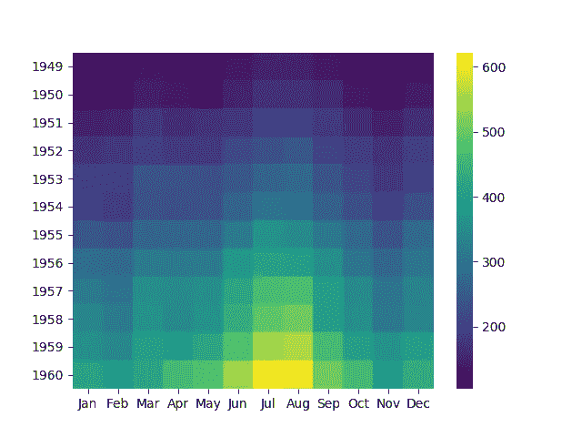
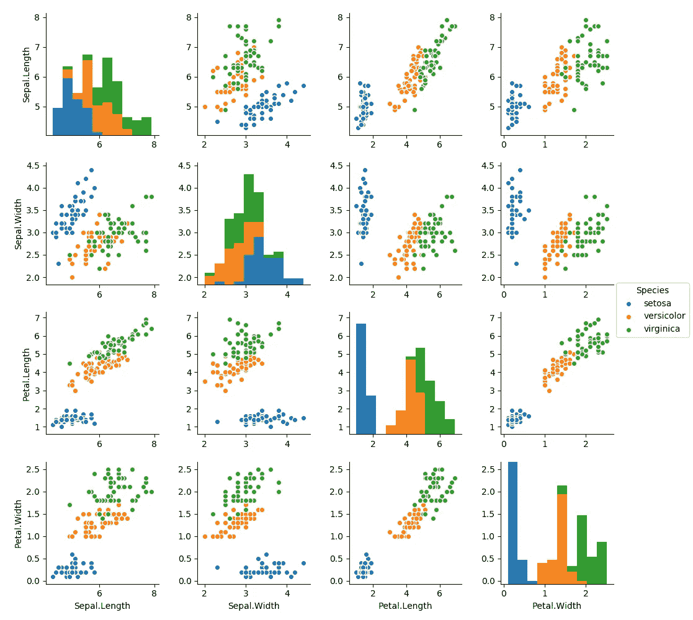

# Python Seaborn 使用 reticulate 在 R 中绘图

> 原文：<https://towardsdatascience.com/python-seaborn-plots-in-r-using-reticulate-fb59cebf61a7?source=collection_archive---------11----------------------->


我认为没有人会质疑`ggplot2`有多神奇。但是在 Python 的现代数据可视化库`Seaborn`中有几个我很欣赏的情节。这不仅仅是因为它能产生高质量的可视化效果，还因为它的构建是多么的容易和简单。那两个地块是`heatmap`和`pairplot`。我总是想念他们，但我想不会了。

如果我告诉您，您现在可以使用 RStudio 在 R 中构建 Seaborn 热图和 pairplot，会怎么样？在这篇文章中，我们将看到如何制作像 Pairplot 和 Heatmap 这样的 Seaborn 可视化工具，就此而言，r。

# 网状的

这里的圣杯是最近推出的 R 包`reticulate`，由 RStudio 开发。

# 关于套餐:

reticulate 包为 Python 和 r 之间的互操作性提供了一套全面的工具。

*   以多种方式从 R 调用 Python，包括 R Markdown、获取 Python 脚本、导入 Python 模块以及在 R 会话中交互使用 Python。
*   R 和 Python 对象之间的转换(例如，R 和 Pandas 数据框之间，或者 R 矩阵和 NumPy 数组之间)。
*   灵活绑定到不同版本的 Python，包括虚拟环境和 Conda 环境。

Reticulate 在 R 会话中嵌入了一个 Python 会话，实现了无缝、高性能的互操作性。

# 安装和加载 R 包

`reticulate`在[曲柄](https://cran.r-project.org/package=reticulate)上可用，并可按以下代码安装:

```
install.packages('reticulate')
```

让我们将 R 包加载到当前的 R 会话中(就像加载其他 R 包一样):

```
#loading required R libraries 
library(reticulate) #the superpower bridges python and R
```

# 初始设置

记住，要访问这个包，您的机器中需要有 Python。所以请确保您已经安装了 Python 以及所需的包，并且在`PATH`上可用，默认情况下，reticulate 使用路径上的 Python 版本。如果您的计算机上有多个 Python 版本，您可以使用以下代码指示使用哪个版本的 Python for reticulate:

```
#specifying which version of python to use
use_python('C:\\PROGRA~1\\Python35\\python.exe')
```

# 加载 Python 库

`import()`函数帮助将指定的 Python 库导入当前 R 会话。记住，指定的 Python 库必须已经安装在机器上。

```
#importing required Python libraries/modules
sns <- import('seaborn')
plt <- import('matplotlib.pyplot')
pd <- import('pandas')
```

# 代码结构

这段代码做两件事:

# R 中的 Seaborn 热图

```
#using R's inbuilt AirPassengers dataset
df <- datasets::AirPassengers
#converting Time-Series object into an R Dataframe 
#Thx: [https://stackoverflow.com/questions/5331901/transforming-a-time-series-into-a-data-frame-and-back](https://stackoverflow.com/questions/5331901/transforming-a-time-series-into-a-data-frame-and-back)
df1 <- data.frame(tapply(df, list(year = floor(time(df)), month = month.abb[cycle(df)]), c))
df1 <- df1[month.abb]
#building a heatmap using seaborn 
#please note the function r_to_py() that converts R object into a python 
sns$heatmap(r_to_py(df1), fmt="g", cmap ='viridis')
#display the plot
plt$show()
```

给出了这个图:



这真是一张漂亮的热图。为了理解那里发生了什么，我们采用了 AirPassengers 数据集，这是一个时间序列格式的 R 对象。这被转换成数据帧，然后输入到 seaborn 的热图功能，以绘制热图。这里需要注意一些事情:

*   在载入 python 库的对象后使用`$`符号访问 Python 包的函数。这与使用`$`访问数据帧的一列非常相似。
*   `r_to_py()`是一个用来把 R 对象转换成 Python 对象的函数。在这种情况下，R 数据帧被转换为 Python Pandas 数据帧，这是热图函数绘制热图的理想对象类型。

# R 中的 Seaborn 配对图

```
#building a seaborn pairplot using pairplot()
sns$pairplot(r_to_py(iris), hue = 'Species')
#display the plot
plt$show()
```

给出了这个图:



这是理解给定数据集中成对关系的一个很好的图。

# 结论

因此，只需很少的编码和配置，我们就能在 R 中使用 Python Seaborn 很好地可视化给定的数据集，并绘制出热图和 Pairplot。虽然这篇文章可能已经非常具体地描述了这两个图，但是从这篇文章中可以推断出的更大的想法是理解使用`reticulate`包将 Python 代码集成到 R 代码中是多么简单和容易。这里使用的完整代码可以在[我的 github](https://github.com/amrrs/seaborn_in_r) 上获得。r 是任何形式的数据可视化的神奇工具，要了解更多[请查看这个](https://bit.ly/2TXIv3t)。

# 参考

*   [网状文件](https://rstudio.github.io/reticulate/index.html)
*   [来源](https://datascienceplus.com/how-to-make-seaborn-pairplot-and-heatmap-in-r-write-python-in-r/)