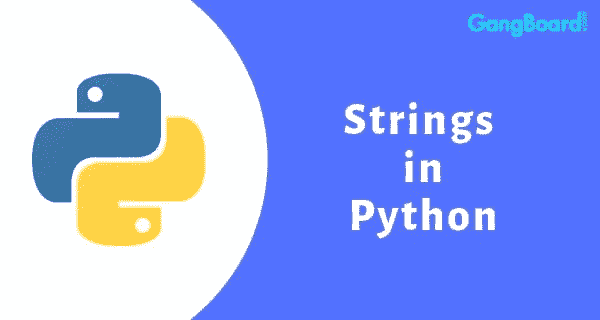

# Python 字符串从零开始！！！

> 原文：<https://towardsdatascience.com/python-strings-from-scratch-afd5ad034de8?source=collection_archive---------16----------------------->

让我们了解一下 python 中字符串的基础知识。



Credits: [GangBoard](https://www.gangboard.com/blog/python-string/)

字符串是一系列字符，可以存储为常量或不同的变量。字符串被视为一种数据类型。通常，程序员必须用引号将字符串括起来，以便将数据识别为字符串，而不是数字或变量名。下面是一些日常最常用的字符串方法，也是最常被问到的面试问题之一。此外，代码可以在我的 [GitHub](https://github.com/Tanu-N-Prabhu/Python/blob/master/Strings/Strings.ipynb) 页面上找到。

**比如用 python 声明一个字符串:**

```
**# Declaring a string variable** string = “This is a python tutorial”
print(string)**This is a python tutorial**print(type(string))**<class 'str'>**
```

## **1。使用字符串对 python 中的序列进行转义**

在 Python 字符串中，反斜杠“”是一个特殊字符，也称为“**转义**字符。它用于表示某些空白字符:" **\t** "是一个制表符，" **\n** "是一个新行，" **\r** "是一个回车符。最后，“”可以用来转义本身:“ **\** ”是字面上的反斜杠字符。来源 [Python 教程](https://www.pitt.edu/~naraehan/python2/tutorial7.html)。

```
**# THis is an escape sequence.** string = “This is a \”Google Colab\” python notebook”print(string)**This is a "Google Colab" python notebook**
```

## **2。通过索引访问字符串**

字符串可以通过它们的索引来访问，以便获得值。要做到这一点，你所要做的就是把数字(索引值)和字符串的名字放在一对方括号内。

```
string = “Python”print(string[2])**t**print(string[5])**n**
```

## **3。切一根绳子**

分割字符串有助于从字符串中获取一组字符。当我们想要访问字符串中的一组特定字符时，这非常有用。下面是一些有用的切片变体。

```
string = “programming”
string**'programming'**
```

**获取字符串中的一个字符**

```
print(string[0:1])**p**
```

**从字符串中获取前三个字符**

```
print(string[0:3])**pro**
```

**从字符串中获取前三个字符(替换)**

```
print(string[:3])**pro**
```

**从字符串中获取最后三个字符**

```
print(string[-3:])**ing**
```

**获取所有字符，但不包括字符串中的前三个字符**

```
print(string[3:])**gramming**
```

**获取所有字符，但不包括字符串的后三个字符**

```
print(string[:-3])**programm**
```

**反转给定字符串中的所有字符**

```
print(string[::-1])**gnimmargorp**
```

**打印字符串中所有字符的替代方法**

```
print(string[::])**programming**
```

## **4。拆分字符串**

有时拆分字符串是一个方便的选择，因为这是将字符串转换成列表的最简单的方法之一。我知道我没有提到列表，但是请记住，split 将字符串转换为列表。你可以找到我写的关于 python 列表的材料，它可以为掌握 Python 列表提供足够的思路:

[](/python-lists-from-scratch-4b958eb956fc) [## Python 列表从头开始！！！

### 让我们从基础到高级理解 Python 列表。

towardsdatascience.com](/python-lists-from-scratch-4b958eb956fc) 

```
String = “Computer Programming”
String**‘Computer Programming’**type(String)**str**list = String.split()
list**['Computer', 'Programming']**type(list)**list**
```

## **5。替换字符串**

python 中的 Replace 函数是可以应用于字符串的最好的函数之一。例如，下面显示的是一个字符串“Money ”,我们需要替换美元和逗号，这可以如下所示完成。

```
Money = ‘$113,678’
print(Money)
print(“===========================”)
print(type(Money))**$113,678 
=========================== 
<class ‘str’>**Money = Money.replace(‘$’, ‘’)
Money**‘113,678’**Money = Money.replace(‘,’, ‘’)
Money**‘113678’**Money = int(Money)
print(Money)
print(“===========================”)
print(type(Money))**113678 
=========================== 
<class ‘int’>**
```

## **6。加入**

连接函数是 python 用来按照指定的模式连接字符串的。

```
String = “Python Programming is fun”
String**‘Python Programming is fun’**String = “ “.join(String)
String**‘P y t h o n   P r o g r a m m i n g   i s   f u n’**
```

## 7.大写

capitalize 函数将单词或字符串中的第一个字符大写。

```
string = “programming”
string**‘programming’**string = string.capitalize()
string**‘Programming’**
```

## 8.**中心**

center 方法返回用指定字符填充的字符串。

```
string = “python”
string**‘python’**print(string.center(15, ‘*’))*******python******
```

## 9.发现

find 方法返回给定子串位置的索引。如果找不到该值，则返回-1。

```
string = “programming”
string**‘programming’**print(string.find(‘p’))**0**print(string.find(‘t’))**-1**
```

## 10.剥夺

strip 函数去除字符串开头和结尾的空格。

```
string = “     programming is easy    “
string**‘     programming is easy    ‘**print(string.strip())**programming is easy**
```

因此，以上是 Python 中非常重要的字符串技术或函数。一些例子是从 [Python 字符串](https://www.gangboard.com/blog/python-string/)中引用的。我用一种简单的方式写了这篇教程，这样每个人都可以理解和掌握 Python 中字符串的概念，而不需要以前的编程知识或经验。如果你们对代码有什么疑问，评论区就是你们的了。

## 谢谢你