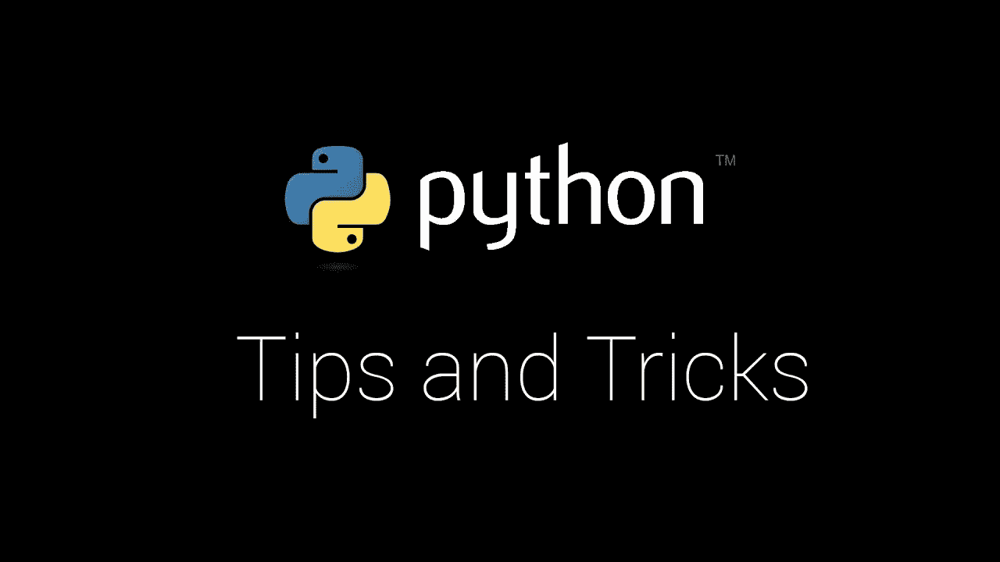

# Python 的技巧和诀窍，你还没有看过

> 原文：<https://towardsdatascience.com/python-tips-and-trick-you-havent-already-seen-37825547544f?source=collection_archive---------5----------------------->

*注:这最初发布在*[*martinheinz . dev*](https://martinheinz.dev/blog/1)

关于 Python 中的许多很酷的特性，比如变量解包、部分函数、枚举可迭代对象，已经有很多文章，但是对于 Python 来说，还有更多的东西要讨论，所以在这里我将尝试展示一些我知道并使用的特性，这些特性我还没有在其他地方提到过。所以我们开始吧。

## 净化字符串输入

净化用户输入的问题几乎存在于你编写的每一个程序中。通常，将字符转换为小写或大写就足够了，有时您可以使用 Regex 来完成这项工作，但是对于复杂的情况，可能有更好的方法:

在此示例中，您可以看到空白字符“\n”和“\t”已被替换为单个空格，并且“\r”已被完全删除。这是一个简单的例子，但是我们可以更进一步，使用`unicodedata`包和它的`combining()`函数生成大的重映射表，来生成和映射我们可以用来从字符串中删除所有重音符号的表。

## 获取迭代器的切片

如果你尝试获取迭代器的一部分，你会得到一个`TypeError`，声明生成器对象是不可下标的，但是有一个简单的解决方法:

使用`itertools.islice`我们可以创建一个`islice`对象，它是一个迭代器，产生想要的项目。不过需要注意的是，这将消耗 slice 开始之前的所有生成器项，以及我们的`islice`对象中的所有项。

## 跳过 Iterable 的开头

有时你不得不处理那些你知道以可变数量的不需要的行开始的文件，比如注释。`itertools`再次提供了简单的解决方案:

该代码片段只在初始注释部分后生成几行。如果我们只想丢弃 iterable 开头的条目(本例中是行),而不知道有多少条目，这种方法会很有用。

## 只有关键字参数的函数(kwargs)

创建只接受关键字参数函数会有所帮助，以便在使用这样的函数时提供(强制)更大的清晰度:

如你所见，这可以通过在关键字参数前放置单个`*`参数来轻松解决。如果我们把位置参数放在`*`参数之前，显然会有位置参数。

## 创建支持`with`语句的对象

我们都知道如何使用`with`语句打开文件或者获取锁，但是我们真的能实现我们自己的吗？是的，我们可以使用`__enter__`和`__exit__`方法实现上下文管理器协议:

这是在 Python 中实现上下文管理的最常见方法，但是还有更简单的方法:

上面的代码片段使用`contextmanager` manager decorator 实现了内容管理协议。进入`with`块时执行`tag`功能的第一部分(在`yield`之前)，然后执行该块，最后执行`tag`功能的剩余部分。

## 使用`__slots__`节省内存

如果你曾经写过一个程序，它创建了某个类的大量实例，你可能会注意到你的程序突然需要大量的内存。这是因为 Python 使用字典来表示类的实例的属性，这使得它很快，但不是非常有效的内存，这通常不是问题。然而，如果它成为你的程序的一个问题，你可以尝试使用`__slots__`:

这里发生的情况是，当我们定义`__slots__`属性时，Python 使用小的固定大小的属性数组而不是字典，这大大减少了每个实例所需的内存。使用`__slots__`也有一些缺点——我们不能声明任何新的属性，并且我们被限制在`__slots__`上使用。同样，带有`__slots__`的类不能使用多重继承。

## 限制 CPU 和内存的使用

如果您不想优化程序内存或 CPU 的使用，而是想直接将其限制在某个硬数字，那么 Python 也有一个库:

在这里，我们可以看到设置最大 CPU 运行时间和最大内存使用限制的两个选项。对于 CPU 限制，我们首先获得特定资源软限制和硬限制(`RLIMIT_CPU`)，然后使用参数指定的秒数和先前检索的硬限制来设置它。最后，如果 CPU 时间超时，我们注册导致系统退出的信号。至于内存，我们再次检索软限制和硬限制，并使用带有大小参数和检索到的硬限制的`setrlimit`进行设置。

## 控制什么可以导入，什么不可以导入

有些语言有非常明显的导出成员(变量、方法、接口)的机制，比如 Golang，只导出以大写字母开头的成员。另一方面，在 Python 中，一切都是导出的，除非我们使用`__all__`:

使用上面的代码片段，我们可以限制使用`from some_module import *`时可以导入的内容。对于这个具体的例子，*通配符导入*与仅导入`bar`。此外，我们可以将`__all__`留空，当使用*通配符导入*从该模块导入时，不会导出任何内容，从而导致`AttributeError`。

## 比较运算符最简单的方法

考虑到有相当多的比较操作符——`__lt__ , __le__ , __gt__ ,`或`__ge__`，为一个类实现所有的比较操作符可能会很烦人。但是如果有更简单的方法呢？`functools.total_ordering`来救援:

这实际上是如何工作的？`total_ordering` decorator 用于简化我们的类实现实例排序的过程。只需要定义`__lt__`和`__eq__`，这是映射剩余操作所需的最低要求，这是装饰者的工作——它为我们填补了空白。

## 结论

在日常 Python 编程中，并非所有这些特性都是必不可少的和有用的，但其中一些有时可能会派上用场，它们还可能会简化任务，否则实现起来会非常冗长和烦人。我还想指出的是，所有这些特性都是 Python 标准库的一部分，而其中一些在我看来就像是标准库中非常非标准的东西，所以每当你决定用 Python 实现某个东西时，首先要在标准库中寻找它，如果你找不到它，那么你可能找得不够仔细(如果它真的不在那里，那么它肯定在某个第三方库中)。🙂