# 初级数据科学家的 Python 工具

> 原文：<https://towardsdatascience.com/python-tools-for-a-beginner-data-scientist-39b3b9a4303a?source=collection_archive---------8----------------------->

## 使用这些库使数据科学家的生活变得非常容易

Python 拥有适用于数据科学项目生命周期所有阶段的工具。[任何数据科学项目固有地包含以下 3 个阶段](/life-cycle-of-a-data-science-project-3962b9670e5b)。


Photo by [Florian Klauer](https://unsplash.com/@florianklauer?utm_source=medium&utm_medium=referral) on [Unsplash](https://unsplash.com?utm_source=medium&utm_medium=referral)

*   数据收集
*   数据建模
*   数据可视化

Python 为这三个阶段提供了非常简洁的工具。

# 数据收集

## [1)美汤](https://pypi.org/project/beautifulsoup4/)


[Digital Ocean](https://www.digitalocean.com/community/tutorials/how-to-scrape-web-pages-with-beautiful-soup-and-python-3)

当数据收集涉及到从网上抓取数据时，python 提供了一个名为 **beautifulsoup 的库。**

```
**from bs4 import BeautifulSoup 
soup = BeautifulSoup(html_doc, 'html.parser')**
```

这个库解析一个网页并整齐地存储它的内容。比如，它会单独存储标题。它还将单独存储所有的标签，这将为您提供包含在页面中的非常整洁的 URL 列表。

作为一个例子，让我们看一个关于爱丽丝漫游奇境记的简单网页。


Webpage screenshot

显然，我们可以看到一些 html 元素，我们可以抓取。

1.  标题——睡鼠的故事
2.  页面文本
3.  超链接——埃尔希、拉西和蒂莉。

Soup 使得提取这些信息变得很容易

```
**soup.title**
*# <title>The Dormouse's story</title>***soup.title.string**
*# u'The Dormouse's story'***soup.p**
*# <p class="title"><b>The Dormouse's story</b></p>***for link in soup.find_all('a'):
    print(link.get('href'))**
*#* [*http://example.com/elsie*](http://example.com/elsie) *#* [*http://example.com/lacie*](http://example.com/lacie) *#* [*http://example.com/tillie*](http://example.com/tillie)**print(soup.get_text())** *# The Dormouse's story
#
# Once upon a time there were three little sisters; and their names were
# Elsie,
# Lacie and
# Tillie;
# and they lived at the bottom of a well.
#
# ...*
```

对于从 HTML 和 XML 文件中提取数据来说，这是一个极好的工具。它提供了导航、搜索和修改解析树的惯用方法。它通常可以为程序员节省数小时甚至数天的工作时间。

## [2) Wget](https://pypi.org/project/wget/)


[Source : Fossmint](https://www.fossmint.com/install-and-use-wget-on-mac/)

下载数据，尤其是从网上下载数据，是数据科学家的重要任务之一。Wget 是一个免费的实用程序，用于从网络上非交互式下载文件。因为它是非交互式的，所以即使用户没有登录，它也可以在后台工作。它支持 HTTP、HTTPS 和 FTP 协议，以及通过 HTTP 代理的检索。因此，下次你想下载一个网站或一个页面上的所有图片时， **wget** 随时为你提供帮助。

```
>>> **import wget** 
>>> **url = '**[**www.futurecrew.com/skaven/song_files/mp3/razorback.mp3'**](http://www.futurecrew.com/skaven/song_files/mp3/razorback.mp3')
>>> **filename = wget.download(url)** 
*100% [................................................] 3841532 / 3841532* >>> **filename** 
*'razorback.mp3'*
```

## 3)数据 API

除了你需要抓取或下载数据的工具之外，你还需要实际的数据。这就是数据 API 发挥作用的地方。python 中有许多 API 可以让您免费下载数据，例如 [Alpha Vantage](https://www.alphavantage.co) 提供全球股票、外汇和加密货币的实时和历史数据。他们有长达 20 年的数据。

例如，使用 alpha vantage APIs，我们可以提取比特币每日价值的数据并绘制出来

```
from **alpha_vantage.cryptocurrencies** import **CryptoCurrencies**
import **matplotlib.pyplot** as **plt**
**cc = CryptoCurrencies(key='YOUR_API_KEY',output_format='pandas')
data, meta_data = cc.get_digital_currency_daily(symbol='BTC', market='USD')
data['1a. open (USD)'].plot()
plt.tight_layout()
plt.title('Alpha Vantage Example - daily value for bitcoin (BTC) in US Dollars')
plt.show()**
```

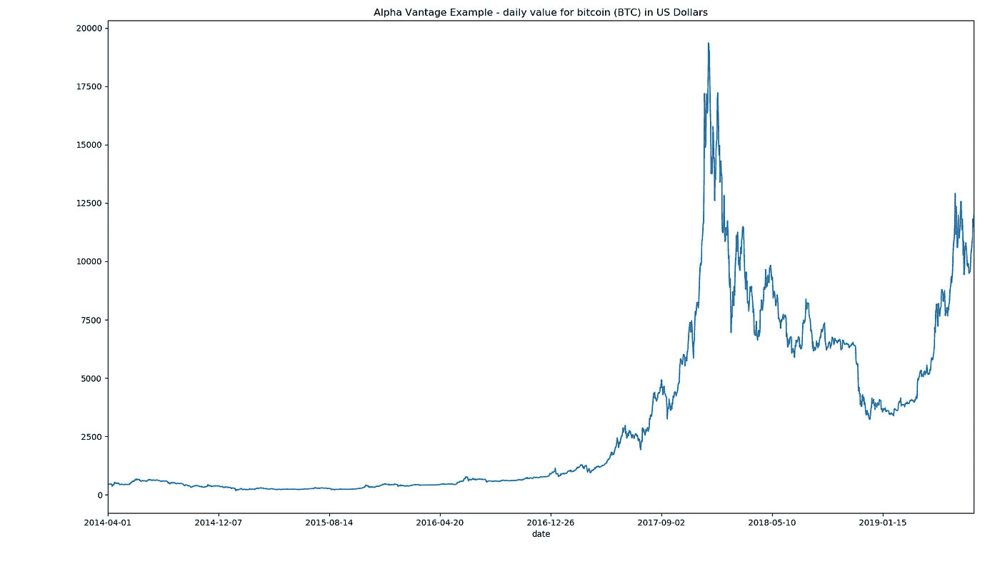

Plotted Image

其他类似的 API 示例有

*   开放通知 API — NASA 和国际空间站数据
*   汇率 API —欧洲中央银行发布的当前和历史外汇汇率

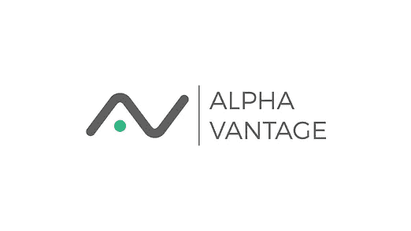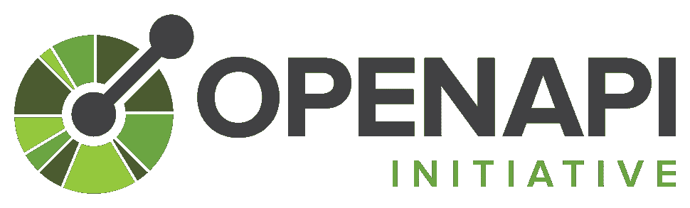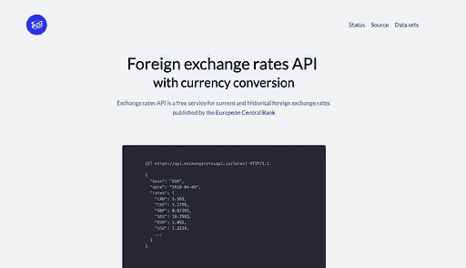

A few APIs for data collection

# 数据建模

正如本文中提到的，数据清理或平衡是数据建模之前的一个重要步骤。

## [1)不平衡学习](http://glemaitre.github.io/imbalanced-learn/index.html)

Imabalanced-learn 就是这样一个平衡数据集的工具。当一个类或类别的数据比其他类别的数据具有不成比例的大样本时，数据集是不平衡的。这可能会给分类算法带来巨大的问题，分类算法最终可能会偏向拥有更多数据的类。

 [## 亚马逊废除了显示对女性有偏见的秘密人工智能招聘工具

### (路透社)-Amazon.com 公司的机器学习专家发现了一个大问题:他们的新…

www.reuters.com](https://www.reuters.com/article/us-amazon-com-jobs-automation-insight-idUSKCN1MK08G) 

例如，该库中名为 Tomek-Links 的命令有助于平衡数据集。

```
from **imblearn.under_sampling** import **TomekLinks ** 
tl = **TomekLinks**(return_indices=True, ratio='majority') 
X_tl, y_tl, id_tl = **tl.fit_sample**(X, y)
```

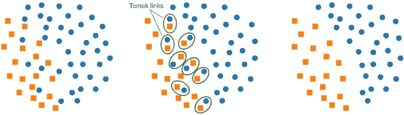

Balancing an imabalanced data set

## [2)冰冷的生态系统——NumPy](https://www.numpy.org/#)

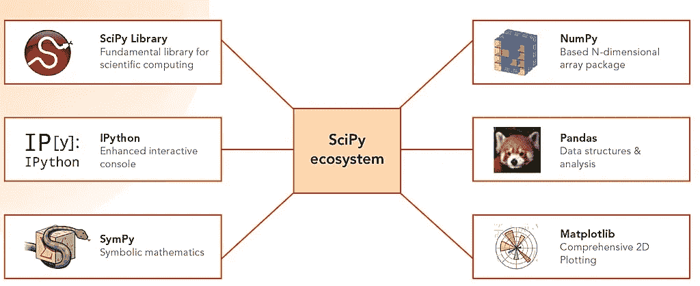

Image by [Ty Shaikh](https://medium.com/u/7b965a981ce?source=post_page-----39b3b9a4303a--------------------------------)

实际的数据处理或建模通过 python 的 scipy 堆栈进行。Python 的 SciPy Stack 是专门为 python 中的科学计算设计的软件集合。nScipy secosystem 包含了许多有用的库，但是 Numpy 无疑是其中最强大的工具。

最基本的包 NumPy 代表数值 Python，科学计算栈就是围绕它构建的。它为矩阵运算提供了大量有用的特性。如果有人使用过 MATLAB，他们会立即意识到 NumPy 不仅和 MATLAB 一样强大，而且在操作上也非常相似。

## [3)熊猫](https://pandas.pydata.org/pandas-docs/stable/reference/api/pandas.DataFrame.html)

Pandas 是一个提供数据结构来处理和操作数据的库。称为 dataframe 的二维结构是最流行的一种。

熊猫是数据争论的完美工具。它旨在实现快速简单的数据操作、聚合和可视化。

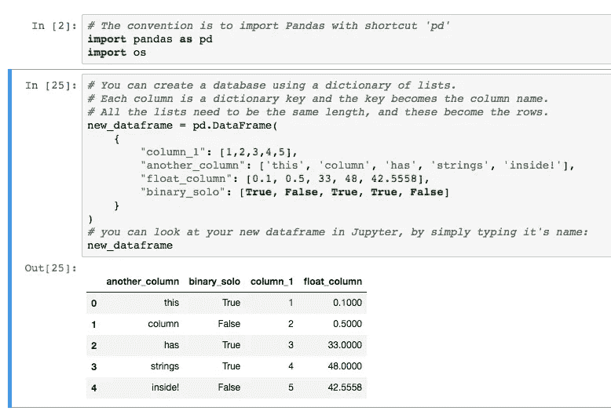

Example of a DataFrame — [Shanelynn](https://www.shanelynn.ie/using-pandas-dataframe-creating-editing-viewing-data-in-python/)

# 数据可视化

## 1) Matplotlib

SciPy 生态系统中的另一个软件包是 Matplotlib，它是为轻松生成简单而强大的可视化而定制的。这是一个 2D 绘图库，以各种硬拷贝格式生成出版物质量数字

Matplotlib 输出的一些示例

```
import numpy as np
import matplotlib.pyplot as pltN = 5
menMeans = (20, 35, 30, 35, 27)
womenMeans = (25, 32, 34, 20, 25)
menStd = (2, 3, 4, 1, 2)
womenStd = (3, 5, 2, 3, 3)
ind = np.arange(N)    # the x locations for the groups
width = 0.35       # the width of the bars: can also be len(x) sequencep1 = plt.bar(ind, menMeans, width, yerr=menStd)
p2 = plt.bar(ind, womenMeans, width,
             bottom=menMeans, yerr=womenStd)plt.ylabel('Scores')
plt.title('Scores by group and gender')
plt.xticks(ind, ('G1', 'G2', 'G3', 'G4', 'G5'))
plt.yticks(np.arange(0, 81, 10))
plt.legend((p1[0], p2[0]), ('Men', 'Women'))plt.show()
```

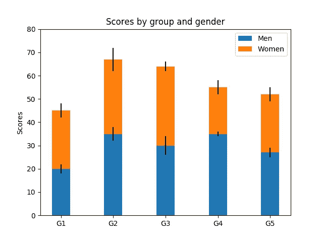

Bar Plot

其他几个例子

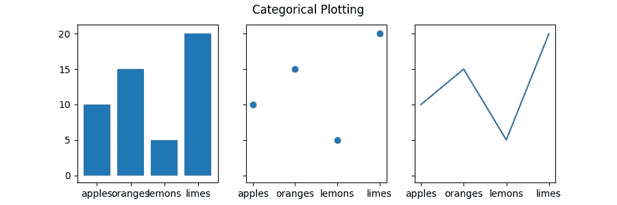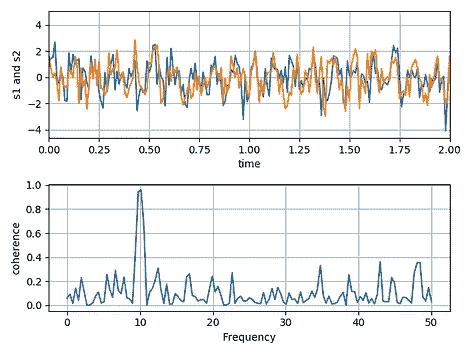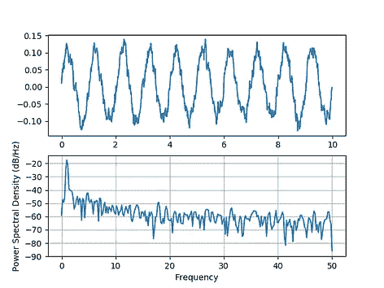

Taken from Matplotlib Docs

## 海洋生物

Seaborn 是一个基于 matplotlib 的 Python 数据可视化库。它**主要**为绘制有吸引力的和信息丰富的**统计图形**提供高级接口。它主要侧重于可视化，如热图

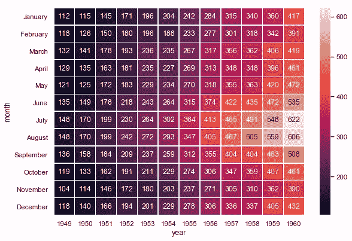

Seaborn docs

## [3)运动速度](https://pypi.org/project/moviepy/)

MoviePy 是一个用于视频编辑的 Python 库，包括剪切、拼接、标题插入、视频合成、视频处理和自定义效果的创建。它可以读写所有常见的音频和视频格式，包括 GIF。


[https://zulko.github.io/moviepy/gallery.html](https://zulko.github.io/moviepy/gallery.html)

## [奖金自然语言处理工具— FuzzyWuzzy](https://pypi.org/project/fuzzywuzzy/)

这个有趣的发声工具在字符串匹配方面是一个非常有用的库。人们可以快速实现诸如字符串比较比率、令牌比率等操作。

```
>>> **fuzz.ratio("this is a test", "this is a test!")**
    97
>>> **fuzz.partial_ratio("this is a test", "this is a test!")**
    100
>>> **fuzz.ratio("fuzzy wuzzy was a bear", "wuzzy fuzzy was a bear")**
    91
>>> **fuzz.token_sort_ratio("fuzzy wuzzy was a bear", "wuzzy fuzzy was a bear")**
    100
```

Python 拥有大量的信息和工具来执行数据科学项目。探索永远不会太迟！