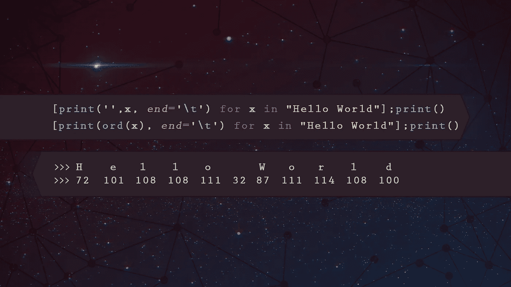

# Python 窍门 101，每个新程序员都应该知道的。

> 原文：<https://towardsdatascience.com/python-tricks-101-what-every-new-programmer-should-know-c512a9787022?source=collection_archive---------0----------------------->


A pretty picture to catch your eye.

Python 比以往任何时候都更受欢迎，人们每天都在证明 Python 是一种非常强大且易于掌握的语言。

我从事 Python 编程已经有几年了，最近 6 个月是专业的，以下是我希望在刚开始时就知道的一些事情:

1.  **字符串操作**
2.  **列表理解**
3.  **λ&map()**
4.  **if、elif 和 else 条件一行程序**
5.  **zip()**

# **# 1:** 琴弦操纵


Pun definitely intended

Python 非常擅长使用数学运算符`+`和`*`来决定如何处理字符串:

```
>>> my_string = "Hi Medium..!"
>>> print(my_string * 2)
**Hi Medium..!Hi Medium..!**>>> print(my_string + " I love Python" * 2)
**Hi Medium..! I love Python I love Python**
```

我们也可以很容易地反转一个字符串，使用`[::-1]`，这不仅限于字符串！：

```
>>> print(my_string[::-1])
**!..muideM iH**>>> my_list = [1,2,3,4,5]
>>> print(my_list[::-1])
**[5, 4, 3, 2, 1]**
```

单词列表呢？我们可以做一个尤达翻译机！：

```
>>> word_list = ["awesome", "is", "this"]
>>> print(' '.join(word_list[::-1]) + '!')
**this is awesome!**
```

上面我们使用了`.join()`方法，用`' '`(空格)连接反转列表中的所有元素，并添加一个感叹号。

# # 2:列出理解



哦，孩子，一旦我知道了这些，我的整个世界都变了(不是真的，但足够接近了)。这是对列表进行快速操作的一种非常强大、直观和可读的方式。

假设我们有一个随机函数，将一个数平方并加上 5:

```
>>> def stupid_func(x):
>>>     return x**2 + 5
```

现在，假设我们想将这个函数应用于列表中的所有奇数，如果您不知道列表的理解，这可能是您要做的:

```
>>> my_list = [1, 2, 3, 4, 5]
>>> new_list = []
>>> for x in my_list:
>>>     if x % 2 != 0:
>>>         new_list.append(stupid_func(x))
>>> print(new_list)
**[6, 14, 30]**
```

但是有一个更简单的方法！：

```
>>> my_list = [1, 2, 3, 4, 5]
>>> print([stupid_func(x) for x in my_list if x % 2 != 0])
**[6, 14, 30]**
```

List comprehensions 与语法`[ expression **for** item **in** list ]`一起工作，如果你想用一个额外的布尔条件，比如上面的“奇数”条件:`[ expression **for** item **in** list **if** conditional ]`这与:

```
>>> **for** item **in** list:
>>>     **if** conditional:
>>>         expression
```

非常酷！尽管如此，我们仍然可以做得更好，因为我们并不真的需要那个“`stupid_func`”:

```
>>> print([x ** 2 + 5 for x in my_list if x % 2 != 0])
**[6, 14, 30]**
```

嘣！

# # 3: Lambda & Map


Crazy paint skills coming in from the right

## 希腊字母的第 11 个

Lambda 有点奇怪，但就像这个列表中的其他东西一样，一旦你明白了，它真的很强大而且很直观。

基本上，Lambda 函数是一个小型的匿名函数。为什么匿名？因为 Lambdas 最常用于执行不需要像`def my_function()`这样的正式函数定义的小/简单操作。

让我们以上面的例子为例，将一个数平方并加 5。上面我们用`def stupid_func(x)`做了一个正式的函数定义，现在让我们用一个 lambda 函数重新创建它:

```
>>> stupid_func = (lambda x : x ** 2 + 5)
>>> print([stupid_func(1), stupid_func(3), stupid_func(5)])
**[6, 14, 30]**
```

那么为什么要使用这种奇怪的语法呢？当你想在不定义实际函数的情况下执行一些简单的操作时，这就变得很有用了。以数字列表为例，我们如何在 Python 中对这样的列表进行排序？一种方法是使用`sorted()`方法:

```
>>> my_list = [2, 1, 0, -1, -2]
>>> print(sorted(my_list))
**[-2, -1, 0, 1, 2]**
```

这样做了，但是假设我们想要按最小平方数排序，我们可以使用 lambda 函数来定义**键**，这是`sorted()`方法用来确定如何排序的。

```
>>> print(sorted(my_list, **key** = lambda x : x ** 2))
**[0, -1, 1, -2, 2]**
```

## 地图

Map 是一个简单的函数，用于将函数应用于一些元素序列，如列表。假设我们必须列出一个列表中的每个元素与另一个列表中相应的元素相乘的位置，我们如何做呢？使用 lambda 函数和映射！：

```
>>> print(list(map(lambda x, y : x * y, [1, 2, 3], [4, 5, 6])))
**[4, 10, 18]**
```

与这个怪物相比，这是简单而优雅的:

```
>>> x, y = [1, 2, 3], [4, 5, 6]
>>> z = []
>>> for i in range(len(x)):
>>>     z.append(x[i] * y[i])
>>> print(z)
**[4, 10, 18]**
```

# **# 4: if、elif 和 else 条件一行程序**


在代码的某个地方，您可能会看到这样的内容:

```
>>> x = int(input())
>>> **if** x >= 10:
>>>     print("**Horse**")
>>> **elif** 1 < x < 10:
>>>     print("**Duck**")
>>> **else**:
>>>     print("**Baguette**")
```

当你运行这个函数时，你会得到一个来自`input()`函数的输入，假设我们输入 5，我们会得到`Duck`。但是我们也可以用这样的一行程序来写整个事情:

```
print("**Horse**" **if** x >= 10 **else** "**Duck**" if 1 < x < 10 **else** "**Baguette**")
```

真的就那么简单！仔细阅读您的旧代码，您会发现许多地方可以将简单的条件 if / else 语句简化为一行程序。

*说到一行程序*，想只使用一行代码就获得整个数据集的概览吗？看看这个:

[](/exploring-your-data-with-just-1-line-of-python-4b35ce21a82d) [## 仅用一行 Python 代码探索您的数据

### 在不到 30 秒的时间内完成所有标准数据分析。熊猫侧写的奇迹。

towardsdatascience.com](/exploring-your-data-with-just-1-line-of-python-4b35ce21a82d) 

# # 5: zip()


还记得“`map()`”一节中关于在两个列表之间并行应用一些东西的例子吗？`zip()`让这变得更加简单。

假设我们有两个列表，一个包含名字，一个包含姓氏，我们如何有序地合并它们？使用`zip()`！：

```
>>> first_names = ["Peter", "Christian", "Klaus"]
>>> last_names = ["Jensen", "Smith", "Nistrup"]
>>> print([' '.join(x) for x in zip(first_names, last_names)])
**['Peter Jensen', 'Christian Smith', 'Klaus Nistrup']**
```

哇哦！哪里弄错了，我的名字不是彼得·詹森..但是我们知道如何轻松解决这个问题！：

```
>>> print([' '.join(x) for x in zip(first_names, last_names[::-1])])
**['Peter Nistrup', 'Christian Smith', 'Klaus Jensen']**
```

# 更像这样

如果您喜欢这些易于应用的东西来改进您的 Python 工作流，请看看我的新文章:

[](/7-things-to-quickly-improve-your-data-analysis-in-python-3d434243da7) [## 快速改进 Python 数据分析的 7 件事

### 让您的数据分析更上一层楼！

towardsdatascience.com](/7-things-to-quickly-improve-your-data-analysis-in-python-3d434243da7) 

# 结束语

这只是一个简单的列表，我把它放在一起是为了让你对 Python 能做的一些伟大的事情有个印象。请留下你的任何反馈，如果你想让我解释一些具体的事情，或者如果你觉得我犯了一个错误！

感谢阅读。希望您发现这很有用！

如果你想多看多学，一定要 [**跟着我上媒**](https://medium.com/@peter.nistrup) 🔍和 [**碎碎念**](https://twitter.com/peternistrup) 🐦

[](https://medium.com/@peter.nistrup) [## 彼得·尼斯特鲁普-中等

### 阅读彼得·尼斯特拉普在媒介上的作品。数据科学、统计和人工智能...推特:@PeterNistrup，LinkedIn…

medium.com](https://medium.com/@peter.nistrup)