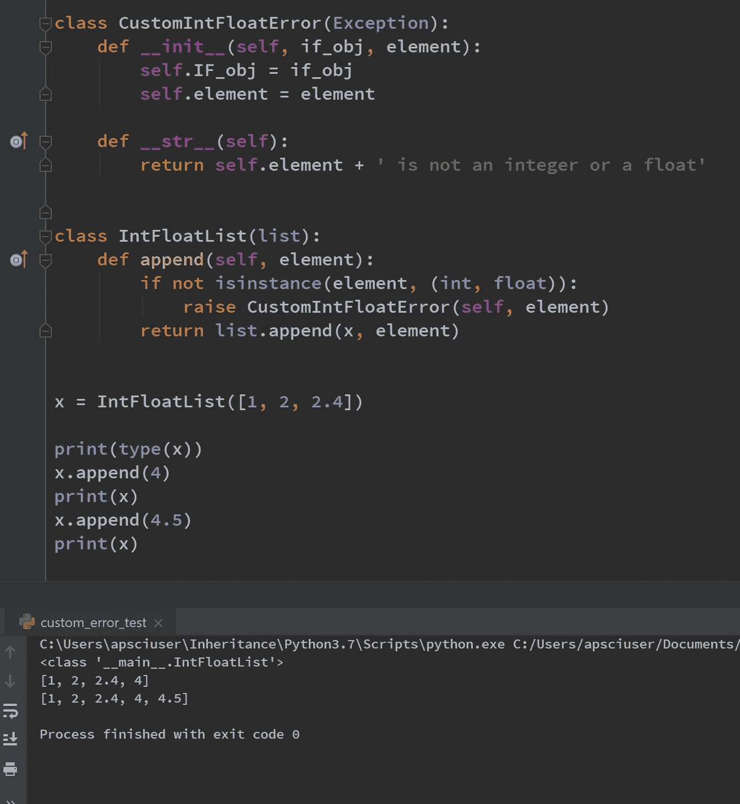
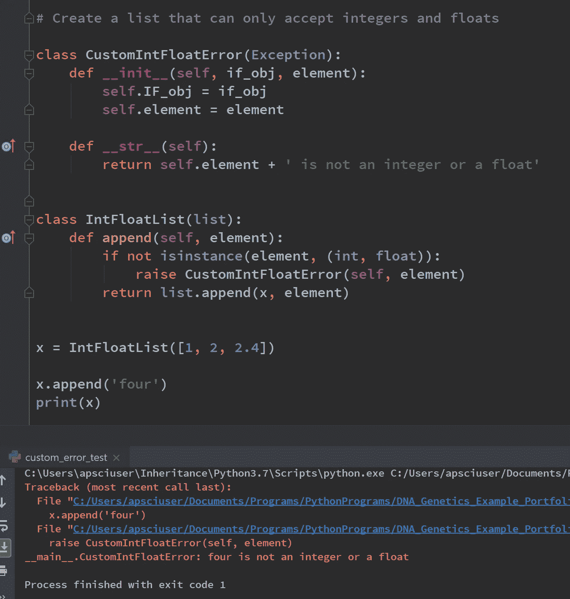
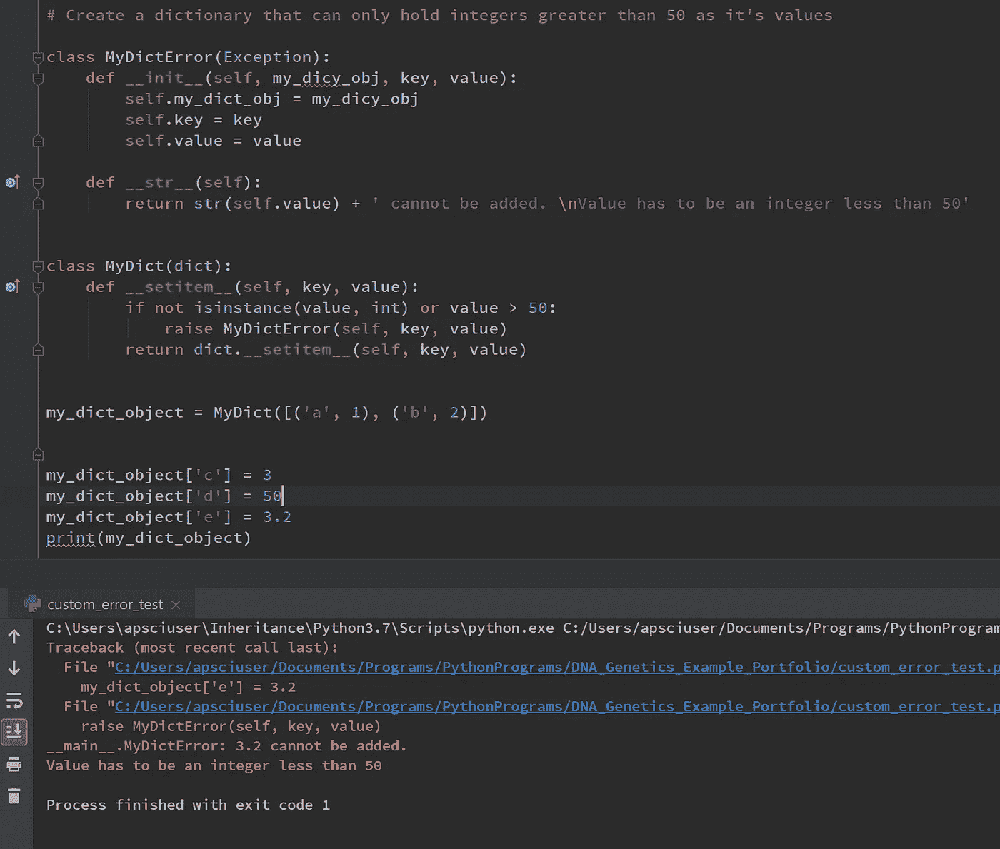

# Python 技巧，从内置数据类型继承

> 原文：<https://towardsdatascience.com/python-tricks-inheriting-from-built-in-data-types-f6cbeb8d88a5?source=collection_archive---------12----------------------->

# 了解如何简单地定制您的列表、字典等功能。

Image Courtesy of [Greg Rakozy](https://unsplash.com/@grakozy) via [Unsplash](https://unsplash.com/photos/oMpAz-DN-9I)

# 定制列表和字典的功能，以满足您的需求！

Python 让我们设计的类继承了内置的类。内置的继承(子)类共享内置的所有相同属性(包括方法)。

我们可以有效地利用核心内置功能，但定制选定的操作。这非常有帮助，因为内置行为是所有 Python 开发人员都熟悉的。这带来了使我们的继承类易于学习的好处。

这给了我们很大的权力，因为我们的对象可以像一个字典或列表对象在各个方面的行为，除了在我们决定要它表现不同的地方。

# 自定义列表对象

为了说明如何利用核心对象并根据我们的需求定制它们，让我们创建一个简单的场景。

让我们构建一个只接受整数和浮点数的自定义列表类。如果我们试图追加任何其他数据类型，比如说一个字符串，我们将生成一个定制的错误异常，这将有助于通知我们类的用户*这个*特定列表只能*接受整数和浮点数。*

我们首先创建一个从 build in list 类继承的 IntFloatList 自定义类。这意味着 IntFloatList 在各个方面都像一个列表，除了在 append 被调用的时候。

我们从内置的 list 类中覆盖了现有的 append 方法。从下面的图像中，可以清楚地看到蓝色的小圆圈，旁边有红色的箭头。append 有两个参数，一个是对象(在我们的例子中是 x)，另一个是我们想要追加的元素。

一个简单的条件语句，测试我们试图添加的元素是 int 还是 float 类的实例。如果不是，我将引发一个自定义的 CustomIntFloatError 异常。因为 Python 中的几乎所有东西都是对象，所以当我们引发 CustomIntFloatError 异常时，我们实际上是在创建 CustomIntFloatError 类的一个实例。

然后，我编写了一个自定义的 magic __str__ 方法，该方法采用新构造的 CustomIntFloatError 对象，并通知用户当我们试图追加一个字符串(比如说' four ')时，会出现一个自定义错误。

下面让我们看看它的功能！

到目前为止，一切顺利。对象 x 是一个 IntFloatList 对象，当我们将 4 或 4.5 添加到我们的列表中时，它们被正确地添加，并且列表的长度增加。但是，对于不是整数和浮点数的对象呢？

当我们试图追加字符串“four”时，会引发自定义错误异常。如控制台所示，一条错误消息通知用户 IntFloatList 是如何输出的。

When the user attempts to append a string object (here the string ‘four’), a useful error message is displayed, informing the user how the custom IntFloatList object is intended to be used.

虽然给出的例子可能不是非常有用，但它确实说明了我们如何定制内置类型来满足我们的需求。

# 自定义可以添加到字典中的值

为了再次演示，让我们创建一个自定义 dictionary 对象，它只能接受小于 50 的整数作为其值。

这里，我们需要从父 dict 类重新实现 __setitem__。__setitem__ 是我们在字典中设置键和值时调用的神奇方法。这是一个神奇的方法，这意味着它是隐式调用的。

如果用户试图添加大于 50 的值或非整数的数据类型，将会引发自定义的 MyDictError 异常。如果没有出现异常，dict。__setitem__ 将使用我们的对象调用，该对象将被处理，在本例中为“my_dict_object”。

我们现在可以看到 __setitem__，正如我们重新定义的那样，是一个与其他一些功能的挂钩，在设置键和值之前，我们可以做任何我们想做的事情。我们可以创建一个只允许某些键的字典，或者我们可以创建一个只允许某些类型的值的字典，就像这个例子所示的那样。

如果您想尝试自己运行代码片段，请使用下面显示的 GitHub gist，并进行测试。

这一次，当我试图添加一个浮点数(这里是 3.2)时，会引发一个自定义的 MyDictError 异常。输出的错误消息通知用户，当值被添加到字典中时，对该值的要求是什么。

# 摘要

我们可以创造功能强大但相对简单的物体。因为我们是从 list 或 dict 继承的，所以我们可以利用很多方法，而我们并没有真正意识到这一点。在这两个示例中，当没有引发异常时，将调用 parent __init__ 和 __repr__ 方法。

在本文中，我们学习了如何继承 Python 的内置对象，以及如何使用它们的神奇方法来改变它们的行为，同时保留它们的其他功能。

Python 对象模型的优雅赋予了这种语言整体的优雅和力量，并让它为我们所用。我们可以非常容易地将这些对象的使用传达给我们的开发伙伴。我们需要说的是，它的行为像一个列表或字典，但只是有一点不同，他们不需要学习方法名或一个新的接口，这是这种语言的一个非常强大的功能。