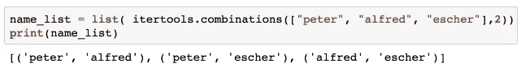

# Python 教程:模糊名称数据集的名称查找表

> 原文：<https://towardsdatascience.com/python-tutorial-a-name-lookup-table-for-fuzzy-name-data-sets-2580e4eca6e7?source=collection_archive---------17----------------------->

## [Python 统计教程系列](https://towardsdatascience.com/tagged/python-stat-tutorial)

## 通过使用姓名成分组合提高人名匹配的准确性

这是我们探索 Python 数据世界之旅的第六篇文章。点击标题上方的链接，获得所有文章的列表。

# 本教程的目标是

让我们回顾一下我们在[的最后一课](/python-tutorial-fuzzy-name-matching-algorithms-7a6f43322cc5)中所取得的成绩。我们建立了一个人的名字“模糊”的名字匹配算法，通过使用一个标准化的步骤以及双变音算法的力量。


All Name Components available

该算法可以处理姓名属性**中的错别字、特殊字符和其他差异，但如果 twitter 账户名称中缺少任何姓名成分，该算法就会失败。**


Two Name Components Available, one only available as an abbreviation

问题是 Twitter 帐户名称是由用户连接的，因此不具有确定性(我们假设他没有使用假名，并且有可能匹配)。正如我们在上一个教程中看到的，我们试图修复某些异常，但解决方案似乎不够健壮。因此，我们必须投入额外的时间来建立一个更健壮的解决方案，通过使用组合学来解决“缺少名称组件”的问题。

## 获取 Jupyter 笔记本以获得额外的教程解释

作为我自己进入 Python 数据科学世界的一部分，我最近开始玩 Python 的 [Jupyter Notebook](https://jupyter.org/index.html) 。

> Jupyter Notebook 是一个开源的 web 应用程序，允许您创建和共享包含实时代码、等式、可视化和叙述性文本的文档。用途包括:数据清理和转换、数值模拟、统计建模、数据可视化、机器学习等等。

这简直太棒了，而且通过 [Ancaconda](https://www.anaconda.com/distribution/) 发行版几分钟就安装好了(你的机器上需要一些备用磁盘空间)。

我把它整合到了我的训练过程中，从现在开始，我将在 Jupyter 的专用笔记本中更详细地描述算法和编码的构建。

你可以在[我的 Github 项目](https://github.com/talfco/clb-sentiment/blob/master/jupyter/lesson6/tutorial6.ipynb)中找到本教程的 Jupyter 笔记本。使用 Jupyter 笔记本(与本教程并排)，允许您在笔记本中随意摆弄和实时修改代码序列。令人惊讶的是，Github 以其原始的、易于阅读的 Web 视图格式呈现了一个 Jupyter 笔记本文件。以防你想看只读格式的！


Jupyter Notebook rendered in Github

# 在名称匹配过程中处理缺少的名称组件

我们想要实现的是，我们的算法能够管理丢失的名称组件。在下面的示例中，我们可以通过省略两边的第二个名称组件来实现匹配。


显然，我们想要一个通用算法，它可以处理 twitter 帐户名称中的任何复杂性，也就是说，在命名结构中也应该有可能进行匹配，如:

*   “梅德医生。彼得·埃舍尔(苏黎世)"或
*   “梅德医生。彼得·埃舍尔(苏黎世)”，用户打错了一个字。

我们用组合学解决的第一个问题，第二个问题，我们已经通过应用著名的双变音算法解决了。

# 组合和排列的简明介绍

为了在缺少元素的情况下导出任何种类的名称成分星座，我们必须理解组合学中的基本概念。

## 我们应该使用组合还是排列

先来回答这个问题。离开学校太久？看看这个有帮助的六分钟视频(来自 betterExplained.com),它更新了各种概念。

Permutations/Combinations explained

Python 在其标准库 *itertools* 中已经提供了函数*置换*和*组合*，我们想进一步研究一下。

让我们将它应用于我们的名称示例，以了解其机制。首先是*组合*功能



以及*排列*功能:


如您所见，在排列中，名称组件的**顺序起着作用**。有一个用于`('peter','alfred')`的元组和一个用于`('alfred','peter')`的元组。在组合中，名称组件的**顺序与**无关。

对我们来说，顺序不起作用，`'peter escher'`被视为`'escher peter'`在应用双音素算法之前，我们无论如何都要对姓名成分进行排序。因此我们使用组合函数。

请始终将“个人识别码”视为“排列”的摇篮。任何 pin 码锁定机制都是基于 10 个元素中给定的一组“数字”的排列数:“1234”不能解锁被“4321”锁定的屏幕。


ATM — Photo by [Mirza Babic](https://unsplash.com/photos/eYZpTMc7hno?utm_source=unsplash&utm_medium=referral&utm_content=creditCopyText) on [Unsplash](https://unsplash.com/search/photos/atm?utm_source=unsplash&utm_medium=referral&utm_content=creditCopyText)

# 为名称组合建立一个查找目录

我们现在构建一个查找目录类，它允许我们存储姓名组件组合，并将它们与我们从 Twitter API 获得的人名进行比较。

## 将人员添加到查找目录

方法`add_person_to_lookup_table` 计算所提供的姓名元组的所有组合，为每个组合生成相关联的双变音键，并将该键与唯一的个人 id 一起存储在查找目录中。

该方法的序列图如下所示，让我们看看所需的各种帮助方法。


## 方法:生成组合

作为第一步，我们生成名称元组的所有组合。下面的方法计算名称元组的所有组合。例如，对于 3 个元素的元组，构建的数组包括

*   三元素元组本身
*   具有 3 个元素中的 2 个元素的组合的所有元组
*   具有 3 个元素中的 1 个的组合的所有元组

例如，下面的 3 个名称元组导致下面的组合列表。


## 方法:将组合添加到目录

在这种方法中，我们通过将每个元组添加到我们的查找目录来构建目录。

我们的查找目录由两个字典的元组组成，这两个字典用于存储键、值对。我们的键是从名称创建的双变音元组，值是唯一的个人标识符。

```
__lookup_dict = ({}, {})
```

该方法如下所示

在第 3 行代码中，我们用名称组件元组创建了一个规范化的名称字符串。该方法如下所示

结果是排序后的串联元组名称元素的小写字符串:


该字符串用于生成双变音元组，这是我们的字典的键。

在代码行 5 和 10 中，我们检查字典中是否已经有一个具有相同键的条目。

*   如果没有，我们添加新的键，值对。
*   如果已经有一个条目，我们首先检查是否已经存储了`person_id`。如果不是，我们将`person_id`添加到值数组中。

## 方法:将人员添加到查找目录

最后，我们准备好了方法，它允许我们将名称元组添加到查找目录中。

例如，我们将以下三个人添加到查找表中。


正如我们在输出中所看到的，我们的带有关键字`'PTR'`的 Peter 条目有一个三人标识符数组。

# 在我们的查找目录中匹配一个名字

我们的查找目录现在已经准备好了，可能会填充人名数据，这些数据是通过我们的政府 API 检索的。

缺少的是`match_name`方法，该方法允许我们查找通过 Twitter API 检索到的名称。我们现在要解决这个问题。

我们的第一步是将所有查找目录条目——与我们搜索的名称元组匹配——收集到一个结果列表中。

*   在代码行 3 中，我们通过现有的方法生成了所有名称组件组合，并对所有组合进行了迭代
*   在代码行 5 和 6 中，我们为查找准备了组合元组的键元组。
*   在代码行 7 中，我们检查我们的密钥是否存在。如您所见，我们只对双变音元组的第一个条目进行检查，它存储在查找目录的第一个条目中。我们将基于双变音元组的排序特性的完整实现作为练习。

```
if metaphone_tuple[0] in self.__lookup_dict[0]:
```

在我们的样本加载查找目录上运行`match_name` 方法会产生以下输出:


正如我们所看到的，我们有两个指向一个`person_id`的元组和一个指向三个人的元组`peter`(显然姓氏被多人重复使用)。指向一个人的二元组有**相同的** id `'A123'`。这意味着我们的匹配只确认了一个人。如果我们的结果中有指向不同人的单人元组，这意味着我们的匹配不是唯一的。

因此，我们增强了我们的方法来进行这种唯一性检查(代码行 12–20):

*   我们的匹配列表中有一个或多个元组总是指向一个人吗？
*   如果是，我们发现了一个唯一的记录，否则我们返回 *None*

让我们在测试样本上验证该算法(如上所述，所有内容也可以作为交互式 Jupyter 笔记本使用)


所以我们准备将新的查找策略应用到我们的程序中。

# 重构我们现有的类

## GovAPI 类扩展


我们通过集成一个`NameLookupDirectory`类实例来增强我们的抽象`GovAPI`类。

```
class GovAPI(ABC):
  def __init__(self):
    self._members = []
    self._nameLookupDirectory =  NameLookupDirectory()
```

我们用代码序列增强了`add_person_record`,以构建我们的查找目录(代码行 22–29)

我们还为`match_name`检查添加了一个新方法，当我们试图合并表记录时会调用这个方法。

```
def match_name(self, name_tuple):
    return self._nameLookupDirectory.match_name(name_tuple)
```

不再需要下面的`calculate_name_matching`方法。

## SocialMediaAnalyzer 类重构

在这个类中，我们还必须重构`calculate_name_matching`方法，我们现在调用匹配的`govAPI`类实例的`match_name`方法(第 5 行)。

如果我们有一个匹配(7–14)，我们从 govAPI 类中检索完整的 person 记录。

记住,`calculate_name_matching`方法是通过 Panda `apply`方法在每个行记录上调用的，因此，该行将由附加的新列补充:

```
panda_data = { 'ScreenName' : self.__col_screen_name,
               'Name': self.__col_name,
               'Description': self.__col_description,
               "FollowersCount": self.__col_followers_count,
               "FriendsCount": self.__col_friends_count,
               "Party": self.__col_party
               }
df = DataFrame(panda_data, index=self.__labels)
df = df.apply(self.__calculate_name_matching, axis=1)
```

当我们再次执行程序时，Twitter 检索到的表如下所示:


在`col_match1`中，我们列出了 govAPI 惟一 id，在`col_match2`中，我们列出了结果元组列表，并对其进行了分析。例如


对于 Twitter 名称“Christian Levrat ”,我们在查找表中找到了三个条目:

*   “christian leverat”映射到 1 个人 id (1150)
*   “christian”映射到 5 个人 id
*   “leverat”映射到 1 个人 id (11509

我们的匹配算法有一个肯定的匹配，因为两个条目都指向同一个人 id。

# 评估我们算法的假阳性

让我们检查一下误报的算法。

什么是误报？

> 假阳性是指当你应该得到阴性结果时，却得到了阳性结果。它有时被称为“[假警报](https://www.statisticshowto.datasciencecentral.com/false-alarm-ratio-definition/)或“假阳性错误”它通常用于医学领域，但也可以应用于其他领域(如软件测试)。( [Ref](https://www.statisticshowto.datasciencecentral.com/false-positive-definition-and-examples/)

假阳性意味着我们算法的准确性有问题。

## 假阳性 1

当我们浏览 Twitter 表时，会遇到下面的记录。


它们都指向同一个人员 id。在检查 govAPI 表中的记录时，我们得到以下记录“74 Christoph Eymann”，它没有 Twitter 帐户，因此在 Twitter 表中找不到。


**哪里出了问题:**

“Christophe Darbellay”和“Christoph mrgeli”曾是瑞士委员会的政治家，因此不在 govAPI 名单中，我们只对活跃成员进行了筛选。


“Christophe”和“Christoph”被转换成相同的双变音字符串，并且与“Christoph Leymann”的 govAPI 记录 74 相匹配。由于 govAPI 列表中只有一个姓“Christoph”的人，因此我们的算法会为任何姓“Christoph(e)”的人返回一个误报，并将其与“Christoph Leymann”进行匹配。govAPI 会列出两个姓“Christoph”的人吗？匹配记录会指向两个人的 id，不再是唯一的。我们的算法在这种情况下不会导致假阳性。


**解决方案**:

嗯，我们必须重新调整我们的算法，使它更加严格。这意味着我们改变了名称元组生成器的条件

> 仅允许至少将姓氏作为元素的名称组件元组。

因此，当调用者向目录中添加一个人时，我们重新调整我们的方法，要求调用者提供姓氏在元组中的位置。

```
def add_person_to_lookup_directory(self, person_id, name_tuple, last_name_pos):
    tuples = self.generate_combinations(name_tuple)
    self.add_combinations_to_directory(tuples, person_id, name_tuple[last_name_pos])
```

在`add_combinations_to_directory`方法中，我们现在只添加包含姓氏的元组(第 3 行)。

重新运行我们的程序会产生以下匹配的统计数据。


Matching via Lookup Directory

这实际上并不比我们的第一次尝试更好(参考下面的[教程](/python-tutorial-fuzzy-name-matching-algorithms-7a6f43322cc5))，但是我们得到了一个更健壮的匹配算法。看起来使用的 Twitter 政治家列表在联邦议会的活跃成员中并不是真正最新的。但是，这是下一课要讲的内容，我们想在下一课结束数据匹配的话题，然后继续。

源代码你可以在相应的 [Github 项目](https://github.com/talfco/clb-sentiment)中找到，所有其他文章的列表[在这里](https://twitter.com/i/moments/1092507080307720193)。

编码愉快。