# Python 简介#3:使用工厂模式连接政府数据 API

> 原文：<https://towardsdatascience.com/python-tutorial-connect-government-data-apis-by-using-the-factory-pattern-501e5c65ba6d?source=collection_archive---------33----------------------->

## [Python 统计教程系列](https://towardsdatascience.com/tagged/python-stat-tutorial)

## 从公共政府数据 API 中获取政治家数据，以提高分配准确性

点击标题上方的链接，查看所有教程文章的列表。

在本教程中，我们主要做两个步骤

*   首先，我们从收集的数据中生成一些图表，
*   其次，我们将一个公共政府 API 连接到我们的程序，以可靠的方式检索政府成员和党派分配

所有教程的列表可以在[这里](https://twitter.com/i/moments/1092507080307720193)找到。

正如你已经知道的，我们对一个通用程序感兴趣，它可以在多个国家工作。为此，我们将在教程的第二部分介绍一个抽象类和工厂模式。

# Plotly 图表生成

但是让我们从第一个非常简单的任务开始，为我们的表生成两个图表。

我们创建了条形图和饼图。作为基础，我们以我们的 plotly 表 *CH-tw-party-list* 。

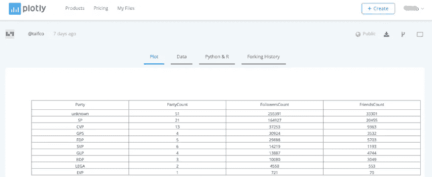

代码很简单:

*   在条形图中，我们直观地显示了每个聚会累积的朋友数。
*   在饼状图中，我们汇总了每一方的 twitter 账户。

从代码摘录中可以看出，各种配置参数允许您修改图表的布局。前往 [Plotly Python 开源图形库](https://plot.ly/pandas/)了解更多关于图表、panda 和 Plotly 的多种可能性。

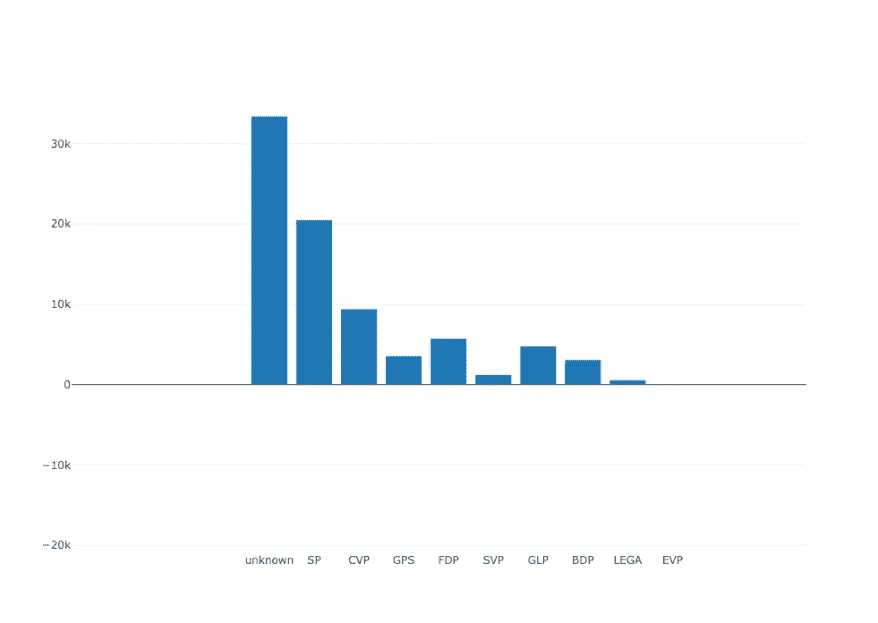

正如你所看到的，我们有很多“未知数”，也就是说，我们不能仅仅通过分析 Twitter 数据元素来确定相应的一方。在本教程的第二部分，我们将连接另一个数据源来解决这个问题。


# 政府数据 API 工厂


Photo by [Rodney Minter-Brown](https://unsplash.com/photos/zb29xBwpt6c?utm_source=unsplash&utm_medium=referral&utm_content=creditCopyText) on [Unsplash](https://unsplash.com/search/photos/factory?utm_source=unsplash&utm_medium=referral&utm_content=creditCopyText)

近年来，所谓的开放政府 API 的可用性激增。它源于数据应该开放的理念，正如维基百科对术语[开放数据](https://en.wikipedia.org/wiki/Open_data)的描述:

> 开放数据的理念是，一些数据应该免费提供给每个人使用和重新发布，不受版权、专利或其他控制机制的限制。
> 
> 开放数据的最重要形式之一是开放政府数据(OGD)，这是由执政的政府机构创建的一种开放数据形式。开放政府数据的重要性在于它是公民日常生活的一部分，甚至是看似远离政府的最日常/最平凡的任务。

获得政府数据 API 概述的一个很好的起点是 programmableweb 目录，它列出了 20，000 多个不同的 API。

政府 API 类别可在此处找到:

[https://www.programmableweb.com/category/government/apis?类别=20094](https://www.programmableweb.com/category/government/apis?category=20094)

政府空气污染指数的两个例子:

美国政府的数据 API:【https://www.data.gov/developers/apis T3

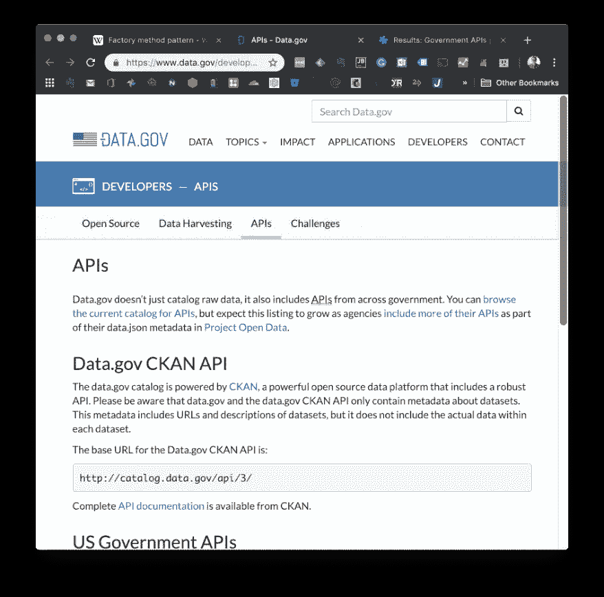

或者瑞士议会的瑞士政府 API:【http://ws-old.parlament.ch/ :

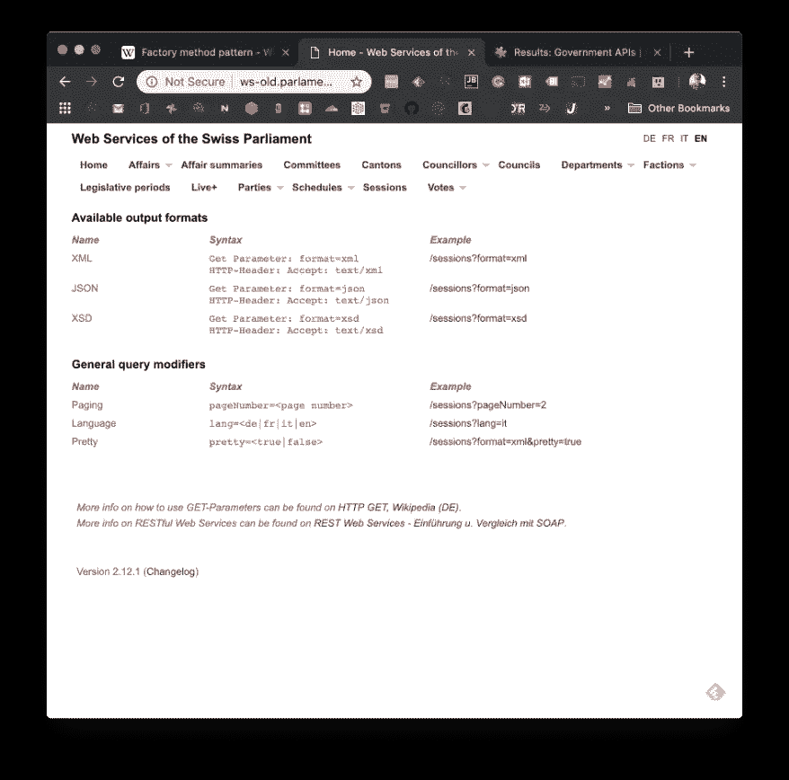

我们将使用瑞士议会 API 提取议会成员的个人数据(主要是政党分配)，以提高我们的 twitter 匹配算法的准确性。

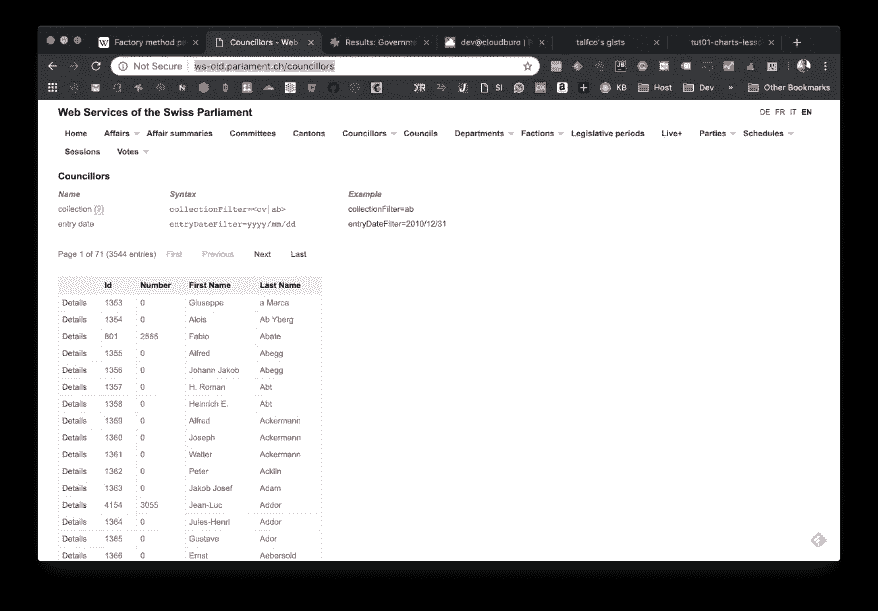

正如我们在第二篇教程中已经解释过的，一个公共 API 可能会返回很多信息。为了控制一个请求中返回的数据量，使用了游标或分页机制的概念。

瑞士议会 API 在一次请求中返回大约 25 条记录。最新的请求记录将附带一个属性，告诉您是否有更多可用的数据( *hasMorePages=true* )。

如果设置为' *true* ，您可以通过添加查询参数: *pageNumber=2* 等获取下一页。

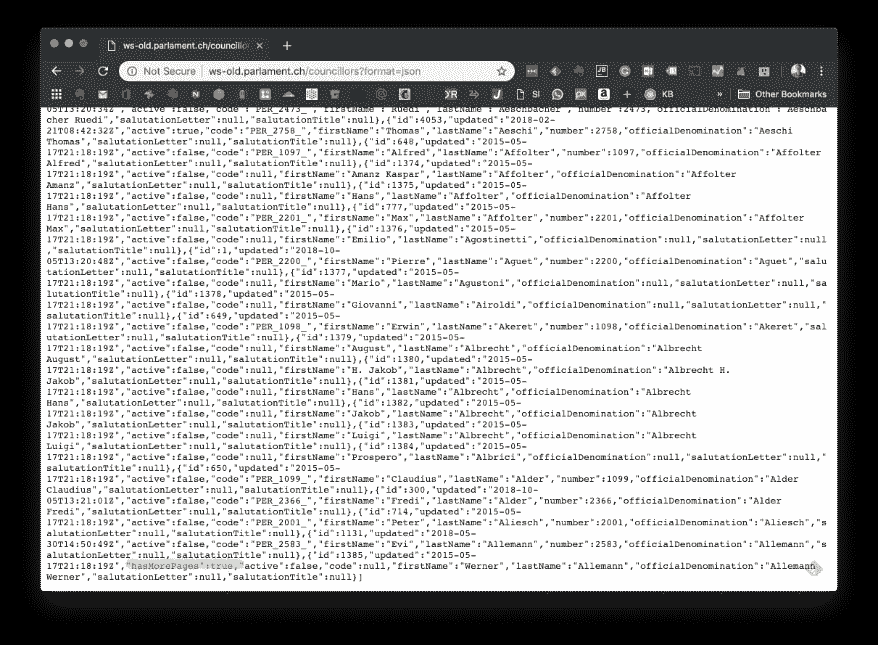

你可以在 API 的用户文档中找到这类信息，例如，瑞士议会 API 有一些控制输出格式、语言等的参数。

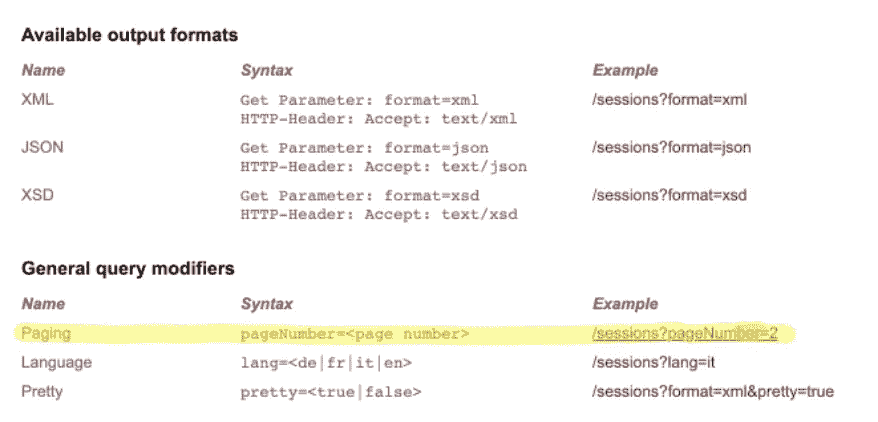

现在对 API 有了基本的了解，我们可以增强程序，使其能够从特定国家的政府 API 中读取数据。让我们深入研究代码。

# 增强代码 UML 图

以一种通用的方式引入政府 API 需要对我们的程序进行一些认真的设计和改进。我们的增强程序的 UML 类图如下所示(不要被复杂性淹没，所有细节将在本文后面解释)。

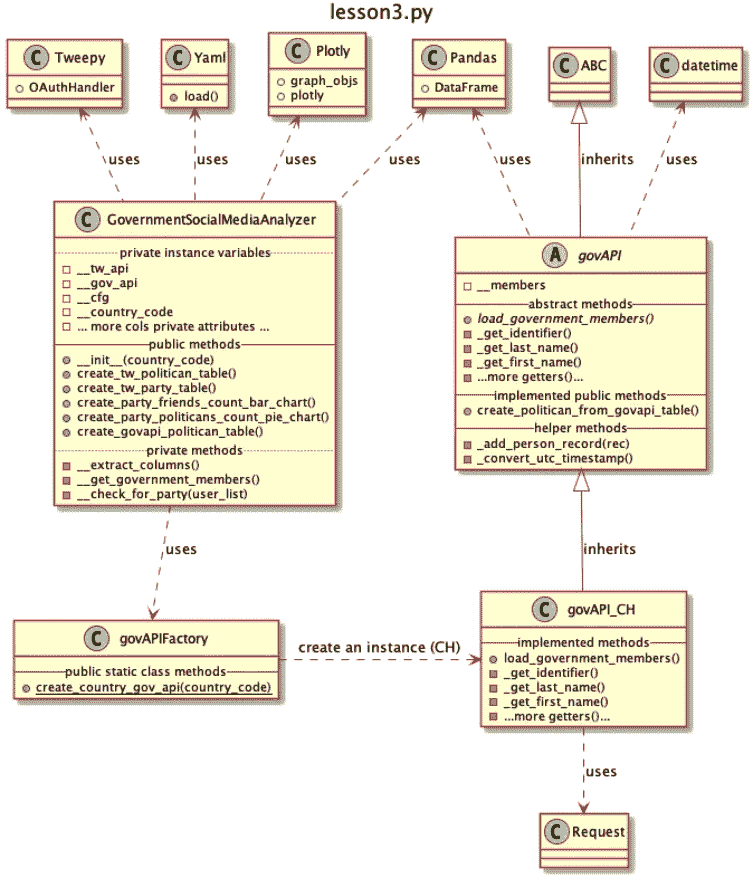

我们到目前为止所做工作的快速总结:

*   我们在第二个[教程](/python-tutorial-government-social-media-analyser-class-build-out-12858190b284)中创建了 GovernmentSocialMediaAnalyzer 类，它能够检索一个国家的政治家的 twitter 相关账户数据。我们使用了一种基于配置驱动的方法——基于 YAML——将特定于国家的数据抽象到一个配置文件中
*   定义了几种方法，使我们能够创建 panda 数据框，以及 plotly 特定的表格和图表。

现在我们将引入三个新类 *govAPIFactory* 、 *govAPI* (一个抽象类)和 *govAPI_CH* ，它们将构建一个通用的方法来连接任何类型的政府 API。

软件设计模式在软件设计中起着重要的作用，正如 [Wikipedia](https://en.wikipedia.org/wiki/Software_design_pattern) 所描述的:

> 在软件工程中，软件设计模式是对软件设计中给定上下文中常见问题的通用、可重用的解决方案。它不是一个可以直接转化为源代码或机器码的成品设计。它是如何解决一个问题的描述或模板，可以在许多不同的情况下使用。设计模式是形式化的最佳实践，程序员可以用它来解决设计应用程序或系统时的常见问题。

在我们的设计中，我们将使用工厂方法模式将连接推广到政府 API，这由[维基百科](https://en.wikipedia.org/wiki/Factory_method_pattern)解释如下:

> 在基于类的编程中，工厂方法模式是一种创造性的模式，它使用工厂方法来处理创建对象的问题，而不必指定将要创建的对象的确切类。这是通过调用工厂方法(在接口中指定并由子类实现，或者在基类中实现并可选地由派生类重写)而不是通过调用构造函数来创建对象来完成的。

我们的设计将以策略为基础，来定义

*   一个抽象的基类(父类— *GovAPI* )
*   一个派生类(child — *GovAPI_CH* )，它将具有特定于国家的实现(如瑞士)。
*   将来，我们可以引入额外的类，例如对于英国，我们将构建实现类: *GovAPI_UK*

# 抽象基类“GovAPI”

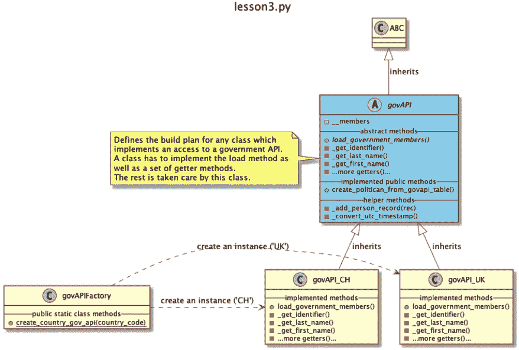

govAPI 是一个抽象类，包含几个抽象方法。抽象方法是已声明但不包含实现的方法。

在 Python 中，抽象类是从 ABC 类派生(或继承)的，并且将有一个或多个标有@abstractmethod 的方法。

所以抽象类为你提供了一个构建计划，在我们的类 *govAPI_CH* 中，任何继承它的实现类。

*govAPI_CH* 要实现什么样的方法？

首先，*load _ government _ members()*方法的实现必须处理从政府 API 获取的政治家的数据记录。每个提取的记录——代表一个政治家的数据——必须传递给方法 *add_person_record* (该方法已经由 *govAPI* 基类实现)

现在的问题是， *add_person_record* 方法到底在做什么？好吧，看看下面的代码。

该方法只是为我们的个人记录准备一个目标字典。即定义的属性名(*姓*、*名*、*会*等)。)是我们希望用于任何 *GovAPI* 实现的名称。

这意味着我们检索的记录以专用政府 API 实现的形式(即以瑞士政府议会 API 的形式)必须通过使用一堆 getter 方法来转换。

这些 getter 方法要么是抽象的，要么返回空字符串。提供正确的 getter 实现是继承类( *GovAPI_CH* )的实现者的责任。

# 实现类“GovAPI_CH”

下面显示了 *GovAPI_CH* 的 getter 方法实现。它由一组 getter 方法组成，这些方法将从记录中返回所需的属性值。

让我们深入到方法*load _ gegovernment _ members*:

我们的实现使用了 python 模块 [*requests*](http://docs.python-requests.org/en/master/) ，这是“一个优雅而简单的人类 HTTP 库”在本文的简介部分，我们提供了瑞士议会 API 的概述。下面的代码将使用分页机制获取数据。

我们将 URL 及其参数放在配置 YAML 文件中。

```
govAPIUrl: "http://ws-old.parlament.ch/" 
govAPICouncillorsRes: "councillors" 
govAPIParams: 
  - format : "json"
```

*   8:第一个 *requests.get* 将获取所有议员概况页面[http://ws-old.parlament.ch/councillors?format=json&page number = 1](http://ws-old.parlament.ch/councillors?format=json&pageNumber=1)。
*   15:如果数据记录被标记为*激活*,将提取详细记录
*   17:第二个请求将使用记录的 id*和细节记录的 URL。也就是说，在这个例子中，我们获取了 id 为‘1358’的政治家记录:[http://ws-old.parlament.ch/councillors/1358?format=json](http://ws-old.parlament.ch/councillors/1358?format=json&pageNumber=1)*
*   19:我们将检索到的详细记录传递给方法 *addPerson* ，该方法将把提供的数据记录转换成目标记录(通过使用我们已经实现的 getters)。
*   20:最后，我们检查 *hasMorePages* 属性，如果到达最后一条记录，我们将中断循环。

上述方法将在 *govAPI* 函数*create _ political _ from _ govAPI _ table*(已经由 govAPI 父类实现)中调用，该函数将把政客记录列表转换为 Panda 数据帧。

## 正则模型

重要的是要认识到，只要我们基于 govAPI 抽象类实现一个特定的类，这个 Panda 数据帧的结构将与任何种类的政府 API 相同。所以我们将数据标准化，这样我们就可以用标准化的方式工作和处理它。

我们再次努力实现一个重要的设计模式，我们的目标结构(或模型)，被称为[规范模型](https://en.wikipedia.org/wiki/Canonical_model)。正如维基百科所描述的:

> 规范模型是一种用于在不同数据格式之间进行通信的设计模式。本质上:创建一个数据模型，它是所有其他模型的超集(“规范的”)，并创建一个“翻译”模块或层，所有现有的模块通过它与其他模块交换数据。

从概念上讲，我们已经建立了一个迷你数据管道。对于每个政府 API，我们必须实现一个数据记录获取函数和转换规则(getters ),将数据转换为我们的标准化数据。

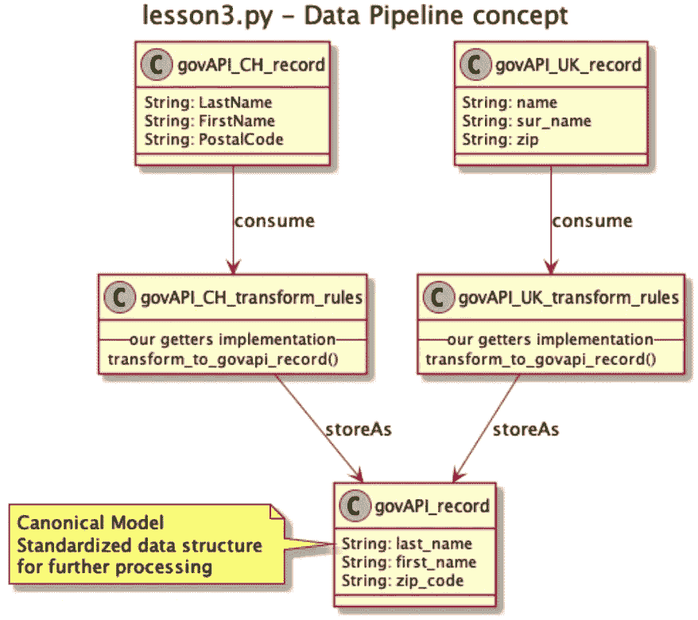

整个模式在 UML 序列图中可视化。

*   “消费”操作由步骤 60 表示
*   “转换规则”操作由步骤 80-120 表示。
*   “存储”操作由步骤 130 表示

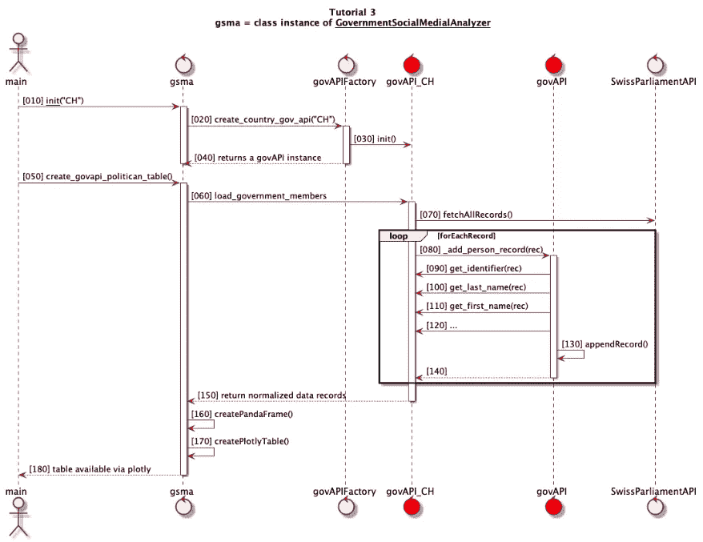

重要的是你要理解各种类的职责。 *govAPI* 和 *govAPI_CH* (红点)对外界可见( *govAPIFactory* ， *gsma* )作为一个类实例。对于调用者来说，谁实现哪个方法并不重要。

# govAPIFactory 类

还缺少最后一个东西，即 *govAPIFactory* 类，它非常简单。根据 *country_code* ，将创建相应的实现类实例并返回给调用者:

可以看到，这个类只有一个类方法。即 *GovAPIFactory* 不支持对象实例。一个工厂在一个程序中只包含一次，这被称为单例模式。

> 在[软件工程](https://en.wikipedia.org/wiki/Software_engineering)中，**单件模式**是一种[软件设计模式](https://en.wikipedia.org/wiki/Software_design_pattern)，它将一个[类](https://en.wikipedia.org/wiki/Class_(computer_programming))的[实例化](https://en.wikipedia.org/wiki/Instantiation_(computer_science))限制为一个。当只需要一个对象来协调整个系统的动作时，这很有用

我们在这里使用了一个派生，通过只有一个静态类方法来确保单例性。

这是相当多的内容要吸收，我们介绍了两个重要的设计模式工厂方法和规范的数据模型，以及如何生成第一对图表。

*lesson3.py* 程序将在 Plotly 内生成名为 *CH-govapi-member-list* 的表格。


今天就到这里，在下一篇文章中，我们将开始通过结合两个数据源来进行一些数据分析。

# 锻炼

你可以在这里找到练习教程:[链接](https://dev.cloudburo.net/2019/02/18/python-tutorial-exercise-3-implement-the-govapi_uk-class.html)

# 源代码

源代码可以在这里找到(第三课目录):[https://github.com/talfco/clb-sentiment](https://github.com/talfco/clb-sentiment)

# 进一步阅读

如果您想更深入地了解设计模式和 Python 的主题，请阅读下面的文章"[确保代码整洁:Python 的一瞥，参数化的](https://www.toptal.com/python/python-parameterized-design-patterns)"

*原载于 2019 年 2 月 11 日*[*dev.cloudburo.net*](https://dev.cloudburo.net/2019/02/11/python-tutorial-connect-government-data-api-s-by-using-the-factory-pattern.html)*。*