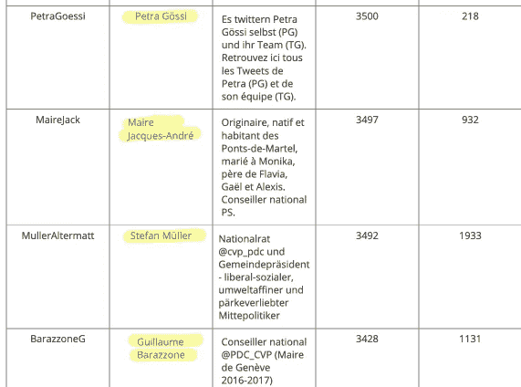
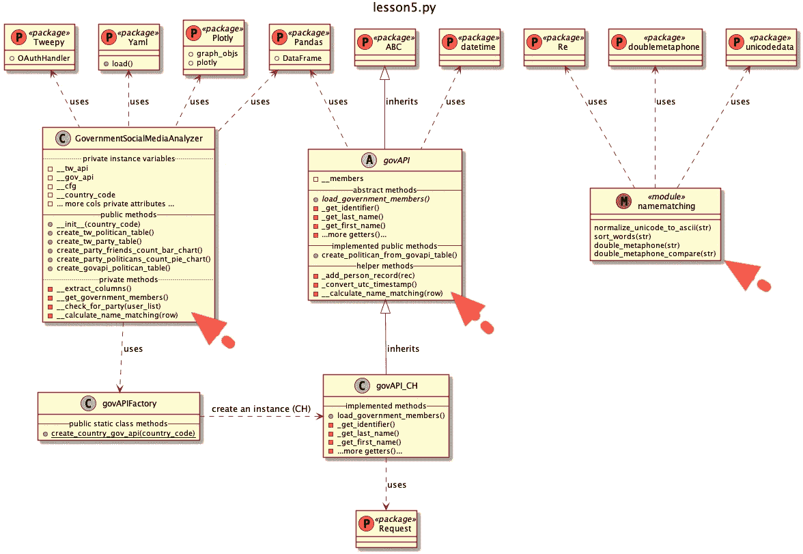
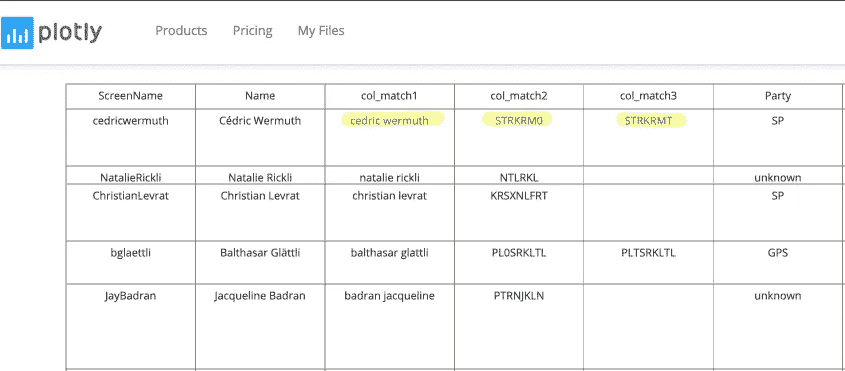
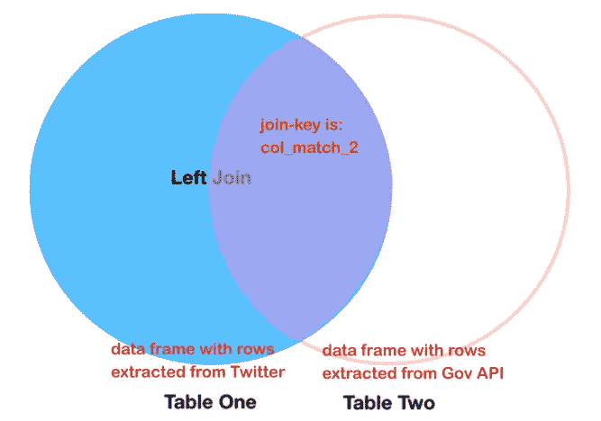
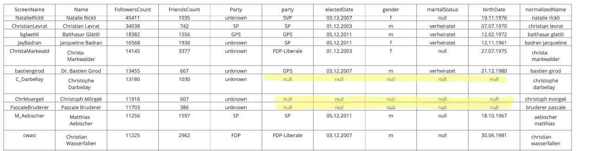
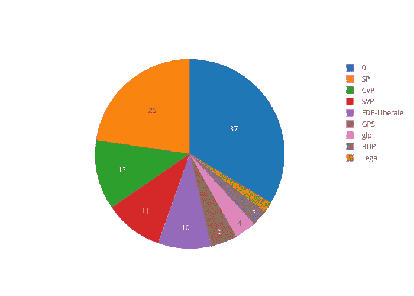
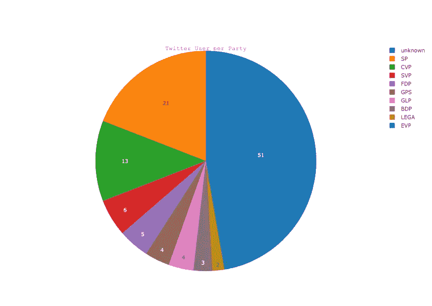

# Python 教程:模糊名称匹配算法

> 原文：<https://towardsdatascience.com/python-tutorial-fuzzy-name-matching-algorithms-7a6f43322cc5?source=collection_archive---------3----------------------->

## sur [Python 统计教程系列](https://towardsdatascience.com/tagged/python-stat-tutorial)

## 如何应对用作标识符的人名变量的可变性和复杂性？

这是我们探索 Python 数据世界之旅的第五篇文章。点击上面的链接，获取已发表文章的列表。

# 名称匹配的方法

在从公共来源检索的统计数据集中,(一个人的)姓名通常被视为与其他一些字段(如电子邮件、电话号码或 ID 号码)的元数据相同。在我们的样本集中是这样的情况:

> 当姓名是唯一的统一数据点时，正确匹配相似的姓名就变得更加重要，但是它们的可变性和复杂性使得姓名匹配成为一项极具挑战性的任务。昵称、翻译错误、同一个名字的多种拼写等等都可能导致匹配失败。(【rosette.com】T2

这正是我们现在面临的情况:

我们的 twitter 数据集包含一个由 Twitter 用户自己设置的*名称*变量。根据个人的偏好，它可以

*   一个完整的假名
*   名字，姓氏(反之亦然)
*   只有姓氏
*   名字缩写，中间名缩写，姓氏缩写
*   他的全名，但不小心拼错了
*   等等。等等。等等。

这给我们留下了一些数据质量和规范化的挑战，我们必须解决这些挑战，以便我们可以使用 *Name* 属性作为匹配的标识符。

下表描述了一些挑战以及我们应对这些挑战的策略。用于解决挑战的每种方法都将在本文中解释，并且是 [Github 教程源代码](https://github.com/talfco/clb-sentiment/tree/master/src/lesson5)的一部分。

让我们从解决*头衔&敬称*、*缺失成分、*和其他一些异常开始。

幸运的是，从许多记录的角度来看，我们的列表是可管理的，也就是说，我们可以对“Name”属性中使用的异常和标题进行手动检查。

# 命名清洁剂步骤

我们的质量审查显示，Name 字段似乎具有良好的质量(没有使用虚拟或昵称)。但是，我们发现了一些异常情况，如下所示:

我们在第一个清理步骤中修复了程序中的这些异常。为了保持通用性，我们再次使用 yaml 配置文件并添加了两个额外的参数。

*   *twitterNameCleaner* ,由必须从任何 twitter 帐户名称中删除的关键字列表组成
*   *twitternamesexpender*，它将每个 Twitter 帐户名称缩写子串扩展为一个完整的名称字符串。

我们特定于国家的 yaml 文件通过以下条目得到了增强。

清理步骤在下面的方法中调用，该方法评估我们的 Twitter 表的每一行(稍后解释它与程序的集成)

使用字符串*替换方法*非常简单

*   我们从 *Name* 属性中删除了在 *twitterNameCleaner* 列表中找到的每个关键字(用' ' '替换它)
*   我们将在*twitternamesexpender*字典中找到的每个缩写替换为它的全名。

对于我们的下一个正常化步骤，我们介绍一种起源于 100 年前美国面临巨大移民潮时的方法。

# 双变音算法

该算法的原理可以追溯到上个世纪，实际上是 1918 年(那时第一台计算机还远在几年前)。

作为补充信息(如果你曾经参加过百万富翁智力竞赛节目)，第一台电脑是在 23 年后

> Z3 是由康拉德·楚泽设计的德国机电计算机。这是世界上第一台可编程的全自动数字计算机。Z3 由 2，600 个继电器组成，实现了 22 位字长，以大约 4–5Hz 的时钟频率运行。程序代码存储在穿孔胶片上。初始值是手工输入的([维基百科](https://en.wikipedia.org/wiki/Z3_(computer)))

A Z3 replica at the Deutsche Museum ([CC BY-SA 3.0](http://creativecommons.org/licenses/by-sa/3.0/))

回到 1918 年，美国人口普查局的 Robert C. Russell 发明了 Soundex 算法，这种算法能够对英语进行索引，只需粗略浏览一下就可以找到同一姓名的多种拼写。

> 美国的移民有一种不以罗马字符为基础的母语。为了写出他们的名字，他们亲戚的名字，或者他们来自的城市，移民们不得不尽可能地猜测如何用英语来表达他们的象征性语言。美国政府意识到需要能够以一种允许同一姓名的多种拼法(例如 Smith 和 Smythe)被分组的方式对普通公民的姓名进行分类。(点击阅读完整故事

Immigrants arriving at Ellis Island — Wikipedia — [Commons Licence](https://commons.wikimedia.org/wiki/File:Arriving_at_Ellis_Island_LCCN2014710704.jpg)

Soundex 算法基于字母表中字母的语音分类。在他的专利中，Russell 描述了给每个类别分配一个数值的策略。例如，约翰逊被映射到 J525，米勒被映射到 M460 等。

随着时间的推移，Soundex 算法在效率和准确性方面得到了发展，并被其他算法所取代。

在很大程度上，它们都被强大的索引系统所取代，该系统被称为“双变音位 T2”。该算法是开源的，其最新版本发布于 2009 年左右。

幸运的是有一个 Python 库[可用](https://pypi.org/project/Metaphone/)，我们在我们的程序中使用它。我们围绕该算法编写了一些小的包装器方法，并实现了一个比较方法。

*doublemethane*方法返回一个由两个字符组成的关键字元组，它是传入的单词的语音翻译。我们的*比较*方法显示了该算法的排序能力是相当有限的。

让我们通过引入基于 Python *pytest* 框架的 *test_class.py* 来运行一些验证检查，以评估算法的效率。

> `pytest`框架使得编写小测试变得容易，同时也支持应用程序和库的复杂功能测试。([链接](https://docs.pytest.org/en/latest/))

它的用法很简单，您可以在下面看到测试类的实现

测试结果如下所示。我们使用了两个名字(A+B ),并用一些改变的名字(A1/A2+B1/B2/B3)来检验算法的效率。

*   A1+B1 通过了强匹配检查。因此，缺少空格和用 u/a 替换“/”似乎不会影响双变音键的生成
*   B2 通过了正常比赛。拼写错误也被算法覆盖
*   A2 + B3 正在失败。A2 使用名称部分的缩写，无法应付。这种行为我们已经预料到，并决定引入名称扩展器算法(见上文)。B3 因缺少“-”而失败。这是意料之外的，但是我们用第二个名字 cleanser 步骤覆盖了这个行为。

# 命名清洁剂第二步

我们的小规模试运行表明，以下额外的清洁步骤是有益的:

*   我们必须去掉任何可能导致失败的特殊字符
*   无序成分，即名字之前的姓氏影响语音键的生成。因此，最好是按字母顺序对姓名成分进行排序，以提高匹配的准确性。

除了删除任何特殊字符之外，我们还决定删除任何 Unicode 字符，即在瑞士，使用多种德语(δ，θ，ü)、法语(δ，é)或意大利语变音符号，我们也想删除它们。

下面的*normalize _ unicode _ to _ ascii*方法使用 *unicodedata* 库将名称转换为 ASCII，然后将所有字符转换为小写。然后，使用两个正则表达式删除特殊字符和多个空格。

正则表达式操作是一种强大的机制，但对于新手来说并不容易理解。你可以通过下面的教程来获得这个强大方法的第一印象。

*   只有一个解释，正则表达式术语*'[^a-za-z0–9]+'*的意思是从传入的字符串中取出' a-z '+' a-z '+' 0–9 '+' '之间任意数量的字符。^[]+是正则表达式中的特殊字符。表达式序列可以被翻译成“从字符串中去除任何特殊字符”

# 数据框“应用”方法的妙处

## 在两个类中建立 __calculate_name_matching 方法

现在，我们已经将所有的名称清理器、规范化和语音关键字生成器方法组合在一起(捆绑在 *namemachting.py* 模块中)，最终可以为我们的两个类 *govAPI* 和*government social media analyzer 构建我们的名称匹配标识符创建方法*_ _ calculate _ name _ matching*。*

One new module and two new methods are added

这两个类都获得了一个新方法，我们将其应用于它们的 Panda 数据框，每个方法都创建了三个新的标识符属性( *col_match1、col_match2、col_match3* )。然后，这三列可用于合并两个数据框。

我们的*政府 API* 类的方法如下所示:

所以对于我们的 *govAPI* 类如下。这是我们抽象类中的一个实现方法。该方法用于任何实现的子类(参考我们的[早期教程](/python-tutorial-connect-government-data-apis-by-using-the-factory-pattern-501e5c65ba6d)中解释的工厂设计)

实现很简单，我们规范化每个表的人名(从政府 API 我们得到三个独立的属性，从 Twitter API 一个帐户名)，然后计算两个双变音标识符字符串。我们将所有三个新值追加到传入的行中。

## 不要打电话给我们，我们打电话给你:“好莱坞原则”

Photo by [Annie Spratt](https://unsplash.com/photos/goholCAVTRs?utm_source=unsplash&utm_medium=referral&utm_content=creditCopyText) on [Unsplash](https://unsplash.com/search/photos/telephone?utm_source=unsplash&utm_medium=referral&utm_content=creditCopyText)

有一个问题仍然悬而未决:“我们如何使用我们的新方法来增强由三列及其每行计算值组成的数据框？

嗯，这可以通过使用[熊猫数据帧*应用*](https://pandas.pydata.org/pandas-docs/version/0.22/generated/pandas.DataFrame.apply.html) 方法很容易地实现，其定义为:

> apply()可以沿数据帧的任意轴应用函数

这是在数据框的每一行或每一列上进行任何计算的一种很好很优雅的方式。

下面你会看到增强的*create _ politican _ from _ govapi _ table*方法。在第 4 行代码中，我们新调用了数据帧( *df* )的 *apply* 方法，并将我们的方法名 *self 作为参数传入。__calculate_name_matching* 并指示 *apply* 方法为每一行调用我们的方法( *axis=1* )。

现在熊猫数据框

*   遍历每个数据行，每个数据行代表一个专门的政治家的数据记录
*   称我们为*自我。_ _ 计算名称匹配*方法
*   将数据行作为参数传入，并存储回方法调用返回的数据行(这三个新列)。

非常漂亮不是吗？我们不必编写任何类型的循环来获取数据、检查循环结束条件等等。我们刚刚实现了可以传递给 *apply* 方法的方法。

这种交互是 IT 界众所周知的设计原则，被称为“好莱坞原则”，Matthew Mead 的优秀[博客文章描述如下:](http://matthewtmead.com/blog/hollywood-principle-dont-call-us-well-call-you-4/)

> 这个原则的精髓就是“不要打电话给我们，我们会打电话给你”。如你所知，这是你在好莱坞电影试镜后听到的回应。这也是软件好莱坞原则的相同概念。目的是明智地构造和实现您的依赖关系。

想想我们上面的实现。我们的*_ _ calculate _ name _ matching*方法与 panda 数据帧实现完全分离。我们的方法只获得一个行字典作为输入，我们可以操作它，并在最后作为返回值返回。我们完全没有意识到有一个大规模的熊猫数据框架实施涉及，也没有任何依赖它。

> 在最基本的层面上，这个原则是关于减少软件系统中的耦合。这又回到了软件开发中众所周知的一句话:松耦合和高内聚。通过确保没有不必要的引用，并且正确地引用类和其他子系统，可以保持类的松散耦合*。虽然好莱坞原则没有规定任何关于凝聚力的东西，但它也是一个重要的方面。内聚就是让你的类忠于它们的意图，不允许它们的行为超出其核心目的。像高耦合一样，低内聚不会导致系统不稳定或不能正常工作，但可能会导致软件维护困难。*

*今天的设计教学已经足够了，当我们运行我们的程序时，两个 plotly politician 表都被 3 个新属性增强了，这允许我们最终将它们结合在一起(uff…我们必须做一些概念性的工作)*

**

# *最后，连接数据框*

*我们现在必须连接两个数据框，这是 Panda 提供的许多组合和合并可能性之一。参考下面这篇由[datacarpentry.org](https://datacarpentry.org/python-ecology-lesson/05-merging-data/)写的文章，这篇文章很好地介绍了整个主题。*

> *组合数据帧的另一种方法是在每个数据集中使用包含公共值(一个公共的唯一 id)的列。使用公共字段组合数据帧称为“连接”。包含公共值的列称为“连接键”。当一个数据帧是一个“查找表”,包含我们希望包含在另一个数据帧中的附加数据时，以这种方式连接数据帧通常很有用。*

*这是通过可应用于熊猫数据帧的*合并*方法实现的(参见下面的代码行 23)。你必须提供参数*

*   *两个数据帧*
*   *匹配键(在我们的例子中，双变音属性 *col_match2* 在两个数据帧中都可用)*
*   *和连接策略( *how* 参数)*

*我们表示一个“外部左”连接( *how=left)* ，它可以被可视化如下*

**

*省略*参数*将如何导致内部连接*

**

*“内连接”意味着只接管匹配的行，“左连接”意味着接管左数据帧的所有行。如果没有匹配的右表记录，用“NaN”值填充相关记录。*

*我们新的 Plotly 表*CH-tw-politican-merged-list*就有这样的条目。*

**

*这意味着我们的匹配策略仍然会遗漏条目。让我们将合并后的表格的饼状图与初始表格进行比较:*

**

*Twitter User per Party (merged with gov API source)*

*最初的一个(参考这篇[文章](/python-tutorial-connect-government-data-apis-by-using-the-factory-pattern-501e5c65ba6d))漏掉了 51 个，通过我们简单的合并策略，我们可以识别另外 14 个条目。*

**

*Twitter User per Party (just using Twitter API information)*

*所以，我们还没有到那一步(啊…)，但是今天足够了，在下一节课中，我们将尝试调整我们的匹配策略，以便我们可以再次减少未知。*

*源代码你可以在相应的 [Github 项目](https://github.com/talfco/clb-sentiment)中找到，其他所有文章[列表在这里](https://twitter.com/i/moments/1092507080307720193)。*