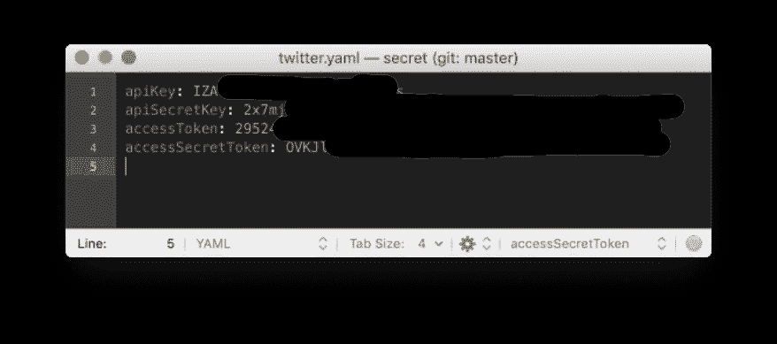

# Python 教程:瑞士政府成员的 Twitter 账户检索

> 原文：<https://towardsdatascience.com/python-tutorial-retrieve-a-list-of-swiss-government-members-from-twitter-d5f999555f98?source=collection_archive---------18----------------------->

## [Python 统计教程系列](https://towardsdatascience.com/tagged/python-stat-tutorial)

## 开始你的政治家社交媒体分析之旅

点击标题上方的链接，查看所有教程文章的列表。这是第一条。

本教程将向您展示如何通过 Twitter API 提取瑞士政府成员的 tweet 列表。提取的数据将被放入 Panda Dataframe 中，然后通过强大的 Plotly 软件包进行可视化。


Source Attribution: [http://www.parlament.ch/](http://www.parlament.ch/)

结果将如下所示:


# 从哪里获取数据？

twitter 账户 [SoMePolis](https://twitter.com/SoMePolis) 维护着一份拥有 Twitter 账户的瑞士政府成员名单。


该计划的目标是获取所有名单成员(正在发推特的政府成员)并提取一些关键人物(追随者和朋友)

# 创建一个 Twitter 开发者账户和应用


确认后，您就可以在您的开发者帐户中创建您的第一个应用程序了。


完成后，Twitter 将生成 API 密钥和令牌，您将在程序中使用它们与 Twitter API 进行通信。


# 该写程序了。

我们将创建一个 TwitterClient 类，它提供两个方法 get_government_members 和 create_plotly_table


该程序将使用以下 python 包

*   [tweepy](http://docs.tweepy.org/en/3.7.0/index.html) :将提供对 Twitter 公共 API 的访问
*   yaml :是一个解析器，可以读取 yaml 配置文件(用来存储我们的密钥)
*   pandas :是一个提供高性能、易于使用的数据结构和数据分析工具的库
*   [plotly](https://plot.ly/python/) :是一个图形库，可以在线制作交互式的、出版物质量的图形。

也就是说，通过使用这四个库，我们已经做好了准备。

## __init__

在类初始化方法中，我们必须建立与 Twitter API 的连接。

为此，我们使用从 yaml 文件加载的密钥和令牌，该文件位于当前目录之外的 secret 目录中。

```
with open("../../secret/twitter.yaml", 'r') as stream:
```

这是一种常见的方法，用于定位目录中的敏感数据，这些数据只存在于本地计算机上，不会在 Github 这样的远程源系统中进行检查。

Yaml 是一种人类可读的数据序列化语言。它通常用于配置文件，但也可以用于存储数据的许多应用程序。



它有一个简单的语法，对于我们的例子，安全令牌有四个 <key>: <value>对，它们被加载:</value></key>

```
consumer_key = res['apiKey'] 
consumer_secret = res['apiSecretKey'] 
access_token = res['accessToken'] 
access_token_secret = res['accessSecretToken']
```

作为补充信息，当您增强您的程序并需要额外的非敏感配置数据时，您将引入第二个包含公共信息的 yaml 文件，您可以使用普通源代码签入该文件。

下一步，我们使用 [OAuth](https://en.wikipedia.org/wiki/OAuth) 对 Twitter 进行认证，并获得对其 API 的访问权。OAuth 是一种开放的访问授权标准，通常用于互联网用户授权网站或应用程序访问他们在其他网站上的信息，但不需要给他们密码。即，您将向他们提供您的秘密访问令牌和密钥。

我们创建了一个私有的类变量 *_api* ，它保存了对 Twitter API 的引用。通过这个引用对象，您现在可以与 Twitter API 交互，这里描述了所有可用的方法。我们为 API 使用私有变量，因为我们不想直接向类的消费者提供 API，而是提供更高级别的方法，如 *getgovernment_members* 。

当您设计将在程序或模块中使用的类时，定义类变量的范围(public、protected、private)是一个重要的设计决策。


## 获取 _ 政府 _ 成员

在这个方法中，我们将从上面描述的 twitter 帐户 SoMePolis 的列表 BundesparlamentarierInnen 中获取所有的 twitter 政客帐户。


第一步，我们获取 SomePolis 帐户的所有 Twitters 列表，并搜索所需的列表。找到它之后，我们将使用它的 *list.id* 来检索列表中的所有成员(twitter 帐户)。

为了检索一个列表的所有成员，我们必须使用一个所谓的*光标(*位置 7 *)*

管理任意大型列表的数据检索是 API 接口中的一个重要概念(例如，一个列表可能有数百万个条目)

如果你在程序中使用下面的代码序列，你将只返回列表的前 25 个成员。

```
__api.list_members(list.id)
```

使用这种策略，Twitter API 将确保它不必在一个请求中向客户端程序传递大量数据。如果您想要所有成员，您必须多次调用 list_members。在每个请求中，将返回 25 个列表成员帐户的数据包。这个概念被称为“分页”，在各种提供者的公共 API 中使用(你可以在这里找到更多信息: [Tweeply Cursor Tutorial](http://docs.tweepy.org/en/v3.5.0/cursor_tutorial.html)

该列表大约有 110 个成员，这意味着 list_members 方法将被调用五次。最后，结果变量将有 110 个 Twitter 帐户。

## 创建 _ 绘图 _ 表格

最后，我们从 twitter 帐户列表中提取某些数据，以供进一步处理。

我们将准备一个 Panda Dataframe，它是一个二维大小可变的、潜在异构的表格数据结构，带有标记轴(行和列)。

我们将提取的 Twitter 帐户列表

*   *屏幕名称*，也就是@ <推特名称>
*   *名*，通常是这个人的全名
*   *描述*，提供对该人的附加描述
*   Twitter 账户的*关注者计数*，以及*好友计数*。

我们必须为数据帧创建列，这是通过以下命令序列实现的

```
col1 = [list.screen_name for list in lists]
```

我们遍历列表，为每条记录提取出 *screen_name* 。

最后，我们创建一个 plotly 表:

有两个主要模块，我们将需要生成我们的 Plotly 图形。

*   p *lotly.plotly* 包含了帮助我们与 plotly 服务器通信的功能
*   *plotly.graph_objs* 包含了为我们生成图形对象的函数。

您必须在 [https://plot.ly](https://plot.ly/) 创建一个帐户(当您第一次运行应用程序时)，您生成的表将被上传到该帐户。因此，您将在您的帐户中获得一个与此类似的表。


## 在 Plotly 创建账户

第一次运行该程序时，会要求您在 plotly 注册并创建一个帐户。


创建帐户后，您必须检索访问令牌(如有必要，创建一个新的)


并将它存储在文件中。凭证在主目录的文件夹中。plotly


这就是今天的练习，尝试添加以下代码序列。

# 锻炼

通过分析每个政府人员的网名或描述，试着识别他们的党派。作为指导性帮助，请查看[以下瑞士聚会指南](https://www.parlament.ch/en/organe/groups/parties-in-parliament)。主要政党是“CVP”、“FDP”、“SP”、“SVP”以及“Grüne”。缩写很有可能是一个人提到的(见下面截图)。

因此，构建一个新的 Panda 列，并将其添加到数据框中进行可视化。


源代码( *lesson1.py* )可以在这里找到:[https://github.com/talfco/clb-sentiment](https://github.com/talfco/clb-sentiment)

此处练习[的解答](https://dev.cloudburo.net/2019/01/27/python-tutorial-exercise-1-introduce-check_for_party.html)

*原载于 2019 年 1 月 26 日*[*【dev.cloudburo.net】*](https://dev.cloudburo.net/2019/01/26/python-tutorial-retrieve-a-list-of-swiss-government-members-from-twitter.html)*。*