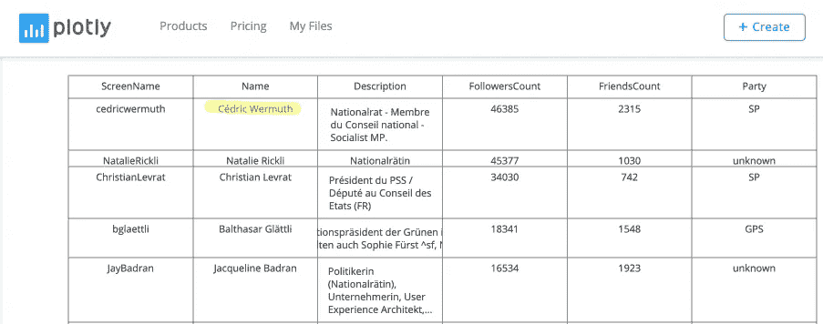
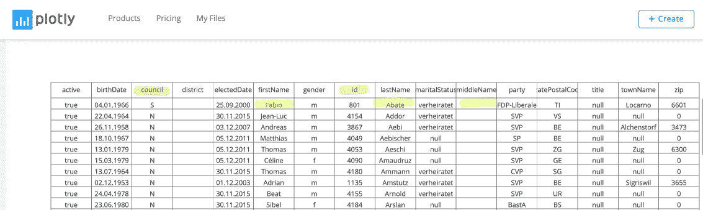
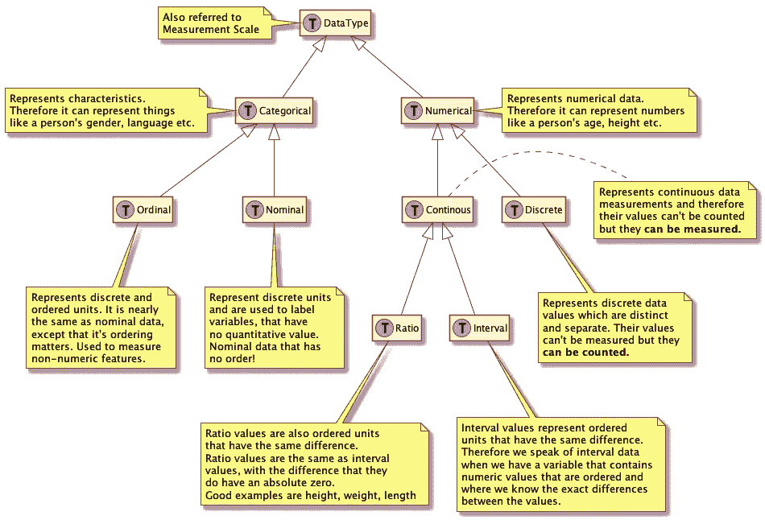
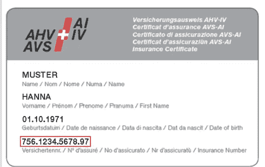

# Python 教程:简要介绍主要统计概念

> 原文：<https://towardsdatascience.com/python-tutorial-short-stop-to-introduce-main-statistical-concepts-8213724550f4?source=collection_archive---------19----------------------->

## [Python 统计教程系列](https://towardsdatascience.com/tagged/python-stat-tutorial)

## 通过使用我们的教程程序作为展示来解释概念

我计划在本次会议中通过名称变量介绍两个数据集的合并算法。

为了简单明了地概述整个方法，有必要事先介绍一些统计概念。

我决定做一个短暂的停留，将工作嵌入到统计框架中，这是任何数据探索项目的基础。所以今天没有编程，只是一些概念，对整体理解至关重要。我计划在未来建立更多的统计站来建立我们项目的科学背景。

Photo by [chuttersnap](https://unsplash.com/photos/CEubYUySRo4?utm_source=unsplash&utm_medium=referral&utm_content=creditCopyText) on [Unsplash](https://unsplash.com/search/photos/bus-stop?utm_source=unsplash&utm_medium=referral&utm_content=creditCopyText)

# 总体、样本、测量、参数和统计

我们从统计学中使用的一些基本定义开始，通过使用塞勒学院的[介绍教程](https://saylordotorg.github.io/text_introductory-statistics/s05-01-basic-definitions-and-concepts.html)(内容在[知识共享许可](https://saylordotorg.github.io/text_introductory-statistics/s00-license.html)下提供)

> ***群体** *是感兴趣对象的任何特定集合。* **样本** *是总体的任何子集或子集合，包括样本由整个总体组成的情况，这映射到术语* **普查**。*

## *人口*

*在我们的例子中，人口是瑞士联邦议会的瑞士政府成员(议员)。*

> *联邦议会是两院制的，由 200 个席位的[国民议会](https://en.wikipedia.org/wiki/National_Council_(Switzerland))和 46 个席位的[州议会](https://en.wikipedia.org/wiki/Council_of_States_(Switzerland))组成。这些房子拥有相同的权力。两院的议员代表[州](https://en.wikipedia.org/wiki/Cantons_of_Switzerland)，但是，尽管国民议会的席位是按人口比例分配的，但每个州在上院有两个席位，除了六个[半州](https://en.wikipedia.org/wiki/Half-canton)各有一个席位。两人每四年选举一次，最后一次选举将于 2019 年举行。([维基百科链接](https://en.wikipedia.org/wiki/Federal_Assembly_(Switzerland)))*

## *样品*

*我们的样本是所有议员，他们都有一个 Twitter 账户，并被列为 SoMePolis Twitter 议会名单的成员。这是一个子集，所以我们不用人口普查这个术语。*

> **一个* **测量值** *是为总体或样本的每个成员计算的一个数字或属性/变量。样本元素的测量值统称为* **样本数据**。*

## *尺寸*

*对于样本集的每个成员，我们通过两个数据集收集变量，即第一组变量通过 Twitter API 收集，第二组变量通过政府 API 收集。*

## *抽样资料*

*我们通过统一这两个数据集得到的总体样本数据集。*

> **一个* **参数** *是一个概括总体某个方面的数字。* **统计量** *是从样本数据中计算出的数。**

*因为我们要计算的数字是基于人口子集的，所以我们讨论的是统计数据而不是参数。*

*这就是最初的范围定义；现在让我们关注“变量”的概念，这是至关重要的。*

# *数据集和变量*

*作为补充，让我们来看两个数据集，我们已经检索过了:*

*作为第一个表( [Tutorial 2](/python-tutorial-government-social-media-analyser-class-build-out-12858190b284) )，我们从 Twitter 中检索了以下瑞士政治家 Twitter 账户的数据记录。*

**

*Image owned by the writer*

*它为我们提供了在未来分析中发挥作用的三个统计变量:*

*   **追随者计数**
*   **好友计数**
*   **聚会**
*   **姓名*，可能代表 Twitter 用户的真实姓名。“可能”这个词在这里是必不可少的，但更多的是在后面。*

*我们还从 Twitter 获得了一个*标识符*变量，它帮助我们揭示一个人的真实身份(在我们的例子中，是瑞士委员会的成员):*

*   **ScreenName，* 这是 Twitter 账户的唯一标识符。如果我们必须在稍后阶段通过 Twitter API 检索附加信息，我们可以使用它。*

*作为第二个表([教程 3](/python-tutorial-government-social-media-analyser-class-build-out-12858190b284) )，我们通过瑞士政府 API 检索了瑞士[联邦议会](https://en.wikipedia.org/wiki/Federal_Assembly_(Switzerland))所有现任议员的名单。*

**

*Image owned by the writer*

*从该表中，我们得到了以下变量，我们希望将其用于我们的统计评估:*

*   **名字-中间名-姓氏*，这是(理事会的)人名。*
*   **出生日期**
*   *议会由两院组成，即[国民议会](https://en.wikipedia.org/wiki/National_Council_(Switzerland))(下院)和[上院](https://en.wikipedia.org/wiki/Council_of_States_(Switzerland))。这由表中的值“N”或“S”表示。*
*   **选举日期**
*   **性别**
*   **玛丽塔尔状态**
*   **当事人**
*   **家庭地址(邮政编码、城镇名称、邮政编码)**

*以及标识符变量*

*   **id* ，标识政府 API 上下文中的数据记录*

*让我们更深入地挖掘一下数据集中使用的变量的统计意义*

## *可变术语定义*

> *在统计学中，一个**变量**有两个定义特征。(1)变量是描述人、地点、事物或想法的属性。(2)变量的值可以从一个实体到另一个实体“变化”。*

*在我们的例子中，一个人的*性别*、*政党、*或 T *维特追随者数量*都是潜在变量。*

## *数据类型分类*

*变量的数据类型在统计中起着重要的作用，必须理解这一点才能正确地将统计测量应用到数据中。在统计学中，术语“测量尺度”也可以使用。*

*下面的树对数据类型概念进行了分类*

**

*Data Type Classification Tree (image owned by writer)*

*参考下面这篇优秀的[中型文章](/data-types-in-statistics-347e152e8bee)来获得对数据类型主题的整体介绍。*

*让我们将分类应用于我们的两个数据集，结果如下表所示。*

*Image owned by the writer*

*两条评论*

*   *我们将每个集合的变量标记为“唯一”，这标识了一个专用的样本结果，我们不能对其执行任何数据分析。所谓的标识符变量*
*   *在 gov.api 数据集中，我捆绑了一些变量来描述一个人或地址。即，一个人的名字由该人家庭住址的*名、中间名、*和*姓*组成，家庭住址由*邮政编码、*和*邮政编码*组成。*

*存在许多变量类型，可以用上述方案对它们进行分类(参考参考章节中的附加链接)。不过，我们现在对所谓的标识符变量感兴趣。*

## *标识符变量*

*标识符变量和唯一标识符通常在统计中用于唯一标识数据收集目的。*

> *标识符变量是[分类变量](https://www.statisticshowto.datasciencecentral.com/what-is-a-categorical-variable/)，每个类别有一个个体。例如:*
> 
> *社会安全号码、面试者身份证号码或雇员身份证号码。*
> 
> *由于标识符变量是单一的，不可能对它们进行任何[数据分析](https://www.statisticshowto.datasciencecentral.com/probability-and-statistics/data-analysis/)。相反，它们是用来识别结果的。*

*嗯，我们的两个数据集在自己的域中有一个唯一的标识符。然而，没有真正的唯一标识符允许通过两个(跨域)数据集中可用的唯一标识符直接组合两个数据集。*

*在理想的情况下，这两个记录都有一个唯一的标识符，也就是说，在它们的数据集中有一个国家标识符，可以很容易地将它们合并。*

*以下示例显示了瑞士的国民身份证，它为瑞士公民(持有身份证)提供了一个唯一的标识号。*

**

*Swiss ID Card — [Source](https://www.checkinscan.com/blog/en/articles/find-issue-date-passport-or-id-card/)*

*以下标识符要求个人持有身份证；如果一个人只持有一本护照，你就必须获得唯一的护照标识符。不旅行的人不会潜在地拥有这两种身份手段中的任何一种。*

*一个更好的标识符是国家安全标识符，几乎每个公民都持有(超过一定年龄)。低于居住在瑞士的人数。*

**

*Swiss Social Security Number — [Source](https://www.grundrechte.ch/ahv-nummer-soll-bei-allen-behoerden-globaler-personenidentifikator-werden.html)*

*现实情况是，你公开获得的数据集将不包括这种**易受影响的**人数。*

*不应以不安全的方式暴露这种强标识号(在互联网上公开共享)。参考 CNN 的以下文章，它描述了 Equifax 的一个著名的数据黑客，导致 1.43 亿美国人的社会安全号码泄露。*

> *罪犯可以使用您的社会安全号码来窃取您的身份。他们可以开立银行账户和信用卡，或者申请贷款。黑客还可以以你的名义获得你的退税或医疗服务。(【money.cnn.com】T2*

*我们今天对统计概念的介绍到此结束，下一篇文章将带我们回到通过 Python 连接没有通用唯一标识符的数据集的问题。*

*在我们的例子中，我们在两个数据集中都有一个(或多个)描述个人姓名的属性。但是，要注意；*

> *当姓名是唯一的统一数据点时，正确匹配相似的姓名就显得更加重要。然而，它们的可变性和复杂性使得名称匹配成为一项极具挑战性的任务。昵称、翻译错误、同一个名字的多种拼写等等都可能导致匹配失败。(【rosette.com】T4)*

*这正是我们现在面临的情况；让我们进入下一篇文章。*

# *参考*

*   *不同变量类型的综合列表(嗯，你能想到的任何类型)——[链接:datasciencecentral.com](https://www.statisticshowto.datasciencecentral.com/probability-and-statistics/types-of-variables/)*

**原载于 2019 年 2 月 24 日*[*dev.cloudburo.net*](https://dev.cloudburo.net/2019/02/24/python-tutorial-short-stop-to-introduce-main-statistical-concepts.html)*。**