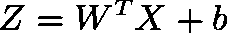
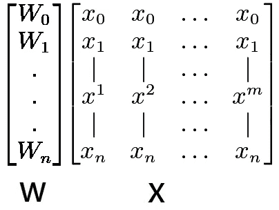
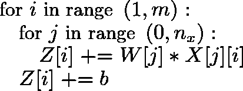
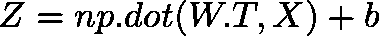
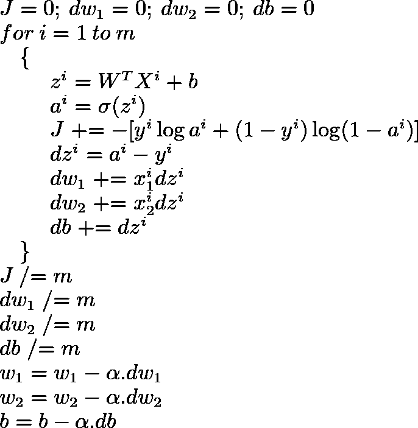
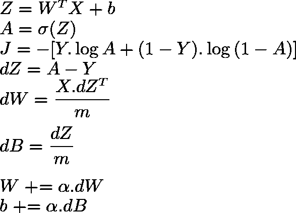

# Python 和矢量化

> 原文：<https://towardsdatascience.com/python-vectorization-5b882eeef658?source=collection_archive---------11----------------------->


当今世界的计算机硬件通过利用 SIMD(单指令、多数据)架构，利用并行计算来实现更快的计算。SIMD 是一类并行计算，其中逻辑处理器同时对多个数据点执行单个指令。我们需要向量化我们的深度学习代码，以便我们可以利用我们的系统提供的所有计算能力。计算越快，我们的神经网络训练得越快，我们得到结果的速度就越快。因此，对一段代码进行矢量化的能力已经成为深度学习实践者的一项关键技能。在这个故事中，我将解释使用 python 进行矢量化的基础知识。

# 到底什么是矢量化？

在逻辑回归的背景下，让我们借助下面的等式来理解矢量化的确切含义:



存储输入和权重的约定并不标准，但我更喜欢用以下方式存储。设 ***X*** 为输入矩阵的维数( ***n，m)*** 其中 ***n*** 是出现在*中的特征数，而 ***m*** 是出现在我们的训练数据集中的训练样本数，即我们在 1 列中存储一个数据点。对于每个特征，都会有一个与之相关联的权重，因此设 ***W*** 为维度的权重矩阵( ***n，1)*** )。*

**

*现在，如果我们使用 ***为*** 循环编写示例方程，我们会得到如下结果:*

**

*上述代码片段由针对 循环的显式 ***组成，不会利用并行化。因此，我们需要将其转换为矢量化版本。这可以通过以下方式利用内置的 ***Numpy*** 函数轻松完成:****

**

****Z*** 将是一个 ***(1，m)*** 矩阵，按照矩阵乘法规则。 ***np.dot()*** 函数执行给定输入矩阵的矩阵乘法。它不仅使代码更具可读性和可理解性，而且还利用并行化来提高计算速度。下面的代码片段显示了与非矢量化实现相比，矢量化实现的速度有多快。*

```
***import** numpy **as** np
**import** time*# Number of features* n = 1000
*# Number of training examples* m = 10000
*# Initialize X and W* X = np.random.rand(n,m)
W = np.random.rand(n,1)*# Vectorized code* t1=time.time()
Z = np.dot(W.T,X)
print(**"Time taken for vectorized code is : "**,(time.time()-t1)*1000,**"ms"**)*# Non Vectorized code* Z1 = np.zeros((1,m))
t2 = time.time()
**for** i **in** range(X.shape[1]):
    **for** j **in** range(X.shape[0]):
        Z[0][i] += W[j]*X[j][i]print(**"Time taken for non vectorized code is : "**,(time.time()-t2)*1000,**"ms"**)**''' Output
Time taken for vectorized code is :  5.964040756225586 ms
Time taken for non vectorized code is :  40915.54665565491 ms
'''***
```

*上述实现仅考虑 10k 训练示例和 1k 特征。尽管有代码优化策略，但显然矢量化实现比非矢量化实现快得多。 ***Numpy*** 是一个用于科学计算的 python 库。它提供了各种内置函数，让我们可以轻松地编写矢量化代码。*

> *根据经验，我们应该使用内置的 **numpy** 函数为任何未来的实现编写矢量化代码。*

# *向量化逻辑回归*

*既然我们已经看到了编写矢量化代码的好处，那么让我们更深入地研究，为逻辑回归编写矢量化代码。不可能为每种情况编写一个矢量化代码，但是我们应该尽可能地遵循经验法则。让我们看一个非矢量化版本的逻辑回归，并尝试找出可以矢量化的部分。这样我们就能理解如何将一段给定的代码转换成它的矢量化版本。为简单起见，我们将只考虑 ***X*** 中的 2 个特征，因此只有 2 个权重。*

**

*在上面的例子中，我们只考虑了 2 个权重，即 ***w1*** 和 ***w2*** ，但是在实际生活场景中会有更多的权重，处理它们将成为一项复杂的任务。因此，我们将通过以下方式对权重导数 ***dw1*** 和 ***dw2*** 的计算和更新进行矢量化:*

```
*dW = X[i].dZ[i]
dW /= m*
```

*在上述更改的帮助下，我们已经设法对代码的一小部分进行了矢量化。大部分仍然依赖于 ***for*** 循环，该循环用于迭代所有的训练示例。让我们看看如何移除 循环的 ***并对其进行矢量化:****

*所有训练示例的值 ***A*** 可以很容易地通过下式找到:*

```
*A = sigmoid(np.dot(W.T,X)+b)*
```

*成本 ***J*** 可由下式查出:*

```
*J = -(np.dot(Y,np.log(A).T)+np.dot((1-Y),np.log(1-A).T))*
```

*所有训练示例的导数 ***dZ*** ， ***dW*** 和 ***dB*** 可以通过以下方式找到:*

```
*dZ = A - Y 
dW = np.dot(X*(dZ.T))/m
dB = (np.sum(dZ))/m*
```

*权重矩阵 ***W*** 和偏差 ***B*** 可以通过以下方式更新:*

```
*W = W - alpha*dW
b = b - alpha*dB*
```

*这些转变起初看起来令人困惑。因此，我敦促读者看看每次计算后每个矩阵的维数是如何变化的。这将有助于更好地理解事物。让我们应用这些变化，看看当所有东西都被编译在一起时，矢量化的代码是什么样子。*

**

*上面的代码更加清晰、易读、简短，计算速度也更快。*

# *广播*

*在代码中，你可能已经发现两个维数不相容的矩阵被相加、相减、相乘和相除。 ***Numpy*** 有一大特色叫 ***播*** 。在某些约束条件下，较小的矩阵被 ***广播*** 到较大的矩阵，以便它们具有兼容的维数来执行各种数学运算。让我们借助一些例子来看看广播是如何工作的。设 ***A*** 和 ***B*** 为输入矩阵， ***C*** 为输出矩阵，作为对 ***A*** 和 ***B*** 的任何数学运算的结果。*

```
*Shape of A : 5 x 4
Shape of B :     4
Shape of C : 5 x 4Shape of A : 15 x 3 x 5
Shape of B : 15 x 1 x 5
Shape of C : 15 x 3 x 5Shape of A : 8 x 1 x 6 x 1
Shape of B :     7 x 1 x 5
Shape of C : 8 x 7 x 6 x 5Shape of A : 2 x 3 x 3
Shape of B :     1 x 5
Shape of C : Error*
```

*由此可见，广播工作基于两个原则:*

1.  ****A*** 和 ***B*** 的尾部尺寸应等于 ***或****
2.  ****A*** 或 ***B*** 的拖尾尺寸应为 1。*

> *理解矢量化并将给定代码转换为矢量化格式的最佳方式是跟踪表中各种矩阵的维数。*

*起初，编写代码的矢量化版本可能会令人望而生畏，但是，在 Numpy 的内置函数和广播的帮助下，通过练习，它变得非常容易。这将使代码可读性更强，速度更快。*

# *参考*

1.  *[StackOverflow —什么是矢量化？](https://stackoverflow.com/questions/1422149/what-is-vectorization)*
2.  *[科学文件—广播](https://docs.scipy.org/doc/numpy/user/basics.broadcasting.html)*
3.  *[Numpy](https://www.numpy.org/)*
4.  *[Coursera —深度学习课程 1](https://www.coursera.org/learn/neural-networks-deep-learning?specialization=deep-learning)*

*我要感谢读者阅读这个故事。如果你有任何问题或疑问，请在下面的评论区提问。我将非常乐意回答这些问题并帮助你。如果你喜欢这个故事，请关注我，以便在我发布新故事时获得定期更新。我欢迎任何能改进我的故事的建议。*