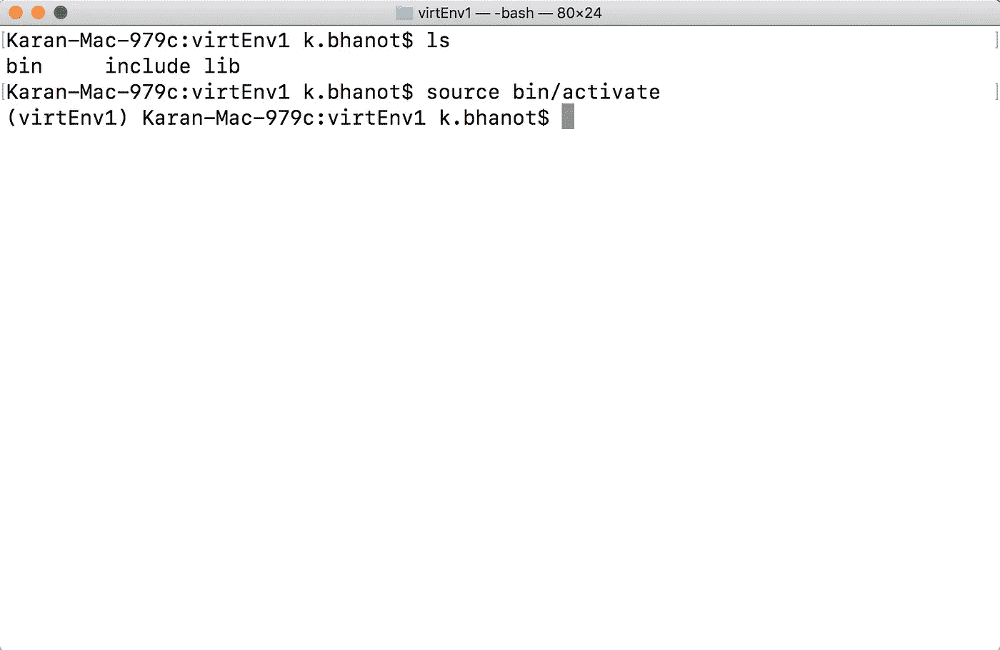
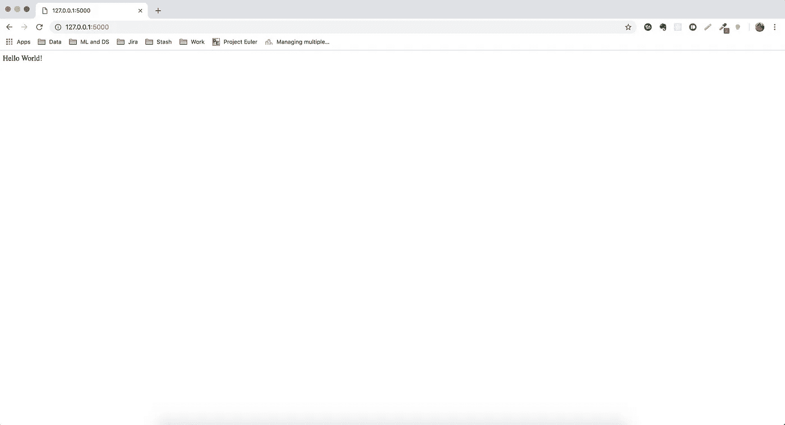
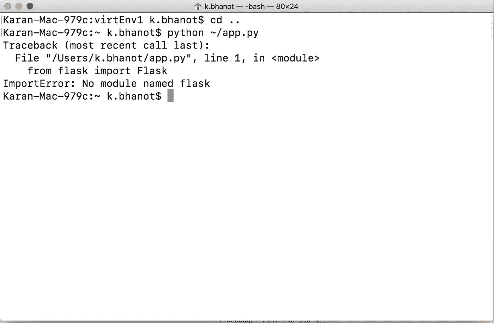

# Python 虚拟环境变得简单

> 原文：<https://towardsdatascience.com/python-virtual-environments-made-easy-fe0c603fe601?source=collection_archive---------6----------------------->


Photo by [Chris Ried](https://unsplash.com/@cdr6934?utm_source=medium&utm_medium=referral) on [Unsplash](https://unsplash.com?utm_source=medium&utm_medium=referral)

我开始了一个项目，在这个项目中，我必须快速检查一个包`Flask`是否能与我机器上安装的 Python 一起工作。当我运行安装 Flask 的命令时，它提醒我已经安装了这个包，因为我的机器上已经安装了 [Anaconda](https://www.anaconda.com/) 。

但是当我试图在 Sublime Text 3 上运行`Hello World` Flask 应用时，控制台给出了一个错误，它无法找到 Flask 模块。我很困惑，开始在网上看关于这个问题的资料。我发现 Anaconda 有 Flask 模块，但是我在 Sublime Text 中使用的 Python 没有这个模块。我草草地找到了一个解决方案，以理解如何正确地设置 Python，在正确的位置安装正确的包，并设置 Sublime Text build 系统。我的网上研究揭示了关于`Virtual Environments`，一些我以前没有读到过的东西。

在阅读了许多关于`Virtual Environments`的文章后，我学到了很多关于 Python 的知识，以及我应该如何创建使用 Python 的环境。在本文中，我将分享我关于如何使用终端设置这些环境的知识。

# 计算机编程语言


Photo by [Icons8 team](https://unsplash.com/@icons8?utm_source=medium&utm_medium=referral) on [Unsplash](https://unsplash.com?utm_source=medium&utm_medium=referral)

社区目前支持两个版本， *2.x* 和 *3.x* 版本。有些包适用于 Python 3.x，但有些包不支持 3.x，仅适用于 2.x。在这种情况下，有时人们可能希望使用 Python 2.x，有时使用 Python 3.x。我们从安装两个版本的 [Python](https://www.python.org/downloads/mac-osx/) 开始，这样我们可以使用其中一个或两个来设置环境。如果你有一个包安装程序，比如 [Homebrew](https://brew.sh/) ，你可以用它来安装 Python。

**Python 3。X**

```
brew install python@3
```

**Python 2。X**

```
brew install python@2
```

它还安装了`pip`，帮助我们安装 Python 包。

# 虚拟环境


Photo by [Kimberly Farmer](https://unsplash.com/@kimberlyfarmer?utm_source=medium&utm_medium=referral) on [Unsplash](https://unsplash.com?utm_source=medium&utm_medium=referral)

每当您开始一个项目时，您将首先决定使用哪个 Python 版本，然后选择一些您想要的库/包。然而，最好不要在系统范围内安装这些软件包。您可能在同一台机器上使用多个版本的 Python，或者某些包只适用于某些版本的 Python 而不适用于其他版本。在这样的场景中，我们可以设置不同的环境，称为`Virtual Environments`。

每个环境都将是它自己的虚拟空间。安装在该空间内的所有软件包不会干扰环境外部的软件包，并且将只包含在该空间内。

## 识别 Python 安装位置

根据您使用的安装方法，Python 将安装在不同的位置。

**从官网安装的 Python**

```
/Library/Frameworks/Python.framework/Versions/
```

在这里，你会找到已安装的版本。我的版本是 3.6，所以 Python 的路径应该是:

```
/Library/Frameworks/Python.framework/Versions/3.6/bin
```

**使用自制软件安装的 Python**

```
/usr/local/Cellar/
```

接下来是目录`python`或`python@2`下的版本。如果我们以`python`和`3.7.2_1`版本为例，位置将是:

```
/usr/local/Cellar/python/3.7.2_1/bin
```

## 安装虚拟

我们将使用自制软件安装 Python 3。我们用`pip3`安装`virtualenv`。

```
pip3 install virtualenv
```

## 创建虚拟环境

所有软件包都已安装，现在我们可以开始设置我们的虚拟环境了。我们需要定义我们想要建立环境的位置，并提供一个名称。我将它放在主目录中，并将名称设为`virtEnv1`。

```
virtualenv -p python3 ~/virtEnv1
```

上面命令中的最后一个参数定义了我们环境的确切路径以及环境名称。我们的环境现在已经设置好了，我们可以开始在其中工作了。

## 激活环境

为了开始在一个环境中工作，我们需要激活这个环境。当设置环境时，在环境的`bin`文件夹中创建一个名为`activate`的文件。我们将这个文件设置为源文件，现在我们在环境中了。

```
cd ~/virtEnv1
source bin/activate
```

环境的名称开始出现在括号中，表示我们现在正在环境中工作。



Inside ‘virtEnv1’ environemnt

## 安装软件包并创建文件

我去装烧瓶。

```
pip install flask
```

我还在 home 目录下创建了一个文件`app.py`，其中包含 Flask 中最基本的`Hello World`代码。

如果我试着在环境中运行代码，它会像下面的图片一样工作。

```
python ~/app.py
```

***客户端***



Hello World in Flask

***服务器***

## 停用环境

如果您的环境是启用的，那么很容易就能摆脱它。只需在终端中键入`deactivate`即可。

由于环境现在被停用，我们使用系统范围内安装的 Python。系统中没有安装烧瓶。因此，如果我再次尝试运行相同的代码，它会给出一个错误，即没有找到`flask`。



No flask error outside environment

以类似的方式，我们可以创建更多的环境，甚至为 Python 2 复制类似的过程。

# 在 Sublime Text 3 中使用 Python


Photo by [Ilya Pavlov](https://unsplash.com/@ilyapavlov?utm_source=medium&utm_medium=referral) on [Unsplash](https://unsplash.com?utm_source=medium&utm_medium=referral)

当我不在 Jupyter 笔记本上工作时，我更喜欢处理精彩的文本。要为 Python 设置 Sublime 文本，我们需要创建一个新的*构建系统*。转到:

```
Tools > Build System > New Build System...
```

并将文本设置如下:

用您的用户名替换`<username>`。

先存成`virtEnv1Python`吧。在 Sublime 文本中打开文件 app.py。将构建系统设置为`virtEnv1Python`。要测试应用程序是否工作，请按`Command` + `B`。您将看到应用程序开始运行，您可以通过链接`[http://127.0.0.1:5000/](http://127.0.0.1:5000/.)`进行确认。

# 结论

在本文中，我讨论了使用`virtualenv`来创建 Python 虚拟环境并在这些环境中安装包。

请随时分享你的想法，想法和建议。