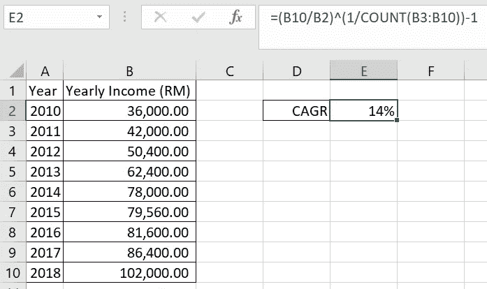
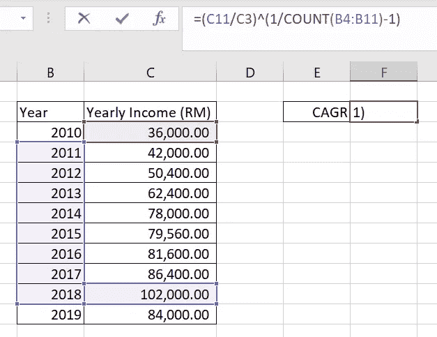
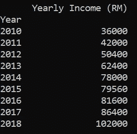
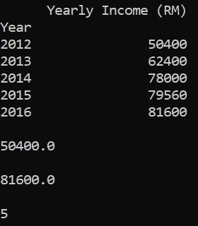

# Python 与 Excel —复合年增长率(CAGR)

> 原文：<https://towardsdatascience.com/python-vs-excel-compound-annual-growth-rate-cagr-c8dbad46d3e0?source=collection_archive---------13----------------------->

我对 Microsoft Excel(或 Google Sheets)最大的失望之一是缺乏一个内置的函数来计算复合年增长率或 CAGR (XIRR 是最接近的，但它不是相同的)。这意味着，在我需要进行快速 Excel CAGR 分析的任何情况下，我都需要为 CAGR 编写 Excel 公式。

每一个。单身。时间。

如果您还不知道，CAGR 的 Excel 公式如下:

## =(结束值/开始值)^ (1 /年数)-1

其中，结束值是给定时间段的最新值，开始值是给定时间段的第一个值，年数是要计算年增长率的年数。

在 Excel 表格中，它可能看起来像这样:



CAGR formula to calculate growth rate between 2010 and 2018

这是一个相当简单的公式，可以很容易地依赖…除了当表随着时间的增长而变长的时候！



Just add one more year, and you now need to specify the correct cells for the formula again

数据集往往会增长，这给分析师带来了一个问题，他们必须确保公式始终正确！(我去过。我不得不为一个更大的数据集修正一个更复杂的公式，纠正一个整整一年都没人注意到的错误，因为这个公式被淹没在数据的海洋中！)

这种挫败感是我从电子表格转向编程(特别是 Python 和 Pandas 库)进行数据分析的原因。我对 Python 还比较陌生，但是我已经体验到了它比 Excel 强大的多功能性和高效性(就像不用等几个小时 Excel 表来填充所有缺失的值)。

在这里，您将了解为什么编写 CAGR 函数并将其应用于从电子表格转换而来的数据帧会更好、更高效。

让我们从用 Python 定义 CAGR 函数开始:

```
def cagr(start_value, end_value, num_periods): return (end_value / start_value) ** (1 / (num_periods - 1)) - 1
```

就是这样！两行代码就有了你自己的 CAGR 函数。您会注意到这里与 Excel 函数略有不同。在该函数中，在 **num_periods** 之后有一个负 1。这使我能够通过将总周期数而不是复利周期数(总周期数总是减 1)指定为参数来正确计算 CAGR。我这样做是因为在过去，我曾多次在 Excel 中错误地指定复利周期数。

现在您已经有了 CAGR 函数，您可以将它保存到一个单独的 Python 文件中(从该文件中您可以导入到任何其他 Python 文件中),也可以将它编码到文件中，您将在该文件中将 Excel 表加载到数据框中并应用它。

要应用您的 CAGR 函数，首先导入 Pandas 库:

```
import pandas as pd
```

Pandas 是一个开源的、易于使用的 Python 库，它可以将任何 csv 或 Excel 文件转换成 dataframe 用于数据分析。这是用 Python 进行任何数据分析编程的必备工具。

接下来，将 Excel 加载到熊猫数据框架中:

```
ExcelFile = 'ExcelTable.xlsx' #name of my Excel file
df = pd.read_excel(ExcelFile, index_col='Year')
```

请注意，我添加了一个参数 **index_col** 来将“Year”列指定为索引，将“Year Income(RM)”列作为 dataframe 中的唯一一列。

在数据框上执行打印功能，查看 Excel 表格是否成功转换为数据框:

```
print(df)
```



Looks like it came out right

现在，您有了一个可以应用 CAGR 函数的数据框架。

Python 中 CAGR 函数的关键，以及为什么它在 Python 中更容易使用，是下面的变量:

```
start_value = float(df.iloc[0])
end_value = float(df.iloc[-1])
num_periods = len(df)
```

这些变量将提取 CAGR 函数所需的参数，在这种情况下，输出返回:

```
**36000.00
102000.00
9**
```

这些变量的好处在于，即使数据集在增长，代码也不必更改。使用**。iloc** 方法与列表索引一起确保函数将始终使用第一行作为起始值，最后一行作为结束值，并且 **len** 函数将始终正确计算时间段的总数。

即使你多加了一年，代码也是一样的。比方说，您在数据帧中添加了一行:

```
df.loc[2019] =[84000]
```

对相同变量运行打印功能将根据新数据返回不同的输出:

```
**36000.00
84000.00
10** 
```

如果您想为 CAGR 计算指定一个时间段，比如 2012 年到 2016 年之间的 5 年，您也可以使用**。loc** 方法很容易做到这一点:

```
start_value = float(df.loc[2012])
end_value = float(df.loc[2016])
num_periods = len(df.loc[2012:2016])
```



Slicing and dicing

现在，让我们通过使用变量作为输入参数，尝试将 CAGR 函数应用于该切片数据集:

```
result = cagr(start_value, end_value, num_periods)
print(result)**0.12801507993497308**
```

但是等等！输出以小数位数过多的浮点类型显示结果。虽然我个人更喜欢这种输出，但它通常对许多人来说并不友好。我们将需要字符串格式来表示百分比输出:

```
print("{:.2%}".format(result))**12.80%**
```

更加人性化。

这就是在 Python 中执行 CAGR 分析所需的全部内容！