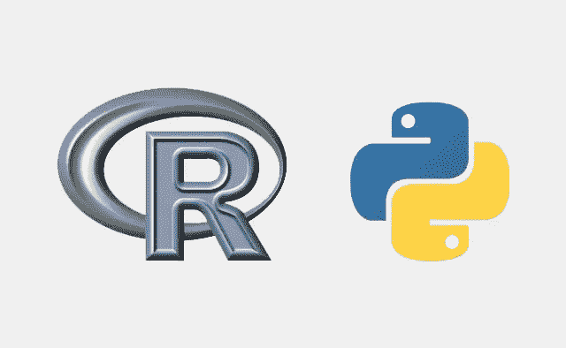

# Python Vs R:什么最适合机器学习

> 原文：<https://towardsdatascience.com/python-vs-r-whats-best-for-machine-learning-93432084b480?source=collection_archive---------6----------------------->

你是否在考虑建立一个机器学习项目，并在为你的项目选择正确的编程语言之间犹豫不决？好了，那么这篇文章就要帮你扫清与 Python 和 r 特性相关的疑惑了，先从基础开始吧。

r 和 Python 拥有相似的特性，是数据科学家最常用的工具。两者都是开源的，因此是免费的，然而 Python 是一种广泛有用的编程语言，而 R 是为统计分析而创建的。

在本文中，我们将探讨这两种语言的优缺点，以便您可以决定哪种选择最适合您。

# 计算机编程语言

Python 编程语言开发于上世纪 80 年代末，在推动谷歌内部基础设施方面发挥着至关重要的作用。Python 由热情的开发者组成，现在它已经被广泛应用于 YouTube、Instagram、Quora 和 Dropbox。Python 在 IT 业务中被广泛使用，并允许开发团队内部的简单协作。这样，如果你需要一种适应性强、多理由的编程语言，一个庞大的工程师支持网络，以及可扩展的人工智能包，那么 Python 就是最佳选择。

**Python 的优势**

● **通用语言** —如果你的项目需要的不仅仅是统计数据，Python 被认为是更好的选择。例如，设计一个功能性网站

● **平滑的学习曲线**——Python 易学易用，让你更快找到熟练的开发者。

● **大量重要的库** — [Python 使用了无数的库](https://www.csestack.org/python-libraries-for-data-science/)来管理、收集和控制信息。以 Scikit-realize 为例，它包括信息挖掘和调查工具，以支持利用 Python 实现令人难以置信的人工智能便利性。另一个名为 Pandas 的包为工程师提供了优越的结构和数据检查设备，有助于缩短改进时间。如果你的开发团队需要 R 的一个主要功能，那么 RPy2 就是你要找的。

● **更好的集成** —通常，在任何工程环境中，Python 都比 r 集成得更好。因此，无论设计者是否试图利用 C、C++或 Java 等低级语言，它通常都能更好地将不同的组件与 Python wrapper 结合起来。此外，基于 python 的堆栈很容易创建，因此很难将数据研究人员手头的剩余任务整合进来。

● **提高生产力**—Python 的语法非常容易理解，就像其他编程语言一样，但相对于 r 来说是独一无二的。通过这种方式，它保证了开发团队的高盈利能力。

Python 的缺点

●包括非常少的统计模型包。

●由于全局解释器锁(GIL)的存在，Python 中的线程处理变得很棘手，很成问题。随后，受 CPU 限制的多线程应用程序比单线程应用程序运行得更慢。人工智能事业对于执行多重处理比利用多线程编程更有价值。

**R**

r 是由统计学家开发的，基本上是为统计学家开发的，任何开发人员通过查看它的语法就可以预测到。由于这种语言包含了机器学习中的数学计算，而机器学习又是从统计学中派生出来的，所以 R 成为了想要更好地理解底层细节并进行创新的人的正确选择。如果您的项目主要基于统计数据，那么 R 可以被认为是缩小项目范围的绝佳选择，因为这需要一次性深入数据集。例如，如果您喜欢通过将段落解构为单词或短语来分析文本语料库，以识别它们的模式，那么 R 是最佳选择。

**R 的优势**

● **适合分析** —如果数据分析或可视化是您项目的核心，那么 R 可以被视为最佳选择，因为它允许快速原型制作，并与数据集一起设计机器学习模型。

● **大量有用的库和工具** —与 Python 类似，R 包含多个包，有助于提高机器学习项目的性能。例如，Caret 通过其特殊的功能集来增强 R 的机器学习能力，这有助于高效地创建预测模型。r 开发人员从高级数据分析包中获益，这些包覆盖了建模前和建模后阶段，针对特定的任务，如模型验证或数据可视化。

● **适合探索性的工作**——如果你在项目的开始阶段需要在统计模型中做任何探索性的工作，那么 R 使得编写它们变得更加容易，因为开发人员只需要添加几行代码。

R 的缺点

## ●陡峭的学习曲线——很难否认 R 是一种具有挑战性的语言，因此你可以找到非常罕见的专家来构建你的项目团队。

● **不一致** —由于 R 的算法来自第三方，所以可能会出现不一致的情况。每次你的开发团队使用一个新的算法，所有连接的资源都需要学习不同的方法来建模数据和进行预测。与此类似，每个新的包都需要学习，并且没有详细的 R 文档，因为它会对开发速度产生负面影响。

# R vs. Python:选择哪一个？

说到机器学习项目，R 和 Python 都各有优势。尽管如此，Python 似乎在数据操作和重复性任务方面表现更好。因此，如果你计划建立一个基于机器学习的数字产品，这是正确的选择。此外，如果您需要在项目的早期阶段开发一个专门的分析工具，那么请选择 r。最终的选择取决于您想要使用哪种编程语言。直到那时——继续学习！

**作者简介:**

【https://www.tatvasoft.com】维卡什·库马尔**在一家软件开发公司工作。他喜欢分享关于机器学习、人工智能和许多其他方面的新想法。除了日常的专业工作，他还喜欢烹饪和四处闲逛。您可以访问这里了解他的公司，并在*[*Twitter*](https://twitter.com/vikashv2v)*和*[*LinkedIN*](https://www.linkedin.com/in/vikashkumarchaudhary/)*上关注他。**