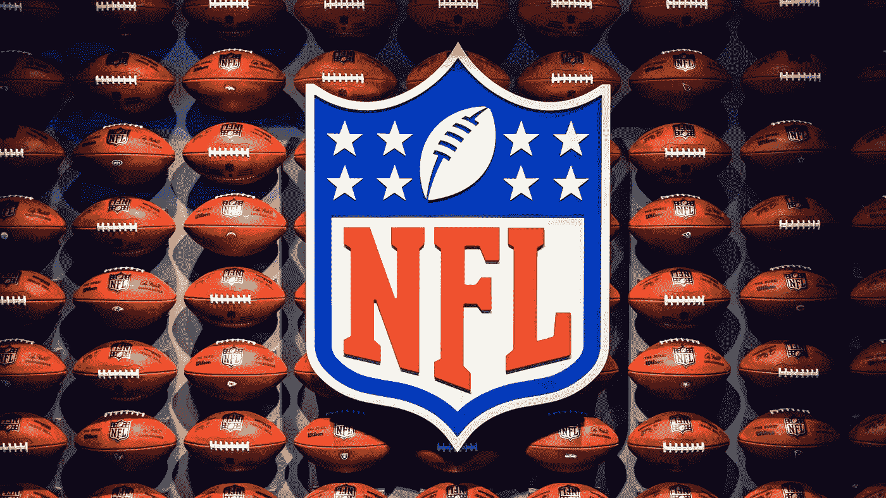
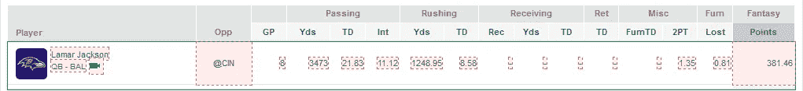
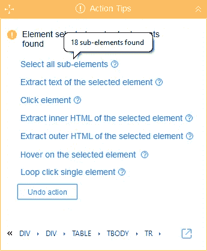
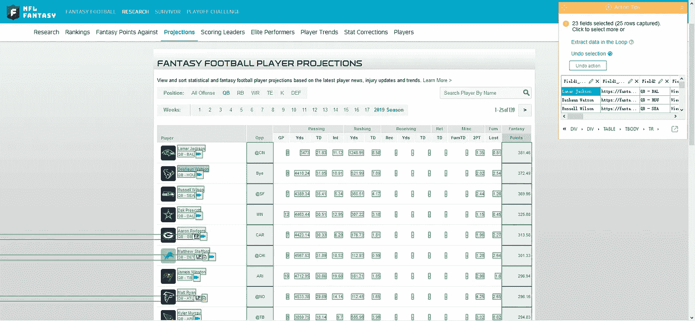
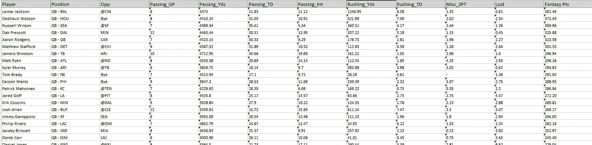
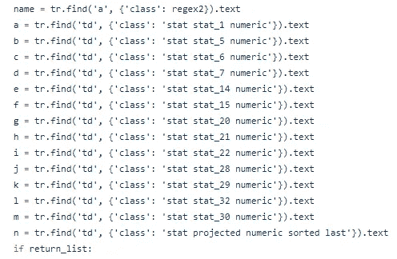

# Python vs. Web 抓取工具抓取梦幻足球投影

> 原文：<https://towardsdatascience.com/python-vs-web-scraping-tool-to-crawl-fantasy-football-projections-91670054b42?source=collection_archive---------28----------------------->

Photo by [HENCE THE BOOM](https://unsplash.com/@hencetheboom?utm_source=unsplash&utm_medium=referral&utm_content=creditCopyText) on [Unsplash](https://unsplash.com/s/photos/nfl?utm_source=unsplash&utm_medium=referral&utm_content=creditCopyText)

梦幻足球是一个乏味的游戏。这么说的话，不研究是不可能拿冠军的。这就是网络抓取派上用场的原因。在本教程中，你将学习如何建立一个网页抓取工具来完成这项工作。

现在，您可以迅速地将有价值的数据自动整理到一个电子表格中。这比通过复制和粘贴从各种来源查找统计数据要容易得多，也快得多。

# 为什么是网络抓取？

根据这份报告，普通球员每周会花 3 个小时来管理他们的球队，另外 9 个小时用来阅读趋势。大约 30%的球员在日常工作中管理他们的球队。

大量信息唾手可得。准确预测团队成员的表现是很困难的。你如何挑选二线球员并取得顶级成绩？您需要跟踪游戏统计数据，并找到隐藏的值。

# 什么是网页抓取？

网络抓取是一种从网站上自动提取数据的技术。传统上，你需要一个程序员来编写脚本。

至于现在，一个网页抓取工具代替了编码的劳动。抓取不再是程序员的特权。任何人都可以从互联网上提取有价值的信息，并将其保存到本地存储或云上。

在这篇文章中，我将带你通过如何提取幻想足球投影点从体育网站一样，fantasypros.com 与网页抓取工具。

没有必要记录整个页面。你甚至可以更有创意，通过与对手的团队进行并排比较来获得全面的分析。

然后我们将其与 Python 脚本进行比较。所以你会有一个想法，对我们所有人来说，尤其是梦幻足球运动员，保持跟踪统计数据是多么容易。

**免责声明**:我是梦幻足球的新手。本文不提供起草策略的专业建议。相反，这是一篇从统计学角度分享知识的文章。

# 使用 Octoparse 进行网页抓取

**先决条件:**

[**Octoparse，**](https://www.octoparse.com/) 一个非常直观的网页抓取工具。它帮助我完成了数据分析项目中的许多障碍。这是市场上最好的。你可以在这里下载。

**创建项目:**

打开 Octoparse，点击小加号，用高级模型构建一个新任务。输入网址，Octoparse 会用内置浏览器打开网页。我们可以通过点击页面来交互和提取数据。

**第一个**，点击第一行的玩家。注意，Octoparse 将网站解析成单个元素。它找到了相似元素并用红色突出显示。

这太棒了。遵循操作提示，并单击“选择所有子元素”整行已被选中。然后，Octoparse 会提醒您它找到了准备好被选中的相似行。按照指南，点击“全选”

请注意，现在所有行都被成功选中，并以绿色突出显示。

**接下来，**点击“提取循环中的数据”。恭喜你！你完成了一个爬虫。【[下载爬虫](https://www.dropbox.com/s/dm1t3u3gltqiduq/FantasyFootballPlaye.otd?dl=0)

**最后但并非最不重要的**，保存任务并在你选择的提取类型中开始提取。您可以在本地、在云上提取，或者设置一个时间表。在这种情况下，我强烈建议制定一个时间表。爬虫会及时抓取网站。所以你总是保持更新。

提取的数据将以结构化格式交付，包括 Excel、txt 和 JSON。由于我们需要分析这些点，所以我将它们导出到 Excel 中，看起来是这样的。

# 使用 Python 进行 Web 抓取

可以在这里 阅读完整的 Python 作品 [***。我把这个过程分成几个步骤:***](https://gist.github.com/octoparse/30dcdbdb54c3098c286c4bd5e76f25e4)

1.  浏览到所需页面并复制 URL 以备后用。
2.  仔细检查 HTML 代码，找到要提取的数据所在的位置。在本例中，我们寻找“TR”(表格行)
3.  找到您想要的数据周围的唯一标识符，如 href 链接、类名、表行和表数据。
4.  尝试从一行数据中提取不同的字段
5.  经历几次试错迭代。
6.  规范数据格式(当我们提取原始数据时，使用奇怪的格式可能会使数据看起来很有趣。您需要清理字符格式，使它们一致和可读。)

# 最后

网页抓取运动项目既快又容易。然而，有了网络抓取工具，你可以在简单的点击中完成整个过程。我花了 1 个小时阅读 Beautiful Soup 的文档，尝试如何定位精确的字段并编写 Python 代码。

然而，我花了不到 10 分钟的时间用 Octoparse 设置了提取。最好的部分是，一旦你有了爬虫，你可以设置一个时间表，让它自动提取。

对于播放器，您可以通过更轻松地设置提取爬虫来同时监视不同的站点源:

你收集的数据越多，你的分析就越全面。现在，你甚至会在消息出来之前就获得第一手数据！

11 月 26 日，Octoparse 正在进行他们最好的黑色星期五早期交易,所有商品都有 10%的额外折扣。他们绝对值得你花几分钟时间来检查他们的产品和交易。

*原载于 2019 年 11 月 22 日*[*【https://likegeeks.com*](https://likegeeks.com/web-scraping-tool/)*。*